# Chapter 10: Hashing


## Table of Contents

1. [Introduction](#introduction)
2. [What is Hashing?](#what-is-hashing)
3. [Hash Table](#hash-table)
4. [Hash Function](#hash-function)
   - [Division Method](#1-division-method)
   - [Mid-Square Method](#2-mid-square-method)
   - [Folding Method](#3-folding-method)
5. [Hash Collision](#hash-collision)
6. [Collision Resolution Schemes](#collision-resolution-schemes)
   - [Linear Probing](#1-linear-probing-method)
   - [Quadratic Probing](#2-quadratic-probing-method)
   - [Random Probing](#3-random-probing-method)
   - [Double Hashing](#4-double-hashing-method)
   - [Rehashing](#5-rehashing-method)
   - [Chaining Method](#6-chaining-method)
7. [Summary](#summary)

---

## Introduction

### Why Do We Need Hashing?

Imagine you have a **library** with thousands of books. If the books were placed randomly on shelves, finding a specific book would take a very long time — you would have to check every single book one by one. But what if you had a **magic formula** that tells you the exact shelf number for any book? You could go directly to that shelf and grab the book instantly!

That "magic formula" is what we call a **hash function**, and the entire system is called **hashing**.

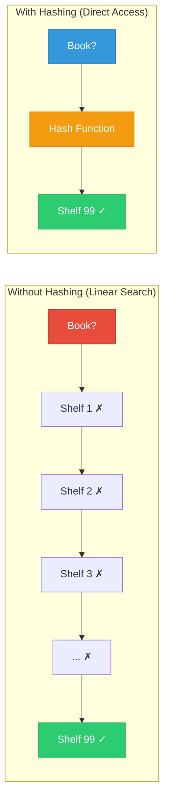

> **Key Point:** Hashing is a **special type of searching** technique. Instead of searching through every element, we use a formula (hash function) to calculate the **exact position** where data should be stored or retrieved.

### Hashing vs Other Search Methods

| Feature | Linear Search | Binary Search | Hashing |
|---------|--------------|---------------|---------|
| **Time Complexity** | O(n) | O(log n) | O(1) average |
| **Data must be sorted?** | No | Yes | No |
| **Extra space needed?** | No | No | Yes (hash table) |
| **Best for** | Small lists | Sorted lists | Fast lookups |

---

## What is Hashing?

**Hashing** is a method for **storing and retrieving** data from a table using a special function. The core idea is simple:

1. You have some **data** (like a student ID, a name, etc.).
2. You pass that data through a **hash function**.
3. The hash function gives you a **direct address** (index) in a table.
4. You store the data at that address, or retrieve from it.

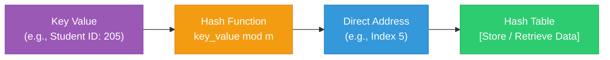

### The Golden Rule of Hashing

> **Important:** The **same hash function** that is used to **store** data in the hash table **must also be used** to **retrieve** data from the hash table. If you use a different function for retrieval, you will look at the wrong address and never find your data!

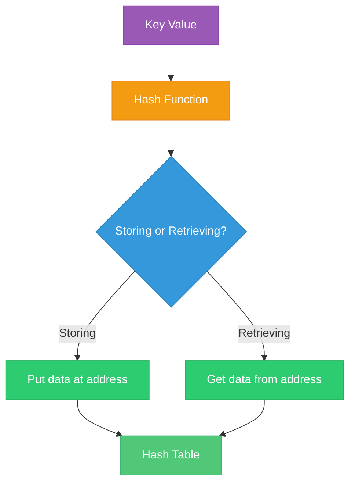

---

## Hash Table

A **hash table** is simply an **array** (or table) that is used to store data in hashing. Each cell in the array has an **index number**, and data is stored at the index calculated by the hash function.

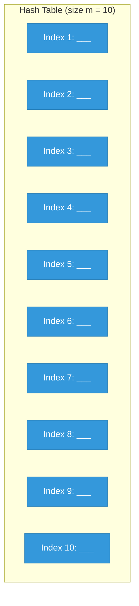

Think of it like a **row of lockers** — each locker has a number, and the hash function tells you which locker to put your stuff in (or which locker to check when you want your stuff back).

---

## Hash Function

A **hash function** is a function that transforms a **key value** (like a student ID, personal ID, etc.) into a **direct address** (index) of the hash table.

There are several methods to compute the hash address:

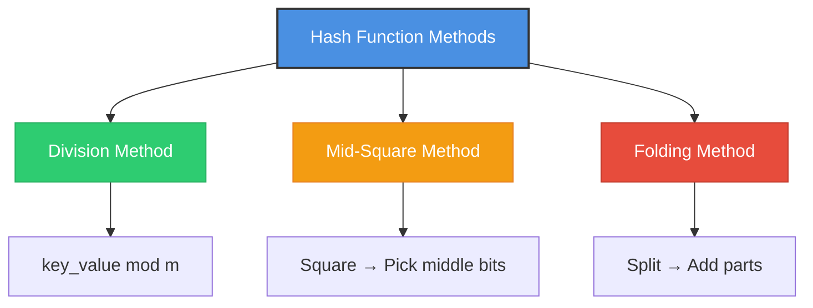

---

### 1. Division Method

This is the **simplest and most commonly used** hash function. It uses the **modulus** (remainder) operation.

**Formula:**

```
h(key_value) = key_value mod m
```

Where:
- `key_value` = the data item (e.g., student ID)
- `m` = the size of the hash table
- `mod` = modulus operation (gives the remainder after division)

#### 📝 Practical Example

Let `m = 10` (hash table has 10 cells). Key values are: **13, 4, 12, 9, 24**

| Key Value | Calculation | Hash Address (Index) |
|-----------|-------------|---------------------|
| 13 | 13 mod 10 = **3** | 3 |
| 4 | 4 mod 10 = **4** | 4 |
| 12 | 12 mod 10 = **2** | 2 |
| 9 | 9 mod 10 = **9** | 9 |
| 24 | 24 mod 10 = **4** | 4 |

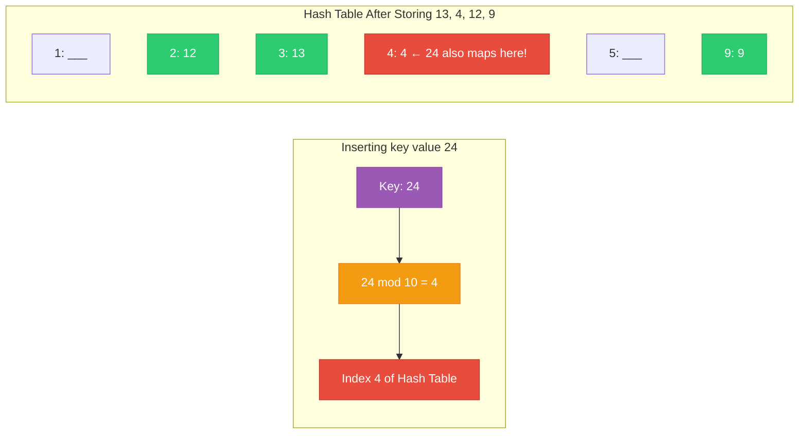

> **Notice:** Both key 4 and key 24 give the same hash address (4). This is called a **hash collision** — we will learn how to handle this later!

---

### 2. Mid-Square Method

In this method, we work with the **binary representation** of the key value.

**Steps:**

1. Convert the key value to its **binary** form.
2. **Square** the binary number (multiply it by itself).
3. Pick out the **middle k bits** from the squared result.
4. These middle k bits become the **hash address**.
5. The hash table size will be at least **2^k - 1**.

#### 🎯 Visual Flowchart

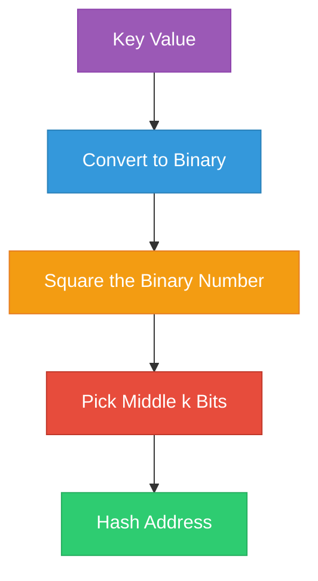

#### 📝 Practical Example

- Binary form of key value = `1011001`
- Squaring: `1011001 × 1011001 = 1111011110001`
- Let `k = 3` (we pick 3 middle bits)
- The result `1111011110001` has 13 bits. The middle 3 bits are: `111`
- `111` in decimal = **7**
- So the hash address is **7**

```
Original:     1011001
Squared:  1111011110001
                ^^^
          Middle 3 bits = 111 = 7 (hash address)
```

> **Key Insight:** The mid-square method is useful because squaring a number spreads out the digits, and picking the middle bits gives a good distribution of hash addresses.

---

### 3. Folding Method

In this method, we **divide the key value into equal parts** (each part is treated as an integer), and then **add all the parts together** to get the hash address.

#### 🎯 Visual Flowchart

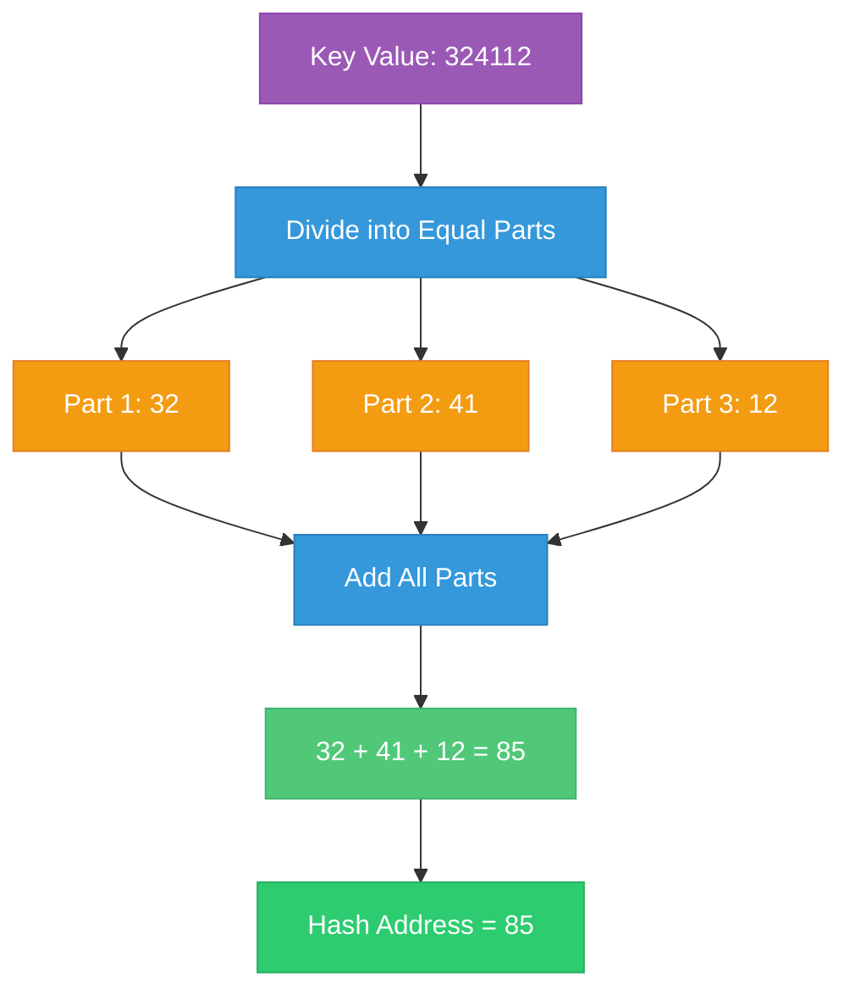

#### 📝 Practical Example

- Key value = `324112`
- Divide into 2-digit parts: `32`, `41`, `12`
- Add them: `32 + 41 + 12 = 85`
- Hash address = **85**

#### Range of Hash Addresses

If all key values are **6 digits long** and we partition into **2-digit groups** (3 parts):
- The highest 2-digit number is **99**
- Maximum possible sum = 99 × 3 = **297**
- So hash addresses range from **0 to 297**

> **Note:** The folding method is simple and works well when key values have many digits. The size of each part determines the range of hash addresses.

---

## Hash Collision

### What is a Hash Collision?

A **hash collision** happens when **two different key values** produce the **same hash address**. That means two pieces of data need to be stored in the **same cell** of the hash table — but a single cell can only hold one item!

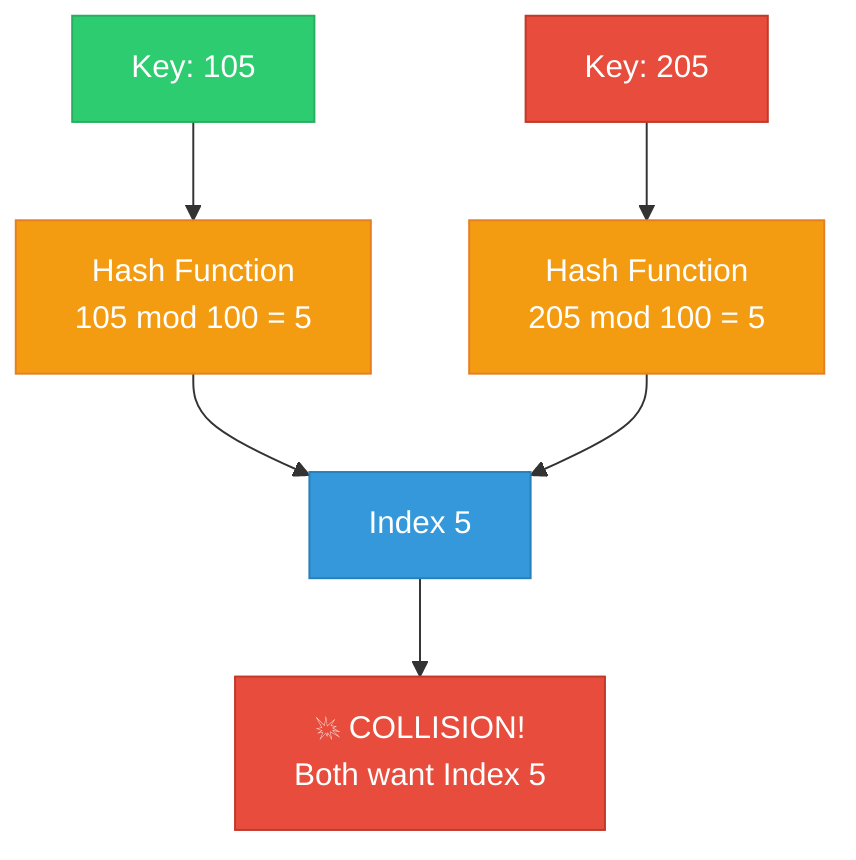

### Why Does It Happen?

- Hash functions map a **large set of possible keys** to a **small set of addresses**.
- For example, with `m = 100`, any key ending in the same two digits will have the same hash address.
- Collisions are **inevitable** in practice — we cannot avoid them entirely.

### How Do We Fix It?

There are several **collision resolution schemes** to handle this problem:

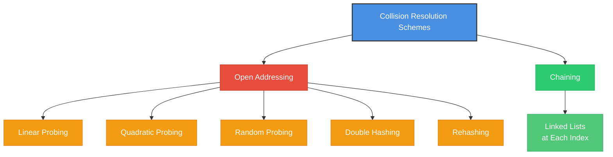

---

## Collision Resolution Schemes

### 1. Linear Probing Method

Linear probing is the **simplest** collision resolution technique. The idea is straightforward:

- If the target cell (index `y0`) is **already occupied**, just try the **next cell** (`y0 + 1`).
- If that is also occupied, try the **next one** (`y0 + 2`).
- Keep going until you find an **empty cell**.

**Probing sequence:**

```
y0 = key_value mod m           (first try)
y1 = y0 + 1                    (if y0 is occupied)
y2 = y1 + 1 = y0 + 2           (if y1 is occupied)
y3 = y2 + 1 = y0 + 3           (if y2 is occupied)
...keep going until an empty cell is found
```

#### 🎯 Visual Flowchart

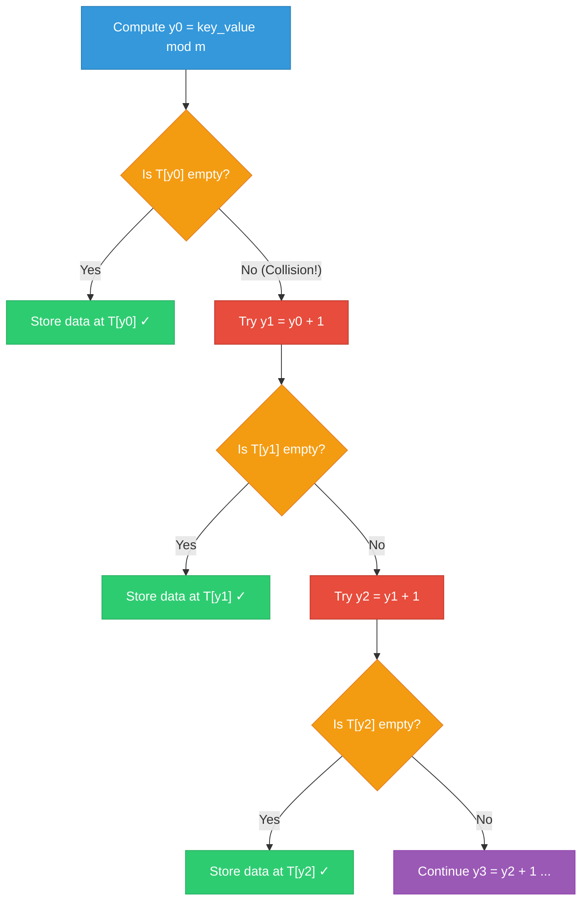

#### 📝 Practical Example

Let `m = 100`. We want to store key values **105** and **205**.

**Step 1:** Store 105
- `y0 = 105 mod 100 = 5`
- Cell 5 is empty → Store 105 at index 5 ✓

**Step 2:** Store 205
- `y0 = 205 mod 100 = 5`
- Cell 5 is **occupied** (by 105) → Collision!
- `y1 = 5 + 1 = 6`
- Cell 6 is empty → Store 205 at index 6 ✓

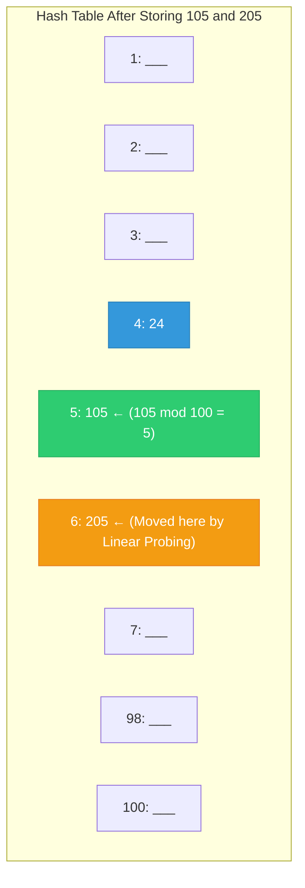

> **Remember:** When retrieving data, you must use the **same hash function** and the **same probing method**. First check index `y0`, and if the data is not there, check `y0 + 1`, `y0 + 2`, and so on.

---

#### 📘 Algorithm 10.1: Create a Hash Table with Linear Probing

> **Purpose:** Store a list of key values into a hash table, resolving collisions with linear probing.

#### Pseudocode

```
1. Input list of elements (key_values);
2. Create an empty hash table, T[1……m]
3. for (i = 1 to m)
   {
       i)  index = key_value mod m;
           if (T[index] = 0), then T[index] = key_value;

       ii) else {
               do {
                   index = index + 1;
               } while (T[index] != 0);
           }

4.     T[index] = key_value;
   }
5. Output a hash table with data (elements).
// Hash collision is resolved using linear probing method.
```

**How it works:**
- `T[m]` is an array (hash table) of size `m`.
- We assume the number of elements is less than or equal to `m`.
- For each key value, we compute `key_value mod m` to find the index.
- If that index is empty (value is 0), we store the data there.
- If that index is occupied, we keep moving to the next cell (`index + 1`) until we find an empty one.

#### 🎯 Algorithm Flowchart

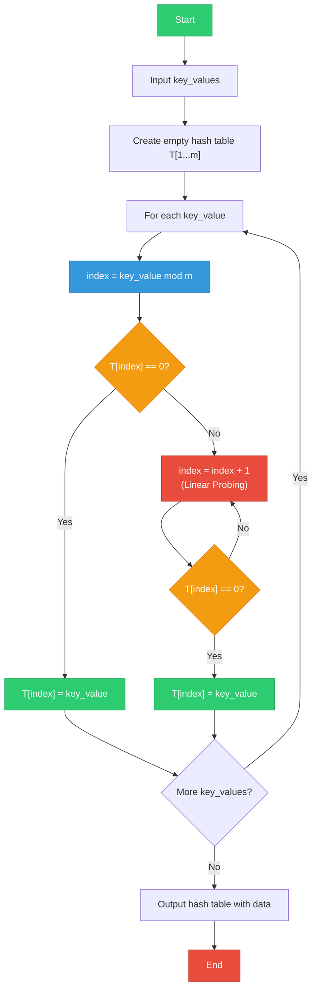

---

#### 📘 Algorithm 10.2: Retrieve a Data Element from a Hash Table (Linear Probing)

> **Purpose:** Search for and retrieve a specific key value from a hash table that was built using linear probing.

#### Pseudocode

```
1. Input the hash table, T[1……m], key_value to be retrieved;
2. for (i = 1 to m)
   {
       h = key_value mod m;
3.     if (T[h] = key_value), then item = T[h];
4.     else {
           do {
               h = h + 1;
           } while (T[h] != key_value)
5.         item = T[h];
       }
   }
6. Output: the target value in item.
```

**How it works:**
- We use the **same hash function** (`key_value mod m`) to compute the initial index.
- If the data at that index matches our key value, we have found it.
- If not, we probe forward (`h + 1`, `h + 2`, ...) just like we did when storing, until we find the data.
- The target value is stored in the variable `item`.

#### 🎯 Retrieval Flowchart

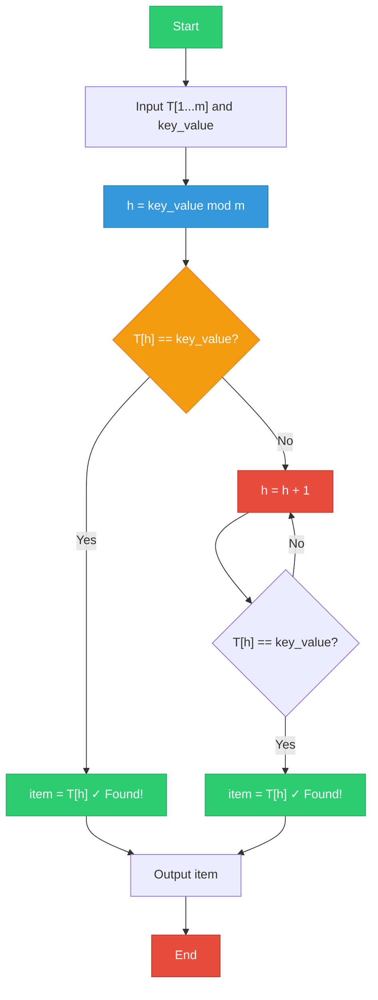

---

### 2. Quadratic Probing Method

Linear probing has a problem: when many values collide, they form **clusters** (groups of occupied cells next to each other), which slows things down. **Quadratic probing** reduces clustering by using **squares** for the probe sequence.

**Probing sequence:**

```
y0 = key_value mod m                    (first try)
y1 = (y0 + 1²) mod m = (y0 + 1) mod m  (if y0 is occupied)
y2 = (y0 + 2²) mod m = (y0 + 4) mod m  (if y1 is occupied)
y3 = (y0 + 3²) mod m = (y0 + 9) mod m  (if y2 is occupied)
...
yi = (y0 + k²) mod m;  where k = 1, 2, 3, ...
```

Instead of checking the next cell, next cell, next cell (1, 2, 3, 4...), we **jump by increasing squares** (1, 4, 9, 16...).

#### 📝 Practical Example

If `y0 = 1`:

| Step | k | k² | Probe Address (y0 + k²) |
|------|---|-----|------------------------|
| y1 | 1 | 1 | 1 + 1 = **2** |
| y2 | 2 | 4 | 1 + 4 = **5** |
| y3 | 3 | 9 | 1 + 9 = **10** |
| y4 | 4 | 16 | 1 + 16 = **17** |

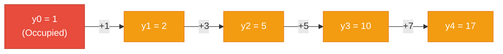

> **Advantage:** Quadratic probing **spreads out** the probes more than linear probing, reducing the clustering problem.

---

### 3. Random Probing Method

In this method, instead of stepping by 1 (linear) or by squares (quadratic), we step by a **fixed value `r`** that is **relatively prime** to `m` (the table size).

**Probing sequence:**

```
y(i+1) = (yi + r) mod m;  where i = 0, 1, 2, 3, ...
```

**What does "relatively prime" mean?**
Two numbers are **relatively prime** if their **greatest common divisor (GCD)** is 1. For example:
- GCD(2, 7) = 1 → they are relatively prime
- GCD(4, 6) = 2 → they are **NOT** relatively prime

> **Why relatively prime?** If `r` and `m` are relatively prime, the probing sequence will visit **every cell** in the hash table before repeating. This guarantees we will find an empty cell if one exists.

#### 📝 Practical Example

If `y0 = 3` and `r = 2`:

| Step | Calculation | Probe Address |
|------|-------------|--------------|
| y0 | — | **3** |
| y1 | (3 + 2) mod m | **5** |
| y2 | (5 + 2) mod m | **7** |
| y3 | (7 + 2) mod m | **9** |
| y4 | (9 + 2) mod m | **11** |

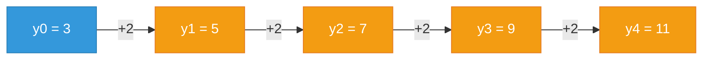

---

### 4. Double Hashing Method

Double hashing uses **two hash functions** instead of one. If the first hash function causes a collision, a **second hash function** determines the step size for probing.

**Probing sequence:**

```
y0 = key_value mod m                         (primary hash)
d  = key_value mod (m - 2) + 1               (secondary hash — step size)
y1 = y0 + 1 × d
y2 = y0 + 2 × d
y3 = y0 + 3 × d
...
yi = (y0 + i × d)
```

The key difference from linear probing: the step size `d` **depends on the key value itself**, so different keys that collide at the same position will probe different sequences.

#### 🎯 Visual Flowchart

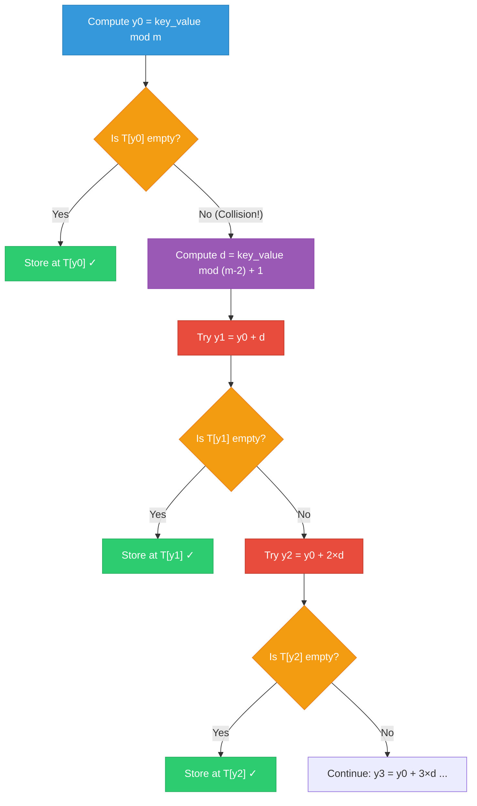

#### 📝 Practical Example

Key values: **211, 232, 624**, and `m = 7`.

**i. Store 211:**
- `y0 = 211 mod 7 = 1`
- Cell 1 is empty → Store 211 at index 1 ✓

**ii. Store 232:**
- `y0 = 232 mod 7 = 1` → Cell 1 is **occupied** (by 211)!
- `d = (232 mod 5) + 1 = 2 + 1 = 3`
- `y1 = 1 + 3 = 4`
- Cell 4 is empty → Store 232 at index 4 ✓

**iii. Store 624:**
- `y0 = 624 mod 7 = 1` → Cell 1 is **occupied**!
- `d = (624 mod 5) + 1 = 4 + 1 = 5`
- `y1 = 1 + 5 = 6`
- Cell 6 is empty → Store 624 at index 6 ✓

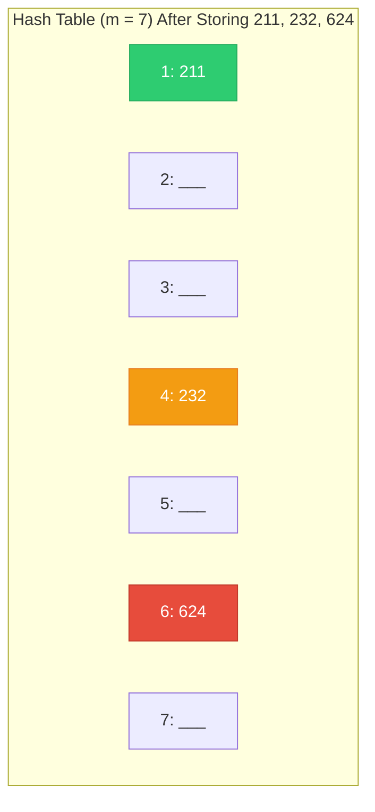

> **Key Insight:** Note how `d = (m-2)` in the formula. Here `m = 7`, so `m - 2 = 5`. The secondary hash function uses `mod 5` and adds 1 to ensure `d` is never zero.

---

#### 📘 Algorithm 10.3: Create a Hash Table Using Double Hashing

> **Purpose:** Store key values into a hash table, resolving collisions using double hashing.

#### Pseudocode

```
1. Input elements (key_values)
2. Create an empty table, T[1……m]
3. for (i = 1 to m)
   {
       k = 1
       ind = key_value mod m;

4.     if (T[ind] = 0), then T[ind] = key_value;

5.     else {
           d = key_value mod (m - 2) + 1     // double hashing
           do {
               index = ind + d × k;
               k = k + 1;
           } while (T[index] != 0);
       }

6.     T[index] = key_value;
   }
7. Output: a hash table with data.
```

#### 🎯 Algorithm Flowchart

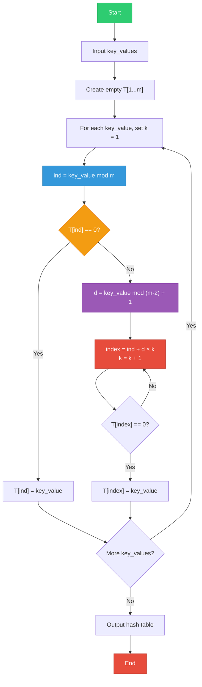

---

#### 📘 Algorithm 10.4: Retrieve an Item from a Hash Table Using Double Hashing

> **Purpose:** Search for and retrieve a key value from a hash table that was built using double hashing.

#### Pseudocode

```
1. Input the hash table, T[1……m], key_value to be retrieved
2. for (i = 1 to m)
   {
       k = 1;
       y = key_value mod m;

3.     if (T[y] = key_value), then item = T[y];

4.     else {
           d = key_value mod (m - 2) + 1;
           do {
               h = y + d × k;
               k = k + 1;
           } while (T[h] != key_value);

5.         item = T[h];
       }
   }
6. Output: the target value in item.
```

#### 🎯 Retrieval Flowchart

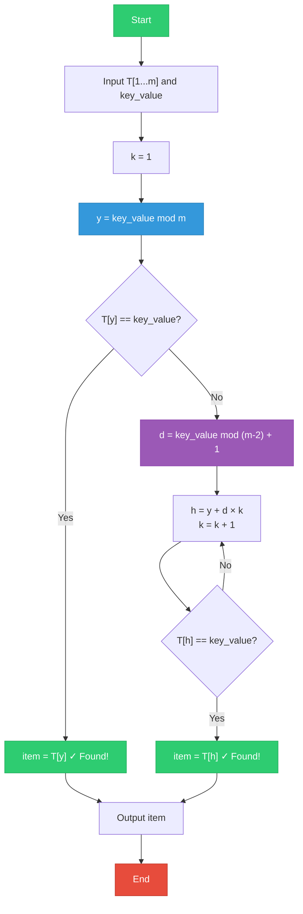

---

### 5. Rehashing Method

Rehashing uses **two different hash functions** — one primary and one secondary. When a collision occurs, instead of adding a step to the address, we **apply the second hash function repeatedly** to the result.

**How it works:**

1. First hash function: `f(key_value) = key_value mod m` → gives `y0`
2. If `y0` is occupied, apply second hash function: `h(y0) = y0 × r mod m` → gives `y1`
3. If `y1` is occupied, apply again: `h(y1) = y1 × r mod m` → gives `y2`
4. Keep going until an empty cell is found.

Here, `r` and `m` must be **relatively prime** (GCD(r, m) = 1).

```mermaid
flowchart TD
    A["f(key_value) = key_value mod m → y0"] --> B{"Is T[y0] empty?"}
    B -->|"Yes"| C["Store at T[y0] ✓"]
    B -->|"No"| D["y1 = y0 × r mod m"]
    D --> E{"Is T[y1] empty?"}
    E -->|"Yes"| F["Store at T[y1] ✓"]
    E -->|"No"| G["y2 = y1 × r mod m"]
    G --> H{"Is T[y2] empty?"}
    H -->|"Yes"| I["Store at T[y2] ✓"]
    H -->|"No"| J["y3 = y2 × r mod m ..."]

    style A fill:#3498db,stroke:#2980b9,color:#fff
    style B fill:#f39c12,stroke:#e67e22,color:#fff
    style C fill:#2ecc71,stroke:#27ae60,color:#fff
    style D fill:#9b59b6,stroke:#8e44ad,color:#fff
    style E fill:#f39c12,stroke:#e67e22,color:#fff
    style F fill:#2ecc71,stroke:#27ae60,color:#fff
    style G fill:#9b59b6,stroke:#8e44ad,color:#fff
    style H fill:#f39c12,stroke:#e67e22,color:#fff
    style I fill:#2ecc71,stroke:#27ae60,color:#fff
```

#### 📝 Practical Example

Let `m = 10`, `r = 3`. Key values: **901, 811, 621**.

**i. Store 901:**
- `y0 = 901 mod 10 = 1`
- Cell 1 is empty → Store 901 at index 1 ✓

**ii. Store 811:**
- `y0 = 811 mod 10 = 1` → Cell 1 is **occupied** (by 901)!
- `y1 = 1 × 3 mod 10 = 3`
- Cell 3 is empty → Store 811 at index 3 ✓

**iii. Store 621:**
- `y0 = 621 mod 10 = 1` → Cell 1 is **occupied**!
- `y1 = 1 × 3 mod 10 = 3` → Cell 3 is **also occupied** (by 811)!
- `y2 = 3 × 3 mod 10 = 9`
- Cell 9 is empty → Store 621 at index 9 ✓

```mermaid
graph TD
    subgraph "Hash Table (m = 10) After Storing 901, 811, 621"
        T1["1: 901"]
        T2["2: ___"]
        T3["3: 811"]
        T4["4: ___"]
        T5["5: ___"]
        T6["6: ___"]
        T7["7: ___"]
        T8["8: ___"]
        T9["9: 621"]
        T10["10: ___"]
    end

    style T1 fill:#2ecc71,stroke:#27ae60,color:#fff
    style T3 fill:#f39c12,stroke:#e67e22,color:#fff
    style T9 fill:#e74c3c,stroke:#c0392b,color:#fff
```

| Key Value | y0 | y1 | y2 | Final Index |
|-----------|-----|-----|-----|------------|
| 901 | 1 (free) | — | — | **1** |
| 811 | 1 (occupied) | 3 (free) | — | **3** |
| 621 | 1 (occupied) | 3 (occupied) | 9 (free) | **9** |

---

#### 📘 Algorithm 10.5: Create a Hash Table Using Rehashing

> **Purpose:** Store key values into a hash table, resolving collisions by applying a second hash function repeatedly.

#### Pseudocode

```
1. Input elements (key_values).
2. Create an empty table, T[1……m]
3. for (i = 1 to m)
   {
       ind = key_value mod m;

4.     if (T[ind] = 0), then T[ind] = key_value;

5.     else {
           do {
               ind = ind × r mod m        // rehashing
           } while (T[ind] != 0);
       }

6.     T[ind] = key_value;
   }
7. Output: a hash table with data.
```

#### 🎯 Algorithm Flowchart

```mermaid
flowchart TD
    S["Start"] --> IN["Input key_values"]
    IN --> CT["Create empty T[1...m]"]
    CT --> L["For each key_value"]
    L --> H["ind = key_value mod m"]
    H --> C{"T[ind] == 0?"}
    C -->|"Yes"| ST["T[ind] = key_value"]
    C -->|"No"| RH["ind = ind × r mod m<br/>(Rehashing)"]
    RH --> C2{"T[ind] == 0?"}
    C2 -->|"No"| RH
    C2 -->|"Yes"| ST2["T[ind] = key_value"]
    ST --> NXT{"More key_values?"}
    ST2 --> NXT
    NXT -->|"Yes"| L
    NXT -->|"No"| OUT["Output hash table"]
    OUT --> E["End"]

    style S fill:#2ecc71,stroke:#27ae60,color:#fff
    style E fill:#e74c3c,stroke:#c0392b,color:#fff
    style H fill:#3498db,stroke:#2980b9,color:#fff
    style RH fill:#9b59b6,stroke:#8e44ad,color:#fff
    style C fill:#f39c12,stroke:#e67e22,color:#fff
```

---

#### 📘 Algorithm 10.6: Retrieve a Data Element Using Rehashing

> **Purpose:** Retrieve a key value from a hash table that was built using the rehashing method.

#### Pseudocode

```
1. Input the hash table, T[1……m], key_value to be retrieved
2. for (i = 1 to m)
   {
       h = key_value mod m;

3.     if (T[h] = key_value), then item = T[h];

4.     else {
           do {
               h = h × r mod m
           } while (T[h] != key_value);
       }

5.     item = T[h];
   }
6. Output: the target value in item.
```

#### 🎯 Retrieval Flowchart

```mermaid
flowchart TD
    S["Start"] --> IN["Input T[1...m] and key_value"]
    IN --> H["h = key_value mod m"]
    H --> C{"T[h] == key_value?"}
    C -->|"Yes"| F["item = T[h] ✓ Found!"]
    C -->|"No"| RH["h = h × r mod m"]
    RH --> C2{"T[h] == key_value?"}
    C2 -->|"No"| RH
    C2 -->|"Yes"| F2["item = T[h] ✓ Found!"]
    F --> OUT["Output item"]
    F2 --> OUT
    OUT --> E["End"]

    style S fill:#2ecc71,stroke:#27ae60,color:#fff
    style E fill:#e74c3c,stroke:#c0392b,color:#fff
    style H fill:#3498db,stroke:#2980b9,color:#fff
    style RH fill:#9b59b6,stroke:#8e44ad,color:#fff
    style F fill:#2ecc71,stroke:#27ae60,color:#fff
    style F2 fill:#2ecc71,stroke:#27ae60,color:#fff
```

---

### 6. Chaining Method

The chaining method takes a **completely different approach** to collision resolution. Instead of finding another cell in the same table, we use **linked lists**.

**How it works:**

1. The hash table is an **array of pointers** (not an array of data).
2. Each cell in the table points to a **linked list**.
3. When a collision occurs, we simply **add a new node** to the linked list at that index.
4. Multiple values can share the same index — they just form a chain (linked list).

```mermaid
graph TD
    subgraph "Hash Table (Array of Pointers)"
        T0["0"] --> L0A["400"] --> L0B["100"]
        T1["1"] --> NULL1["NULL"]
        T2["2"] --> L2A["102"] --> L2B["302"] --> L2C["402"]
        T3["3"] --> NULL3["NULL"]
        T98["98"] --> L98A["498"]
        T99["99"] --> L99A["199"] --> L99B["299"] --> L99C["499"]
    end

    style T0 fill:#3498db,stroke:#2980b9,color:#fff
    style T1 fill:#3498db,stroke:#2980b9,color:#fff
    style T2 fill:#3498db,stroke:#2980b9,color:#fff
    style T3 fill:#3498db,stroke:#2980b9,color:#fff
    style T98 fill:#3498db,stroke:#2980b9,color:#fff
    style T99 fill:#3498db,stroke:#2980b9,color:#fff
    style L0A fill:#2ecc71,stroke:#27ae60,color:#fff
    style L0B fill:#2ecc71,stroke:#27ae60,color:#fff
    style L2A fill:#f39c12,stroke:#e67e22,color:#fff
    style L2B fill:#f39c12,stroke:#e67e22,color:#fff
    style L2C fill:#f39c12,stroke:#e67e22,color:#fff
    style L98A fill:#9b59b6,stroke:#8e44ad,color:#fff
    style L99A fill:#e74c3c,stroke:#c0392b,color:#fff
    style L99B fill:#e74c3c,stroke:#c0392b,color:#fff
    style L99C fill:#e74c3c,stroke:#c0392b,color:#fff
    style NULL1 fill:#95a5a6,stroke:#7f8c8d,color:#fff
    style NULL3 fill:#95a5a6,stroke:#7f8c8d,color:#fff
```

#### 📝 Practical Example

Hash function: `key_value mod 100`. Let's store **102** and **402**.

**Step 1:** Store 102
- `102 mod 100 = 2`
- `table[2]` is NULL → Create a new node with value 102, point `table[2]` to it.

**Step 2:** Store 402
- `402 mod 100 = 2`
- `table[2]` is **NOT NULL** (it points to node 102) → Collision!
- Create a new node with value 402 and **link it to the end** of the chain at index 2.

```mermaid
graph LR
    subgraph "Before: Only 102 stored"
        T2A["table[2]"] --> N1A["102"] --> NULLA["NULL"]
    end

    subgraph "After: 402 added to chain"
        T2B["table[2]"] --> N1B["102"] --> N2B["402"] --> NULLB["NULL"]
    end

    style T2A fill:#3498db,stroke:#2980b9,color:#fff
    style N1A fill:#2ecc71,stroke:#27ae60,color:#fff
    style T2B fill:#3498db,stroke:#2980b9,color:#fff
    style N1B fill:#2ecc71,stroke:#27ae60,color:#fff
    style N2B fill:#f39c12,stroke:#e67e22,color:#fff
```

> **Key Advantage:** With chaining, we **never run out of space** in the hash table itself. Each index can hold any number of elements through its linked list. There is no need to find another cell in the table.

---

#### 📘 Algorithm 10.7: Create a Hash Table Using Chaining Method

> **Purpose:** Store key values into a hash table using linked lists to resolve collisions.

#### Data Structures

```c
// Node structure
struct node {
    int key_value;
    node *next;
};

// Hash table: array of pointers to nodes
node *table[m], *nptr, *tptr;
```

- `table[m]` — the hash table (array of pointers, size m)
- `nptr` — pointer to a newly created node
- `tptr` — temporary pointer used to traverse a linked list

#### Pseudocode

```
1. Declare node structure and table as array of pointers.

2. Create an empty hash table:
   for (i = 1 to m)
       table[i] = NULL;

3. Input key_value and create a new node (with key_value) → nptr

4. index = key_value mod m;
   if (table[index] == NULL)
       table[index] = nptr;
   else {
       tptr = table[index];
       while (tptr→next != NULL) {
           tptr = tptr→next;
       }
       tptr→next = nptr;
   }

5. Repeat Steps 3 to 4 for each new key_value.

6. Output: a chain of linked lists (hash table with data).
```

#### 🎯 Algorithm Flowchart

```mermaid
flowchart TD
    S["Start"] --> INIT["Initialize table[1...m] = NULL"]
    INIT --> INP["Input key_value<br/>Create new node → nptr"]
    INP --> H["index = key_value mod m"]
    H --> C{"table[index] == NULL?"}
    C -->|"Yes"| ST["table[index] = nptr<br/>(First node in chain)"]
    C -->|"No"| TR["tptr = table[index]"]
    TR --> W{"tptr→next == NULL?"}
    W -->|"No"| NX["tptr = tptr→next"]
    NX --> W
    W -->|"Yes"| LN["tptr→next = nptr<br/>(Add to end of chain)"]
    ST --> MORE{"More key_values?"}
    LN --> MORE
    MORE -->|"Yes"| INP
    MORE -->|"No"| OUT["Output hash table<br/>(chains of linked lists)"]
    OUT --> E["End"]

    style S fill:#2ecc71,stroke:#27ae60,color:#fff
    style E fill:#e74c3c,stroke:#c0392b,color:#fff
    style H fill:#3498db,stroke:#2980b9,color:#fff
    style C fill:#f39c12,stroke:#e67e22,color:#fff
    style ST fill:#2ecc71,stroke:#27ae60,color:#fff
    style TR fill:#9b59b6,stroke:#8e44ad,color:#fff
    style LN fill:#2ecc71,stroke:#27ae60,color:#fff
```

#### Step-by-Step Visual: Building a Chain

```mermaid
graph TD
    subgraph "Step 1: Empty Table"
        A0["table[0]: NULL"]
        A1["table[1]: NULL"]
        A2["table[2]: NULL"]
        A99["table[99]: NULL"]
    end

    subgraph "Step 2: Insert 99 (99 mod 100 = 99)"
        B0["table[0]: NULL"]
        B1["table[1]: NULL"]
        B2["table[2]: NULL"]
        B99["table[99]"] --> BN1["99 | NULL"]
    end

    subgraph "Step 3: Insert 4199 (4199 mod 100 = 99)"
        C0["table[0]: NULL"]
        C1["table[1]: NULL"]
        C2["table[2]: NULL"]
        C99["table[99]"] --> CN1["99"] --> CN2["4199 | NULL"]
    end

    style A0 fill:#3498db,stroke:#2980b9,color:#fff
    style A1 fill:#3498db,stroke:#2980b9,color:#fff
    style A2 fill:#3498db,stroke:#2980b9,color:#fff
    style A99 fill:#3498db,stroke:#2980b9,color:#fff
    style B99 fill:#3498db,stroke:#2980b9,color:#fff
    style BN1 fill:#2ecc71,stroke:#27ae60,color:#fff
    style C99 fill:#3498db,stroke:#2980b9,color:#fff
    style CN1 fill:#2ecc71,stroke:#27ae60,color:#fff
    style CN2 fill:#f39c12,stroke:#e67e22,color:#fff
```

---

## Summary

### Comparison of All Methods

| Method | How It Probes | Pros | Cons |
|--------|--------------|------|------|
| **Linear Probing** | y0, y0+1, y0+2, ... | Simple to implement | Causes clustering |
| **Quadratic Probing** | y0, y0+1, y0+4, y0+9, ... | Reduces clustering | May not visit all cells |
| **Random Probing** | y0, y0+r, y0+2r, ... | Good distribution | Need r relatively prime to m |
| **Double Hashing** | y0, y0+d, y0+2d, ... (d varies by key) | Best open addressing | Two hash functions needed |
| **Rehashing** | y0, y0×r mod m, ... | Repeated second hash | Can be slower |
| **Chaining** | Linked lists at each index | No overflow, easy deletion | Extra memory for pointers |

### When to Use What?

```mermaid
graph TD
    A["Need to Handle Collisions?"] --> B{"Fixed table size?"}
    B -->|"Yes"| C["Open Addressing"]
    B -->|"No / Flexible"| D["Chaining Method"]

    C --> E{"Which probing?"}
    E --> F["Linear Probing<br/>Simple, but clusters"]
    E --> G["Quadratic Probing<br/>Less clustering"]
    E --> H["Double Hashing<br/>Best distribution"]
    E --> I["Rehashing<br/>Two hash functions"]

    style A fill:#4A90E2,stroke:#333,stroke-width:2px,color:#fff
    style B fill:#f39c12,stroke:#e67e22,color:#fff
    style C fill:#e74c3c,stroke:#c0392b,color:#fff
    style D fill:#2ecc71,stroke:#27ae60,color:#fff
    style F fill:#f39c12,stroke:#e67e22,color:#fff
    style G fill:#f39c12,stroke:#e67e22,color:#fff
    style H fill:#f39c12,stroke:#e67e22,color:#fff
    style I fill:#f39c12,stroke:#e67e22,color:#fff
```

### Key Takeaways

- ✅ **Hashing** provides O(1) average-time data storage and retrieval using a hash function.
- ✅ **Hash Function** transforms a key value into a direct address in the hash table (Division, Mid-Square, and Folding methods).
- ✅ **Hash Collision** occurs when two keys map to the same address — it is inevitable and must be handled.
- ✅ **Linear Probing** checks the next cell sequentially — simple but causes clustering.
- ✅ **Quadratic Probing** jumps by increasing squares (1, 4, 9, 16, ...) — reduces clustering.
- ✅ **Random Probing** steps by a fixed value `r` that is relatively prime to `m`.
- ✅ **Double Hashing** uses a second hash function to compute the step size — best distribution among open addressing methods.
- ✅ **Rehashing** repeatedly applies a second hash function to the previous result.
- ✅ **Chaining** uses linked lists at each index — handles unlimited collisions at any position.
- ✅ **Same hash function** must always be used for both storing and retrieving data.

---

*End of Chapter 10*

*[Back to Main Repository](../README.md)*
