# Chapter 2: Algorithm Analysis and Complexity

## Table of Contents

1. [Introduction](#introduction)
2. [Mathematical Foundations](#mathematical-foundations)
   - Floor and Ceiling Functions
   - Modular Arithmetic
   - Summation and Factorial
   - Logarithms
3. [Algorithm Notation](#algorithm-notation)
4. [Control Structures](#control-structures)
5. [Algorithm Complexity](#algorithm-complexity)
6. [Big O Notation](#big-o-notation)
7. [Other Asymptotic Notations](#other-asymptotic-notations)
8. [Practice Exercises](#practice-exercises)

---

## Introduction

### What is Algorithm Analysis?

**In Simple Terms:** Algorithm analysis is like comparing different routes to get to school - which one is faster? Which one uses less gas? Similarly, we compare algorithms to see which one is faster or uses less memory.

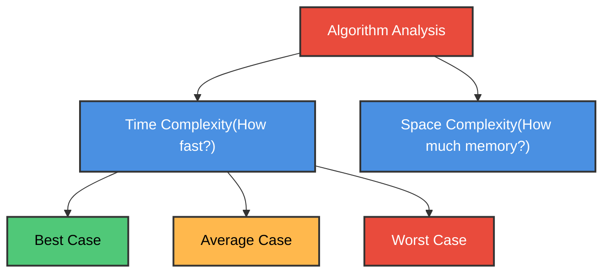

**Why Study This?**
- ✅ Choose the best algorithm for a problem
- ✅ Predict how algorithm performs with large data
- ✅ Optimize programs for speed and memory

---

## Mathematical Foundations

### Floor and Ceiling Functions

**In Simple Terms:** 
- **Floor** ⌊x⌋ = Round DOWN to nearest integer
- **Ceiling** ⌈x⌉ = Round UP to nearest integer

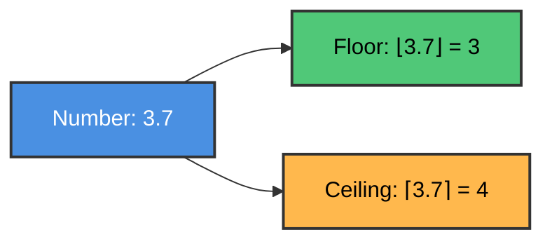

**Examples:**

| Number | Floor ⌊x⌋ | Ceiling ⌈x⌉ |
|--------|-----------|-------------|
| 3.14   | 3         | 4           |
| 7.9    | 7         | 8           |
| -2.5   | -3        | -2          |
| 5.0    | 5         | 5           |

### C Program: Floor and Ceiling

```c
#include <stdio.h>
#include <math.h>

int main() {
    double numbers[] = {3.14, 7.9, -2.5, 5.0};
    int n = 4;
    
    printf("Number\tFloor\tCeiling\n");
    printf("------\t-----\t-------\n");
    
    for(int i = 0; i < n; i++) {
        printf("%.2f\t%.0f\t%.0f\n", 
               numbers[i], 
               floor(numbers[i]), 
               ceil(numbers[i]));
    }
    
    return 0;
}
```

---

### Modular Arithmetic

**In Simple Terms:** Modulo (mod) gives you the remainder after division. Like when you divide 17 cookies among 5 friends - each gets 3, with 2 left over. So 17 mod 5 = 2.

**Formula:** `k mod M = remainder when k ÷ M`

**Examples:**
- 25 mod 7 = 4 (because 25 = 7×3 + **4**)
- 100 mod 10 = 0 (because 100 = 10×10 + **0**)
- 17 mod 5 = 2 (because 17 = 5×3 + **2**)

### C Program: Modulo Operation

```c
#include <stdio.h>

int main() {
    int numbers[] = {25, 100, 17, 43};
    int divisors[] = {7, 10, 5, 8};
    int n = 4;
    
    printf("Number\tDivisor\tRemainder\n");
    printf("------\t-------\t---------\n");
    
    for(int i = 0; i < n; i++) {
        printf("%d\t%d\t%d\n", 
               numbers[i], 
               divisors[i], 
               numbers[i] % divisors[i]);
    }
    
    return 0;
}
```

**Output:**
```
Number	Divisor	Remainder
------	-------	---------
25	7	4
100	10	0
17	5	2
43	8	3
```

---

### Summation (Σ)

**In Simple Terms:** The Σ symbol means "add up a bunch of numbers."

**Example:** Sum of first 5 numbers
```
  5
  Σ i = 1 + 2 + 3 + 4 + 5 = 15
 i=1
```

**Formula for sum of first n numbers:**
```
  n
  Σ i = n(n+1)/2
 i=1
```

### C Program: Summation

```c
#include <stdio.h>

int main() {
    int n = 10;
    int sum = 0;
    
    // Method 1: Using loop
    for(int i = 1; i <= n; i++) {
        sum += i;
    }
    printf("Sum of 1 to %d (loop): %d\n", n, sum);
    
    // Method 2: Using formula
    int formulaSum = n * (n + 1) / 2;
    printf("Sum of 1 to %d (formula): %d\n", n, formulaSum);
    
    return 0;
}
```

**Output:**
```
Sum of 1 to 10 (loop): 55
Sum of 1 to 10 (formula): 55
```

---

### Factorial (n!)

**In Simple Terms:** Factorial means multiply all numbers from 1 to n.

**Examples:**
- 3! = 1 × 2 × 3 = 6
- 5! = 1 × 2 × 3 × 4 × 5 = 120
- 0! = 1 (special case)

### C Program: Factorial

```c
#include <stdio.h>

// Iterative version
long factorial(int n) {
    long result = 1;
    for(int i = 1; i <= n; i++) {
        result *= i;
    }
    return result;
}

// Recursive version
long factorialRecursive(int n) {
    if(n == 0 || n == 1) return 1;
    return n * factorialRecursive(n - 1);
}

int main() {
    printf("n\tFactorial\n");
    printf("--\t---------\n");
    
    for(int i = 0; i <= 10; i++) {
        printf("%d\t%ld\n", i, factorial(i));
    }
    
    return 0;
}
```

---

### Logarithms

**In Simple Terms:** Logarithm asks "what power do I raise this base to get this number?"

**log₂ 8 = 3** means "2 to what power equals 8?" Answer: 3 (because 2³ = 8)

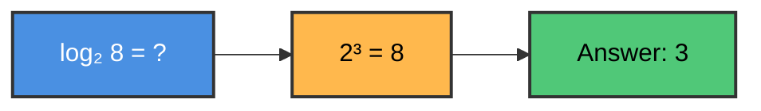

**Common Logarithms:**
- log₂ (base 2) - used in computer science
- log₁₀ (base 10) - common logarithm
- ln (base e ≈ 2.718) - natural logarithm

**Examples:**

| Expression | Value | Why |
|------------|-------|-----|
| log₂ 8     | 3     | 2³ = 8 |
| log₂ 16    | 4     | 2⁴ = 16 |
| log₁₀ 100  | 2     | 10² = 100 |
| log₂ 1     | 0     | 2⁰ = 1 |

### C Program: Logarithm

```c
#include <stdio.h>
#include <math.h>

int main() {
    int numbers[] = {8, 16, 32, 64, 128};
    int n = 5;
    
    printf("Number\tlog₂\n");
    printf("------\t----\n");
    
    for(int i = 0; i < n; i++) {
        // log₂(x) = log(x) / log(2)
        double log2_value = log(numbers[i]) / log(2);
        printf("%d\t%.0f\n", numbers[i], log2_value);
    }
    
    return 0;
}
```

---

## Algorithm Notation

### Algorithm Structure

**Parts of an Algorithm:**
1. **Header:** Name and description
2. **Input:** What data is needed
3. **Output:** What result is produced
4. **Steps:** Numbered instructions

### Example: Find Maximum Element

**Algorithm:** Find the largest number in an array

```
Input: Array DATA with N numbers
Output: MAX (largest value)

Step 1. Set MAX = DATA[0]
Step 2. For i = 1 to N-1:
           If DATA[i] > MAX then:
              Set MAX = DATA[i]
        [End loop]
Step 3. Return MAX
```

### C Implementation

```c
#include <stdio.h>

int findMax(int arr[], int n) {
    int max = arr[0];
    
    for(int i = 1; i < n; i++) {
        if(arr[i] > max) {
            max = arr[i];
        }
    }
    
    return max;
}

int main() {
    int numbers[] = {45, 23, 67, 12, 89, 34};
    int n = 6;
    
    int maximum = findMax(numbers, n);
    printf("Maximum value: %d\n", maximum);
    
    return 0;
}
```

**Output:**
```
Maximum value: 89
```

---

## Control Structures

### 1. Sequence (Do things in order)

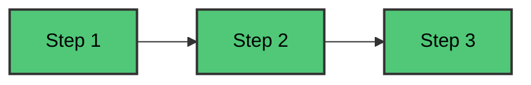

**Example:**
```c
int a = 5;      // Step 1
int b = 10;     // Step 2
int sum = a + b; // Step 3
```

---

### 2. Selection (Make decisions)

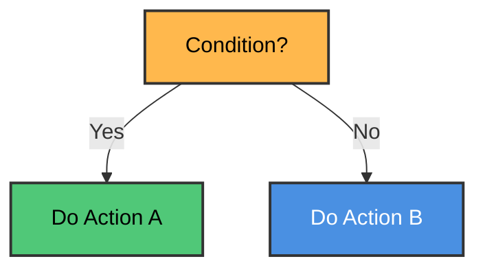

**Example:**
```c
if(age >= 18) {
    printf("Adult");
} else {
    printf("Minor");
}
```

---

### 3. Iteration (Repeat actions)

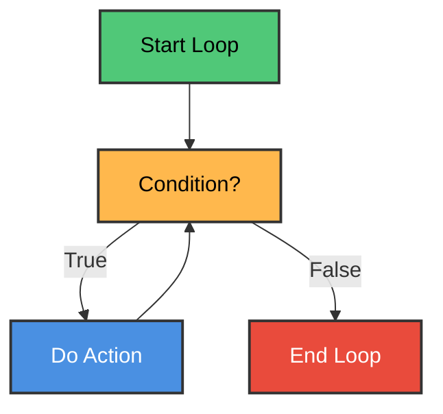

**Example:**
```c
for(int i = 0; i < 5; i++) {
    printf("%d ", i);
}
// Output: 0 1 2 3 4
```

---

## Algorithm Complexity

### What is Complexity?

**In Simple Terms:** Complexity measures how much time or memory an algorithm needs as the input size grows.

**Two Types:**
- **Time Complexity:** How many steps does it take?
- **Space Complexity:** How much memory does it use?

### Measuring Time Complexity

We count the number of **basic operations** (comparisons, assignments, etc.)

**Example: Linear Search**

```c
int linearSearch(int arr[], int n, int target) {
    for(int i = 0; i < n; i++) {        // n iterations
        if(arr[i] == target) {          // 1 comparison per iteration
            return i;
        }
    }
    return -1;
}
```

**Analysis:**
- **Best Case:** Target is first element → 1 comparison
- **Worst Case:** Target is last or not present → n comparisons
- **Average Case:** Target is in middle → n/2 comparisons

---

### Three Cases

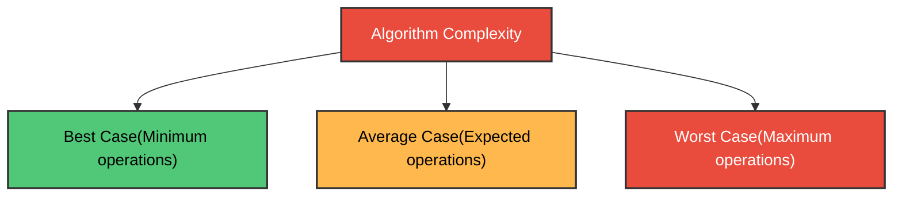

**Example with Array [10, 20, 30, 40, 50]:**

Searching for different values:
- Search for 10: **Best case** (1 comparison)
- Search for 30: **Average case** (3 comparisons)
- Search for 50 or 99: **Worst case** (5 comparisons)

---

## Big O Notation

### What is Big O?

**In Simple Terms:** Big O describes how an algorithm's time grows as input size increases. It's like saying "this algorithm gets slower linearly" or "this one gets slower exponentially."

**Notation:** O(f(n)) where n is input size

### Common Big O Values

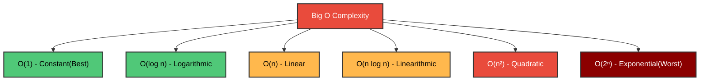

### Complexity Comparison

| Big O | Name | Example | n=10 | n=100 | n=1000 |
|-------|------|---------|------|-------|--------|
| O(1) | Constant | Array access | 1 | 1 | 1 |
| O(log n) | Logarithmic | Binary search | 3 | 7 | 10 |
| O(n) | Linear | Linear search | 10 | 100 | 1000 |
| O(n log n) | Linearithmic | Merge sort | 30 | 700 | 10000 |
| O(n²) | Quadratic | Bubble sort | 100 | 10000 | 1000000 |
| O(2ⁿ) | Exponential | Recursive fibonacci | 1024 | huge | impossible |

### Examples with Code

**O(1) - Constant Time:**
```c
int getFirst(int arr[]) {
    return arr[0];  // Always 1 operation
}
```

**O(n) - Linear Time:**
```c
int sum(int arr[], int n) {
    int total = 0;
    for(int i = 0; i < n; i++) {  // n operations
        total += arr[i];
    }
    return total;
}
```

**O(n²) - Quadratic Time:**
```c
void printPairs(int arr[], int n) {
    for(int i = 0; i < n; i++) {        // n iterations
        for(int j = 0; j < n; j++) {    // n iterations each
            printf("(%d,%d) ", arr[i], arr[j]);
        }
    }
}
// Total: n × n = n² operations
```

**O(log n) - Logarithmic Time:**
```c
int binarySearch(int arr[], int n, int target) {
    int left = 0, right = n - 1;
    
    while(left <= right) {
        int mid = left + (right - left) / 2;
        
        if(arr[mid] == target) return mid;
        
        if(arr[mid] < target)
            left = mid + 1;
        else
            right = mid - 1;
    }
    return -1;
}
// Divides search space in half each time
```

---

### Big O Rules

**Rule 1: Drop Constants**
- O(2n) → O(n)
- O(500) → O(1)

**Rule 2: Drop Lower Order Terms**
- O(n² + n) → O(n²)
- O(n + log n) → O(n)

**Rule 3: Different Inputs Use Different Variables**
- Two loops over different arrays: O(a + b)
- Nested loops over different arrays: O(a × b)

### C Program: Complexity Demonstration

```c
#include <stdio.h>
#include <time.h>

// O(1) - Constant
int constant(int arr[], int n) {
    return arr[0];
}

// O(n) - Linear
int linear(int arr[], int n) {
    int sum = 0;
    for(int i = 0; i < n; i++) {
        sum += arr[i];
    }
    return sum;
}

// O(n²) - Quadratic
int quadratic(int arr[], int n) {
    int count = 0;
    for(int i = 0; i < n; i++) {
        for(int j = 0; j < n; j++) {
            count++;
        }
    }
    return count;
}

int main() {
    int sizes[] = {10, 100, 1000};
    
    printf("Input Size\tO(1)\tO(n)\tO(n²)\n");
    printf("----------\t----\t----\t-----\n");
    
    for(int i = 0; i < 3; i++) {
        int n = sizes[i];
        printf("%d\t\t1\t%d\t%d\n", n, n, n*n);
    }
    
    return 0;
}
```

**Output:**
```
Input Size	O(1)	O(n)	O(n²)
----------	----	----	-----
10		1	10	100
100		1	100	10000
1000		1	1000	1000000
```

---

## Other Asymptotic Notations

### Omega Notation (Ω) - Lower Bound

**In Simple Terms:** Ω describes the **best case** - the minimum time an algorithm will take.

**Example:** Linear search is Ω(1) because in the best case, we find the element immediately.

---

### Theta Notation (Θ) - Tight Bound

**In Simple Terms:** Θ describes when the best and worst cases are the same.

**Example:** Printing all elements is Θ(n) - always takes exactly n steps.

```c
void printAll(int arr[], int n) {
    for(int i = 0; i < n; i++) {
        printf("%d ", arr[i]);
    }
}
// Always n operations, so Θ(n)
```

---

### Summary of Notations

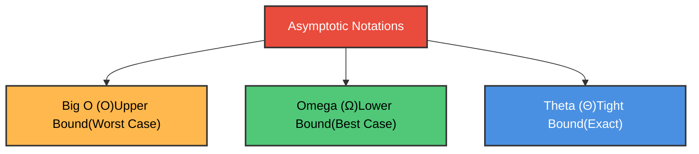

| Notation | Meaning | Example |
|----------|---------|---------|
| O(f(n)) | At most f(n) | Linear search: O(n) |
| Ω(f(n)) | At least f(n) | Linear search: Ω(1) |
| Θ(f(n)) | Exactly f(n) | Print array: Θ(n) |

---

## Practice Exercises

### Exercise 1: Floor and Ceiling

**Question:** Calculate ⌊7.8⌋ and ⌈7.8⌉

<details>
<summary>Click for answer</summary>

- ⌊7.8⌋ = **7** (round down)
- ⌈7.8⌉ = **8** (round up)
</details>

---

### Exercise 2: Modular Arithmetic

**Question:** Calculate 47 mod 5

<details>
<summary>Click for answer</summary>

47 ÷ 5 = 9 remainder **2**

So 47 mod 5 = **2**

(Because 47 = 5×9 + 2)
</details>

---

### Exercise 3: Big O Analysis

**Question:** What is the time complexity of this code?

```c
for(int i = 0; i < n; i++) {
    for(int j = 0; j < n; j++) {
        printf("%d ", i + j);
    }
}
```

<details>
<summary>Click for answer</summary>

**O(n²)** - Quadratic time

The outer loop runs n times, and for each iteration, the inner loop runs n times.
Total operations: n × n = n²
</details>

---

### Exercise 4: Factorial

**Question:** Calculate 6!

<details>
<summary>Click for answer</summary>

6! = 6 × 5 × 4 × 3 × 2 × 1 = **720**

Or using the recursive property:
6! = 6 × 5! = 6 × 120 = **720**
</details>

---

### Exercise 5: Logarithm

**Question:** What is log₂ 64?

<details>
<summary>Click for answer</summary>

log₂ 64 = **6**

Because 2⁶ = 64
</details>

---

### Exercise 6: Algorithm Analysis

**Question:** Which is faster for searching in a sorted array of 1000 elements?
- A) Linear Search
- B) Binary Search

<details>
<summary>Click for answer</summary>

**B) Binary Search** is much faster!

- Linear Search: O(n) → up to 1000 comparisons
- Binary Search: O(log n) → about 10 comparisons

Binary search is ~100x faster!
</details>

---

## 📚 Algorithms from Chapter 2

This section covers all the algorithms presented in Chapter 2 of Schaum's Data Structures textbook, with easy-to-understand explanations and visual flowcharts.

---

## Algorithm 2.1: Largest Element in Array (Using Go To)

### Problem Statement
**Given:** An array DATA with N numerical values  
**Find:** The location LOC and value MAX of the largest element

### The Idea (Super Simple!)

Imagine you're looking for the tallest person in a line:
1. Start by assuming the first person is the tallest
2. Go through each person one by one
3. If someone is taller, remember them as the new tallest
4. When you reach the end, you know the tallest person!

### Algorithm (Textbook Format)

```
Algorithm 2.1: LARGEST ELEMENT IN ARRAY
─────────────────────────────────────────
A nonempty array DATA with N numerical values is given.
This algorithm finds the location LOC and the value MAX 
of the largest element of DATA.
The variable K is used as a counter.

Step 1. [Initialize.] Set K := 1, LOC := 1 and MAX := DATA[1].
Step 2. [Increment counter.] Set K := K + 1.
Step 3. [Test counter.] If K > N, then:
            Write: LOC, MAX, and Exit.
Step 4. [Compare and update.] If MAX < DATA[K], then:
            Set LOC := K and MAX := DATA[K].
Step 5. [Repeat loop.] Go to Step 2.
```

### Visual Flowchart

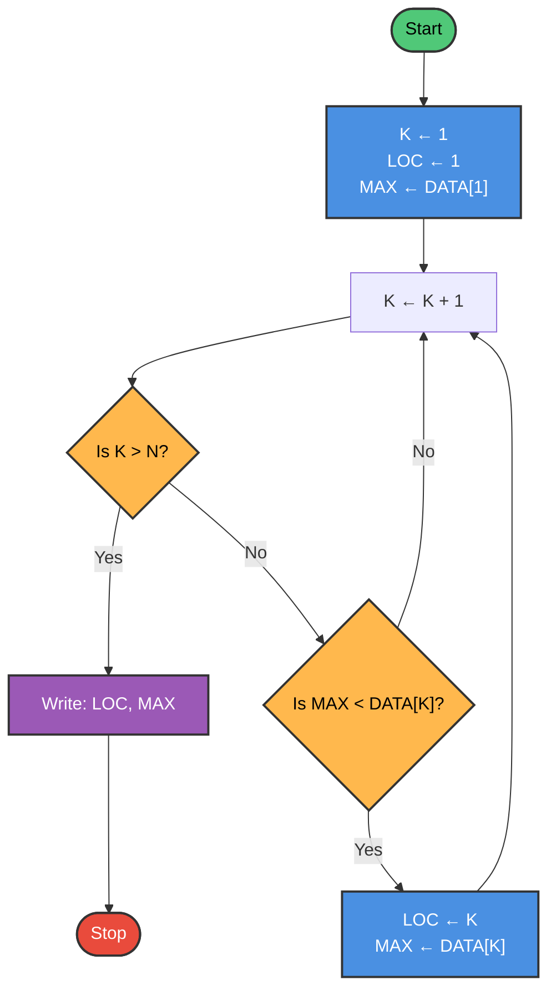

### Step-by-Step Trace

**Given:** DATA = [45, 23, 78, 12, 89, 34], N = 6

| Step | K | DATA[K] | MAX | LOC | Action |
|------|---|---------|-----|-----|--------|
| Init | 1 | 45 | 45 | 1 | Initialize MAX = DATA[1] |
| 2-4 | 2 | 23 | 45 | 1 | 23 < 45, no update |
| 2-4 | 3 | 78 | 78 | 3 | 78 > 45, update MAX and LOC |
| 2-4 | 4 | 12 | 78 | 3 | 12 < 78, no update |
| 2-4 | 5 | 89 | 89 | 5 | 89 > 78, update MAX and LOC |
| 2-4 | 6 | 34 | 89 | 5 | 34 < 89, no update |
| 3 | 7 | - | 89 | 5 | K > N, exit with MAX=89, LOC=5 |

### C Implementation

```c
#include <stdio.h>

void findLargest_GoTo(int DATA[], int N) {
    int K, LOC, MAX;
    
    // Step 1: Initialize
    K = 1;
    LOC = 1;
    MAX = DATA[1];  // Using 1-indexed (DATA[0] unused)
    
Step2:
    // Step 2: Increment counter
    K = K + 1;
    
    // Step 3: Test counter
    if (K > N) {
        printf("Location: %d, Maximum: %d\n", LOC, MAX);
        return;  // Exit
    }
    
    // Step 4: Compare and update
    if (MAX < DATA[K]) {
        LOC = K;
        MAX = DATA[K];
    }
    
    // Step 5: Repeat loop
    goto Step2;
}

int main() {
    // Using index 1 to N (index 0 unused)
    int DATA[] = {0, 45, 23, 78, 12, 89, 34};  // 0 is placeholder
    int N = 6;
    
    printf("Array: [45, 23, 78, 12, 89, 34]\n");
    findLargest_GoTo(DATA, N);
    
    return 0;
}
```

**Output:**
```
Array: [45, 23, 78, 12, 89, 34]
Location: 5, Maximum: 89
```

### ⚠️ Note About Go To

The `Go to` statement is **generally avoided** in modern programming because it makes code harder to read and maintain. Algorithm 2.3 shows the improved version using a `while` loop.

### Complexity Analysis

| Metric | Value | Explanation |
|--------|-------|-------------|
| Time Complexity | O(n) | Visit each element once |
| Space Complexity | O(1) | Only need a few variables |
| Comparisons | n-1 | Compare each element with MAX |

---

## Algorithm 2.2: Quadratic Equation Solver

### Problem Statement
**Given:** Coefficients A, B, C of the equation ax² + bx + c = 0  
**Find:** The real solutions (if any)

### The Idea (Super Simple!)

A quadratic equation can have:
- **Two different solutions** (when discriminant > 0)
- **One solution** (when discriminant = 0)
- **No real solutions** (when discriminant < 0)

The **discriminant** D = B² - 4AC tells us which case we have!

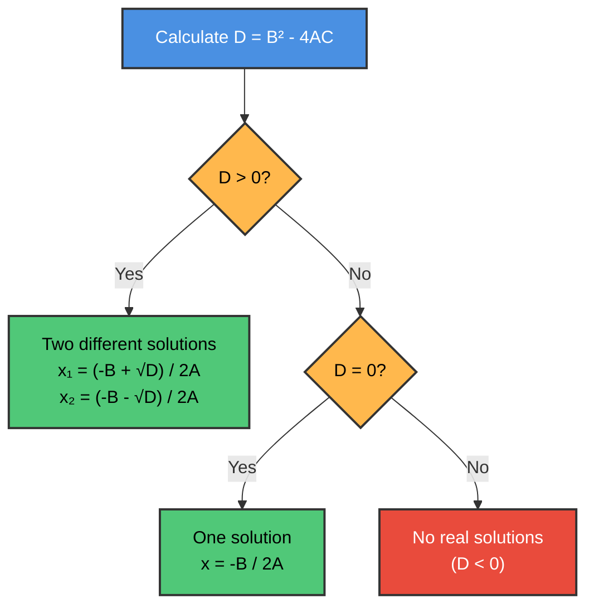

### Algorithm (Textbook Format)

```
Algorithm 2.2: QUADRATIC EQUATION
─────────────────────────────────────────
This algorithm inputs the coefficients A, B, C of a 
quadratic equation and outputs the real solutions, if any.

Step 1. Read: A, B, C.
Step 2. Set D := B² - 4*A*C.
Step 3. If D > 0, then:
            (a) Set X1 := (-B + √D) / (2*A) and
                    X2 := (-B - √D) / (2*A).
            (b) Write: X1, X2.
        Else if D = 0, then:
            (a) Set X := -B / (2*A).
            (b) Write: 'UNIQUE SOLUTION', X.
        Else:
            Write: 'NO REAL SOLUTIONS'
        [End of If structure.]
Step 4. Exit.
```

### Visual Flowchart

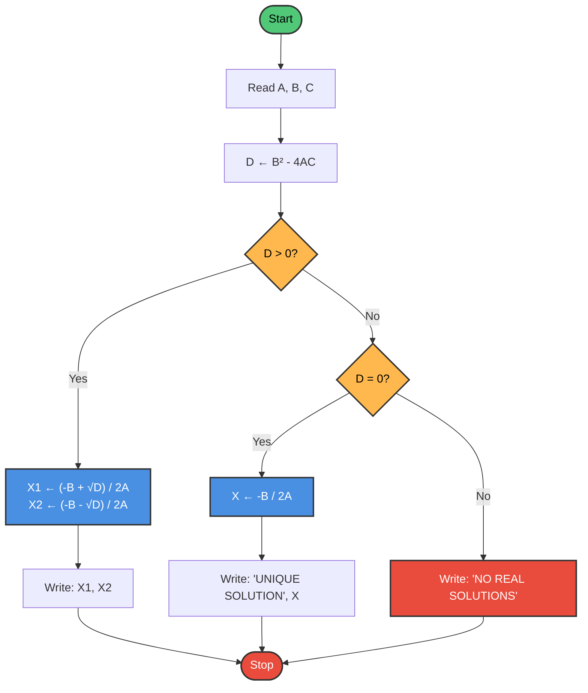

### Example Cases

**Case 1: Two Solutions (D > 0)**
- Equation: x² - 5x + 6 = 0 (A=1, B=-5, C=6)
- D = (-5)² - 4(1)(6) = 25 - 24 = 1 > 0
- X1 = (5 + 1) / 2 = 3
- X2 = (5 - 1) / 2 = 2
- ✅ Solutions: x = 3 and x = 2

**Case 2: One Solution (D = 0)**
- Equation: x² - 4x + 4 = 0 (A=1, B=-4, C=4)
- D = (-4)² - 4(1)(4) = 16 - 16 = 0
- X = 4 / 2 = 2
- ✅ Solution: x = 2 (double root)

**Case 3: No Real Solutions (D < 0)**
- Equation: x² + 2x + 5 = 0 (A=1, B=2, C=5)
- D = (2)² - 4(1)(5) = 4 - 20 = -16 < 0
- ❌ No real solutions

### C Implementation

```c
#include <stdio.h>
#include <math.h>

void solveQuadratic(double A, double B, double C) {
    printf("\nEquation: %.1fx² + %.1fx + %.1f = 0\n", A, B, C);
    
    // Step 2: Calculate discriminant
    double D = B * B - 4 * A * C;
    printf("Discriminant D = %.2f\n", D);
    
    // Step 3: Check cases
    if (D > 0) {
        // Two distinct real solutions
        double X1 = (-B + sqrt(D)) / (2 * A);
        double X2 = (-B - sqrt(D)) / (2 * A);
        printf("Two solutions: X1 = %.4f, X2 = %.4f\n", X1, X2);
    }
    else if (D == 0) {
        // One unique solution
        double X = -B / (2 * A);
        printf("UNIQUE SOLUTION: X = %.4f\n", X);
    }
    else {
        // No real solutions
        printf("NO REAL SOLUTIONS\n");
    }
}

int main() {
    printf("=== QUADRATIC EQUATION SOLVER ===\n");
    
    // Test Case 1: Two solutions
    solveQuadratic(1, -5, 6);  // x² - 5x + 6 = 0
    
    // Test Case 2: One solution
    solveQuadratic(1, -4, 4);  // x² - 4x + 4 = 0
    
    // Test Case 3: No real solutions
    solveQuadratic(1, 2, 5);   // x² + 2x + 5 = 0
    
    return 0;
}
```

**Output:**
```
=== QUADRATIC EQUATION SOLVER ===

Equation: 1.0x² + -5.0x + 6.0 = 0
Discriminant D = 1.00
Two solutions: X1 = 3.0000, X2 = 2.0000

Equation: 1.0x² + -4.0x + 4.0 = 0
Discriminant D = 0.00
UNIQUE SOLUTION: X = 2.0000

Equation: 1.0x² + 2.0x + 5.0 = 0
Discriminant D = -16.00
NO REAL SOLUTIONS
```

### Key Insight: The Quadratic Formula

$$x = \frac{-B \pm \sqrt{B^2 - 4AC}}{2A}$$

The discriminant $D = B^2 - 4AC$ determines:
- $D > 0$: Two distinct real roots
- $D = 0$: One repeated real root
- $D < 0$: Two complex conjugate roots (no real solutions)

---

## Algorithm 2.3: Largest Element in Array (Using While Loop)

### Why This Version?

This is the **improved version** of Algorithm 2.1. Instead of using `Go to` (which creates "spaghetti code"), it uses a `while` loop for **structured programming**.

### Algorithm (Textbook Format)

```
Algorithm 2.3: LARGEST ELEMENT IN ARRAY (Structured)
─────────────────────────────────────────
Given a nonempty array DATA with N numerical values,
this algorithm finds the location LOC and the value MAX 
of the largest element of DATA.

1. [Initialize.] Set K := 1, LOC := 1 and MAX := DATA[1].
2. Repeat Steps 3 and 4 while K ≤ N:
3.     If MAX < DATA[K], then:
           Set LOC := K and MAX := DATA[K].
       [End of If structure.]
4.     Set K := K + 1.
   [End of Step 2 loop.]
5. Write: LOC, MAX.
6. Exit.
```

### Visual Flowchart

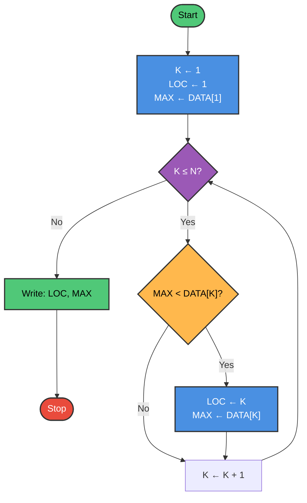

### Comparison: Go To vs While Loop

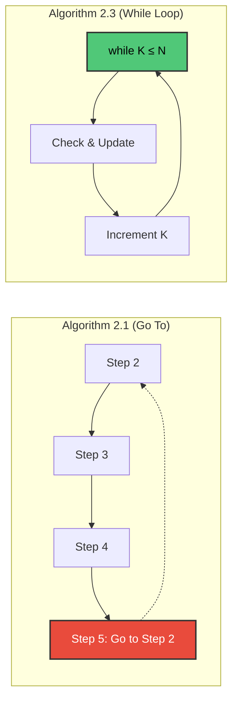

### C Implementation

```c
#include <stdio.h>

void findLargest_While(int DATA[], int N) {
    int K, LOC, MAX;
    
    // Step 1: Initialize
    K = 1;
    LOC = 1;
    MAX = DATA[1];  // Using 1-indexed
    
    // Step 2: Repeat while K ≤ N
    while (K <= N) {
        // Step 3: Compare and update
        if (MAX < DATA[K]) {
            LOC = K;
            MAX = DATA[K];
        }
        
        // Step 4: Increment counter
        K = K + 1;
    }
    
    // Step 5: Output result
    printf("Location: %d, Maximum: %d\n", LOC, MAX);
}

int main() {
    // Using index 1 to N (index 0 unused)
    int DATA[] = {0, 45, 23, 78, 12, 89, 34};  // 0 is placeholder
    int N = 6;
    
    printf("Array: [45, 23, 78, 12, 89, 34]\n");
    printf("Using While Loop:\n");
    findLargest_While(DATA, N);
    
    return 0;
}
```

**Output:**
```
Array: [45, 23, 78, 12, 89, 34]
Using While Loop:
Location: 5, Maximum: 89
```

### Benefits of Structured Programming

| Feature | Go To (Algorithm 2.1) | While Loop (Algorithm 2.3) |
|---------|----------------------|---------------------------|
| Readability | ❌ Harder to follow | ✅ Easy to understand |
| Maintenance | ❌ Difficult to modify | ✅ Easy to change |
| Debugging | ❌ Hard to trace | ✅ Clear flow |
| Modern Practice | ❌ Discouraged | ✅ Recommended |

---

## Algorithm 2.4: Linear Search

### Problem Statement
**Given:** An array DATA with N elements and a specific ITEM to search for  
**Find:** The location LOC where ITEM appears, or LOC = 0 if not found

### The Idea (Super Simple!)

Linear search is like looking for a book on a shelf:
1. Start from the first book
2. Check each book one by one
3. If you find it, note the position
4. If you reach the end without finding it, the book isn't there

### Algorithm (Textbook Format)

```
Algorithm 2.4: LINEAR SEARCH
─────────────────────────────────────────
A linear array DATA with N elements and a specific 
ITEM of information are given. This algorithm finds 
the location LOC of ITEM in DATA or sets LOC = 0.

1. [Initialize] Set K := 1 and LOC := 0.
2. Repeat Steps 3 and 4 while LOC = 0 and K ≤ N.
3.     If ITEM = DATA[K], then: Set LOC := K.
4.     Set K := K + 1. [Increment counter.]
   [End of Step 2 loop.]
5. [Successful?]
       If LOC = 0, then:
           Write: ITEM is not in the array DATA.
       Else:
           Write: LOC is the location of ITEM.
       [End of If structure.]
6. Exit.
```

### Visual Flowchart

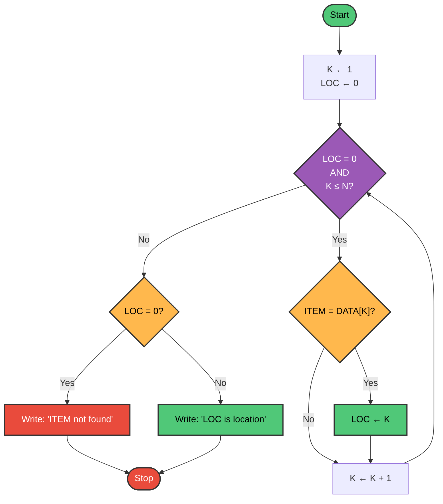

### Step-by-Step Trace

**Given:** DATA = [15, 42, 73, 28, 56], N = 5, ITEM = 73

| Step | K | DATA[K] | ITEM | LOC | Condition | Action |
|------|---|---------|------|-----|-----------|--------|
| Init | 1 | - | 73 | 0 | - | Initialize K=1, LOC=0 |
| 2-4 | 1 | 15 | 73 | 0 | 15 ≠ 73 | Continue |
| 2-4 | 2 | 42 | 73 | 0 | 42 ≠ 73 | Continue |
| 2-4 | 3 | 73 | 73 | 3 | 73 = 73 | Found! LOC = 3 |
| 5 | - | - | - | 3 | LOC ≠ 0 | Output: Location is 3 |

**Another Example:** ITEM = 99 (not in array)

| Step | K | DATA[K] | ITEM | LOC | Condition | Action |
|------|---|---------|------|-----|-----------|--------|
| Init | 1 | - | 99 | 0 | - | Initialize |
| 2-4 | 1 | 15 | 99 | 0 | 15 ≠ 99 | Continue |
| 2-4 | 2 | 42 | 99 | 0 | 42 ≠ 99 | Continue |
| 2-4 | 3 | 73 | 99 | 0 | 73 ≠ 99 | Continue |
| 2-4 | 4 | 28 | 99 | 0 | 28 ≠ 99 | Continue |
| 2-4 | 5 | 56 | 99 | 0 | 56 ≠ 99 | Continue |
| 2 | 6 | - | - | 0 | K > N | Exit loop |
| 5 | - | - | - | 0 | LOC = 0 | Output: Not found |

### C Implementation

```c
#include <stdio.h>

int linearSearch(int DATA[], int N, int ITEM) {
    int K, LOC;
    
    // Step 1: Initialize
    K = 1;
    LOC = 0;
    
    // Step 2: Repeat while LOC = 0 and K ≤ N
    while (LOC == 0 && K <= N) {
        // Step 3: Compare
        if (ITEM == DATA[K]) {
            LOC = K;
        }
        
        // Step 4: Increment counter
        K = K + 1;
    }
    
    // Step 5: Report result
    if (LOC == 0) {
        printf("  ITEM %d is not in the array DATA.\n", ITEM);
    } else {
        printf("  LOC = %d is the location of ITEM %d.\n", LOC, ITEM);
    }
    
    return LOC;
}

int main() {
    // Using index 1 to N (index 0 unused)
    int DATA[] = {0, 15, 42, 73, 28, 56};  // 0 is placeholder
    int N = 5;
    
    printf("=== LINEAR SEARCH ===\n");
    printf("Array DATA: [15, 42, 73, 28, 56]\n\n");
    
    printf("Searching for 73:\n");
    linearSearch(DATA, N, 73);
    
    printf("\nSearching for 28:\n");
    linearSearch(DATA, N, 28);
    
    printf("\nSearching for 99:\n");
    linearSearch(DATA, N, 99);
    
    return 0;
}
```

**Output:**
```
=== LINEAR SEARCH ===
Array DATA: [15, 42, 73, 28, 56]

Searching for 73:
  LOC = 3 is the location of ITEM 73.

Searching for 28:
  LOC = 4 is the location of ITEM 28.

Searching for 99:
  ITEM 99 is not in the array DATA.
```

### Complexity Analysis

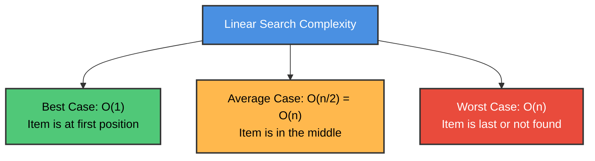

| Case | Comparisons | Big O |
|------|-------------|-------|
| Best Case | 1 | O(1) |
| Average Case | n/2 | O(n) |
| Worst Case | n | O(n) |

### Average Case Analysis (From Textbook)

If ITEM appears in the array with equal probability at any position:
- Position 1: 1 comparison (probability 1/n)
- Position 2: 2 comparisons (probability 1/n)
- ...
- Position n: n comparisons (probability 1/n)

Expected comparisons:
$$C(n) = 1 \cdot \frac{1}{n} + 2 \cdot \frac{1}{n} + \cdots + n \cdot \frac{1}{n} = \frac{1}{n}(1 + 2 + \cdots + n) = \frac{n(n+1)}{2n} = \frac{n+1}{2}$$

So the average case is approximately **n/2 comparisons**, which is O(n).

---

## 📐 Subalgorithms: Functions and Procedures

### What is a Subalgorithm?

A **subalgorithm** is a complete, independent module that:
- Can be called by a main algorithm or another subalgorithm
- Receives input values (called **arguments** or **parameters**)
- Performs computations
- Returns result(s) to the calling algorithm

### Two Types of Subalgorithms

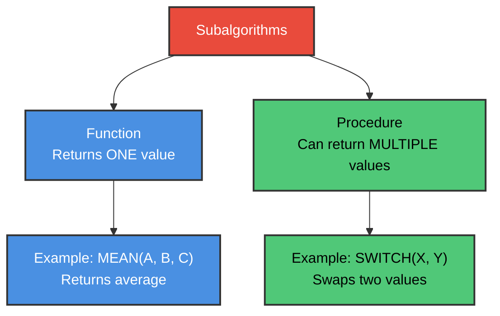

---

### Function 2.5: MEAN (Average of Three Numbers)

**Purpose:** Calculate the average of three numbers A, B, and C.

```
Function 2.5: MEAN(A, B, C)
─────────────────────────────────────────
1. Set AVE := (A + B + C) / 3.
2. Return(AVE).
```

### How Function Calls Work

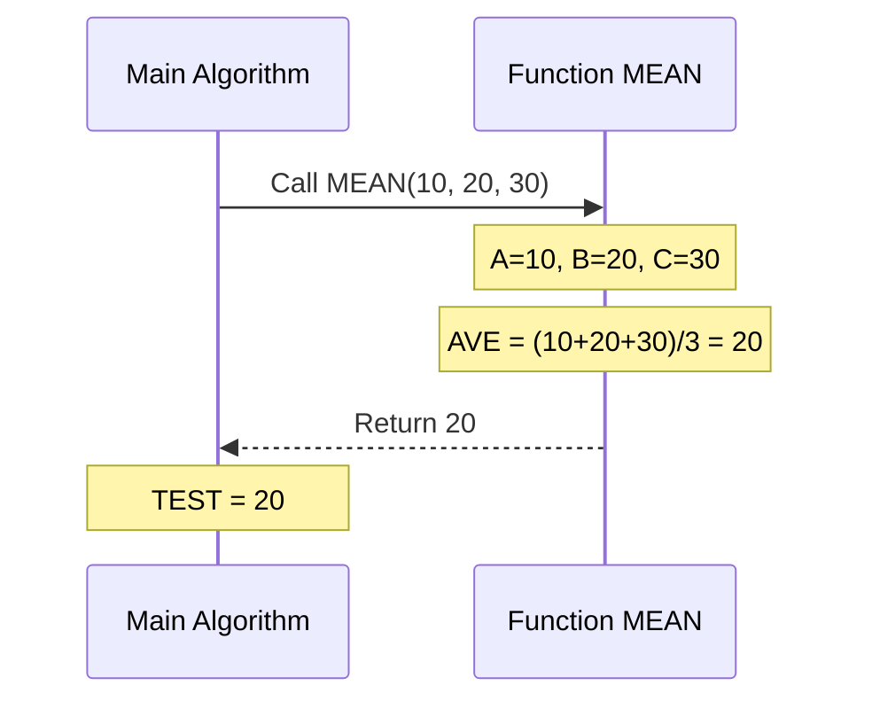

### C Implementation

```c
#include <stdio.h>

// Function 2.5: MEAN
double MEAN(double A, double B, double C) {
    double AVE;
    
    // Step 1: Calculate average
    AVE = (A + B + C) / 3.0;
    
    // Step 2: Return result
    return AVE;
}

int main() {
    double T1 = 85.0;  // Test score 1
    double T2 = 90.0;  // Test score 2
    double T3 = 88.0;  // Test score 3
    
    // Call the function
    double TEST = MEAN(T1, T2, T3);
    
    printf("Test scores: %.1f, %.1f, %.1f\n", T1, T2, T3);
    printf("Average (TEST): %.2f\n", TEST);
    
    return 0;
}
```

**Output:**
```
Test scores: 85.0, 90.0, 88.0
Average (TEST): 87.67
```

---

### Procedure 2.6: SWITCH (Swap Two Values)

**Purpose:** Interchange the values of two variables AAA and BBB.

```
Procedure 2.6: SWITCH(AAA, BBB)
─────────────────────────────────────────
1. Set TEMP := AAA, AAA := BBB, and BBB := TEMP.
2. Return.
```

### How Procedure Calls Work

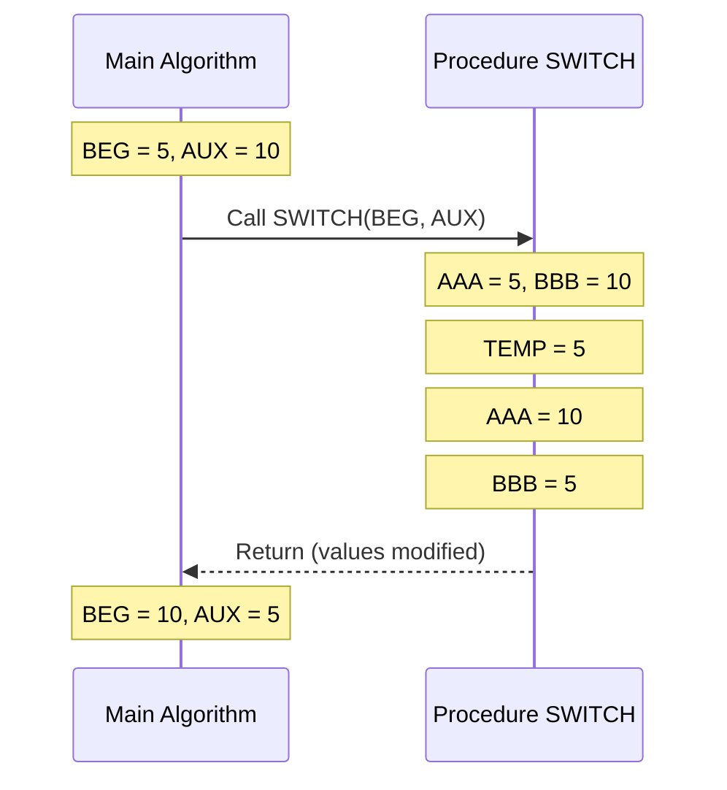

### Visual Explanation of Swap

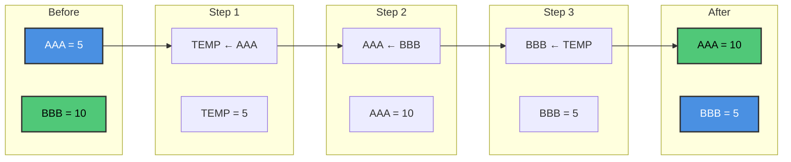

### C Implementation

```c
#include <stdio.h>

// Procedure 2.6: SWITCH
void SWITCH(int *AAA, int *BBB) {
    int TEMP;
    
    // Step 1: Swap using temporary variable
    TEMP = *AAA;
    *AAA = *BBB;
    *BBB = TEMP;
    
    // Step 2: Return (implicit in C void function)
}

int main() {
    int BEG = 5;
    int AUX = 10;
    
    printf("Before SWITCH:\n");
    printf("  BEG = %d, AUX = %d\n", BEG, AUX);
    
    // Call the procedure
    SWITCH(&BEG, &AUX);
    
    printf("\nAfter SWITCH:\n");
    printf("  BEG = %d, AUX = %d\n", BEG, AUX);
    
    return 0;
}
```

**Output:**
```
Before SWITCH:
  BEG = 5, AUX = 10

After SWITCH:
  BEG = 10, AUX = 5
```

---

### Converting Function to Procedure

Any function can be converted to a procedure by adding an extra parameter for the return value:

```mermaid
graph LR
    A["Function MEAN(A, B, C)<br/>Returns AVE"] --> B["Procedure MEAN(A, B, C, AVE)<br/>AVE is output parameter"]
    
    style A fill:#4A90E2,stroke:#333,stroke-width:2px,color:#fff
    style B fill:#50C878,stroke:#333,stroke-width:2px,color:#000
```

**As a Procedure:**
```
Procedure MEAN(A, B, C, AVE)
─────────────────────────────────────────
1. Set AVE := (A + B + C) / 3.
2. Return.
```

**Called as:**
```
Call MEAN(T1, T2, T3, TEST)
```

### C Implementation (Procedure Version)

```c
#include <stdio.h>

// MEAN as a Procedure
void MEAN_Procedure(double A, double B, double C, double *AVE) {
    *AVE = (A + B + C) / 3.0;
}

int main() {
    double T1 = 85.0, T2 = 90.0, T3 = 88.0;
    double TEST;
    
    // Call as procedure
    MEAN_Procedure(T1, T2, T3, &TEST);
    
    printf("Average: %.2f\n", TEST);
    
    return 0;
}
```

---

## 🗂️ Variables and Data Types

### Data Types in Algorithms

```mermaid
graph TD
    A["Data Types"] --> B["Character<br/>Letters, symbols<br/>Coded as EBCDIC/ASCII"]
    A --> C["Real (Float)<br/>Numbers with decimals<br/>3.14, -2.5"]
    A --> D["Integer<br/>Whole numbers<br/>-5, 0, 42"]
    A --> E["Logical (Boolean)<br/>True or False<br/>1 or 0"]
    
    style A fill:#E94B3C,stroke:#333,stroke-width:2px,color:#fff
    style B fill:#4A90E2,stroke:#333,stroke-width:2px,color:#fff
    style C fill:#50C878,stroke:#333,stroke-width:2px,color:#000
    style D fill:#FFB84D,stroke:#333,stroke-width:2px,color:#000
    style E fill:#9B59B6,stroke:#333,stroke-width:2px,color:#fff
```

### Local vs Global Variables

```mermaid
graph TD
    subgraph "Main Program"
        M1["Global Variable: X = 10"]
        M2["Local Variable: A = 5"]
    end
    
    subgraph "Subalgorithm 1"
        S1["Can access X (global)"]
        S2["Local Variable: B = 3"]
        S3["Cannot access A"]
    end
    
    subgraph "Subalgorithm 2"
        T1["Can access X (global)"]
        T2["Local Variable: C = 7"]
        T3["Cannot access A or B"]
    end
    
    M1 --> S1
    M1 --> T1
    
    style M1 fill:#50C878,stroke:#333,stroke-width:2px,color:#000
    style M2 fill:#4A90E2,stroke:#333,stroke-width:2px,color:#fff
    style S2 fill:#FFB84D,stroke:#333,stroke-width:2px,color:#000
    style T2 fill:#9B59B6,stroke:#333,stroke-width:2px,color:#fff
```

| Variable Type | Scope | Example |
|---------------|-------|---------|
| **Local** | Only within the module | TEMP in SWITCH |
| **Parameter** | Passed between modules | A, B, C in MEAN |
| **Global** | Accessible everywhere | Declared with COMMON (FORTRAN) |

### ⚠️ Warning: Side Effects

A **side effect** occurs when a subalgorithm changes a variable that it shouldn't. This can cause hard-to-find bugs!

```c
// BAD: Uses global variable (side effect possible)
int globalCounter = 0;

void badFunction() {
    globalCounter++;  // Side effect!
}

// GOOD: Uses parameters
void goodFunction(int *counter) {
    (*counter)++;  // Clear and explicit
}
```

---

## 📊 Algorithms Comparison Table

| Algorithm | Purpose | Input | Output | Complexity |
|-----------|---------|-------|--------|------------|
| 2.1 | Find largest (Go To) | Array DATA, size N | LOC, MAX | O(n) |
| 2.2 | Solve quadratic | A, B, C | X1, X2 or X | O(1) |
| 2.3 | Find largest (While) | Array DATA, size N | LOC, MAX | O(n) |
| 2.4 | Linear search | Array DATA, size N, ITEM | LOC | O(n) |
| Func 2.5 | Calculate average | A, B, C | AVE | O(1) |
| Proc 2.6 | Swap values | AAA, BBB | Modified AAA, BBB | O(1) |

---

## Summary

### Key Concepts Learned

✅ **Mathematical Functions:** Floor, ceiling, modulo, factorial, logarithms  
✅ **Algorithm Notation:** How to write and read algorithms  
✅ **Control Structures:** Sequence, selection, iteration  
✅ **Complexity Analysis:** Best, average, worst cases  
✅ **Big O Notation:** O(1), O(log n), O(n), O(n²), etc.  
✅ **Asymptotic Notations:** O, Ω, Θ  
✅ **Algorithms 2.1-2.4:** Finding maximum, quadratic solver, linear search  
✅ **Subalgorithms:** Functions and procedures  
✅ **Variables:** Local, global, and parameters  

### Complexity Hierarchy (Fastest to Slowest)

```
O(1) < O(log n) < O(n) < O(n log n) < O(n²) < O(2ⁿ)
```

### Important Takeaways

1. **Big O describes growth rate**, not exact time
2. **Drop constants and lower terms** in Big O
3. **Logarithmic is much better than linear** for large inputs
4. **Quadratic and exponential are slow** for large inputs
5. **Always analyze worst case** for safety
6. **Use structured programming** (avoid Go To statements)
7. **Subalgorithms** make code reusable and modular
8. **Be careful with global variables** to avoid side effects

---

**End of Chapter 2**

*Continue to [Chapter 3: String Processing](https://github.com/M-F-Tushar/CSE-2101-Data-Structure/blob/main/Chapter%203%20-%20String%20Processing/README.md)*


