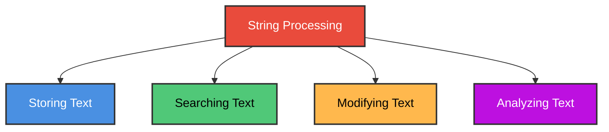
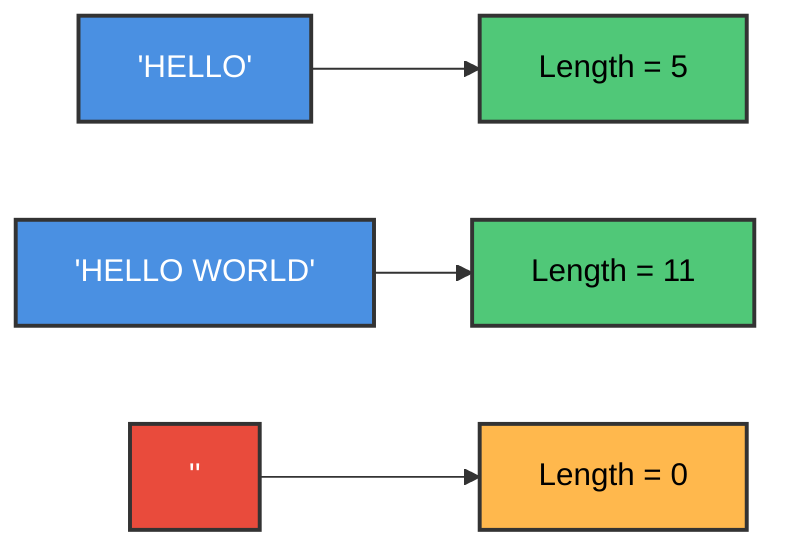
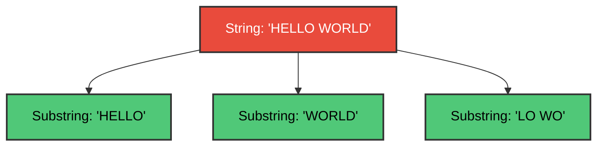
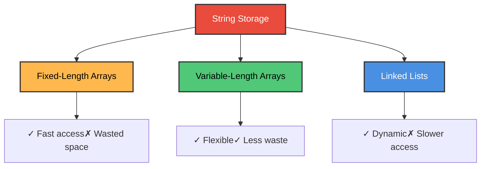
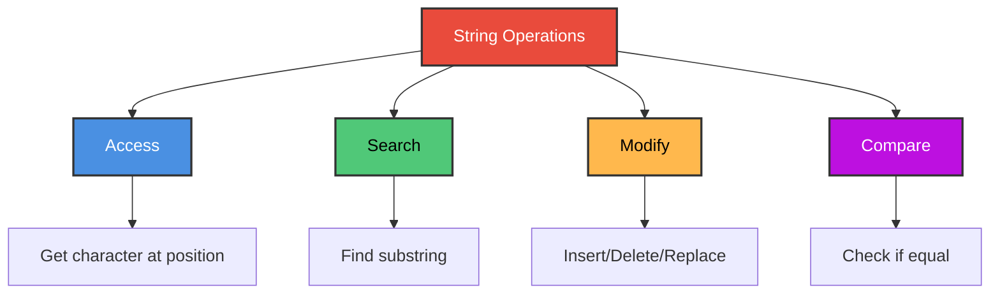
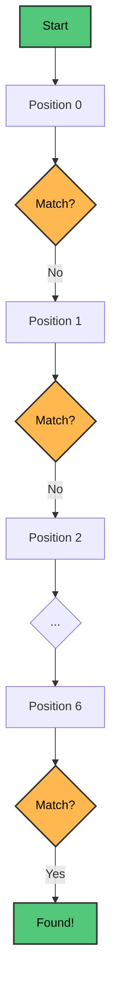

# Chapter 3: String Processing

## Table of Contents

1. [Introduction](#introduction)
2. [String Basics](#string-basics)
3. [String Storage Methods](#string-storage-methods)
4. [String Operations](#string-operations)
5. [Pattern Matching](#pattern-matching)
6. [String Manipulation](#string-manipulation)
7. [Practice Exercises](#practice-exercises)

---

## Introduction

### What is String Processing?

**In Simple Terms:** String processing is working with text - like searching for a word in a document, replacing text, or counting characters. It's what happens when you use "Find" in a word processor!



**Common Uses:**
- ✅ Word processors (Microsoft Word, Google Docs)
- ✅ Search engines (Google, Bing)
- ✅ Text editors (VS Code, Notepad++)
- ✅ Email clients
- ✅ Social media platforms

---

## String Basics

### What is a String?

**In Simple Terms:** A string is a sequence of characters - letters, numbers, symbols, and spaces.

**Examples:**
- `"Hello World"` - 11 characters (including space)
- `"12345"` - 5 characters (numbers as text)
- `""` - 0 characters (empty string)
- `"C Programming!"` - 14 characters

### String Length

**Length:** The number of characters in a string



### C Program: String Length

```c
#include <stdio.h>
#include <string.h>

int main() {
    char str1[] = "Hello";
    char str2[] = "Hello World";
    char str3[] = "";
    
    printf("String\t\tLength\n");
    printf("------\t\t------\n");
    printf("'%s'\t\t%lu\n", str1, strlen(str1));
    printf("'%s'\t%lu\n", str2, strlen(str2));
    printf("'%s'\t\t%lu\n", str3, strlen(str3));
    
    return 0;
}
```

**Output:**
```
String		Length
------		------
'Hello'		5
'Hello World'	11
''		0
```

---

### Concatenation

**In Simple Terms:** Concatenation means joining two strings together.

**Symbol:** `//` (in algorithms) or `strcat()` (in C)

**Examples:**
- `"Hello" // "World"` = `"HelloWorld"`
- `"Hello" // " " // "World"` = `"Hello World"`

### C Program: Concatenation

```c
#include <stdio.h>
#include <string.h>

int main() {
    char str1[50] = "Hello";
    char str2[] = "World";
    char str3[50] = "Hello";
    char space[] = " ";
    
    // Concatenate without space
    strcat(str1, str2);
    printf("Result 1: %s\n", str1);
    
    // Concatenate with space
    strcat(str3, space);
    strcat(str3, str2);
    printf("Result 2: %s\n", str3);
    
    return 0;
}
```

**Output:**
```
Result 1: HelloWorld
Result 2: Hello World
```

---

### Substrings

**In Simple Terms:** A substring is a piece of a string.



**Types:**
- **Prefix:** Starts at beginning (`"HELLO"` from `"HELLO WORLD"`)
- **Suffix:** Ends at end (`"WORLD"` from `"HELLO WORLD"`)
- **Middle:** Anywhere in between (`"LO WO"` from `"HELLO WORLD"`)

---

## String Storage Methods

### Three Main Methods



---

### Method 1: Fixed-Length Arrays

**In Simple Terms:** Reserve a fixed amount of space for each string, like having boxes of the same size.

**Example:**
```
String: "HELLO"
Storage: [H][E][L][L][O][ ][ ][ ][ ][ ]
         ← 5 used → ← 5 wasted →
```

**Advantages:**
- ✅ Fast access to any character
- ✅ Simple implementation

**Disadvantages:**
- ❌ Wastes space if string is short
- ❌ Can't store strings longer than fixed size

### C Program: Fixed-Length Storage

```c
#include <stdio.h>
#include <string.h>

#define MAX_LENGTH 20

int main() {
    char strings[3][MAX_LENGTH] = {
        "Hello",
        "World",
        "C Programming"
    };
    
    printf("Fixed-Length Storage (Max: %d chars)\n\n", MAX_LENGTH);
    
    for(int i = 0; i < 3; i++) {
        int used = strlen(strings[i]);
        int wasted = MAX_LENGTH - used - 1;
        printf("String %d: '%s'\n", i+1, strings[i]);
        printf("  Used: %d chars, Wasted: %d chars\n\n", used, wasted);
    }
    
    return 0;
}
```

---

### Method 2: Variable-Length with NULL Terminator

**In Simple Terms:** Use only as much space as needed, and mark the end with a special character (`\0`).

**Example:**
```
String: "HELLO"
Storage: [H][E][L][L][O][\0]
         ← 5 used → ← 1 terminator →
```

**This is how C stores strings!**

### C Program: NULL-Terminated Strings

```c
#include <stdio.h>
#include <string.h>

int main() {
    char str[] = "Hello";
    
    printf("String: %s\n", str);
    printf("Length: %lu\n\n", strlen(str));
    
    printf("Character-by-character:\n");
    for(int i = 0; str[i] != '\0'; i++) {
        printf("str[%d] = '%c'\n", i, str[i]);
    }
    printf("str[%d] = '\\0' (NULL terminator)\n", (int)strlen(str));
    
    return 0;
}
```

**Output:**
```
String: Hello
Length: 5

Character-by-character:
str[0] = 'H'
str[1] = 'e'
str[2] = 'l'
str[3] = 'l'
str[4] = 'o'
str[5] = '\0' (NULL terminator)
```

---

### Method 3: Linked Lists

**In Simple Terms:** Store characters in connected nodes, like a chain.


**Advantages:**
- ✅ Dynamic size
- ✅ Easy insertion/deletion

**Disadvantages:**
- ❌ Extra memory for pointers
- ❌ Slower access (must traverse)

---

## String Operations

### Common String Operations



---

### 1. Character Access

**Get character at position n**

### C Program: Character Access

```c
#include <stdio.h>
#include <string.h>

char getChar(char str[], int pos) {
    if(pos >= 0 && pos < strlen(str)) {
        return str[pos];
    }
    return '\0';  // Invalid position
}

int main() {
    char str[] = "HELLO";
    
    printf("String: %s\n\n", str);
    
    for(int i = 0; i < strlen(str); i++) {
        printf("Position %d: '%c'\n", i, getChar(str, i));
    }
    
    return 0;
}
```

**Output:**
```
String: HELLO

Position 0: 'H'
Position 1: 'E'
Position 2: 'L'
Position 3: 'L'
Position 4: 'O'
```

---

### 2. Substring Extraction

**Extract part of a string**

### C Program: Substring

```c
#include <stdio.h>
#include <string.h>

void substring(char str[], int start, int length, char result[]) {
    int i;
    for(i = 0; i < length && str[start + i] != '\0'; i++) {
        result[i] = str[start + i];
    }
    result[i] = '\0';
}

int main() {
    char str[] = "HELLO WORLD";
    char sub[50];
    
    // Extract "WORLD" (starts at position 6, length 5)
    substring(str, 6, 5, sub);
    printf("Original: %s\n", str);
    printf("Substring (6, 5): %s\n\n", sub);
    
    // Extract "HELLO" (starts at position 0, length 5)
    substring(str, 0, 5, sub);
    printf("Substring (0, 5): %s\n", sub);
    
    return 0;
}
```

**Output:**
```
Original: HELLO WORLD
Substring (6, 5): WORLD

Substring (0, 5): HELLO
```

---

### 3. String Comparison

**Check if two strings are equal**

### C Program: String Comparison

```c
#include <stdio.h>
#include <string.h>

int main() {
    char str1[] = "HELLO";
    char str2[] = "HELLO";
    char str3[] = "WORLD";
    
    printf("Comparing strings:\n\n");
    
    // strcmp returns 0 if equal
    if(strcmp(str1, str2) == 0) {
        printf("'%s' == '%s': TRUE\n", str1, str2);
    } else {
        printf("'%s' == '%s': FALSE\n", str1, str2);
    }
    
    if(strcmp(str1, str3) == 0) {
        printf("'%s' == '%s': TRUE\n", str1, str3);
    } else {
        printf("'%s' == '%s': FALSE\n", str1, str3);
    }
    
    return 0;
}
```

**Output:**
```
Comparing strings:

'HELLO' == 'HELLO': TRUE
'HELLO' == 'WORLD': FALSE
```

---

## Pattern Matching

### What is Pattern Matching?

**In Simple Terms:** Finding if a word or pattern exists in a text, like using Ctrl+F to find a word in a document.


---

### Simple Pattern Matching Algorithm

**Steps:**
1. Start at beginning of text
2. Compare pattern with text at current position
3. If match, return position
4. If no match, move to next position
5. Repeat until pattern found or end of text

### C Program: Pattern Matching

```c
#include <stdio.h>
#include <string.h>

int findPattern(char text[], char pattern[]) {
    int textLen = strlen(text);
    int patLen = strlen(pattern);
    
    // Check each position in text
    for(int i = 0; i <= textLen - patLen; i++) {
        int j;
        
        // Check if pattern matches at position i
        for(j = 0; j < patLen; j++) {
            if(text[i + j] != pattern[j]) {
                break;  // Mismatch
            }
        }
        
        // If we checked all characters and they matched
        if(j == patLen) {
            return i;  // Found at position i
        }
    }
    
    return -1;  // Not found
}

int main() {
    char text[] = "HELLO WORLD";
    char pattern1[] = "WORLD";
    char pattern2[] = "HELLO";
    char pattern3[] = "XYZ";
    
    printf("Text: %s\n\n", text);
    
    int pos1 = findPattern(text, pattern1);
    if(pos1 != -1) {
        printf("'%s' found at position %d\n", pattern1, pos1);
    } else {
        printf("'%s' not found\n", pattern1);
    }
    
    int pos2 = findPattern(text, pattern2);
    if(pos2 != -1) {
        printf("'%s' found at position %d\n", pattern2, pos2);
    } else {
        printf("'%s' not found\n", pattern2);
    }
    
    int pos3 = findPattern(text, pattern3);
    if(pos3 != -1) {
        printf("'%s' found at position %d\n", pattern3, pos3);
    } else {
        printf("'%s' not found\n", pattern3);
    }
    
    return 0;
}
```

**Output:**
```
Text: HELLO WORLD

'WORLD' found at position 6
'HELLO' found at position 0
'XYZ' not found
```

---

### Pattern Matching Visualization



---

## String Manipulation

### 1. Insert Operation

**Insert a string into another string at a specific position**

### C Program: String Insertion

```c
#include <stdio.h>
#include <string.h>

void insertString(char str[], char insert[], int pos, char result[]) {
    int i, j = 0;
    
    // Copy characters before insertion point
    for(i = 0; i < pos; i++) {
        result[j++] = str[i];
    }
    
    // Copy inserted string
    for(i = 0; insert[i] != '\0'; i++) {
        result[j++] = insert[i];
    }
    
    // Copy remaining characters
    for(i = pos; str[i] != '\0'; i++) {
        result[j++] = str[i];
    }
    
    result[j] = '\0';
}

int main() {
    char str[] = "HELLO WORLD";
    char insert[] = "BEAUTIFUL ";
    char result[100];
    
    insertString(str, insert, 6, result);
    
    printf("Original: %s\n", str);
    printf("Insert: %s\n", insert);
    printf("Result: %s\n", result);
    
    return 0;
}
```

**Output:**
```
Original: HELLO WORLD
Insert: BEAUTIFUL 
Result: HELLO BEAUTIFUL WORLD
```

---

### 2. Delete Operation

**Remove characters from a string**

### C Program: String Deletion

```c
#include <stdio.h>
#include <string.h>

void deleteChars(char str[], int pos, int length) {
    int i, j = 0;
    int len = strlen(str);
    
    // Copy characters before deletion point
    for(i = 0; i < pos; i++) {
        str[j++] = str[i];
    }
    
    // Skip 'length' characters
    i = pos + length;
    
    // Copy remaining characters
    while(i < len) {
        str[j++] = str[i++];
    }
    
    str[j] = '\0';
}

int main() {
    char str[] = "HELLO BEAUTIFUL WORLD";
    
    printf("Original: %s\n", str);
    
    // Delete "BEAUTIFUL " (10 chars starting at position 6)
    deleteChars(str, 6, 10);
    
    printf("After deletion: %s\n", str);
    
    return 0;
}
```

**Output:**
```
Original: HELLO BEAUTIFUL WORLD
After deletion: HELLO WORLD
```

---

### 3. Replace Operation

**Replace one substring with another**

### C Program: String Replacement

```c
#include <stdio.h>
#include <string.h>

void replaceString(char str[], char old[], char new[], char result[]) {
    int i = 0, j = 0;
    int oldLen = strlen(old);
    int newLen = strlen(new);
    int strLen = strlen(str);
    
    while(i < strLen) {
        // Check if old string matches at current position
        int match = 1;
        for(int k = 0; k < oldLen; k++) {
            if(str[i + k] != old[k]) {
                match = 0;
                break;
            }
        }
        
        if(match) {
            // Copy new string
            for(int k = 0; k < newLen; k++) {
                result[j++] = new[k];
            }
            i += oldLen;
        } else {
            // Copy current character
            result[j++] = str[i++];
        }
    }
    
    result[j] = '\0';
}

int main() {
    char str[] = "HELLO WORLD";
    char old[] = "WORLD";
    char new[] = "UNIVERSE";
    char result[100];
    
    replaceString(str, old, new, result);
    
    printf("Original: %s\n", str);
    printf("Replace '%s' with '%s'\n", old, new);
    printf("Result: %s\n", result);
    
    return 0;
}
```

**Output:**
```
Original: HELLO WORLD
Replace 'WORLD' with 'UNIVERSE'
Result: HELLO UNIVERSE
```

---

## Practice Exercises

### Exercise 1: String Length

**Question:** What is the length of the string `"C Programming"`?

<details>
<summary>Click for answer</summary>

**13 characters**

Count: C(1) (2) P(3) r(4) o(5) g(6) r(7) a(8) m(9) m(10) i(11) n(12) g(13)
</details>

---

### Exercise 2: Concatenation

**Question:** What is the result of `"Hello" // " " // "World"`?

<details>
<summary>Click for answer</summary>

**"Hello World"**

The `//` operator joins the strings together:
- "Hello" + " " + "World" = "Hello World"
</details>

---

### Exercise 3: Substring

**Question:** Given string `S = "PROGRAMMING"`, what is `SUBSTRING(S, 3, 4)`?

<details>
<summary>Click for answer</summary>

**"OGRA"**

Starting at position 3 (0-indexed = position 2), extract 4 characters:
- Position 3: O
- Position 4: G
- Position 5: R
- Position 6: A
- Result: "OGRA"
</details>

---

### Exercise 4: Pattern Matching

**Question:** In the text `"HELLO WORLD"`, at what position does the pattern `"WORLD"` appear?

<details>
<summary>Click for answer</summary>

**Position 6**

H(0) E(1) L(2) L(3) O(4) (5) W(6) O(7) R(8) L(9) D(10)

"WORLD" starts at position 6.
</details>

---

### Exercise 5: String Comparison

**Question:** Write a C program to check if two strings are equal (without using `strcmp`).

<details>
<summary>Click for answer</summary>

```c
#include <stdio.h>
#include <string.h>

int areEqual(char str1[], char str2[]) {
    int len1 = strlen(str1);
    int len2 = strlen(str2);
    
    // Different lengths = not equal
    if(len1 != len2) {
        return 0;
    }
    
    // Compare character by character
    for(int i = 0; i < len1; i++) {
        if(str1[i] != str2[i]) {
            return 0;  // Not equal
        }
    }
    
    return 1;  // Equal
}

int main() {
    char str1[] = "HELLO";
    char str2[] = "HELLO";
    char str3[] = "WORLD";
    
    if(areEqual(str1, str2)) {
        printf("'%s' and '%s' are equal\n", str1, str2);
    } else {
        printf("'%s' and '%s' are not equal\n", str1, str2);
    }
    
    if(areEqual(str1, str3)) {
        printf("'%s' and '%s' are equal\n", str1, str3);
    } else {
        printf("'%s' and '%s' are not equal\n", str1, str3);
    }
    
    return 0;
}
```
</details>

---

## Summary

### Key Concepts Learned

✅ **String Basics:** Definition, length, concatenation, substrings  
✅ **Storage Methods:** Fixed-length, variable-length, linked lists  
✅ **String Operations:** Access, search, modify, compare  
✅ **Pattern Matching:** Finding substrings in text  
✅ **String Manipulation:** Insert, delete, replace  

### Important C Functions

| Function | Purpose | Example |
|----------|---------|---------|
| `strlen()` | Get string length | `strlen("Hello")` → 5 |
| `strcpy()` | Copy string | `strcpy(dest, src)` |
| `strcat()` | Concatenate | `strcat(s1, s2)` |
| `strcmp()` | Compare | `strcmp(s1, s2)` |
| `strstr()` | Find substring | `strstr(text, pattern)` |

### String Storage Comparison

| Method | Speed | Memory | Flexibility |
|--------|-------|--------|-------------|
| Fixed-Length | Fast | Wasteful | Limited |
| NULL-Terminated | Fast | Efficient | Good |
| Linked List | Slow | Overhead | Excellent |

### Important Takeaways

1. **Strings in C are NULL-terminated** (`\0`)
2. **Always check array bounds** to avoid overflow
3. **Pattern matching is O(n×m)** where n = text length, m = pattern length
4. **Use library functions** when available (safer and tested)
5. **Remember to allocate enough space** for string operations

---

**End of Chapter 3**

*Continue to [Chapter 4: Arrays, Records and Pointers](../Chapter%204%20-%20Arrays,%20Records%20and%20Pointers/README.md)*


