# Chapter 4: Arrays, Records and Pointers


## Table of Contents

1. [Introduction](#introduction)
2. [Linear Arrays (One-Dimensional)](#linear-arrays-one-dimensional)
3. [Array Representation in Memory](#array-representation-in-memory)
4. [Traversing Arrays](#traversing-arrays)
5. [Inserting and Deleting Elements](#inserting-and-deleting-elements)
6. [Sorting: Bubble Sort](#sorting-bubble-sort)
7. [Searching: Linear Search](#searching-linear-search)
8. [Searching: Binary Search](#searching-binary-search)
9. [Multidimensional Arrays](#multidimensional-arrays)
10. [Pointers and Pointer Arrays](#pointers-and-pointer-arrays)
11. [Records and Record Structures](#records-and-record-structures)
12. [Matrices](#matrices)
13. [Sparse Matrices](#sparse-matrices)

---

## Introduction

### Understanding Data Structures

Data structures are ways we organize and store information in a computer. Think of them like different containers for your stuff - some are like a straight line of boxes, others are more complex like a family tree.

We divide data structures into two main groups:

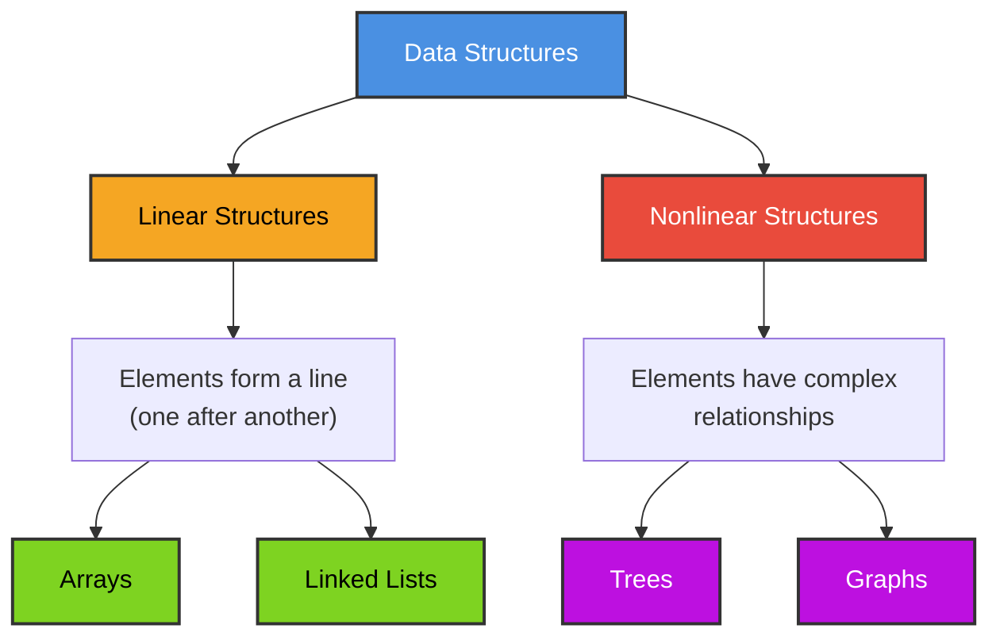

**Linear Structures** are simple - elements are arranged in a straight sequence, like people standing in a queue. There are two ways to create this sequence in computer memory:

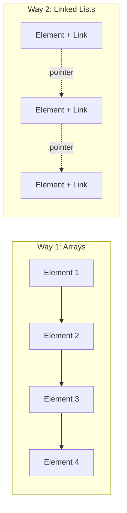

- **Arrays**: Elements sit next to each other in memory (like houses on the same street)
- **Linked Lists**: Elements can be anywhere in memory but point to each other (like a treasure hunt with clues)

**Nonlinear Structures** like trees and graphs are covered in later chapters.

### What Can We Do With Linear Structures?

No matter if we use an array or linked list, we usually need to do these things:

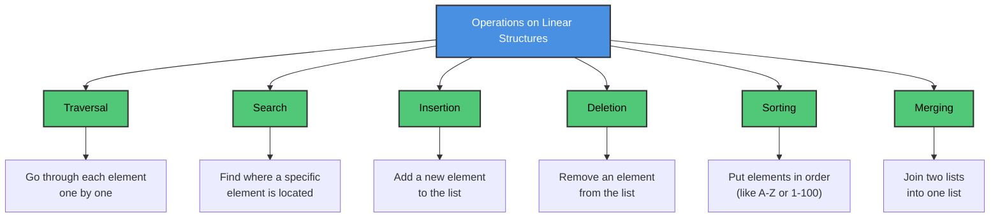

Which structure you choose depends on what operations you do most often. Arrays are great when your data stays mostly the same. Linked lists are better when you add and remove items frequently.

---

## Linear Arrays (One-Dimensional)

### What is a Linear Array?

A **linear array** is a list with a specific number of items, where all items are the same type (all numbers, all names, etc.). Two important features:

1. **Each element has a number (index)** - We use consecutive numbers like 1, 2, 3... or 0, 1, 2... to identify each element
2. **Elements sit next to each other in memory** - The computer stores them in a row of memory locations

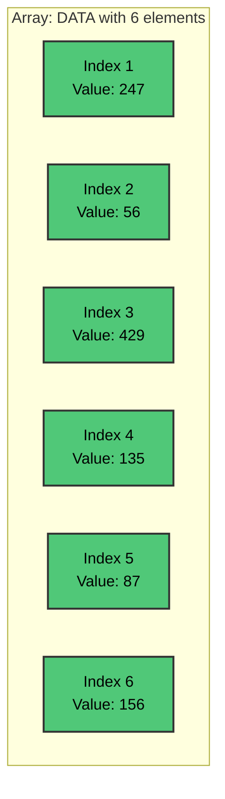

We write array elements as:
- **Subscript notation**: A₁, A₂, A₃, ... Aₙ
- **Bracket notation**: A[1], A[2], A[3], ... A[N]

The number inside the brackets is called the **subscript** or **index**.

### How to Calculate Array Length

The number of elements in an array is called its **length** or **size**.

```
Length = Upper Bound - Lower Bound + 1
```

Where:
- **Upper Bound (UB)** = The largest index
- **Lower Bound (LB)** = The smallest index

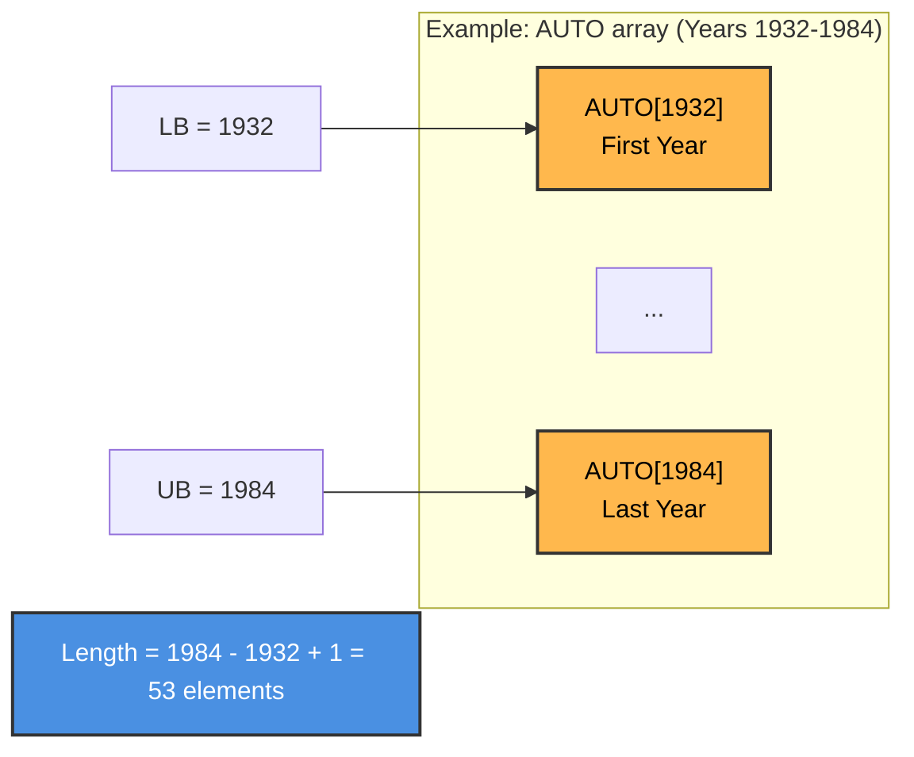

### Static vs Dynamic Arrays

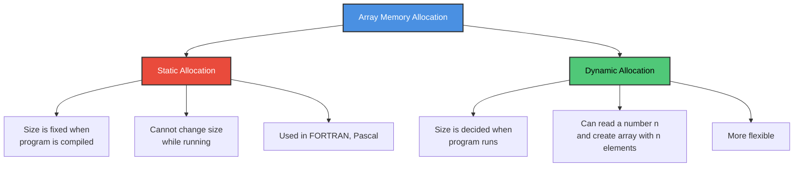

---

## Array Representation in Memory

### How the Computer Stores Arrays

Computer memory is like a long street with numbered houses. Each house (memory location) has an address.

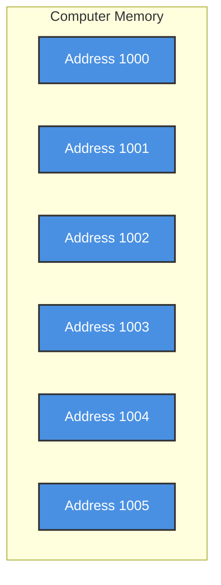

The computer doesn't remember where every element is stored. Instead, it only remembers:
- **Base Address** = Where the first element is stored

Then it calculates where any other element is using this formula:

### Address Calculation Formula

```
LOC(LA[K]) = Base(LA) + w × (K - Lower Bound)
```

Where:
- **LOC(LA[K])** = Memory address of element K
- **Base(LA)** = Address of first element
- **w** = How many bytes each element takes
- **K** = Index of the element we want
- **Lower Bound** = First index (often 0 or 1)

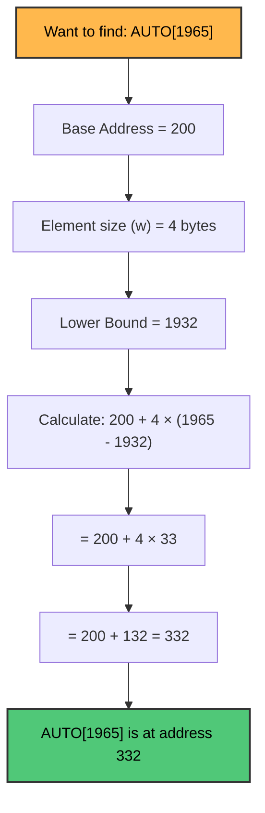

### Why This is Important: Indexing Property

Because we can calculate any element's address using a simple formula, we can access any element in the **same amount of time** - no matter if it's the first element or the millionth element!

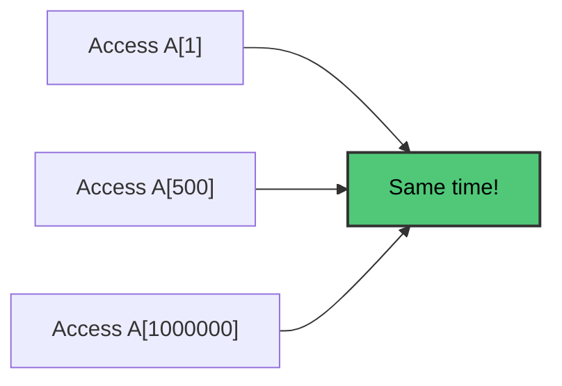

This is called the **indexing property** of arrays. Linked lists don't have this property - to find the 1000th element, you must go through all 999 elements before it.

---

## Traversing Arrays

### What is Traversal?

**Traversal** means visiting every element in the array exactly once. It's like a teacher taking attendance - you go through the list and do something with each name.

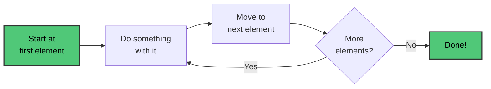

---

### 📘 Algorithm 4.1: Traversing a Linear Array

> **Purpose:** Visit every element in an array exactly once and apply some operation (like printing or counting).

#### Pseudocode

```
Algorithm 4.1: TRAVERSE(LA, LB, UB)
────────────────────────────────────
LA    = Linear Array
LB    = Lower Bound (first index)
UB    = Upper Bound (last index)

1. [Initialize counter] Set K := LB
2. Repeat Steps 3 and 4 while K ≤ UB
3.     [Visit element] Apply PROCESS to LA[K]
4.     [Increase counter] Set K := K + 1
   [End of Step 2 loop]
5. Exit
```

#### 🎯 Visual Flowchart

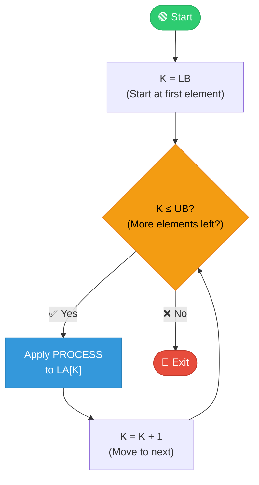

#### Alternative Form (using for loop)

```
Algorithm 4.1': TRAVERSE(LA, LB, UB)
─────────────────────────────────────
1. Repeat for K = LB to UB:
       Apply PROCESS to LA[K]
   [End of loop]
2. Exit
```

#### 📝 Practical Examples

**Example 1: Count years with more than 300 cars sold**

```
1. [Initialize] Set NUM := 0
2. Repeat for K = 1932 to 1984:
       If AUTO[K] > 300, then: Set NUM := NUM + 1
   [End of loop]
3. Return
```

**Example 2: Print each year and sales**

```
1. Repeat for K = 1932 to 1984:
       Write: K, AUTO[K]
   [End of loop]
2. Return
```

⚠️ **Important Note:** If your process needs a starting value (like NUM := 0 for counting), you must set it before starting the traversal!

---

## Inserting and Deleting Elements

### Understanding Insertion

**Inserting** means adding a new element to the array.

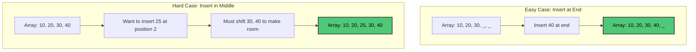

- **Inserting at the end** is easy - just put the new element in the next empty spot
- **Inserting in the middle** is harder - you must move elements to create space

### Understanding Deletion

**Deleting** means removing an element from the array.

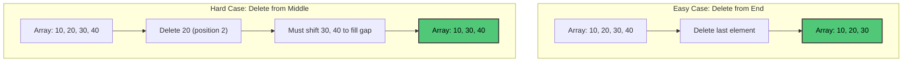

### Visual Example: Managing a Name List

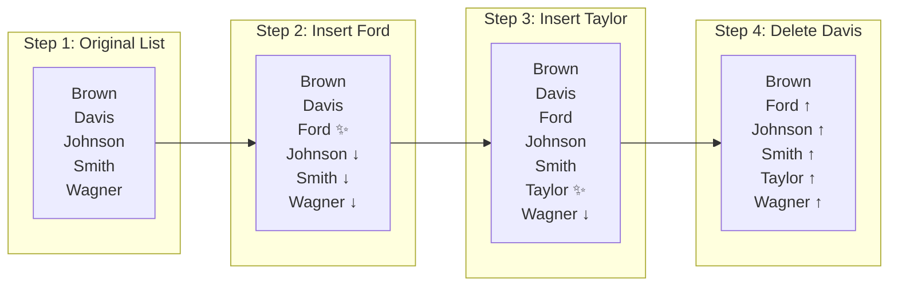

Moving data around is **expensive** when you have thousands of elements!

---

### 📘 Algorithm 4.2: Inserting into a Linear Array

> **Purpose:** Insert a new element ITEM at position K in array LA that has N elements.

#### Pseudocode

```
Algorithm 4.2: INSERT(LA, N, K, ITEM)
─────────────────────────────────────
LA   = Linear Array with N elements
K    = Position where ITEM should be inserted (K ≤ N)
ITEM = Element to insert

1. [Initialize counter] Set J := N
2. Repeat Steps 3 and 4 while J ≥ K
3.     [Move Jth element downward] Set LA[J+1] := LA[J]
4.     [Decrease counter] Set J := J - 1
   [End of Step 2 loop]
5. [Insert element] Set LA[K] := ITEM
6. [Reset N] Set N := N + 1
7. Exit
```

#### 🎯 Visual Flowchart

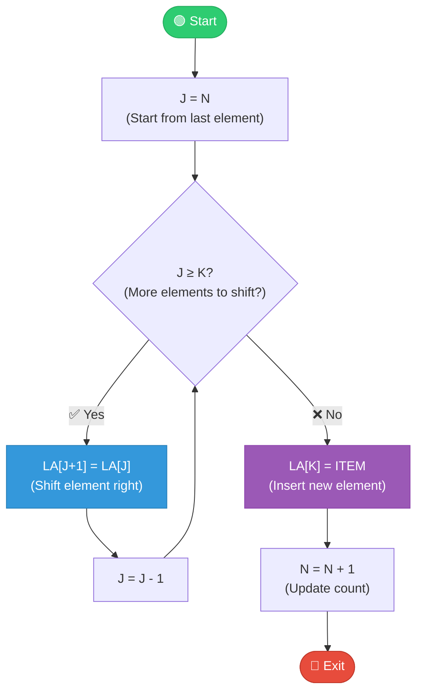

#### ⚠️ Critical: Why Shift in Reverse Order?

We shift from **right to left** (starting from the last element) because:
- If we shifted left to right, we would **overwrite** data before saving it!

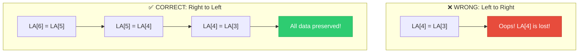

---

### 📘 Algorithm 4.3: Deleting from a Linear Array

> **Purpose:** Delete the element at position K from array LA and store it in ITEM.

#### Pseudocode

```
Algorithm 4.3: DELETE(LA, N, K, ITEM)
─────────────────────────────────────
LA   = Linear Array with N elements
K    = Position of element to delete (K ≤ N)
ITEM = Will store the deleted element

1. Set ITEM := LA[K]
2. Repeat for J = K to N-1:
       [Move J+1st element upward] Set LA[J] := LA[J+1]
   [End of loop]
3. [Reset N] Set N := N - 1
4. Exit
```

#### 🎯 Visual Flowchart

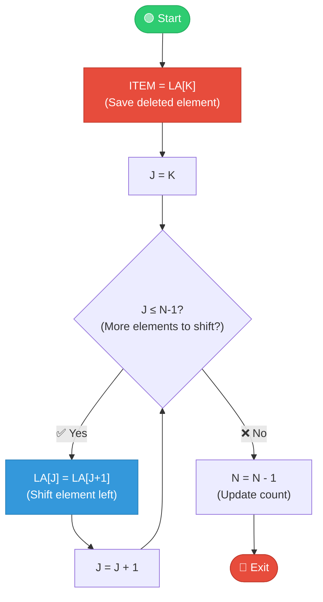

#### 💡 Comparing Insert vs Delete

| Operation | Shift Direction | Why |
|-----------|-----------------|-----|
| **Insert** | Right → Left (reverse) | Create space for new element |
| **Delete** | Left → Right (forward) | Fill the gap left by removed element |

⚠️ **Remember:** If you do many insertions and deletions, an array might not be the best choice. Consider using a linked list instead!

---

## Sorting: Bubble Sort

### What is Sorting?

**Sorting** means arranging elements in a specific order - usually from smallest to largest (ascending) or largest to smallest (descending).


### How Bubble Sort Works

Think of it like organizing people by height in a line:
1. Compare two people next to each other
2. If they're in wrong order, swap them
3. Keep doing this until the tallest person "bubbles up" to the end
4. Repeat for remaining people

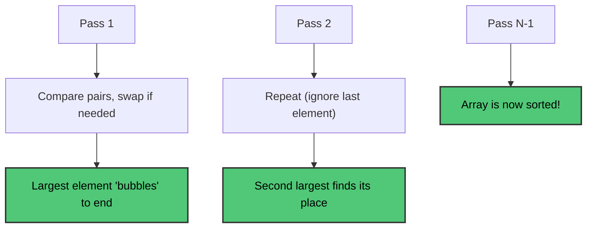

---

### 📘 Algorithm 4.4: Bubble Sort

> **Purpose:** Sort an array DATA with N elements in ascending order.

#### Pseudocode

```
Algorithm 4.4: BUBBLE(DATA, N)
──────────────────────────────
DATA = Array with N elements

1. Repeat Steps 2 and 3 for K = 1 to N-1:
2.     Set PTR := 1  [Initialize pass pointer]
3.     Repeat while PTR ≤ N - K:  [Execute pass]
           (a) If DATA[PTR] > DATA[PTR+1], then:
                   Interchange DATA[PTR] and DATA[PTR+1]
               [End of If structure]
           (b) Set PTR := PTR + 1
       [End of inner loop]
   [End of Step 1 outer loop]
4. Exit
```

#### 🎯 Visual Flowchart

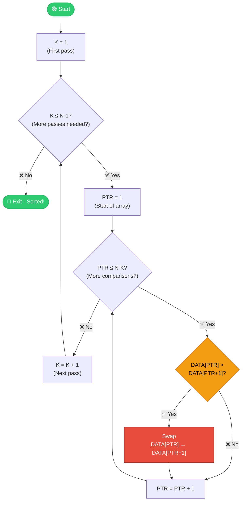

#### 📊 Complete Example: Sort [32, 51, 27, 85, 66, 23, 13, 57]

**Pass 1 - Finding the largest (85):**
```
[32, 51, 27, 85, 66, 23, 13, 57]  Compare 32,51 → No swap
[32, 51, 27, 85, 66, 23, 13, 57]  Compare 51,27 → Swap!
[32, 27, 51, 85, 66, 23, 13, 57]  Compare 51,85 → No swap
[32, 27, 51, 85, 66, 23, 13, 57]  Compare 85,66 → Swap!
[32, 27, 51, 66, 85, 23, 13, 57]  Compare 85,23 → Swap!
[32, 27, 51, 66, 23, 85, 13, 57]  Compare 85,13 → Swap!
[32, 27, 51, 66, 23, 13, 85, 57]  Compare 85,57 → Swap!
[32, 27, 51, 66, 23, 13, 57, 85]  ← 85 is now in position! ✅
```

**After all passes:**
```
Pass 1: [32, 27, 51, 66, 23, 13, 57, 85]  ← 85 in place
Pass 2: [27, 32, 51, 23, 13, 57, 66, 85]  ← 66 in place
Pass 3: [27, 32, 23, 13, 51, 57, 66, 85]  ← 57 in place
Pass 4: [27, 23, 13, 32, 51, 57, 66, 85]  ← 51 in place
Pass 5: [23, 13, 27, 32, 51, 57, 66, 85]  ← 32 in place
Pass 6: [13, 23, 27, 32, 51, 57, 66, 85]  ← Sorted! ✅
```

#### ⏱️ Time Complexity

**Counting Comparisons:**
```
Pass 1: n-1 comparisons
Pass 2: n-2 comparisons
Pass 3: n-3 comparisons
...
Pass n-1: 1 comparison

Total = (n-1) + (n-2) + ... + 1 = n(n-1)/2 ≈ n²/2
```

**Complexity: O(n²)** - This means if you double the array size, sorting takes about 4 times longer!

#### 💡 Optimization: Using a FLAG

Some versions use a FLAG variable:
- If no swaps happen during a pass, the array is already sorted
- Can stop early and save time
- But checking the flag adds some overhead

---

## Searching: Linear Search

### What is Searching?

**Searching** means finding where a specific item is located in a collection of data.
- **Successful search**: We find the item
- **Unsuccessful search**: The item is not there

```mermaid
graph TD
    A[Search for ITEM in DATA] --> B{Found?}
    B -->|Yes| C["Return location LOC"]
    B -->|No| D["Return 'not found' message"]
    
    style C fill:#2ecc71,stroke:#27ae60,color:#fff
    style D fill:#e74c3c,stroke:#c0392b,color:#fff
```

### How Linear Search Works

**Linear search** is the simplest method - check each element one by one from the beginning until you find it or reach the end.

```mermaid
graph LR
    A["Start at<br/>first element"] --> B{"Match?"}
    B -->|No| C["Next element"]
    C --> D{"End of<br/>array?"}
    D -->|No| B
    D -->|Yes| E["Not found"]
    B -->|Yes| F["Found!"]
    
    style F fill:#2ecc71,stroke:#27ae60,color:#fff
    style E fill:#e74c3c,stroke:#c0392b,color:#fff
```

---

### 📘 Algorithm 4.5: Linear Search

> **Purpose:** Find the location LOC of ITEM in array DATA with N elements. Returns LOC=0 if not found.

#### Pseudocode

```
Algorithm 4.5: LINEAR(DATA, N, ITEM, LOC)
─────────────────────────────────────────
DATA = Linear Array with N elements
ITEM = Element to search for
LOC  = Will store location of ITEM (or 0 if not found)

1. [Insert ITEM at the end] Set DATA[N+1] := ITEM
2. [Initialize counter] Set LOC := 1
3. [Search for ITEM]
   Repeat while DATA[LOC] ≠ ITEM:
       Set LOC := LOC + 1
   [End of loop]
4. [Successful?] If LOC = N+1, then: Set LOC := 0
5. Exit
```

#### 🔍 The Sentinel Trick Explained

**Why do we add ITEM at the end (Step 1)?**

This is called a **sentinel** - a guard that guarantees the loop will stop.

```mermaid
graph TD
    subgraph "Without Sentinel (2 checks per loop)"
        W1["Check 1: Is LOC ≤ N?"]
        W2["Check 2: Is DATA[LOC] = ITEM?"]
        W1 --> W2
    end
    
    subgraph "With Sentinel (1 check per loop)"
        S1["Check: Is DATA[LOC] = ITEM?"]
        S2["Always finds ITEM (either real or sentinel)"]
        S1 --> S2
    end
    
    style S2 fill:#2ecc71,stroke:#27ae60,color:#fff
```

With the sentinel, the search **always succeeds** - we just check if we found the real item or the sentinel afterward!

#### 🎯 Visual Flowchart

```mermaid
flowchart TD
    START([🟢 Start]) --> SENTINEL["DATA[N+1] = ITEM<br/>(Place sentinel at end)"]
    SENTINEL --> INIT["LOC = 1"]
    INIT --> CHECK{"DATA[LOC] ≠ ITEM?<br/>(Not found yet?)"}
    CHECK -->|✅ Yes| NEXT["LOC = LOC + 1<br/>(Check next)"]
    NEXT --> CHECK
    CHECK -->|❌ No, Found!| VERIFY{"LOC = N+1?<br/>(Hit sentinel?)"}
    VERIFY -->|✅ Yes| NOTFOUND["LOC = 0<br/>(Not in original array)"]
    VERIFY -->|❌ No| FOUND["LOC = position<br/>(Found it!)"]
    NOTFOUND --> EXIT([🔴 Exit])
    FOUND --> EXIT
    
    style START fill:#2ecc71,stroke:#27ae60,color:#fff
    style EXIT fill:#e74c3c,stroke:#c0392b,color:#fff
    style FOUND fill:#2ecc71,stroke:#27ae60,color:#fff
    style NOTFOUND fill:#e74c3c,stroke:#c0392b,color:#fff
    style SENTINEL fill:#9b59b6,stroke:#8e44ad,color:#fff
```

#### 📊 Example: Search for "Susan"

Array: [Mary, Jane, Diane, Susan, Karen, Edith]

| Step | LOC | DATA[LOC] | Action |
|------|-----|-----------|--------|
| 1 | - | - | Place "Susan" at DATA[7] |
| 2 | 1 | Mary | Mary ≠ Susan → continue |
| 3 | 2 | Jane | Jane ≠ Susan → continue |
| 3 | 3 | Diane | Diane ≠ Susan → continue |
| 3 | 4 | Susan | Susan = Susan → **Found!** |
| 4 | 4 | - | LOC=4 ≠ 7, keep LOC=4 ✅ |

#### ⏱️ Time Complexity

| Case | Comparisons | When |
|------|-------------|------|
| **Best** | O(1) | ITEM is first element |
| **Average** | O(n/2) ≈ O(n) | ITEM is in middle |
| **Worst** | O(n+1) | ITEM is not present |

If ITEM is equally likely to be anywhere, average comparisons = (n+1)/2

---

## Searching: Binary Search

### The Power of Divide and Conquer

**Binary search** is much faster than linear search, but it only works on **sorted arrays**.

Think about finding a word in a dictionary:
1. Open to the middle
2. Is your word before or after this page?
3. Go to the middle of the correct half
4. Repeat until you find it

Each step cuts your search area in **half**!

```mermaid
graph TD
    A["1,000,000 elements"] --> B["After 1 comparison: 500,000"]
    B --> C["After 2 comparisons: 250,000"]
    C --> D["After 3 comparisons: 125,000"]
    D --> E["..."]
    E --> F["After 20 comparisons: 1 element"]
    
    style A fill:#e74c3c,stroke:#c0392b,color:#fff
    style F fill:#2ecc71,stroke:#27ae60,color:#fff
```

---

### 📘 Algorithm 4.6: Binary Search

> **Purpose:** Find ITEM in a **sorted** array DATA. Returns LOC (position) or NULL (0) if not found.

#### Pseudocode

```
Algorithm 4.6: BINARY(DATA, LB, UB, ITEM, LOC)
──────────────────────────────────────────────
DATA = Sorted array with lower bound LB and upper bound UB
ITEM = Element to search for
LOC  = Will store location (or NULL=0 if not found)
BEG, END, MID = Beginning, end, and middle of current segment

1. [Initialize segment variables]
   Set BEG := LB, END := UB
   Set MID := INT((BEG + END) / 2)

2. Repeat Steps 3 and 4 while BEG ≤ END and DATA[MID] ≠ ITEM

3.     If ITEM < DATA[MID], then:
           Set END := MID - 1      [Search left half]
       Else:
           Set BEG := MID + 1      [Search right half]
       [End of If structure]

4.     Set MID := INT((BEG + END) / 2)
   [End of Step 2 loop]

5. If DATA[MID] = ITEM, then:
       Set LOC := MID
   Else:
       Set LOC := NULL
   [End of If structure]

6. Exit
```

#### 🎯 Visual Flowchart

```mermaid
flowchart TD
    START([🟢 Start]) --> INIT["BEG = LB, END = UB<br/>MID = (BEG+END)/2"]
    INIT --> MAINCHECK{"BEG ≤ END<br/>AND<br/>DATA[MID] ≠ ITEM?"}
    MAINCHECK -->|❌ No| FINAL{"DATA[MID] = ITEM?"}
    MAINCHECK -->|✅ Yes| COMPARE{"ITEM < DATA[MID]?"}
    COMPARE -->|✅ Yes, go LEFT| LEFT["END = MID - 1<br/>(Search left half)"]
    COMPARE -->|❌ No, go RIGHT| RIGHT["BEG = MID + 1<br/>(Search right half)"]
    LEFT --> RECALC["MID = (BEG+END)/2"]
    RIGHT --> RECALC
    RECALC --> MAINCHECK
    FINAL -->|✅ Yes| FOUND["LOC = MID<br/>✅ Found!"]
    FINAL -->|❌ No| NOTFOUND["LOC = NULL<br/>❌ Not found"]
    FOUND --> EXIT([🔴 Exit])
    NOTFOUND --> EXIT
    
    style START fill:#2ecc71,stroke:#27ae60,color:#fff
    style EXIT fill:#e74c3c,stroke:#c0392b,color:#fff
    style FOUND fill:#2ecc71,stroke:#27ae60,color:#fff
    style NOTFOUND fill:#e74c3c,stroke:#c0392b,color:#fff
    style LEFT fill:#3498db,stroke:#2980b9,color:#fff
    style RIGHT fill:#e67e22,stroke:#d35400,color:#fff
```

#### 📊 Example: Find 40 in [11, 22, 30, 33, 40, 44, 55, 60, 66, 77, 80, 88, 99]

```
Array indices: 1   2   3   4   5   6   7   8   9  10  11  12  13
Values:       11  22  30  33  40  44  55  60  66  77  80  88  99
```

| Step | BEG | END | MID | DATA[MID] | Comparison | Action |
|------|-----|-----|-----|-----------|------------|--------|
| 1 | 1 | 13 | 7 | 55 | 40 < 55 | Search LEFT: END = 6 |
| 2 | 1 | 6 | 3 | 30 | 40 > 30 | Search RIGHT: BEG = 4 |
| 3 | 4 | 6 | 5 | **40** | 40 = 40 | **FOUND at position 5!** ✅ |

**Only 3 comparisons!** (Linear search would need 5)

#### 📊 Example: Find 85 (Not in array)

| Step | BEG | END | MID | DATA[MID] | Comparison | Action |
|------|-----|-----|-----|-----------|------------|--------|
| 1 | 1 | 13 | 7 | 55 | 85 > 55 | Search RIGHT: BEG = 8 |
| 2 | 8 | 13 | 10 | 77 | 85 > 77 | Search RIGHT: BEG = 11 |
| 3 | 11 | 13 | 12 | 88 | 85 < 88 | Search LEFT: END = 11 |
| 4 | 11 | 11 | 11 | 80 | 85 > 80 | BEG = 12 |
| 5 | 12 | 11 | - | - | BEG > END | **NOT FOUND** ❌ |

#### ⏱️ Time Complexity Comparison

| Array Size | Linear Search (worst) | Binary Search (worst) |
|------------|----------------------|----------------------|
| 10 | 10 | 4 |
| 100 | 100 | 7 |
| 1,000 | 1,000 | 10 |
| 1,000,000 | 1,000,000 | **20** |

Binary search needs at most **⌈log₂ n⌉ + 1** comparisons.

#### ⚠️ When NOT to Use Binary Search

| Requirement | Why It Matters |
|-------------|----------------|
| **Array must be sorted** | Can't compare with middle if unsorted |
| **Need direct access** | Must jump to middle (arrays: ✅, linked lists: ❌) |
| **Data changes rarely** | Keeping sorted order is expensive with many insertions/deletions |

---

## Multidimensional Arrays

### Two-Dimensional Arrays

A **two-dimensional array** is like a table with rows and columns. Each element needs TWO numbers to identify it: row number and column number.

```mermaid
graph TD
    subgraph "2D Array A (3 rows × 4 columns)"
        R1["Row 1: A[1,1] A[1,2] A[1,3] A[1,4]"]
        R2["Row 2: A[2,1] A[2,2] A[2,3] A[2,4]"]
        R3["Row 3: A[3,1] A[3,2] A[3,3] A[3,4]"]
    end
    
    style R1 fill:#50C878,stroke:#333,stroke-width:2px,color:#000
    style R2 fill:#FFB84D,stroke:#333,stroke-width:2px,color:#000
    style R3 fill:#4A90E2,stroke:#333,stroke-width:2px,color:#fff
```

#### Real Example: Student Test Scores

```mermaid
graph TD
    subgraph "SCORE Array (25 students × 4 tests)"
        H["Student | Test1 | Test2 | Test3 | Test4"]
        S1["   1   |   84  |   73  |   88  |   81"]
        S2["   2   |   95  |  100  |   88  |   96"]
        S3["   3   |   72  |   66  |   77  |   72"]
        S4["  ...  |  ...  |  ...  |  ...  |  ..."]
        S25["  25   |   78  |   82  |   70  |   85"]
    end
```

- SCORE[2, 3] = Student 2's score on Test 3 = 88
- A row contains all tests for one student
- A column contains all students' scores for one test

### How 2D Arrays are Stored in Memory

Memory is one-dimensional (a long line of cells). So a 2D array must be "flattened":

```mermaid
graph LR
    subgraph "Column-Major Order"
        C["A[1,1] A[2,1] A[3,1] | A[1,2] A[2,2] A[3,2] | ..."]
    end
    
    subgraph "Row-Major Order"  
        R["A[1,1] A[1,2] A[1,3] A[1,4] | A[2,1] A[2,2] A[2,3] A[2,4] | ..."]
    end
    
    style C fill:#4A90E2,stroke:#333,stroke-width:2px,color:#fff
    style R fill:#50C878,stroke:#333,stroke-width:2px,color:#000
```

- **Column-major**: Store column by column (used by FORTRAN)
- **Row-major**: Store row by row (used by C, Pascal)

#### Address Formulas

**Row-Major Order:**
```
LOC(A[J, K]) = Base(A) + w × [N × (J - 1) + (K - 1)]
```

**Column-Major Order:**
```
LOC(A[J, K]) = Base(A) + w × [M × (K - 1) + (J - 1)]
```

Where:
- M = number of rows
- N = number of columns
- w = bytes per element

### Three-Dimensional Arrays

A 3D array has three subscripts, like a book with pages, rows, and columns.

```mermaid
graph TD
    subgraph "3D Array B (2×4×3)"
        P1["Page 1:<br/>2×4 table"]
        P2["Page 2:<br/>2×4 table"]
        P3["Page 3:<br/>2×4 table"]
    end
    
    E["B[row, column, page]"]
    E --> P1
    E --> P2
    E --> P3
```

Total elements = 2 × 4 × 3 = 24

---

## Pointers and Pointer Arrays

### What is a Pointer?

A **pointer** is a variable that stores an address - it "points to" where some data is located.

```mermaid
graph LR
    subgraph "Pointer P points to element in DATA"
        P["Pointer P<br/>Value: 1005"]
        D["DATA Array"]
        E["Element at<br/>address 1005"]
    end
    
    P -.->|"points to"| E
    D --- E
    
    style P fill:#e74c3c,stroke:#c0392b,color:#fff
    style E fill:#50C878,stroke:#333,stroke-width:2px,color:#000
```

### Pointer Arrays for Efficient Storage

**Problem:** Store groups of different sizes efficiently.

**Bad solution:** A 2D array wastes space when groups have different sizes.

```mermaid
graph TD
    subgraph "Jagged Array - Wasted Space"
        R1["Group 1: ★ ★ ★ ★ ○ ○ ○ ○ ○"]
        R2["Group 2: ★ ★ ★ ★ ★ ★ ★ ★ ★"]
        R3["Group 3: ★ ★ ○ ○ ○ ○ ○ ○ ○"]
        R4["Group 4: ★ ★ ★ ★ ★ ★ ○ ○ ○"]
    end
    
    L["★ = data, ○ = wasted space"]
```

**Good solution:** Use a pointer array that tells where each group starts!

```mermaid
graph LR
    subgraph "Pointer Array GROUP"
        G1["GROUP[1] = 1"]
        G2["GROUP[2] = 5"]
        G3["GROUP[3] = 14"]
        G4["GROUP[4] = 16"]
        G5["GROUP[5] = 22"]
    end
    
    subgraph "Data Array MEMBER"
        M1["1-4: Group 1 names"]
        M2["5-13: Group 2 names"]
        M3["14-15: Group 3 names"]
        M4["16-21: Group 4 names"]
    end
    
    G1 -->|"start"| M1
    G2 -->|"start"| M2
    G3 -->|"start"| M3
    G4 -->|"start"| M4
    
    style G1 fill:#e74c3c,stroke:#c0392b,color:#fff
    style G2 fill:#e74c3c,stroke:#c0392b,color:#fff
    style G3 fill:#e74c3c,stroke:#c0392b,color:#fff
    style G4 fill:#e74c3c,stroke:#c0392b,color:#fff
```

To find Group L:
- First element: MEMBER[GROUP[L]]
- Last element: MEMBER[GROUP[L+1] - 1]

---

## Records and Record Structures

### What is a Record?

A **record** is a collection of related data items (called **fields**). Unlike arrays, fields can have different types!

```mermaid
graph TD
    subgraph "Newborn Baby Record"
        R["Record: Newborn"]
        N["Name: string"]
        S["Sex: character"]
        B["Birthday"]
        F["Father"]
        M["Mother"]
        
        B --> BD["Day: integer"]
        B --> BM["Month: integer"]  
        B --> BY["Year: integer"]
        
        F --> FN["Name: string"]
        F --> FA["Age: integer"]
        
        M --> MN["Name: string"]
        M --> MA["Age: integer"]
    end
    
    R --> N
    R --> S
    R --> B
    R --> F
    R --> M
    
    style R fill:#4A90E2,stroke:#333,stroke-width:2px,color:#fff
    style B fill:#FFB84D,stroke:#333,stroke-width:2px,color:#000
    style F fill:#FFB84D,stroke:#333,stroke-width:2px,color:#000
    style M fill:#FFB84D,stroke:#333,stroke-width:2px,color:#000
```

### Record Structure with Level Numbers

```
1 Newborn
    2 Name
    2 Sex
    2 Birthday
        3 Month
        3 Day
        3 Year
    2 Father
        3 Name
        3 Age
    2 Mother
        3 Name
        3 Age
```

- Level 1 is the whole record
- Level 2 items are direct parts of the record
- Level 3 items are parts of level 2 items

### Difference Between Arrays and Records

| Feature | Array | Record |
|---------|-------|--------|
| Data types | All same type | Can mix types |
| Access | By index number | By field name |
| Order | Natural ordering | No natural order |

### Accessing Record Fields

When the same field name appears multiple times (like "Name" and "Age"), we use **qualifiers**:

- `Father.Age` - Age of the father
- `Mother.Age` - Age of the mother
- `Newborn.Father.Name` - Fully qualified name

### Storing Records: Parallel Arrays

When a language doesn't support records, we can use **parallel arrays** - separate arrays where the same index refers to the same entity.

```mermaid
graph TD
    subgraph "Parallel Arrays for Membership"
        N["NAME[K]"]
        A["AGE[K]"]
        S["SEX[K]"]
        P["PHONE[K]"]
    end
    
    E["All refer to member K"]
    
    N --> E
    A --> E
    S --> E
    P --> E
    
    style E fill:#50C878,stroke:#333,stroke-width:2px,color:#000
```

---

## Matrices

### What is a Matrix?

A **matrix** is a mathematical term for a 2D array of numbers arranged in rows and columns.

- A **vector** is like a 1D array (a list of numbers)
- A **scalar** is a single number

### Matrix Operations

#### Matrix Addition
Add corresponding elements:
```
C[i,j] = A[i,j] + B[i,j]
```

#### Scalar Multiplication
Multiply every element by a number:
```
C[i,j] = k × A[i,j]
```

#### Matrix Multiplication

The product of two matrices A (m×p) and B (p×n) is matrix C (m×n) where:

```
C[i,j] = A[i,1]×B[1,j] + A[i,2]×B[2,j] + ... + A[i,p]×B[p,j]
```

---

### 📘 Algorithm 4.7: Matrix Multiplication

> **Purpose:** Multiply matrix A (M×P) by matrix B (P×N) to produce matrix C (M×N).

#### Pseudocode

```
Algorithm 4.7: MATMUL(A, B, C, M, P, N)
──────────────────────────────────────
A = M × P matrix
B = P × N matrix  
C = Result matrix (M × N)

1. Repeat Steps 2 to 4 for I = 1 to M:
2.     Repeat Steps 3 and 4 for J = 1 to N:
3.         Set C[I,J] := 0  [Initialize element]
4.         Repeat for K = 1 to P:
               C[I,J] := C[I,J] + A[I,K] * B[K,J]
           [End of inner loop]
       [End of Step 2 middle loop]
   [End of Step 1 outer loop]
5. Exit
```

#### 🎯 Visual Flowchart

```mermaid
flowchart TD
    START([🟢 Start]) --> I_INIT["I = 1<br/>(Row of result)"]
    I_INIT --> I_CHECK{"I ≤ M?"}
    I_CHECK -->|❌ No| EXIT([🔴 Exit])
    I_CHECK -->|✅ Yes| J_INIT["J = 1<br/>(Column of result)"]
    J_INIT --> J_CHECK{"J ≤ N?"}
    J_CHECK -->|❌ No| I_INC["I = I + 1"]
    I_INC --> I_CHECK
    J_CHECK -->|✅ Yes| INIT_C["C[I,J] = 0"]
    INIT_C --> K_INIT["K = 1"]
    K_INIT --> K_CHECK{"K ≤ P?"}
    K_CHECK -->|❌ No| J_INC["J = J + 1"]
    J_INC --> J_CHECK
    K_CHECK -->|✅ Yes| CALC["C[I,J] += A[I,K] × B[K,J]"]
    CALC --> K_INC["K = K + 1"]
    K_INC --> K_CHECK
    
    style START fill:#2ecc71,stroke:#27ae60,color:#fff
    style EXIT fill:#e74c3c,stroke:#c0392b,color:#fff
    style CALC fill:#3498db,stroke:#2980b9,color:#fff
```

#### ⏱️ Time Complexity

**Total multiplications = M × N × P = O(n³)** for n×n matrices

#### ⚠️ Important Rules for Matrix Multiplication

| Rule | Explanation |
|------|-------------|
| **Dimensions must match** | Columns of A must equal rows of B |
| **Result size** | M rows (from A) × N columns (from B) |
| **Order matters** | A×B ≠ B×A in general |

---

## Sparse Matrices

### What is a Sparse Matrix?

A **sparse matrix** is one where most elements are zero. Storing all those zeros wastes memory!

```mermaid
graph TD
    subgraph "Types of Sparse Matrices"
        T["Triangular Matrix<br/>Non-zero only on/below diagonal"]
        D["Tridiagonal Matrix<br/>Non-zero only on 3 diagonals"]
    end
    
    style T fill:#4A90E2,stroke:#333,stroke-width:2px,color:#fff
    style D fill:#50C878,stroke:#333,stroke-width:2px,color:#000
```

### Efficient Storage: Triangular Matrix

For a **lower triangular matrix** (zeros above diagonal), we only store elements on or below the diagonal.

```mermaid
graph TD
    subgraph "Lower Triangular Matrix"
        R1["a₁₁"]
        R2["a₂₁  a₂₂"]
        R3["a₃₁  a₃₂  a₃₃"]
        R4["a₄₁  a₄₂  a₄₃  a₄₄"]
    end
    
    subgraph "Stored in Linear Array B"
        B["B[1]=a₁₁, B[2]=a₂₁, B[3]=a₂₂, B[4]=a₃₁, ..."]
    end
```

**Space saved:**
- Full n×n array: n² elements
- Triangular storage: n(n+1)/2 elements ≈ half the space!

**To find element A[J,K]:**
```
Position in B = J(J-1)/2 + K
```

This works because:
- Rows 1 through (J-1) contain 1+2+3+...+(J-1) = J(J-1)/2 elements
- Row J has K elements up to position K

---

## Summary

### Key Concepts Covered

✅ **Linear vs Nonlinear Structures**: Arrays and linked lists vs trees and graphs

✅ **Linear Arrays**: Indexed collection of same-type elements in consecutive memory

✅ **Memory Representation**: Base address + formula for any element's location

✅ **Array Operations**: Traversal, insertion, deletion with their algorithms

✅ **Searching**: 
- Linear search O(n) - check one by one
- Binary search O(log n) - divide and conquer (sorted arrays only)

✅ **Sorting**: Bubble sort O(n²) - compare adjacent elements, swap if needed

✅ **Multidimensional Arrays**: Tables (2D), cubes (3D), row-major vs column-major storage

✅ **Pointers**: Variables that store addresses, pointer arrays for efficient group storage

✅ **Records**: Collections of related fields with different types, level numbers

✅ **Matrices**: Mathematical 2D arrays with addition, scalar multiplication, matrix multiplication

✅ **Sparse Matrices**: Efficient storage when most elements are zero

### When to Use What

```mermaid
graph TD
    A["Choose Data Structure"] --> B{"Data size<br/>changes often?"}
    B -->|Yes| C["Consider Linked List"]
    B -->|No| D{"Need fast<br/>random access?"}
    D -->|Yes| E["Use Array"]
    D -->|No| C
    E --> F{"Data sorted?"}
    F -->|Yes| G["Binary Search OK"]
    F -->|No| H["Linear Search<br/>or Sort First"]
    
    style E fill:#50C878,stroke:#333,stroke-width:2px,color:#000
    style C fill:#4A90E2,stroke:#333,stroke-width:2px,color:#fff
    style G fill:#50C878,stroke:#333,stroke-width:2px,color:#000
```

---

**End of Chapter 4**

*Continue to [Chapter 5: Linked Lists](../Chapter%205%20-%20Linked%20Lists/README.md)*
