# Chapter 5: Linked Lists


## Table of Contents

1. [Introduction](#introduction)
2. [What is a Linked List?](#what-is-a-linked-list)
3. [Representation in Memory](#representation-in-memory)
4. [Traversing a Linked List](#traversing-a-linked-list)
5. [Searching](#searching)
6. [Memory Allocation](#memory-allocation--garbage-collection)
7. [Insertion](#insertion)
8. [Deletion](#deletion)
9. [Header Linked Lists](#header-linked-lists)
10. [Two-Way Lists](#two-way-lists)

---

## Introduction

### Why Do We Need Linked Lists?

Think about a shopping list. You start with milk, eggs, and butter. Then you add tomatoes and oranges at the end. Later, you cross out eggs and butter because you already have them.

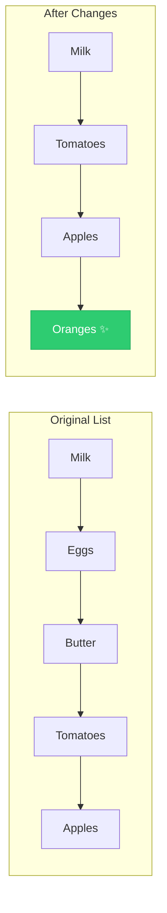

This is what lists do - they let us add and remove items easily!

### Arrays vs Linked Lists: The Trade-Off

We already learned about **arrays** in Chapter 4. Arrays store data in a continuous block of memory, like houses on the same street. This makes finding items fast, but adding or removing items is slow.

**Linked lists** work differently - each item (node) can be anywhere in memory, but it contains a "pointer" (address) to the next item.

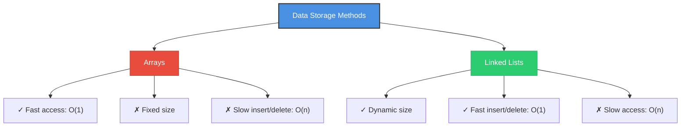

> **Key Point:** Arrays are called **dense lists** (packed together) and are **static** (fixed size). Linked lists are **dynamic** (size changes as needed).

---

## What is a Linked List?

### Definition

A **linked list** (or one-way list) is a collection of **nodes** where each node contains:
1. **Information** - The actual data
2. **Pointer** (or LINK) - The address of the next node


### Important Terms

| Term | Meaning |
|------|---------|
| **START** | Pointer variable that holds the address of the first node |
| **NULL** | Special value (usually 0) that marks the end of the list |
| **Node** | One element in the list (contains INFO and LINK) |
| **Empty List** | A list with no nodes (START = NULL) |

### 📝 Example 5.1: Hospital Ward

A hospital has 12 beds. 9 are occupied. We want to list patients alphabetically, but they're not in alphabetical bed order.

| Bed | Patient | Next Bed |
|-----|---------|----------|
| 1 | Kirk | 7 |
| 3 | Dean | 11 |
| 4 | Maxwell | 12 |
| 5 | Adams | 3 |
| 7 | Lane | 4 |
| 8 | Green | 1 |
| 9 | Samuels | 0 (NULL) |
| 11 | Fields | 8 |
| 12 | Nelson | 9 |

**START = 5** (Adams is first alphabetically)


Following the pointers: Adams(5) → Dean(3) → Fields(11) → Green(8) → Kirk(1) → Lane(7) → Maxwell(4) → Nelson(12) → Samuels(9) → END

> **Key Insight:** The beds are not in alphabetical order, but the pointers create an alphabetical sequence!

---

## Representation in Memory

### Using Arrays to Store Linked Lists

A linked list in memory needs:
- **INFO array** - stores the data at each node
- **LINK array** - stores the pointer (address) to the next node
- **START** - location of the first node
- **NULL** - usually 0, marks the end

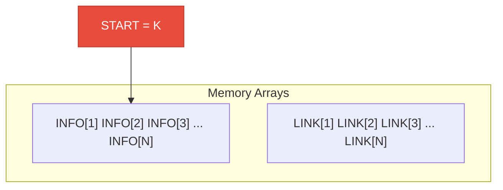

### 📝 Example 5.2: Character String "NO EXIT"

| Index | INFO | LINK |
|-------|------|------|
| 3 | O | 6 |
| 4 | T | 0 |
| 6 | (space) | 11 |
| 7 | X | 10 |
| 9 | N | 3 |
| 10 | I | 4 |
| 11 | E | 7 |

**START = 9**

**Tracing the list:**
- START = 9, so INFO[9] = 'N' is first
- LINK[9] = 3, so INFO[3] = 'O' is second
- LINK[3] = 6, so INFO[6] = ' ' (space) is third
- LINK[6] = 11, so INFO[11] = 'E' is fourth
- LINK[11] = 7, so INFO[7] = 'X' is fifth
- LINK[7] = 10, so INFO[10] = 'I' is sixth
- LINK[10] = 4, so INFO[4] = 'T' is seventh
- LINK[4] = 0 (NULL), so we stop

**Result:** "NO EXIT"

> **Key Insight:** Nodes don't need to be stored in order! The LINK values connect them in the correct sequence.

### Multiple Lists in Same Arrays

You can have multiple linked lists sharing the same INFO and LINK arrays. Each list just needs its own START pointer.

---

## Traversing a Linked List

### What is Traversal?

**Traversal** means visiting each node in the list exactly once, from first to last. It's like walking through a train - you start at the first car and walk through each car until you reach the last one.

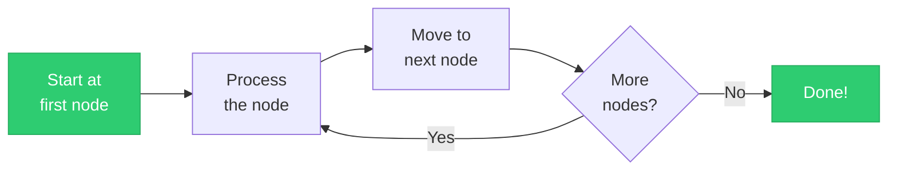

---

### 📘 Algorithm 5.1: Traversing a Linked List

> **Purpose:** Visit every node in a linked list exactly once and apply some operation (like printing or counting).

#### Pseudocode

```
Algorithm 5.1: TRAVERSE(INFO, LINK, START)
────────────────────────────────────────────
INFO  = Array containing node data
LINK  = Array containing next pointers
START = Location of first node
PTR   = Pointer to current node being processed

1. [Initialize pointer] Set PTR := START
2. Repeat Steps 3 and 4 while PTR ≠ NULL
3.     [Visit node] Apply PROCESS to INFO[PTR]
4.     [Move to next node] Set PTR := LINK[PTR]
   [End of Step 2 loop]
5. Exit
```

#### 🎯 Visual Flowchart

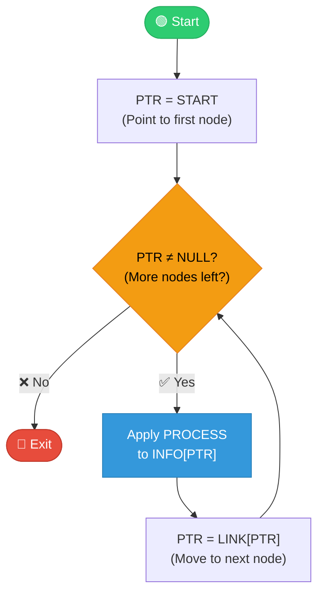

#### 📝 Practical Example: Counting Nodes

To count how many nodes are in a list:

```
Procedure: COUNT(INFO, LINK, START, NUM)
────────────────────────────────────────
1. [Initialize counter] Set NUM := 0
2. [Initialize pointer] Set PTR := START
3. Repeat Steps 4 and 5 while PTR ≠ NULL
4.     [Increment counter] Set NUM := NUM + 1
5.     [Move to next] Set PTR := LINK[PTR]
   [End of Step 3 loop]
6. Return
```

⚠️ **Important:** If your process needs a starting value (like NUM := 0 for counting), you must initialize it before traversing!

#### ⏱️ Time Complexity

| Metric | Value | Explanation |
|--------|-------|-------------|
| **Time** | O(n) | Must visit all n nodes once |
| **Space** | O(1) | Only use one pointer variable PTR |

---

## Searching

### Linear Search in Linked Lists

**Searching** means finding where a specific ITEM is located in the list.

Unlike arrays, we **cannot** use binary search on linked lists because we can't directly access the middle element. We must use linear search.

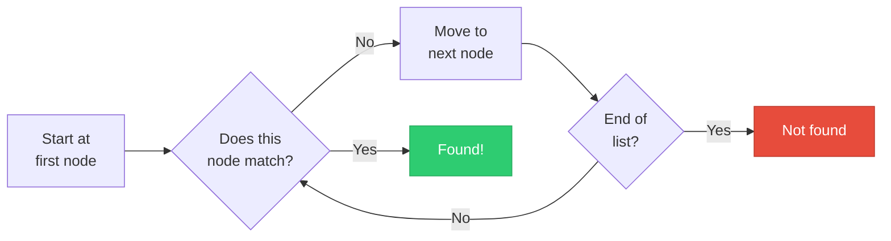

---

### 📘 Algorithm 5.2: Search (Unsorted List)

> **Purpose:** Find the location LOC where ITEM first appears in an unsorted linked list.

#### Pseudocode

```
Algorithm 5.2: SEARCH(INFO, LINK, START, ITEM, LOC)
───────────────────────────────────────────────────
INFO  = Array containing node data
LINK  = Array containing next pointers
START = Location of first node
ITEM  = Element to search for
LOC   = Will store location of ITEM (or NULL if not found)

1. Set PTR := START
2. Repeat Step 3 while PTR ≠ NULL:
3.     If ITEM = INFO[PTR], then:
           Set LOC := PTR, and Exit    [Found!]
       Else:
           Set PTR := LINK[PTR]        [Keep searching]
       [End of If structure]
   [End of Step 2 loop]
4. [Search unsuccessful] Set LOC := NULL
5. Exit
```

#### 🎯 Visual Flowchart

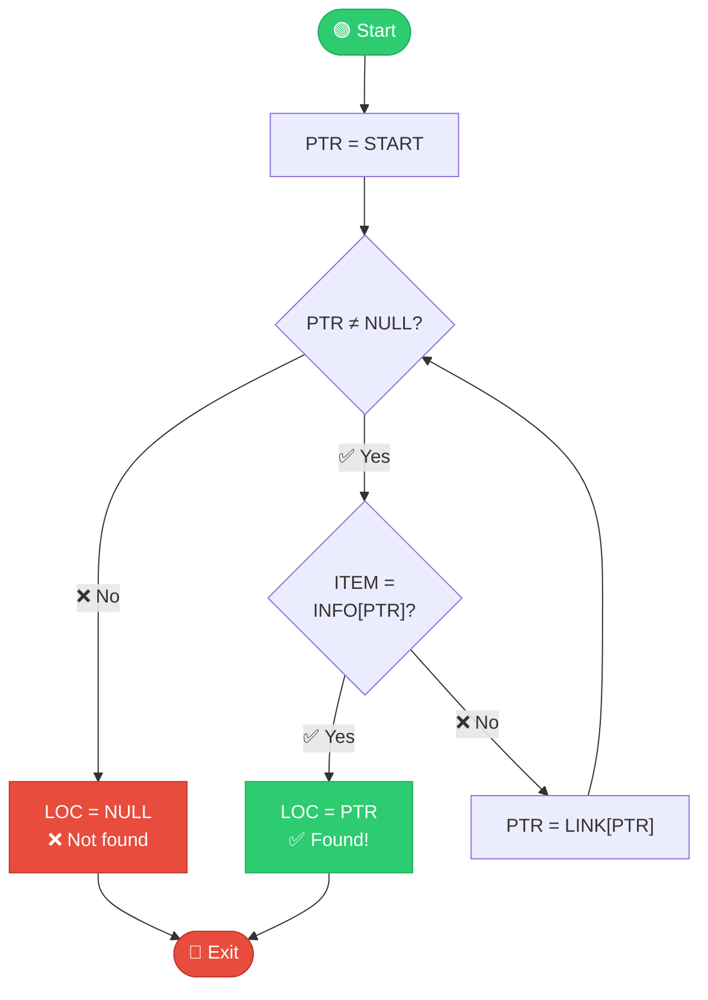

#### ⏱️ Time Complexity

| Case | Comparisons | When |
|------|-------------|------|
| **Best** | O(1) | ITEM is first node |
| **Average** | O(n/2) ≈ O(n) | ITEM is in middle |
| **Worst** | O(n) | ITEM is last or not present |

---

### 📘 Algorithm 5.3: Search (Sorted List)

> **Purpose:** Find ITEM in a **sorted** linked list. Can stop early if ITEM would come before current node.

#### Pseudocode

```
Algorithm 5.3: SRCHSL(INFO, LINK, START, ITEM, LOC)
───────────────────────────────────────────────────
LIST is a sorted list. This finds location LOC of ITEM.

1. Set PTR := START
2. Repeat Step 3 while PTR ≠ NULL:
3.     If ITEM < INFO[PTR], then:
           Set PTR := LINK[PTR]        [Keep looking]
       Else if ITEM = INFO[PTR], then:
           Set LOC := PTR, and Exit    [Found!]
       Else:
           Set LOC := NULL, and Exit   [ITEM too large - not in list]
       [End of If structure]
   [End of Step 2 loop]
4. Set LOC := NULL
5. Exit
```

#### 🎯 Visual Flowchart

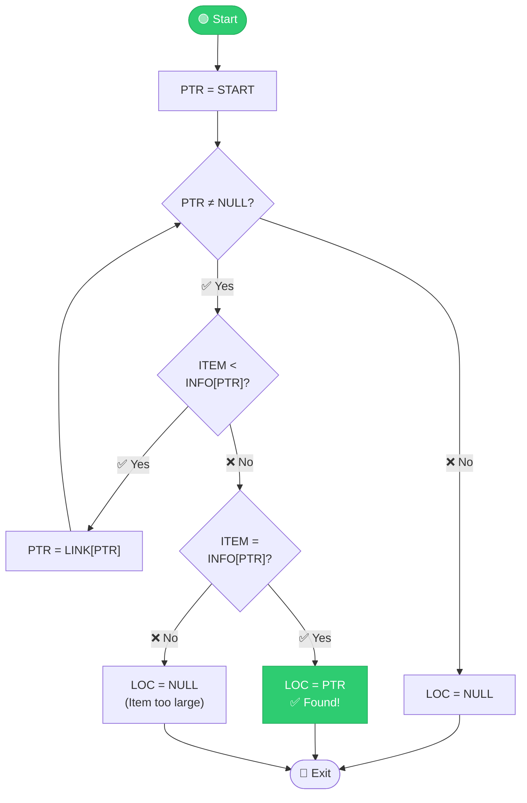

#### 💡 Advantage Over Unsorted Search

With a **sorted** list, we can stop early when we reach a value larger than ITEM. With an **unsorted** list, we must check every node even if ITEM isn't there.

⚠️ **Note:** We still can't use binary search (need random access), but we can stop early when item is not found!

---

## Memory Allocation & Garbage Collection

### The AVAIL List (Free Storage List)

When we add nodes to a list, where do they come from? When we delete nodes, where do they go?

We keep a special list called the **AVAIL list** (available space list or free storage list). It contains all unused memory cells.

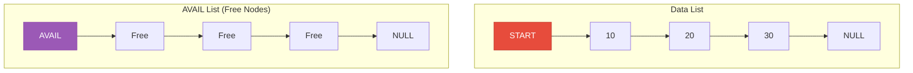

**When inserting:** Remove a node from AVAIL list, add it to data list  
**When deleting:** Remove node from data list, add it back to AVAIL list

### Garbage Collection

Some computer systems collect deleted nodes automatically using **garbage collection**:

1. **First pass:** Mark all nodes currently in use
2. **Second pass:** Collect all unmarked nodes back to AVAIL

This happens automatically in the background. The programmer doesn't need to worry about it.

### Overflow and Underflow

| Condition | When it Happens | What to Do |
|-----------|-----------------|------------|
| **OVERFLOW** | AVAIL = NULL and we try to insert | Print "OVERFLOW" - no more space |
| **UNDERFLOW** | START = NULL and we try to delete | Print "UNDERFLOW" - list is empty |

---

## Insertion

### Understanding Insertion

When we insert a new node N between nodes A and B, three pointer changes happen:

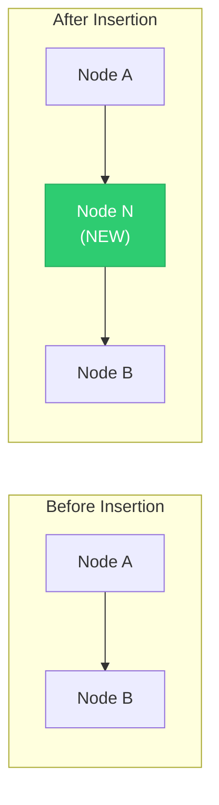

**Three pointer changes:**
1. **AVAIL** moves to the second free node
2. **Node A's LINK** now points to N
3. **Node N's LINK** now points to B

---

### 📘 Algorithm 5.4: Insert at Beginning

> **Purpose:** Insert ITEM as the **first node** in the list. This is the fastest insertion - O(1) time!

#### Pseudocode

```
Algorithm 5.4: INSFIRST(INFO, LINK, START, AVAIL, ITEM)
───────────────────────────────────────────────────────
This algorithm inserts ITEM as the first node in the list.

1. [OVERFLOW?] If AVAIL = NULL, then:
       Write: OVERFLOW, and Exit
2. [Remove first node from AVAIL list]
   Set NEW := AVAIL
   Set AVAIL := LINK[AVAIL]
3. Set INFO[NEW] := ITEM           [Copy data into new node]
4. Set LINK[NEW] := START          [New node points to old first]
5. Set START := NEW                [START now points to new node]
6. Exit
```

#### 🎯 Visual Flowchart

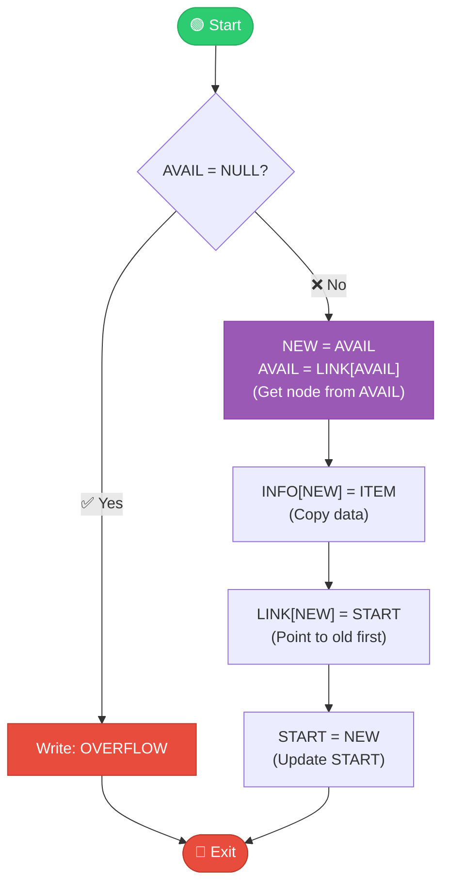

#### 📊 Step-by-Step Example

**Before:** List = [20, 30], AVAIL points to free nodes  
**Insert:** ITEM = 10

| Step | Action | Result |
|------|--------|--------|
| 1 | Check AVAIL ≠ NULL | ✓ Space available |
| 2 | NEW = AVAIL, AVAIL = LINK[AVAIL] | Get free node |
| 3 | INFO[NEW] = 10 | Store data |
| 4 | LINK[NEW] = START | Point to 20 |
| 5 | START = NEW | START points to 10 |

**After:** List = [10, 20, 30]

#### ⏱️ Time Complexity

**O(1) - Constant time!** Only 3 pointer changes, no matter how large the list.

---

### 📘 Algorithm 5.5: Insert After Given Node

> **Purpose:** Insert ITEM after the node at location LOC (or at beginning if LOC = NULL).

#### Pseudocode

```
Algorithm 5.5: INSLOC(INFO, LINK, START, AVAIL, LOC, ITEM)
──────────────────────────────────────────────────────────
LOC = Location of node to insert after (or NULL for beginning)

1. [OVERFLOW?] If AVAIL = NULL, then:
       Write: OVERFLOW, and Exit
2. [Remove first node from AVAIL list]
   Set NEW := AVAIL
   Set AVAIL := LINK[AVAIL]
3. Set INFO[NEW] := ITEM
4. If LOC = NULL, then:              [Insert at beginning]
       Set LINK[NEW] := START
       Set START := NEW
   Else:                             [Insert after LOC]
       Set LINK[NEW] := LINK[LOC]
       Set LINK[LOC] := NEW
   [End of If structure]
5. Exit
```

#### 🎯 Visual Flowchart

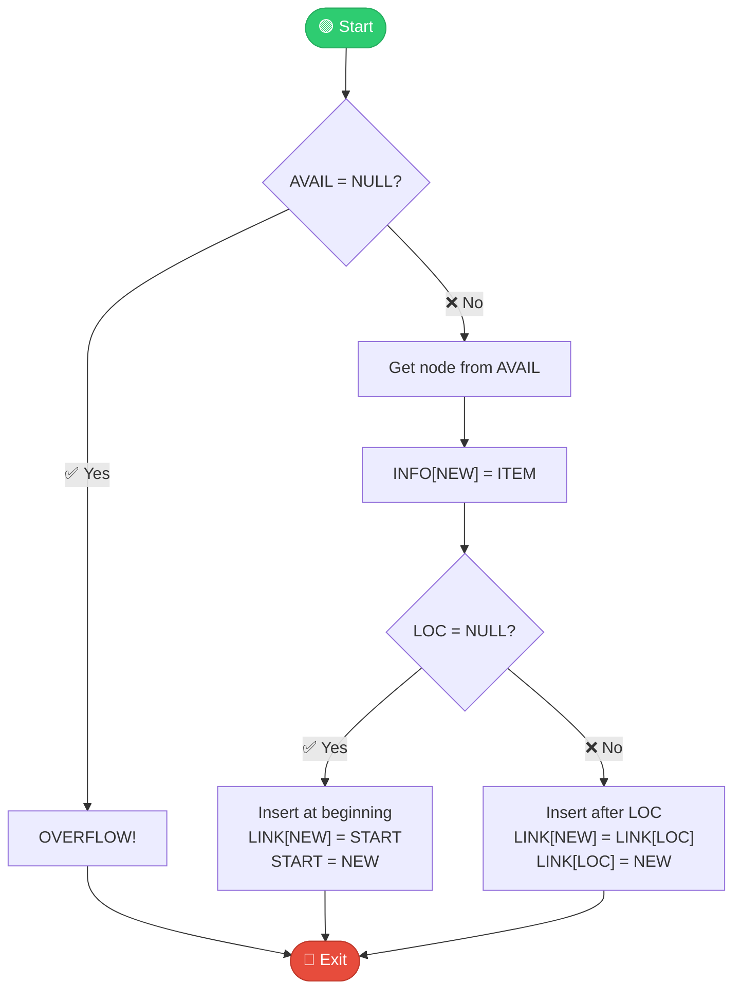

---

### 📘 Procedure 5.6: Find Insert Location (Sorted List)

> **Purpose:** Before inserting into a sorted list, find WHERE to insert. Returns LOC = last node where INFO[LOC] < ITEM.

#### Pseudocode

```
Procedure 5.6: FINDA(INFO, LINK, START, ITEM, LOC)
──────────────────────────────────────────────────
This finds location LOC of the last node in a sorted list
such that INFO[LOC] < ITEM, or sets LOC = NULL.

1. [List empty?] If START = NULL, then:
       Set LOC := NULL, and Return
2. [Special case?] If ITEM < INFO[START], then:
       Set LOC := NULL, and Return
3. Set SAVE := START
   Set PTR := LINK[START]           [Initialize pointers]
4. Repeat Steps 5 and 6 while PTR ≠ NULL:
5.     If ITEM < INFO[PTR], then:
           Set LOC := SAVE, and Return    [Found spot!]
       [End of If structure]
6.     Set SAVE := PTR
       Set PTR := LINK[PTR]               [Update pointers]
   [End of Step 4 loop]
7. Set LOC := SAVE                        [Goes at end]
8. Return
```

#### 🎯 Visual Flowchart

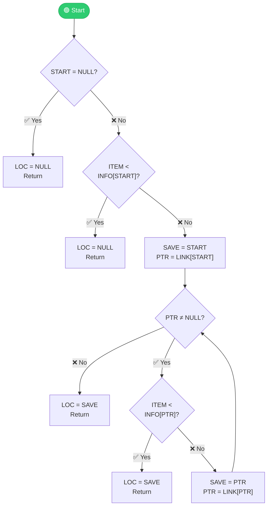

#### 💡 Two-Pointer Technique

This procedure uses **two pointers** (SAVE and PTR):
- **PTR** checks the current node
- **SAVE** remembers the previous node
- When PTR finds a "too large" value, SAVE has the insertion point!

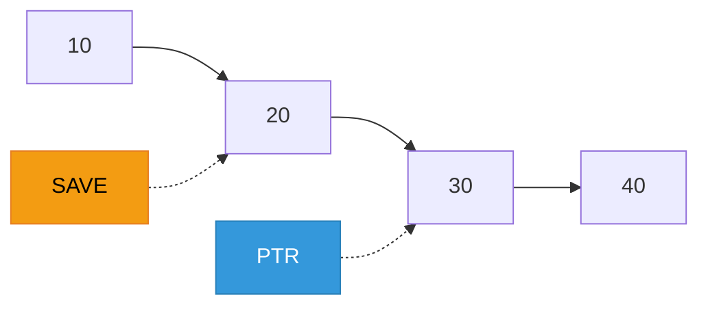

---

### 📘 Algorithm 5.7: Insert into Sorted List

> **Purpose:** Insert ITEM into a sorted linked list while maintaining sorted order.

#### Pseudocode

```
Algorithm 5.7: INSERT(INFO, LINK, START, AVAIL, ITEM)
─────────────────────────────────────────────────────
This algorithm inserts ITEM into a sorted linked list.

1. [Find position] Call FINDA(INFO, LINK, START, ITEM, LOC)
2. [Insert] Call INSLOC(INFO, LINK, START, AVAIL, LOC, ITEM)
3. Exit
```

#### 💡 Modular Design

This algorithm shows **modularity** - breaking complex tasks into simpler pieces:

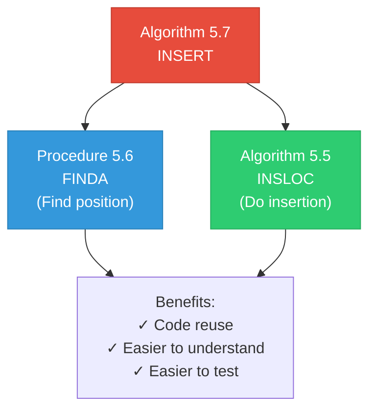

---

## Deletion

### Understanding Deletion

When we delete node N from between nodes A and B, three pointer changes happen:

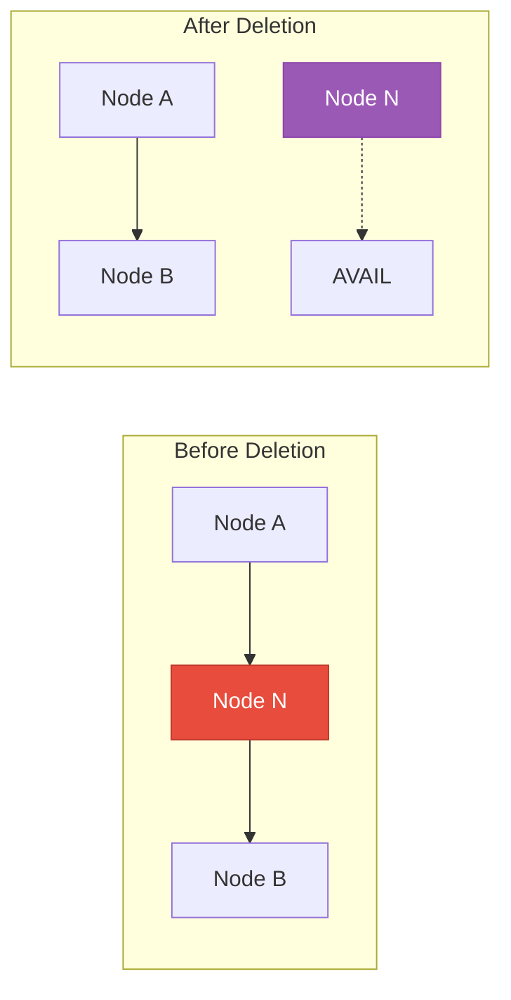

**Three pointer changes:**
1. **Node A's LINK** now points to B (skips N)
2. **Node N's LINK** now points to old first AVAIL node
3. **AVAIL** now points to N

---

### 📘 Algorithm 5.8: Delete Node (Location Given)

> **Purpose:** Delete the node at location LOC. LOCP is the location of the previous node (or NULL if deleting first node).

#### Pseudocode

```
Algorithm 5.8: DEL(INFO, LINK, START, AVAIL, LOC, LOCP)
───────────────────────────────────────────────────────
LOC  = Location of node to delete
LOCP = Location of previous node (or NULL if first)

1. If LOCP = NULL, then:           [Deleting first node]
       Set START := LINK[START]
   Else:                           [Deleting other node]
       Set LINK[LOCP] := LINK[LOC]
   [End of If structure]
2. [Return node to AVAIL list]
   Set LINK[LOC] := AVAIL
   Set AVAIL := LOC
3. Exit
```

#### 🎯 Visual Flowchart

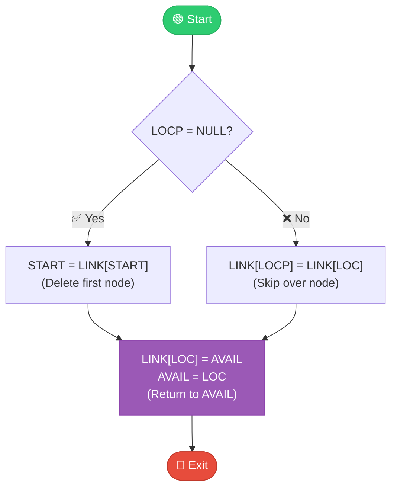

---

### 📘 Procedure 5.9: Find Node to Delete

> **Purpose:** Find the location LOC of the first node containing ITEM, and location LOCP of the preceding node.

#### Pseudocode

```
Procedure 5.9: FINDB(INFO, LINK, START, ITEM, LOC, LOCP)
─────────────────────────────────────────────────────────
This finds LOC of node with ITEM and LOCP of preceding node.

1. [List empty?] If START = NULL, then:
       Set LOC := NULL, LOCP := NULL, and Return
2. [ITEM in first node?] If INFO[START] = ITEM, then:
       Set LOC := START, LOCP := NULL, and Return
3. Set SAVE := START
   Set PTR := LINK[START]           [Initialize pointers]
4. Repeat Steps 5 and 6 while PTR ≠ NULL:
5.     If INFO[PTR] = ITEM, then:
           Set LOC := PTR, LOCP := SAVE, and Return
       [End of If structure]
6.     Set SAVE := PTR
       Set PTR := LINK[PTR]         [Update pointers]
   [End of Step 4 loop]
7. Set LOC := NULL                  [Not found]
8. Return
```

#### 💡 Why Track Both Pointers?

We need **two** locations:
- **LOC** - to know which node to delete
- **LOCP** - to update the link that points to the deleted node

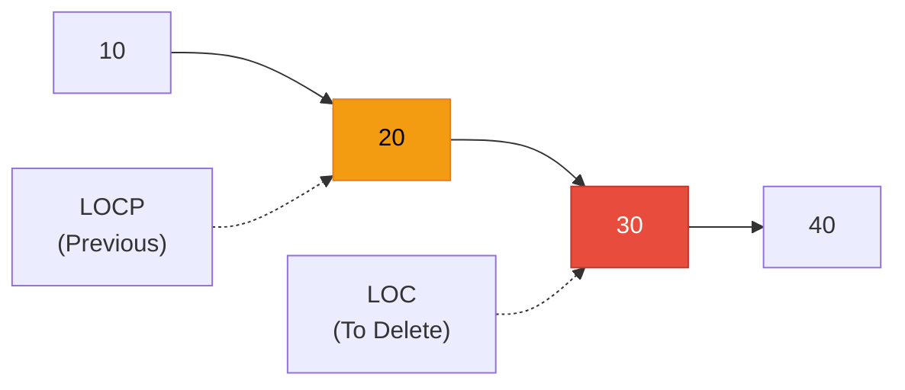

---

### 📘 Algorithm 5.10: Delete by Item Value

> **Purpose:** Delete the first node containing ITEM from the list.

#### Pseudocode

```
Algorithm 5.10: DELETE(INFO, LINK, START, AVAIL, ITEM)
──────────────────────────────────────────────────────
This deletes the first node N which contains ITEM.

1. [Find node] Call FINDB(INFO, LINK, START, ITEM, LOC, LOCP)
2. If LOC = NULL, then:
       Write: ITEM not in list, and Exit
3. [Delete node]
   If LOCP = NULL, then:
       Set START := LINK[START]     [Delete first node]
   Else:
       Set LINK[LOCP] := LINK[LOC]
   [End of If structure]
4. [Return to AVAIL]
   Set LINK[LOC] := AVAIL
   Set AVAIL := LOC
5. Exit
```

#### 💡 Modular Design

```mermaid
graph TD
    A["Algorithm 5.10<br/>DELETE"] --> B["Procedure 5.9<br/>FINDB<br/>(Find node & predecessor)"]
    A --> C["Algorithm 5.8<br/>DEL<br/>(Remove from list)"]
    
    style A fill:#e74c3c,stroke:#c0392b,color:#fff
    style B fill:#3498db,stroke:#2980b9,color:#fff
    style C fill:#9b59b6,stroke:#8e44ad,color:#fff
```

---

## Header Linked Lists

### What is a Header List?

A **header linked list** always has a special node at the beginning called the **header node**. The header doesn't contain regular data - it's just a marker.

### Two Types

```mermaid
graph TD
    subgraph "Grounded Header List"
        H1["Header"] --> A1["10"]
        A1 --> B1["20"]
        B1 --> NULL1["NULL ✗"]
    end
    
    subgraph "Circular Header List"
        H2["Header"] --> A2["10"]
        A2 --> B2["20"]
        B2 --> H2
    end
    
    style H1 fill:#9b59b6,stroke:#8e44ad,color:#fff
    style H2 fill:#9b59b6,stroke:#8e44ad,color:#fff
```

### Why Use Header Lists?

```mermaid
graph TD
    A["Advantages of Header Lists"] --> B["✓ No NULL pointers<br/>All pointers valid"]
    A --> C["✓ Every node has predecessor<br/>No special cases"]
    A --> D["✓ Can store metadata<br/>in header node"]
    
    style A fill:#3498db,stroke:#2980b9,color:#fff
    style B fill:#2ecc71,stroke:#27ae60,color:#fff
    style C fill:#2ecc71,stroke:#27ae60,color:#fff
    style D fill:#f39c12,stroke:#e67e22,color:#000
```

**Example metadata in header:**
- Number of nodes in list
- Sum of all values
- Last modification time

---

### 📘 Algorithm 5.11: Traverse Circular Header List

> **Purpose:** Visit all ordinary nodes in a circular header list (skip the header).

#### Pseudocode

```
Algorithm 5.11: TRAVERSING CIRCULAR HEADER LIST
───────────────────────────────────────────────
LIST is a circular header list. This traverses LIST,
applying PROCESS to each node.

1. Set PTR := LINK[START]          [Skip header, go to first data node]
2. Repeat Steps 3 and 4 while PTR ≠ START:
3.     Apply PROCESS to INFO[PTR]
4.     Set PTR := LINK[PTR]
   [End of Step 2 loop]
5. Exit
```

#### 💡 Key Differences from Regular List

| Regular List | Circular Header List |
|--------------|---------------------|
| Start at `START` | Start at `LINK[START]` (skip header) |
| Stop when `PTR = NULL` | Stop when `PTR = START` (back to header) |

---

## Two-Way Lists

### What is a Two-Way (Doubly Linked) List?

A **two-way list** has nodes with **TWO** pointers:
- **BACK** - pointer to previous node
- **FORW** - pointer to next node

```mermaid
graph LR
    FIRST["FIRST"] --> N1["←|10|→"]
    N1 <--> N2["←|20|→"]
    N2 <--> N3["←|30|→"]
    N3 --> LAST["LAST"]
    
    style FIRST fill:#e74c3c,stroke:#c0392b,color:#fff
    style LAST fill:#e74c3c,stroke:#c0392b,color:#fff
    style N1 fill:#3498db,stroke:#2980b9,color:#fff
    style N2 fill:#3498db,stroke:#2980b9,color:#fff
    style N3 fill:#3498db,stroke:#2980b9,color:#fff
```

### Pointer Property

If FORW[A] = B, then BACK[B] = A

(If A points forward to B, then B points backward to A)

---

### 📘 Algorithm 5.15: Delete from Two-Way List

> **Purpose:** Delete node at location LOC from a two-way circular header list.

#### Pseudocode

```
Algorithm 5.15: DELTWL(INFO, FORW, BACK, START, AVAIL, LOC)
───────────────────────────────────────────────────────────
This deletes node N with location LOC.

1. [Delete node - update neighbors]
   Set FORW[BACK[LOC]] := FORW[LOC]
   Set BACK[FORW[LOC]] := BACK[LOC]
2. [Return to AVAIL]
   Set FORW[LOC] := AVAIL
   Set AVAIL := LOC
3. Exit
```

#### 🎯 Visual Flowchart

```mermaid
flowchart TD
    START([🟢 Start]) --> UPDATE["Update neighbors:<br/>FORW[BACK[LOC]] = FORW[LOC]<br/>BACK[FORW[LOC]] = BACK[LOC]"]
    UPDATE --> RETURN["Return to AVAIL:<br/>FORW[LOC] = AVAIL<br/>AVAIL = LOC"]
    RETURN --> EXIT([🔴 Exit])
    
    style START fill:#2ecc71,stroke:#27ae60,color:#fff
    style EXIT fill:#e74c3c,stroke:#c0392b,color:#fff
    style RETURN fill:#9b59b6,stroke:#8e44ad,color:#fff
```

#### 💡 Big Advantage: O(1) Deletion

| List Type | Delete (location known) | Why |
|-----------|------------------------|-----|
| **Singly Linked** | O(n) | Must find predecessor |
| **Doubly Linked** | O(1) | Use BACK pointer! |

---

### 📘 Algorithm 5.16: Insert into Two-Way List

> **Purpose:** Insert ITEM between nodes A and B in a two-way list.

#### Pseudocode

```
Algorithm 5.16: INSTWL(INFO, FORW, BACK, START, AVAIL, LOCA, LOCB, ITEM)
────────────────────────────────────────────────────────────────────────
LOCA = Location of node A
LOCB = Location of node B
Insert ITEM between A and B.

1. [OVERFLOW?] If AVAIL = NULL, then:
       Write: OVERFLOW, and Exit
2. [Get node and copy data]
   Set NEW := AVAIL
   Set AVAIL := FORW[AVAIL]
   Set INFO[NEW] := ITEM
3. [Update FOUR pointers]
   Set FORW[LOCA] := NEW          [A points forward to NEW]
   Set FORW[NEW] := LOCB          [NEW points forward to B]
   Set BACK[LOCB] := NEW          [B points backward to NEW]
   Set BACK[NEW] := LOCA          [NEW points backward to A]
4. Exit
```

#### 📊 Four Pointer Updates

```mermaid
graph LR
    A["Node A"] --> NEW["NEW"]
    NEW --> B["Node B"]
    B -.-> NEW
    NEW -.-> A
    
    style NEW fill:#2ecc71,stroke:#27ae60,color:#fff
```

**Four updates:**
1. A's FORW → NEW
2. NEW's FORW → B
3. B's BACK → NEW
4. NEW's BACK → A

#### 💡 Trade-offs

| Advantage | Disadvantage |
|-----------|--------------|
| ✓ O(1) deletion | ✗ Extra memory for BACK pointers |
| ✓ Bi-directional traversal | ✗ More pointers to update |
| ✓ No need to track predecessor | ✗ Slightly more complex code |

---

## Summary

### 📊 Algorithm Quick Reference

| Algorithm | Purpose | Time |
|-----------|---------|------|
| 5.1 | Traverse list | O(n) |
| 5.2 | Search unsorted | O(n) |
| 5.3 | Search sorted | O(n) |
| 5.4 | Insert at beginning | **O(1)** |
| 5.5 | Insert after node | **O(1)** |
| 5.6 | Find insert position | O(n) |
| 5.7 | Insert sorted | O(n) |
| 5.8 | Delete node | **O(1)** |
| 5.9 | Find node to delete | O(n) |
| 5.10 | Delete by value | O(n) |
| 5.11 | Traverse header list | O(n) |
| 5.15 | Delete two-way | **O(1)** |
| 5.16 | Insert two-way | **O(1)** |

### When to Use Each Type

```mermaid
graph TD
    Q1{"Need dynamic size?"} -->|No| ARR["Use Array"]
    Q1 -->|Yes| Q2{"Frequent deletions?"}
    Q2 -->|No| SGL["Singly Linked List"]
    Q2 -->|Yes| Q3{"Need backward<br/>traversal?"}
    Q3 -->|No| SGL
    Q3 -->|Yes| DBL["Doubly Linked List"]
    
    style ARR fill:#2ecc71,stroke:#27ae60,color:#fff
    style SGL fill:#3498db,stroke:#2980b9,color:#fff
    style DBL fill:#f39c12,stroke:#e67e22,color:#000
```

### ⚠️ Important Takeaways

1. **Linked lists are dynamic** - size changes as needed
2. **Arrays give O(1) access**, linked lists give **O(1) insert/delete**
3. **Binary search NOT possible** on linked lists (no random access)
4. **Two-pointer technique** (SAVE, PTR) is essential for many operations
5. **Header lists** eliminate special cases for first node
6. **Two-way lists** trade memory for O(1) deletion
7. **AVAIL list** manages free memory efficiently
8. **Modular design** makes algorithms easier to understand

---

**End of Chapter 5**

*Continue to Chapter 6: Stacks, Queues, and Recursion*
