# Chapter 6: Stacks, Queues, and Recursion


## Table of Contents

1. [Introduction](#introduction)
2. [Stacks](#stacks)
   - [Stack Basics](#stack-basics)
   - [Postponed Decisions](#postponed-decisions)
   - [Array Representation of Stacks](#array-representation-of-stacks)
   - [Linked Representation of Stacks](#linked-representation-of-stacks)
3. [Arithmetic Expressions & Polish Notation](#arithmetic-expressions--polish-notation)
   - [Polish Notation Types](#polish-notation-types)
   - [Evaluating Postfix Expressions](#evaluating-postfix-expressions)
   - [Converting Infix to Postfix](#converting-infix-to-postfix)
4. [Quicksort - An Application of Stacks](#quicksort---an-application-of-stacks)
5. [Recursion](#recursion)
   - [Factorial Function](#factorial-function)
   - [Fibonacci Sequence](#fibonacci-sequence)
   - [Ackermann Function](#ackermann-function)
6. [Towers of Hanoi](#towers-of-hanoi)
7. [Implementing Recursion with Stacks](#implementing-recursion-with-stacks)
8. [Queues](#queues)
   - [Array Representation of Queues](#array-representation-of-queues)
   - [Linked Representation of Queues](#linked-representation-of-queues)
9. [Deques](#deques)
10. [Priority Queues](#priority-queues)

---

## Introduction

In previous chapters, we learned about **linear lists** and **arrays** where we could add or remove items at any position - beginning, end, or middle. But sometimes in computer science, we need stricter rules about where we can add or remove items.

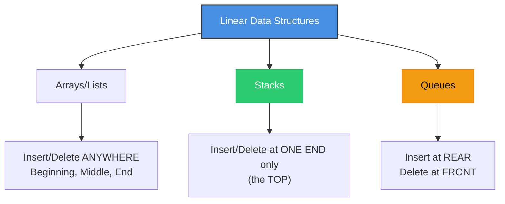

### Two Special Data Structures

| Structure | Rule | Also Called |
|-----------|------|-------------|
| **Stack** | Add/Remove only at ONE end (top) | LIFO (Last-In First-Out) |
| **Queue** | Add at one end, Remove at other end | FIFO (First-In First-Out) |

> **Key Insight:** This chapter also covers **recursion** - a powerful programming technique. One way to simulate recursion is by using a stack!

---

## Stacks

### Stack Basics

A **stack** is a list where you can only add or remove items at ONE end, called the **top**.

**Real-life examples:**
- 📚 Stack of dishes - take from top only
- 🪙 Stack of coins - add/remove from top
- 🧺 Stack of folded towels - pick from top

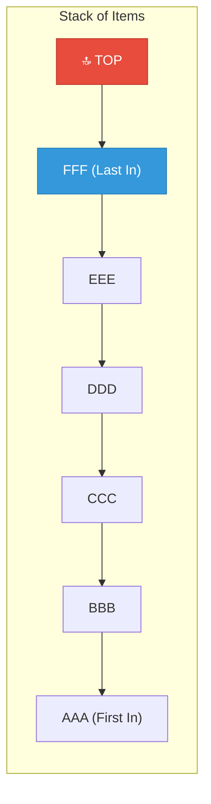

### Stack Operations

| Operation | Meaning | Description |
|-----------|---------|-------------|
| **PUSH** | Insert | Add an item to the top of the stack |
| **POP** | Delete | Remove an item from the top of the stack |

> **Important:** These terms (PUSH and POP) are used ONLY with stacks!

### Example 6.1: Push and Pop Order

If we push these 6 items onto an empty stack in order:
`AAA, BBB, CCC, DDD, EEE, FFF`

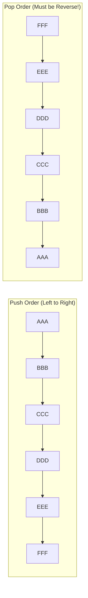

**Key Rule:** The LAST item pushed (FFF) is the FIRST item popped. This is why stacks are called **LIFO** (Last-In, First-Out).

---

### Postponed Decisions

Stacks are very useful when we need to **pause** one task to complete another task first.

**Example Scenario:**
- Working on Project A, but need to finish Project B first
- While working on B, need to finish Project C first
- While working on C, need to finish Project D first

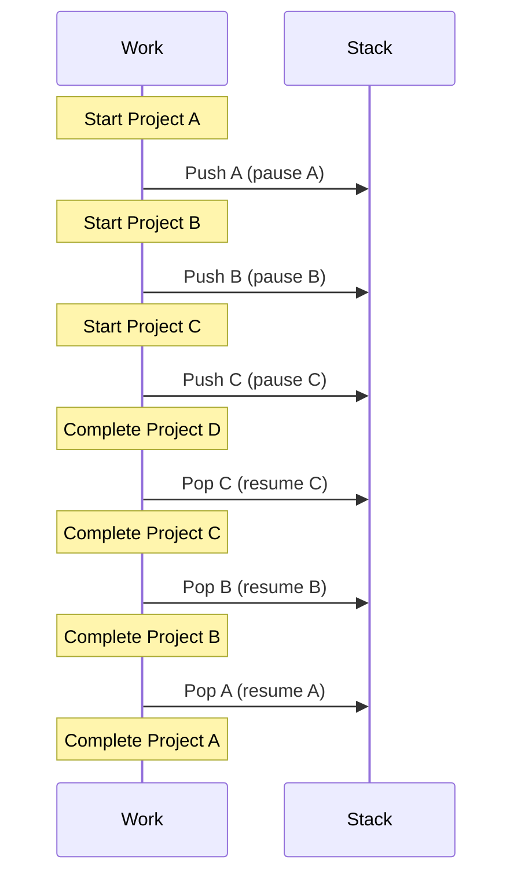

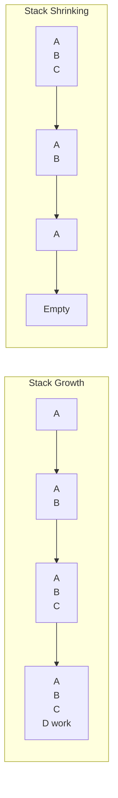

> **Computer Science Application:** This is exactly how **function calls** work! When function A calls function B, which calls function C - the computer uses a stack to remember where to return.

---

### Array Representation of Stacks

We can implement a stack using:
- An array called `STACK`
- A pointer `TOP` (location of the top element)
- A variable `MAXSTK` (maximum capacity)

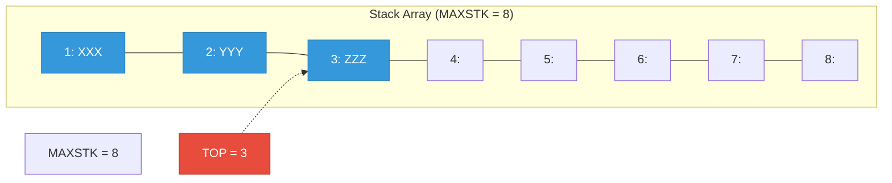

#### Overflow and Underflow

| Condition | When it Happens | Meaning |
|-----------|-----------------|---------|
| **OVERFLOW** | TOP = MAXSTK | Stack is FULL, cannot push |
| **UNDERFLOW** | TOP = 0 | Stack is EMPTY, cannot pop |

---

### Algorithm: PUSH Operation

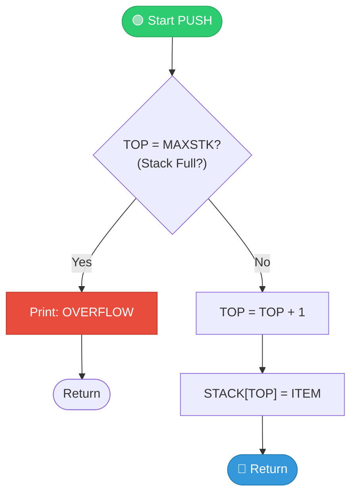

**Procedure 6.1: PUSH(STACK, TOP, MAXSTK, ITEM)**

```text
This procedure pushes an ITEM onto a stack.

1. [Stack already filled?]
   If TOP = MAXSTK, then: Print: OVERFLOW, and Return.
2. Set TOP := TOP + 1.        [Increase TOP by 1]
3. Set STACK[TOP] := ITEM.    [Insert ITEM at new TOP position]
4. Return.
```

---

### Algorithm: POP Operation

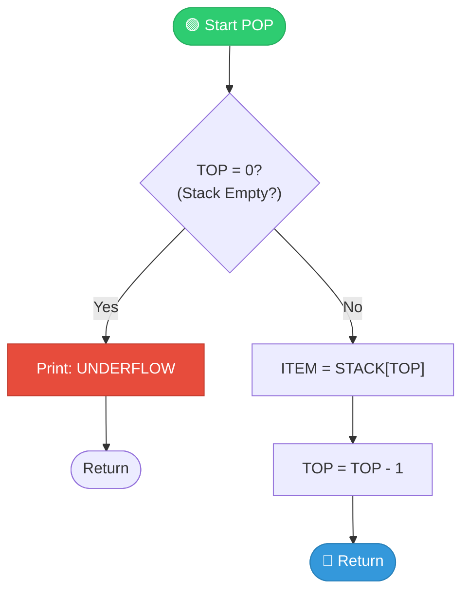

**Procedure 6.2: POP(STACK, TOP, ITEM)**

```text
This procedure deletes the top element and assigns it to ITEM.

1. [Stack has an item to remove?]
   If TOP = 0, then: Print: UNDERFLOW, and Return.
2. Set ITEM := STACK[TOP].    [Assign TOP element to ITEM]
3. Set TOP := TOP - 1.        [Decrease TOP by 1]
4. Return.
```

---

### Example 6.2: Simulating PUSH and POP

**Starting State:** TOP = 3, Stack contains XXX, YYY, ZZZ

**(a) PUSH(STACK, WWW):**

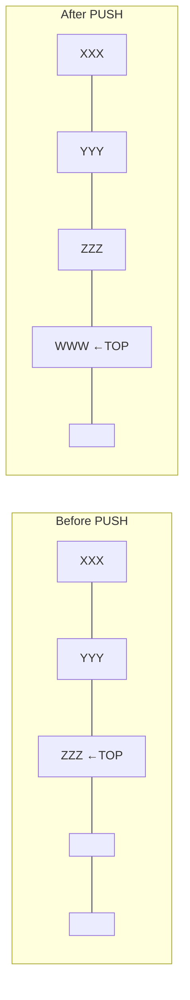

**(b) POP(STACK, ITEM):**

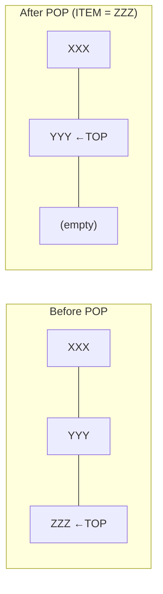

---

### Minimizing Overflow: Two Stacks in One Array

**Problem:** If we have two stacks, each might overflow even when there's unused space in the other.

**Solution:** Put BOTH stacks in ONE array - Stack A grows from LEFT, Stack B grows from RIGHT!

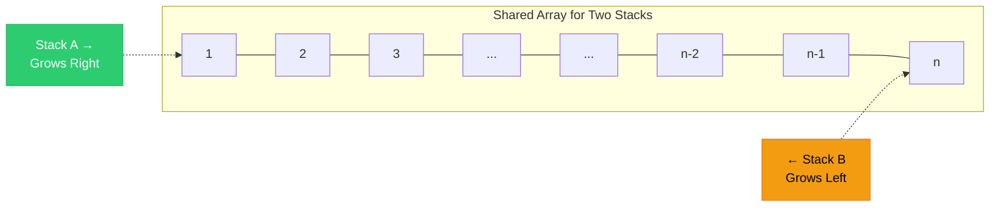

**Benefit:** Overflow happens ONLY when BOTH stacks together use all n spaces!

---

### Linked Representation of Stacks

A **linked stack** uses a singly linked list:
- `INFO` field holds the data
- `LINK` field points to the next node
- `TOP` pointer (same as START) points to the top


**Advantages of Linked Stacks:**
- ✅ No fixed size limit (no MAXSTK needed)
- ✅ No overflow unless memory is exhausted
- ✅ Dynamic memory allocation

---

### Algorithm: PUSH for Linked Stack

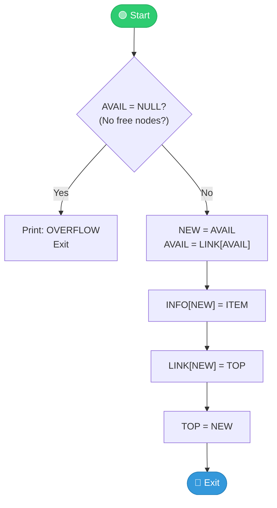

**Procedure 6.3: PUSH_LINKSTACK(INFO, LINK, TOP, AVAIL, ITEM)**

```text
1. [Available space?] 
   If AVAIL = NULL, then Write: OVERFLOW and Exit.
2. [Remove first node from AVAIL list]
   Set NEW := AVAIL and AVAIL := LINK[AVAIL].
3. Set INFO[NEW] := ITEM.     [Copy ITEM into new node]
4. Set LINK[NEW] := TOP.      [New node points to old top]
5. Set TOP := NEW.            [TOP now points to new node]
6. Exit.
```

---

### Algorithm: POP for Linked Stack

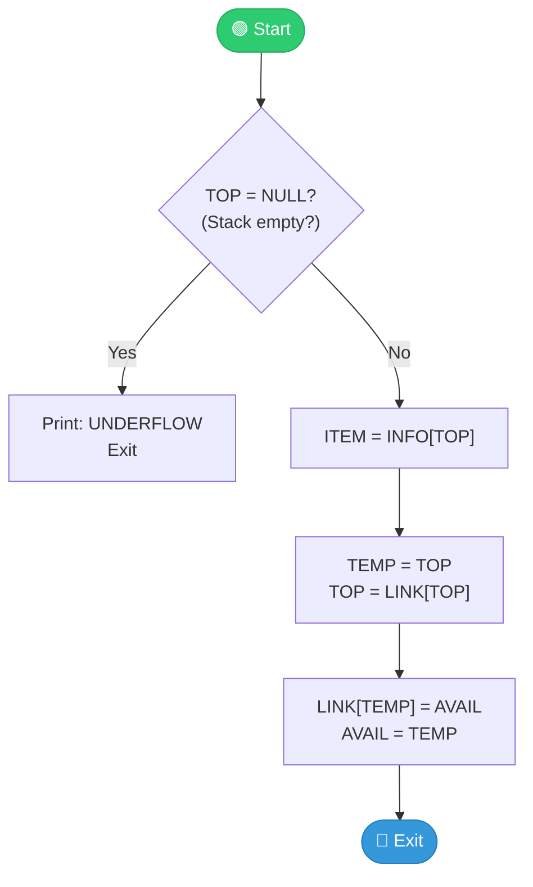

**Procedure 6.4: POP_LINKSTACK(INFO, LINK, TOP, AVAIL, ITEM)**

```text
1. [Stack has an item?]
   If TOP = NULL, then Write: UNDERFLOW and Exit.
2. Set ITEM := INFO[TOP].     [Copy top element to ITEM]
3. Set TEMP := TOP and TOP := LINK[TOP].  [Move TOP to next node]
4. [Return deleted node to AVAIL list]
   Set LINK[TEMP] := AVAIL and AVAIL := TEMP.
5. Exit.
```

---

## Arithmetic Expressions & Polish Notation

### Operator Precedence

When evaluating expressions, operators have different priority levels:

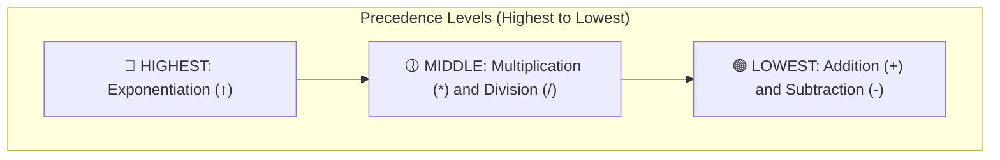

### Polish Notation Types

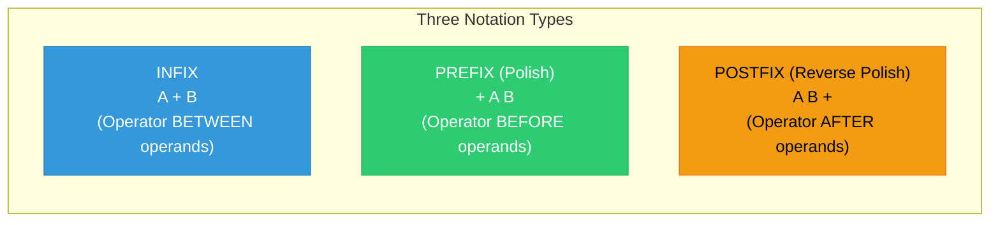

| Infix | Prefix (Polish) | Postfix (Reverse Polish) |
|-------|-----------------|--------------------------|
| A + B | + A B | A B + |
| A - B | - A B | A B - |
| A * B | * A B | A B * |
| A / B | / A B | A B / |
| (A+B)*C | * + A B C | A B + C * |

> **Key Property:** Polish and Reverse Polish notations NEVER need parentheses!

---

### Evaluating Postfix Expressions

**Algorithm 6.5: Evaluate Postfix Expression**

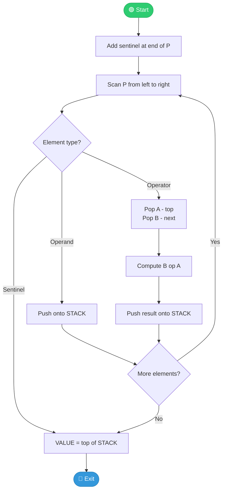

**Algorithm Steps:**

```text
Algorithm 6.5: Evaluate Postfix Expression P

1. Add a right parenthesis ")" at the end of P. [Sentinel]
2. Scan P from left to right and repeat Steps 3-4 for each element
   until the sentinel ")" is encountered.
3. If an operand is encountered, push it onto STACK.
4. If an operator ⊕ is encountered, then:
   (a) Pop A (top element) and B (next-to-top element) from STACK.
   (b) Evaluate B ⊕ A.
   (c) Push the result back onto STACK.
5. Set VALUE equal to the top element on STACK.
6. Exit.
```

---

### Example 6.6: Evaluating Postfix Expression

**Postfix:** `P: 5, 6, 2, +, *, 12, 4, /, -`
**Equivalent Infix:** `Q: 5 * (6 + 2) - 12 / 4`

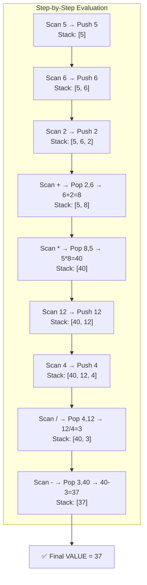

| Step | Symbol Scanned | STACK |
|------|----------------|-------|
| 1 | 5 | 5 |
| 2 | 6 | 5, 6 |
| 3 | 2 | 5, 6, 2 |
| 4 | + | 5, 8 |
| 5 | * | 40 |
| 6 | 12 | 40, 12 |
| 7 | 4 | 40, 12, 4 |
| 8 | / | 40, 3 |
| 9 | - | **37** |

---

### Converting Infix to Postfix

**Algorithm 6.6: POLISH(Q, P)**

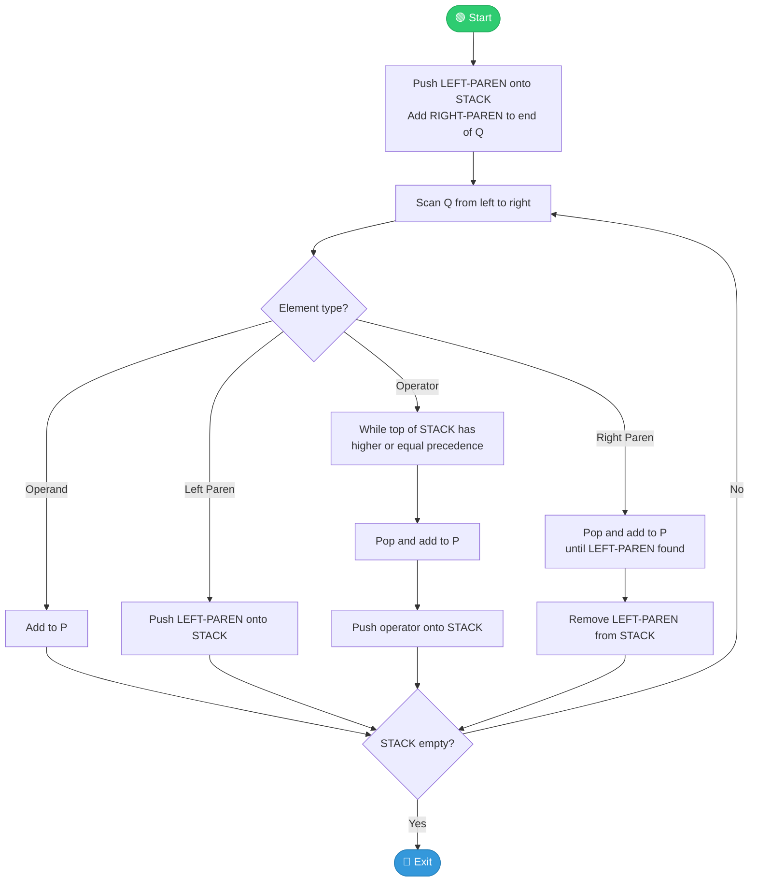

**Algorithm Steps:**

```text
Algorithm 6.6: POLISH(Q, P) - Convert Infix to Postfix

1. Push "(" onto STACK, and add ")" to the end of Q.
2. Scan Q from left to right and repeat Steps 3-6 until STACK is empty:
3. If an operand is encountered, add it to P.
4. If a left parenthesis is encountered, push it onto STACK.
5. If an operator ⊕ is encountered, then:
   (a) Repeatedly pop from STACK and add to P each operator 
       with same or higher precedence than ⊕.
   (b) Push ⊕ onto STACK.
6. If a right parenthesis is encountered, then:
   (a) Repeatedly pop from STACK and add to P each operator
       until a left parenthesis is encountered.
   (b) Remove the left parenthesis. [Don't add it to P]
7. Exit.
```

---

### Example 6.7: Infix to Postfix Conversion

**Infix:** `Q: A + (B * C - (D / E ↑ F) * G) * H`
**Result:** `P: A B C * D E F ↑ / G * - H * +`

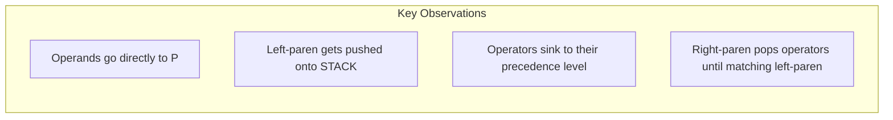

---

## Quicksort - An Application of Stacks

**Quicksort** is a "divide-and-conquer" sorting algorithm that uses stacks to keep track of sublists.

### The Reduction Step

1. Choose a "pivot" element (usually the first)
2. Partition the list so all elements < pivot are on the LEFT, all > pivot are on the RIGHT
3. The pivot is now in its FINAL position
4. Repeat for each sublist

```mermaid
graph TD
    subgraph "Quicksort Partitioning"
        ORIG["Original: 44, 33, 11, 55, 77, 90, 40, 60, 99, 22, 88, 66"]
        PART["After Partition: 22, 33, 11, 40 | 44 | 90, 77, 60, 99, 55, 88, 66"]
        LEFT["Left Sublist<br/>(all < 44)"]
        RIGHT["Right Sublist<br/>(all > 44)"]
        PIVOT["Pivot 44<br/>(Final Position!)"]
    end
    
    ORIG --> PART
    PART --> LEFT
    PART --> PIVOT
    PART --> RIGHT
```

### Using Stacks in Quicksort

Two stacks track sublists waiting to be processed:
- `LOWER` - stores the starting index
- `UPPER` - stores the ending index

```mermaid
flowchart TD
    START([🟢 Start]) --> INIT["Initialize TOP = NULL"]
    INIT --> CHECK1{"N > 1?"}
    CHECK1 -->|Yes| PUSH1["Push boundaries (1, N)<br/>onto LOWER, UPPER"]
    CHECK1 -->|No| EXIT
    PUSH1 --> LOOP{"TOP ≠ NULL?"}
    LOOP -->|No| EXIT([🔴 Exit - Sorted!])
    LOOP -->|Yes| POP["Pop BEG, END from stacks"]
    POP --> QUICK["Call QUICK(A, N, BEG, END, LOC)<br/>Partition and find pivot position"]
    QUICK --> CHECKLEFT{"Left sublist<br/>has ≥ 2 elements?"}
    CHECKLEFT -->|Yes| PUSHLEFT["Push left boundaries"]
    CHECKLEFT -->|No| CHECKRIGHT
    PUSHLEFT --> CHECKRIGHT{"Right sublist<br/>has ≥ 2 elements?"}
    CHECKRIGHT -->|Yes| PUSHRIGHT["Push right boundaries"]
    CHECKRIGHT -->|No| LOOP
    PUSHRIGHT --> LOOP
    
    style START fill:#2ecc71,stroke:#27ae60,color:#fff
    style EXIT fill:#3498db,stroke:#2980b9,color:#fff
```

### Procedure 6.7: QUICK (Partition Procedure)

```text
Procedure 6.7: QUICK(A, N, BEG, END, LOC)

1. [Initialize] Set LEFT := BEG, RIGHT := END, LOC := BEG.

2. [Scan from right to left]
   (a) Repeat while A[LOC] ≤ A[RIGHT] and LOC ≠ RIGHT:
       RIGHT := RIGHT - 1.
   (b) If LOC = RIGHT, then Return.
   (c) If A[LOC] > A[RIGHT], then:
       (i) Interchange A[LOC] and A[RIGHT].
       (ii) Set LOC := RIGHT.
       (iii) Go to Step 3.

3. [Scan from left to right]
   (a) Repeat while A[LEFT] ≤ A[LOC] and LEFT ≠ LOC:
       LEFT := LEFT + 1.
   (b) If LOC = LEFT, then Return.
   (c) If A[LEFT] > A[LOC], then:
       (i) Interchange A[LEFT] and A[LOC].
       (ii) Set LOC := LEFT.
       (iii) Go to Step 2.
```

### Algorithm 6.8: Quicksort

```text
Algorithm 6.8: QUICKSORT(A, N)

1. [Initialize] TOP := NULL.
2. [Push initial boundaries if N > 1]
   If N > 1, then: TOP := 1, LOWER[1] := 1, UPPER[1] := N.
3. Repeat Steps 4-7 while TOP ≠ NULL:
4. [Pop sublist boundaries]
   Set BEG := LOWER[TOP], END := UPPER[TOP], TOP := TOP - 1.
5. Call QUICK(A, N, BEG, END, LOC).
6. [Push left sublist if it has 2+ elements]
   If BEG < LOC - 1, then push (BEG, LOC-1).
7. [Push right sublist if it has 2+ elements]
   If LOC + 1 < END, then push (LOC+1, END).
8. Exit.
```

### Quicksort Complexity

| Case | Complexity | When it Happens |
|------|------------|-----------------|
| **Worst** | O(n²) | List already sorted |
| **Average** | O(n log n) | Random data |
| **Expected** | ≈ 1.4 × n log n | Typical case |

---

## Recursion

**Recursion** is when a procedure calls ITSELF, either directly or indirectly.

### Two Requirements for Well-Defined Recursion

```mermaid
graph TD
    R["Recursive Procedure P"] --> B["1️⃣ BASE CRITERIA<br/>Conditions where P does NOT call itself"]
    R --> C["2️⃣ PROGRESS<br/>Each recursive call must be CLOSER<br/>to the base criteria"]
    
    style R fill:#4A90E2,stroke:#333,color:#fff
    style B fill:#2ecc71,stroke:#27ae60,color:#fff
    style C fill:#f39c12,stroke:#e67e22,color:#000
```

---

### Factorial Function

**Definition:** n! = 1 × 2 × 3 × ... × n

**Recursive Definition 6.1:**
- If n = 0, then n! = 1 (Base case)
- If n > 0, then n! = n × (n-1)!

```mermaid
graph TD
    subgraph "Computing 4! Recursively"
        F4["4! = 4 × 3!"] --> F3["3! = 3 × 2!"]
        F3 --> F2["2! = 2 × 1!"]
        F2 --> F1["1! = 1 × 0!"]
        F1 --> F0["0! = 1 ✓ BASE CASE"]
    end
    
    subgraph "Backtracking"
        B0["0! = 1"] --> B1["1! = 1×1 = 1"]
        B1 --> B2["2! = 2×1 = 2"]
        B2 --> B3["3! = 3×2 = 6"]
        B3 --> B4["4! = 4×6 = 24 ✓"]
    end
```

### Procedure 6.9A: Iterative Factorial

```text
Procedure 6.9A: FACTORIAL(FACT, N) - Iterative Version

1. If N = 0, then: Set FACT := 1, and Return.
2. Set FACT := 1.                    [Initialize]
3. Repeat for K = 1 to N:
   Set FACT := K * FACT.
4. Return.
```

### Procedure 6.9B: Recursive Factorial

```text
Procedure 6.9B: FACTORIAL(FACT, N) - Recursive Version

1. If N = 0, then: Set FACT := 1, and Return.  [Base case]
2. Call FACTORIAL(FACT, N - 1).                [Recursive call]
3. Set FACT := N * FACT.
4. Return.
```

---

### Fibonacci Sequence

**Sequence:** 0, 1, 1, 2, 3, 5, 8, 13, 21, 34, 55, ...

Each number is the SUM of the two numbers before it!

**Definition 6.2:**
- If n = 0 or n = 1, then Fₙ = n (Base cases)
- If n > 1, then Fₙ = Fₙ₋₂ + Fₙ₋₁

```mermaid
graph LR
    F0["F₀=0"] --> F1["F₁=1"]
    F1 --> F2["F₂=1"]
    F2 --> F3["F₃=2"]
    F3 --> F4["F₄=3"]
    F4 --> F5["F₅=5"]
    F5 --> F6["F₆=8"]
    
    style F0 fill:#e74c3c,stroke:#c0392b,color:#fff
    style F1 fill:#e74c3c,stroke:#c0392b,color:#fff
```

### Procedure 6.10: Fibonacci

```text
Procedure 6.10: FIBONACCI(FIB, N)

1. If N = 0 or N = 1, then: Set FIB := N, and Return.  [Base cases]
2. Call FIBONACCI(FIBA, N - 2).
3. Call FIBONACCI(FIBB, N - 1).
4. Set FIB := FIBA + FIBB.
5. Return.
```

---

### Ackermann Function

A more complex recursive function with TWO parameters:

**Definition 6.3:**
- If m = 0, then A(m, n) = n + 1
- If m ≠ 0 but n = 0, then A(m, n) = A(m - 1, 1)
- If m ≠ 0 and n ≠ 0, then A(m, n) = A(m - 1, A(m, n - 1))

> **Note:** Even A(1, 3) requires 15 steps to compute! This function grows VERY fast.

---

## Towers of Hanoi

### The Problem

Move n disks from peg A to peg C using peg B as auxiliary.

**Rules:**
1. Only ONE disk can be moved at a time
2. Only the TOP disk on any peg can be moved
3. A larger disk can NEVER be placed on a smaller disk

```mermaid
graph LR
    subgraph "Initial State (n=3)"
        A["Peg A<br/>🔴<br/>🟡<br/>🔵"]
        B["Peg B<br/>(empty)"]
        C["Peg C<br/>(empty)"]
    end
    
    subgraph "Goal State"
        A2["Peg A<br/>(empty)"]
        B2["Peg B<br/>(empty)"]
        C2["Peg C<br/>🔴<br/>🟡<br/>🔵"]
    end
```

### Recursive Solution

**Key Insight:** To move n disks from A to C:
1. Move (n-1) disks from A to B (using C as auxiliary)
2. Move the largest disk from A to C
3. Move (n-1) disks from B to C (using A as auxiliary)

```mermaid
flowchart TD
    TOWER["TOWER(N, BEG, AUX, END)"] --> CHECK{"N = 1?"}
    CHECK -->|Yes| MOVE["Move BEG → END<br/>Return"]
    CHECK -->|No| STEP1["TOWER(N-1, BEG, END, AUX)<br/>Move N-1 disks to auxiliary"]
    STEP1 --> STEP2["Move BEG → END<br/>Move largest disk"]
    STEP2 --> STEP3["TOWER(N-1, AUX, BEG, END)<br/>Move N-1 disks to final"]
    STEP3 --> RETURN["Return"]
    
    style TOWER fill:#4A90E2,stroke:#333,color:#fff
    style MOVE fill:#2ecc71,stroke:#27ae60,color:#fff
```

### Procedure 6.11: TOWER (Recursive)

```text
Procedure 6.11: TOWER(N, BEG, AUX, END)

1. If N = 1, then:
   (a) Write: BEG → END.
   (b) Return.
2. [Move N-1 disks from BEG to AUX]
   Call TOWER(N - 1, BEG, END, AUX).
3. Write: BEG → END.
4. [Move N-1 disks from AUX to END]
   Call TOWER(N - 1, AUX, BEG, END).
5. Return.
```

### Solution for n = 3

```mermaid
graph LR
    M1["A→C"] --> M2["A→B"] --> M3["C→B"] --> M4["A→C"] --> M5["B→A"] --> M6["B→C"] --> M7["A→C"]
```

**Total moves for n disks:** f(n) = 2ⁿ - 1

| n | Moves |
|---|-------|
| 1 | 1 |
| 2 | 3 |
| 3 | 7 |
| 4 | 15 |
| 5 | 31 |

---

## Implementing Recursion with Stacks

When a programming language doesn't support recursion (like old FORTRAN), we can simulate it using stacks!

### What We Need to Track

For each recursive call, we must save:
1. **Parameters** - the values passed to the procedure
2. **Local variables** - variables used inside the procedure
3. **Return address** - where to continue after the call returns

```mermaid
graph TD
    subgraph "Stacks Needed"
        STPAR["STPAR<br/>Stack for each Parameter"]
        STVAR["STVAR<br/>Stack for each Local Variable"]
        STADD["STADD<br/>Stack for Return Addresses"]
    end
```

### Translation Rules

**For each "Call P" at Step K:**
1. Push current parameter values onto their stacks
2. Push current local variable values onto their stacks
3. Push return address (K + 1) onto STADD
4. Reset parameters to new argument values
5. Go to Step 1 (beginning of procedure)

**For each "Return":**
1. If STADD is empty, return to main program
2. Otherwise, pop all stacks to restore values
3. Go to the popped return address

---

### Procedure 6.12: TOWER (Non-Recursive)

```text
Procedure 6.12: TOWER(N, BEG, AUX, END) - Non-Recursive

0. Set TOP := NULL.

1. If N = 1, then:
   (a) Write: BEG → END.
   (b) Go to Step 5.

2. [Push current values, set return address to 3]
   Push N, BEG, AUX, END onto stacks.
   Push 3 onto STADD.
   Set N := N-1, swap AUX and END.
   Go to Step 1.

3. Write: BEG → END.

4. [Push current values, set return address to 5]
   Push N, BEG, AUX, END onto stacks.
   Push 5 onto STADD.
   Set N := N-1, swap BEG and AUX.
   Go to Step 1.

5. [Return]
   If TOP = NULL, then Return.
   Pop all stacks, restore values.
   Go to Step ADD.
```

---

## Queues

A **queue** is a list where:
- Items are ADDED at one end (the **rear**)
- Items are REMOVED at the other end (the **front**)

### Real-Life Examples

```mermaid
graph LR
    subgraph "Queue at Bus Stop"
        P1["Person 1<br/>FRONT"] --> P2["Person 2"] --> P3["Person 3"] --> P4["Person 4<br/>REAR"]
    end
    
    BUS["🚌 Bus arrives<br/>Person 1 boards first!"]
    NEW["New person joins<br/>at the REAR"]
    
    P1 -.-> BUS
    NEW -.-> P4
```

### Queue Properties

| Property | Description |
|----------|-------------|
| **FIFO** | First-In, First-Out |
| **FRONT** | Where items are removed |
| **REAR** | Where items are added |

```mermaid
graph LR
    subgraph "Queue Operations"
        direction LR
        DELETE["DELETE<br/>↓"] --> F["FRONT"]
        F --> A["AAA"] --> B["BBB"] --> C["CCC"] --> D["DDD"] --> R["REAR"]
        R --> INSERT["INSERT<br/>↑"]
    end
    
    style DELETE fill:#e74c3c,stroke:#c0392b,color:#fff
    style INSERT fill:#2ecc71,stroke:#27ae60,color:#fff
```

---

### Array Representation of Queues

**Problem:** As we add and remove items, the queue "moves" through the array until it reaches the end, even if there's empty space at the beginning!

**Solution:** Use a **circular array** - after position N comes position 1!

```mermaid
graph TD
    subgraph "Circular Queue (N=5)"
        C1["1"] --> C2["2"] --> C3["3"] --> C4["4"] --> C5["5"]
        C5 --> C1
    end
    
    FRONT["FRONT"] -.-> C2
    REAR["REAR"] -.-> C4
```

### Procedure 6.13: QINSERT (Queue Insert)

```mermaid
flowchart TD
    START([🟢 Start]) --> CHECK{"Queue Full?<br/>(FRONT=1 & REAR=N)<br/>OR (FRONT=REAR+1)"}
    CHECK -->|Yes| OVERFLOW["Print: OVERFLOW<br/>Return"]
    CHECK -->|No| EMPTY{"FRONT = NULL?<br/>(Queue empty?)"}
    EMPTY -->|Yes| INIT["FRONT := 1<br/>REAR := 1"]
    EMPTY -->|No| WRAP{"REAR = N?"}
    WRAP -->|Yes| RESET["REAR := 1"]
    WRAP -->|No| INCREMENT["REAR := REAR + 1"]
    INIT --> INSERT["QUEUE[REAR] := ITEM"]
    RESET --> INSERT
    INCREMENT --> INSERT
    INSERT --> RETURN([🔴 Return])
    
    style START fill:#2ecc71,stroke:#27ae60,color:#fff
    style RETURN fill:#3498db,stroke:#2980b9,color:#fff
```

```text
Procedure 6.13: QINSERT(QUEUE, N, FRONT, REAR, ITEM)

1. [Queue already filled?]
   If FRONT = 1 and REAR = N, or if FRONT = REAR + 1, then:
   Write: OVERFLOW, and Return.

2. [Find new value of REAR]
   If FRONT = NULL, then:              [Queue initially empty]
      Set FRONT := 1 and REAR := 1.
   Else if REAR = N, then:
      Set REAR := 1.                   [Wrap around]
   Else:
      Set REAR := REAR + 1.

3. Set QUEUE[REAR] := ITEM.            [Insert new element]
4. Return.
```

---

### Procedure 6.14: QDELETE (Queue Delete)

```mermaid
flowchart TD
    START([🟢 Start]) --> CHECK{"FRONT = NULL?<br/>(Queue empty?)"}
    CHECK -->|Yes| UNDERFLOW["Print: UNDERFLOW<br/>Return"]
    CHECK -->|No| ASSIGN["ITEM := QUEUE[FRONT]"]
    ASSIGN --> SINGLE{"FRONT = REAR?<br/>(Only one element?)"}
    SINGLE -->|Yes| RESET["FRONT := NULL<br/>REAR := NULL"]
    SINGLE -->|No| WRAP{"FRONT = N?"}
    WRAP -->|Yes| SETONE["FRONT := 1"]
    WRAP -->|No| INCREMENT["FRONT := FRONT + 1"]
    RESET --> RETURN([🔴 Return])
    SETONE --> RETURN
    INCREMENT --> RETURN
    
    style START fill:#2ecc71,stroke:#27ae60,color:#fff
    style RETURN fill:#3498db,stroke:#2980b9,color:#fff
```

```text
Procedure 6.14: QDELETE(QUEUE, N, FRONT, REAR, ITEM)

1. [Queue already empty?]
   If FRONT = NULL, then: Write: UNDERFLOW, and Return.

2. Set ITEM := QUEUE[FRONT].

3. [Find new value of FRONT]
   If FRONT = REAR, then:              [Queue had only one element]
      Set FRONT := NULL and REAR := NULL.
   Else if FRONT = N, then:
      Set FRONT := 1.                  [Wrap around]
   Else:
      Set FRONT := FRONT + 1.

4. Return.
```

---

### Linked Representation of Queues

A **linked queue** uses a linked list with TWO pointers:
- `FRONT` points to the first node
- `REAR` points to the last node

```mermaid
graph LR
    FRONT["FRONT"] --> N1["AAA | →"]
    N1 --> N2["BBB | →"]
    N2 --> N3["CCC | →"]
    N3 --> N4["DDD | ✗"]
    REAR["REAR"] --> N4
    
    style FRONT fill:#e74c3c,stroke:#c0392b,color:#fff
    style REAR fill:#2ecc71,stroke:#27ae60,color:#fff
```

**Advantages over Array:**
- ✅ No fixed size limit
- ✅ No need for circular implementation
- ✅ No overflow (unless memory exhausted)

### Procedure 6.15: LINKQ_INSERT

```text
Procedure 6.15: LINKQ_INSERT(INFO, LINK, FRONT, REAR, AVAIL, ITEM)

1. [Available space?]
   If AVAIL = NULL, then Write: OVERFLOW and Exit.
2. [Get new node from AVAIL list]
   Set NEW := AVAIL and AVAIL := LINK[AVAIL].
3. Set INFO[NEW] := ITEM and LINK[NEW] := NULL.
4. If FRONT = NULL, then:              [Queue was empty]
      FRONT := NEW and REAR := NEW.
   Else:
      LINK[REAR] := NEW and REAR := NEW.
5. Exit.
```

### Procedure 6.16: LINKQ_DELETE

```text
Procedure 6.16: LINKQ_DELETE(INFO, LINK, FRONT, REAR, AVAIL, ITEM)

1. [Queue empty?]
   If FRONT = NULL, then Write: UNDERFLOW and Exit.
2. Set TEMP := FRONT.
3. Set ITEM := INFO[TEMP].
4. Set FRONT := LINK[TEMP].            [Move FRONT to next node]
5. [Return deleted node to AVAIL]
   Set LINK[TEMP] := AVAIL and AVAIL := TEMP.
6. Exit.
```

---

## Deques

A **deque** (Double-Ended Queue) allows insertions and deletions at BOTH ends.

```mermaid
graph LR
    subgraph "Deque Operations"
        IL["Insert<br/>Left"] --> L["LEFT"] --> A["AAA"] --> B["BBB"] --> C["CCC"] --> R["RIGHT"] --> IR["Insert<br/>Right"]
        DL["Delete<br/>Left"] --> L
        R --> DR["Delete<br/>Right"]
    end
    
    style IL fill:#2ecc71,stroke:#27ae60,color:#fff
    style IR fill:#2ecc71,stroke:#27ae60,color:#fff
    style DL fill:#e74c3c,stroke:#c0392b,color:#fff
    style DR fill:#e74c3c,stroke:#c0392b,color:#fff
```

### Deque Variations

| Type | Insert | Delete |
|------|--------|--------|
| **Input-Restricted** | One end only | Both ends |
| **Output-Restricted** | Both ends | One end only |

---

## Priority Queues

A **priority queue** processes elements based on their **priority**, not just arrival order.

### Rules

1. Higher priority elements are processed FIRST
2. Same priority elements follow FIFO order

### One-Way List Representation

Each node contains: INFO, PRN (Priority Number), LINK

```mermaid
graph LR
    START["START"] --> A["AAA<br/>PRN:1"] --> B["BBB<br/>PRN:2"] --> C["CCC<br/>PRN:2"] --> D["DDD<br/>PRN:4"]
    D --> E["EEE<br/>PRN:4"] --> F["FFF<br/>PRN:4"] --> G["GGG<br/>PRN:5"] --> NULL["NULL"]
    
    style A fill:#e74c3c,stroke:#c0392b,color:#fff
    style B fill:#f39c12,stroke:#e67e22,color:#000
    style C fill:#f39c12,stroke:#e67e22,color:#000
```

> **Note:** Lower priority NUMBER = Higher priority!

### Algorithm 6.17: Delete from Priority Queue (List)

```text
1. Set ITEM := INFO[START].    [Save first node's data]
2. Delete first node from the list.
3. Process ITEM.
4. Exit.
```

### Algorithm 6.18: Insert into Priority Queue (List)

```text
1. Traverse the list until finding a node X whose priority
   number EXCEEDS the new item's priority.
2. Insert ITEM in front of node X.
3. If no such node found, insert at end.
4. Exit.
```

### Array Representation (Multiple Queues)

Use a separate queue for EACH priority level:

```mermaid
graph TD
    subgraph "2D Array QUEUE"
        R1["Priority 1: | AAA |   |   |   |"]
        R2["Priority 2: | BBB | CCC | XXX |   |"]
        R3["Priority 3: |   |   |   |   |"]
        R4["Priority 4: | DDD | EEE | FFF |   |"]
        R5["Priority 5: | GGG |   |   |   |"]
    end
```

### Algorithm 6.19: Delete (Array Representation)

```text
1. Find the smallest K such that FRONT[K] ≠ NULL.
   [Find first non-empty priority queue]
2. Delete and process the front element in row K.
3. Exit.
```

### Algorithm 6.20: Insert (Array Representation)

```text
1. Insert ITEM at the rear of row M.
   [M is the priority number of ITEM]
2. Exit.
```

### Comparison: List vs Array for Priority Queues

| Aspect | One-Way List | Array (Multiple Queues) |
|--------|--------------|------------------------|
| **Insert Time** | O(n) - must search | O(1) - direct access |
| **Delete Time** | O(1) - always first | O(k) - find first non-empty |
| **Space** | More efficient | May waste space |
| **Overflow** | Total capacity | Per-priority capacity |

---

## Summary

```mermaid
graph TD
    CH6["Chapter 6<br/>Stacks, Queues, Recursion"]
    
    CH6 --> STACKS["📚 STACKS<br/>LIFO - Last In, First Out<br/>Push/Pop at TOP only"]
    CH6 --> QUEUES["🚶 QUEUES<br/>FIFO - First In, First Out<br/>Insert at REAR, Delete at FRONT"]
    CH6 --> RECURSION["🔄 RECURSION<br/>Procedure calls itself<br/>Needs base case + progress"]
    CH6 --> SPECIAL["🎯 SPECIAL STRUCTURES"]
    
    STACKS --> S1["Array Implementation"]
    STACKS --> S2["Linked Implementation"]
    STACKS --> S3["Applications: Polish Notation,<br/>Quicksort, Towers of Hanoi"]
    
    QUEUES --> Q1["Circular Array"]
    QUEUES --> Q2["Linked Queue"]
    
    SPECIAL --> SP1["Deques<br/>(Double-ended)"]
    SPECIAL --> SP2["Priority Queues"]
    
    style CH6 fill:#4A90E2,stroke:#333,color:#fff
    style STACKS fill:#2ecc71,stroke:#27ae60,color:#fff
    style QUEUES fill:#f39c12,stroke:#e67e22,color:#000
    style RECURSION fill:#9b59b6,stroke:#8e44ad,color:#fff
    style SPECIAL fill:#e74c3c,stroke:#c0392b,color:#fff
```

### Key Takeaways

| Concept | Key Point |
|---------|-----------|
| **Stack** | LIFO - Last In, First Out |
| **Queue** | FIFO - First In, First Out |
| **Recursion** | Must have base case and make progress |
| **Polish Notation** | Eliminates need for parentheses |
| **Quicksort** | Divide-and-conquer using stacks |
| **Towers of Hanoi** | Classic recursion problem |
| **Deque** | Insert/Delete at both ends |
| **Priority Queue** | Process by priority, not arrival |

---

> **Next Chapter:** We'll explore more advanced data structures and their applications!


