# Chapter 7: Trees


## Table of Contents

1. [Introduction](#introduction)
2. [Binary Trees](#binary-trees)
3. [Representing Binary Trees in Memory](#representing-binary-trees-in-memory)
4. [Traversing Binary Trees](#traversing-binary-trees)
5. [Binary Search Trees (BST)](#binary-search-trees-bst)
6. [AVL Search Trees](#avl-search-trees)
7. [m-Way Search Trees and B-Trees](#m-way-search-trees-and-b-trees)
8. [Heap and Heapsort](#heap-and-heapsort)
9. [Huffman's Algorithm](#huffmans-algorithm)
10. [General Trees](#general-trees)

---


## Introduction

### What is a Tree?

**In Simple Terms:** A tree is a data structure that looks like an upside-down tree (with root at top). Unlike arrays and linked lists that are linear (straight line), trees are **hierarchical** - they show parent-child relationships.

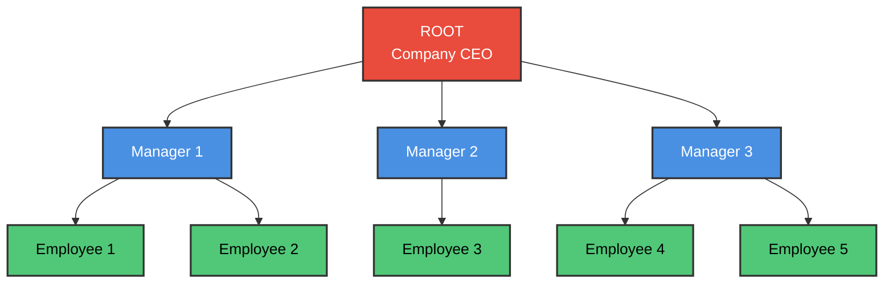
```mermaid
graph TD
    A["ROOT<br/>Company CEO"] --> B["Manager 1"]
    A --> C["Manager 2"]
    A --> D["Manager 3"]
    B --> E["Employee 1"]
    B --> F["Employee 2"]
    C --> G["Employee 3"]
    D --> H["Employee 4"]
    D --> I["Employee 5"]
    
    style A fill:#E94B3C,stroke:#333,stroke-width:2px,color:#fff
    style B fill:#4A90E2,stroke:#333,stroke-width:2px,color:#fff
    style C fill:#4A90E2,stroke:#333,stroke-width:2px,color:#fff
    style D fill:#4A90E2,stroke:#333,stroke-width:2px,color:#fff
    style E fill:#50C878,stroke:#333,stroke-width:2px,color:#000
    style F fill:#50C878,stroke:#333,stroke-width:2px,color:#000
    style G fill:#50C878,stroke:#333,stroke-width:2px,color:#000
    style H fill:#50C878,stroke:#333,stroke-width:2px,color:#000
    style I fill:#50C878,stroke:#333,stroke-width:2px,color:#000
```

**Real-World Examples:**
- 📁 Computer file systems (folders contain files and sub-folders)
- 👨‍👩‍👧‍👦 Family trees
- 🏢 Organization charts
- 📚 Book chapters and sections
- 🌐 XML/HTML document structure

### Why Trees?

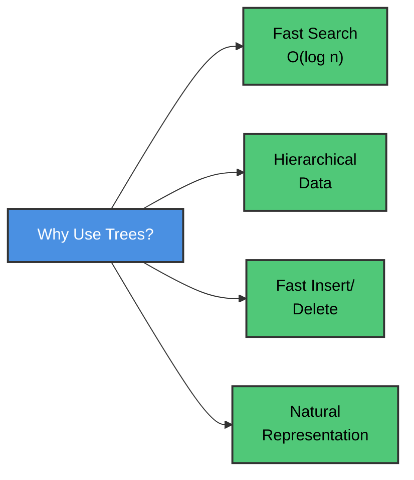
```mermaid
graph LR
    A["Why Use Trees?"] --> B["Fast Search<br/>O(log n)"]
    A --> C["Hierarchical<br/>Data"]
    A --> D["Fast Insert/<br/>Delete"]
    A --> E["Natural<br/>Representation"]
    
    style A fill:#4A90E2,stroke:#333,stroke-width:2px,color:#fff
    style B fill:#50C878,stroke:#333,stroke-width:2px,color:#000
    style C fill:#50C878,stroke:#333,stroke-width:2px,color:#000
    style D fill:#50C878,stroke:#333,stroke-width:2px,color:#000
    style E fill:#50C878,stroke:#333,stroke-width:2px,color:#000
```

---

## Binary Trees

### Definition

A **binary tree** is a tree where each node has **at most 2 children** (called left child and right child).

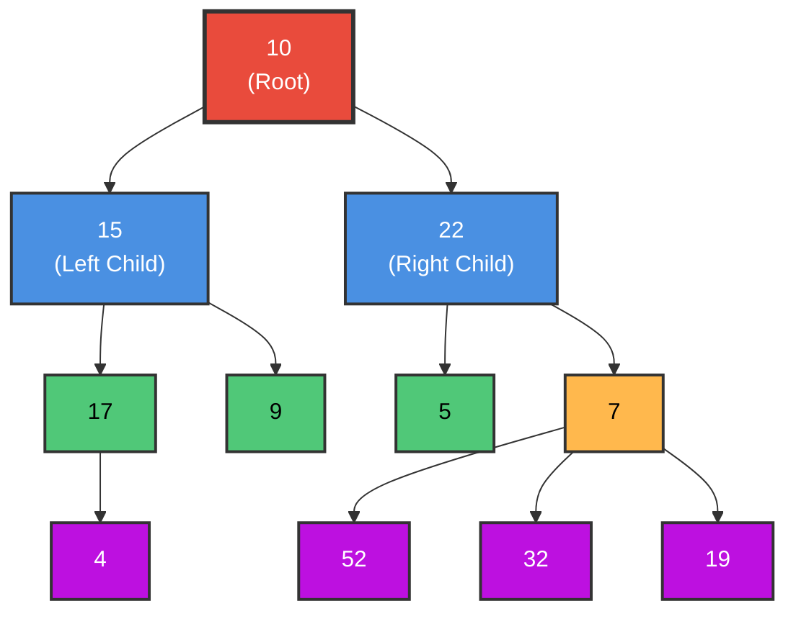
```mermaid
graph TD
    A["10<br/>(Root)"] --> B["15<br/>(Left Child)"]
    A --> C["22<br/>(Right Child)"]
    B --> D["17"]
    B --> E["9"]
    C --> F["5"]
    C --> G["7"]
    D --> H["4"]
    G --> I["52"]
    G --> J["32"]
    G --> K["19"]
    
    style A fill:#E94B3C,stroke:#333,stroke-width:3px,color:#fff
    style B fill:#4A90E2,stroke:#333,stroke-width:2px,color:#fff
    style C fill:#4A90E2,stroke:#333,stroke-width:2px,color:#fff
    style D fill:#50C878,stroke:#333,stroke-width:2px,color:#000
    style E fill:#50C878,stroke:#333,stroke-width:2px,color:#000
    style F fill:#50C878,stroke:#333,stroke-width:2px,color:#000
    style G fill:#FFB84D,stroke:#333,stroke-width:2px,color:#000
    style H fill:#BD10E0,stroke:#333,stroke-width:2px,color:#fff
    style I fill:#BD10E0,stroke:#333,stroke-width:2px,color:#fff
    style J fill:#BD10E0,stroke:#333,stroke-width:2px,color:#fff
    style K fill:#BD10E0,stroke:#333,stroke-width:2px,color:#fff
```

### Key Terminology

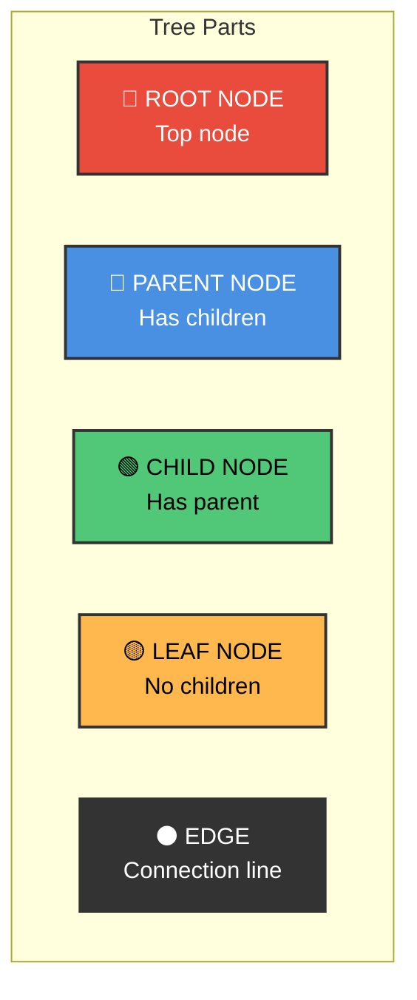
```mermaid
graph TD
    subgraph "Tree Parts"
        ROOT["🔴 ROOT NODE<br/>Top node"]
        PARENT["🔵 PARENT NODE<br/>Has children"]
        CHILD["🟢 CHILD NODE<br/>Has parent"]
        LEAF["🟡 LEAF NODE<br/>No children"]
        EDGE["⚫ EDGE<br/>Connection line"]
    end
    
    style ROOT fill:#E94B3C,stroke:#333,stroke-width:2px,color:#fff
    style PARENT fill:#4A90E2,stroke:#333,stroke-width:2px,color:#fff
    style CHILD fill:#50C878,stroke:#333,stroke-width:2px,color:#000
    style LEAF fill:#FFB84D,stroke:#333,stroke-width:2px,color:#000
    style EDGE fill:#333,stroke:#333,stroke-width:2px,color:#fff
```

| Term | Definition | Example |
|------|------------|---------|
| **Root** | The topmost node (no parent) | 10 in diagram above |
| **Parent** | Node with children | 15 is parent of 17 and 9 |
| **Child** | Node with a parent | 17 is child of 15 |
| **Siblings** | Nodes with same parent | 17 and 9 are siblings |
| **Leaf** | Node with no children | 4, 9, 5, 52, 32, 19 |
| **Edge** | Line connecting two nodes | — |
| **Path** | Sequence of edges | From 10 to 4 |
| **Depth/Height** | Maximum level + 1 | 4 in example |
| **Level** | Distance from root (root = 0) | Root=0, its children=1 |

### Levels in a Binary Tree

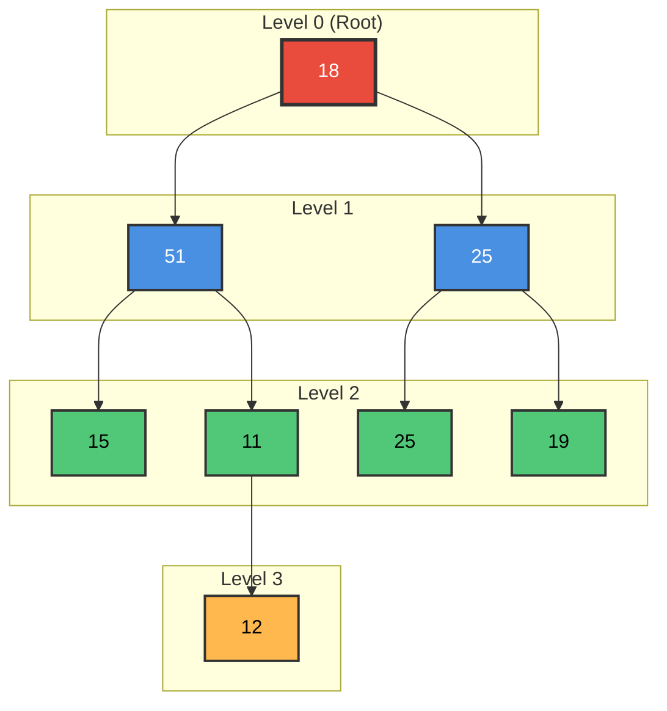
```mermaid
graph TD
    subgraph "Level 0 (Root)"
        A["18"]
    end
    
    subgraph "Level 1"
        B["51"]
        C["25"]
    end
    
    subgraph "Level 2"
        D["15"]
        E["11"]
        F["25"]
        G["19"]
    end
    
    subgraph "Level 3"
        H["12"]
    end
    
    A --> B
    A --> C
    B --> D
    B --> E
    C --> F
    C --> G
    E --> H
    
    style A fill:#E94B3C,stroke:#333,stroke-width:3px,color:#fff
    style B fill:#4A90E2,stroke:#333,stroke-width:2px,color:#fff
    style C fill:#4A90E2,stroke:#333,stroke-width:2px,color:#fff
    style D fill:#50C878,stroke:#333,stroke-width:2px,color:#000
    style E fill:#50C878,stroke:#333,stroke-width:2px,color:#000
    style F fill:#50C878,stroke:#333,stroke-width:2px,color:#000
    style G fill:#50C878,stroke:#333,stroke-width:2px,color:#000
    style H fill:#FFB84D,stroke:#333,stroke-width:2px,color:#000
```

### Complete Binary Tree

A **complete binary tree** is one where:
- All levels are completely filled except possibly the last level
- Last level is filled from left to right

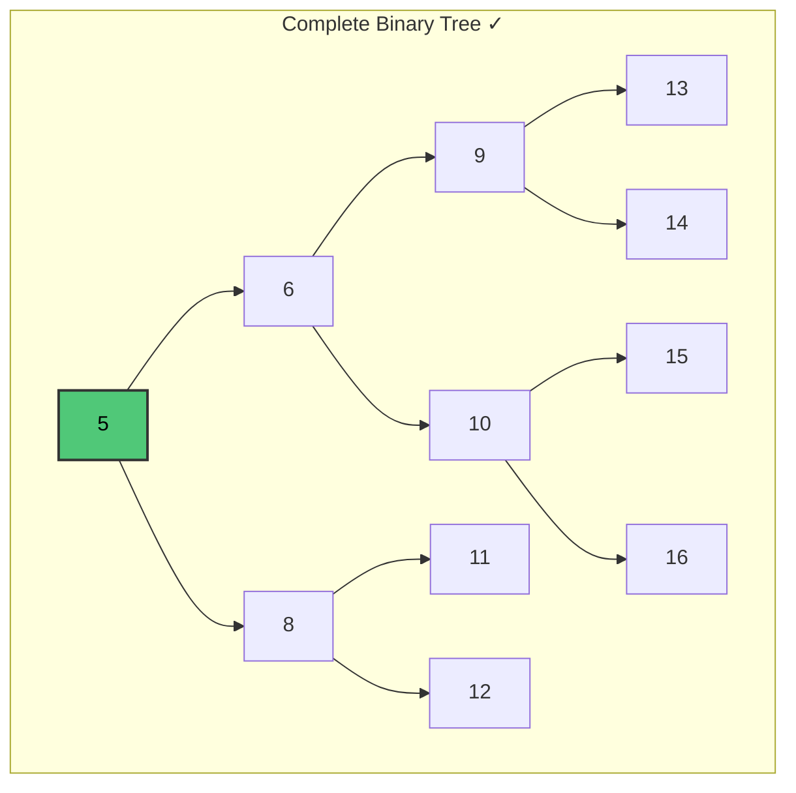
```mermaid
graph TD
    subgraph "Complete Binary Tree ✓"
        A1["5"]
        B1["6"]
        C1["8"]
        D1["9"]
        E1["10"]
        F1["11"]
        G1["12"]
        H1["13"]
        I1["14"]
        J1["15"]
        K1["16"]
        
        A1 --> B1
        A1 --> C1
        B1 --> D1
        B1 --> E1
        C1 --> F1
        C1 --> G1
        D1 --> H1
        D1 --> I1
        E1 --> J1
        E1 --> K1
    end
    
    style A1 fill:#50C878,stroke:#333,stroke-width:2px,color:#000
```

**Properties of Complete Binary Tree:**
- If there are k levels: Number of nodes = 2^k - 1
- If there are n nodes: Depth = ⌈log₂(n+1)⌉

**Example:** For 1,000,000 nodes, depth = 21 (very shallow!)

### Full Binary Tree

A **full binary tree** is one where every node has either 0 or 2 children (no nodes with 1 child).

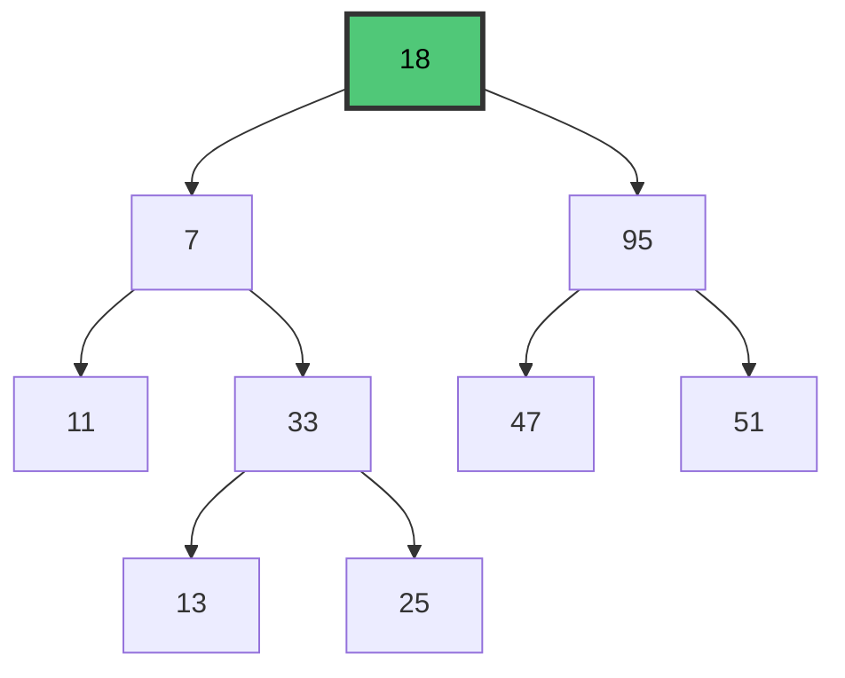
```mermaid
graph TD
    A["18"]
    B["7"]
    C["95"]
    D["11"]
    E["33"]
    F["47"]
    G["51"]
    H["13"]
    I["25"]
    
    A --> B
    A --> C
    B --> D
    B --> E
    C --> F
    C --> G
    E --> H
    E --> I
    
    style A fill:#50C878,stroke:#333,stroke-width:3px,color:#000
```

> **Note:** All full binary trees are complete binary trees, but not all complete binary trees are full.

### Extended Binary Tree (2-Tree)

A **2-tree** is a binary tree where each node has exactly 0 or 2 children.

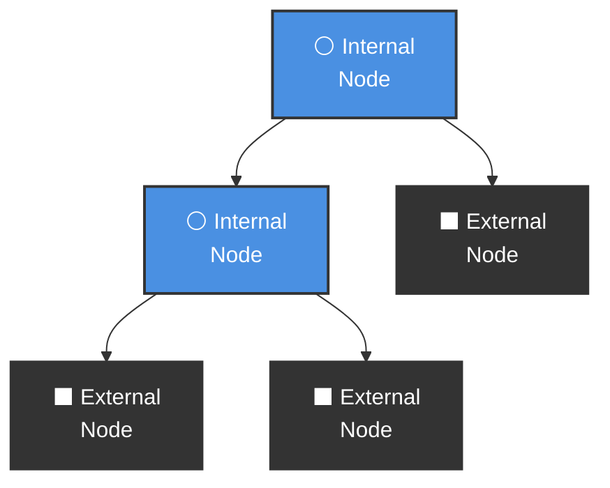
```mermaid
graph TD
    A["⚪ Internal<br/>Node"] --> B["⚪ Internal<br/>Node"]
    A --> C["⬛ External<br/>Node"]
    B --> D["⬛ External<br/>Node"]
    B --> E["⬛ External<br/>Node"]
    
    style A fill:#4A90E2,stroke:#333,stroke-width:2px,color:#fff
    style B fill:#4A90E2,stroke:#333,stroke-width:2px,color:#fff
    style C fill:#333,stroke:#333,stroke-width:2px,color:#fff
    style D fill:#333,stroke:#333,stroke-width:2px,color:#fff
    style E fill:#333,stroke:#333,stroke-width:2px,color:#fff
```

- **Internal nodes** (⚪): Have 2 children
- **External nodes** (⬛): Have 0 children (leaves)
- Number of external nodes = Number of internal nodes + 1

**Application:** Used in algebraic expressions

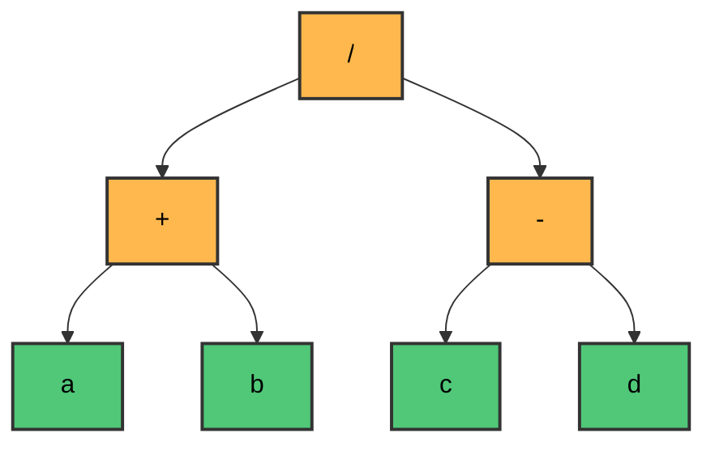
```mermaid
graph TD
    A["/"] --> B["+"]
    A --> C["-"]
    B --> D["a"]
    B --> E["b"]
    C --> F["c"]
    C --> G["d"]
    
    style A fill:#FFB84D,stroke:#333,stroke-width:2px,color:#000
    style B fill:#FFB84D,stroke:#333,stroke-width:2px,color:#000
    style C fill:#FFB84D,stroke:#333,stroke-width:2px,color:#000
    style D fill:#50C878,stroke:#333,stroke-width:2px,color:#000
    style E fill:#50C878,stroke:#333,stroke-width:2px,color:#000
    style F fill:#50C878,stroke:#333,stroke-width:2px,color:#000
    style G fill:#50C878,stroke:#333,stroke-width:2px,color:#000
```

This represents: `(a + b) / (c - d)`

---

## Representing Binary Trees in Memory

### Linked Representation

Each node is stored with three fields:

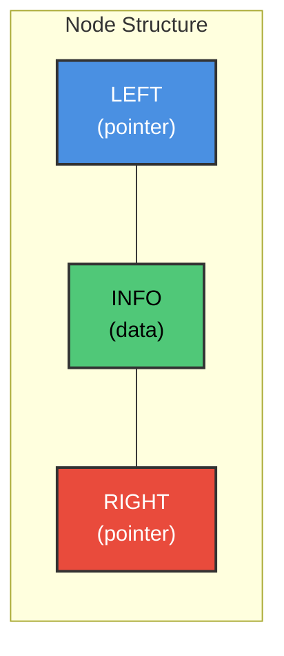
```mermaid
graph LR
    subgraph "Node Structure"
        A["LEFT<br/>(pointer)"]
        B["INFO<br/>(data)"]
        C["RIGHT<br/>(pointer)"]
    end
    
    A --- B
    B --- C
    
    style A fill:#4A90E2,stroke:#333,stroke-width:2px,color:#fff
    style B fill:#50C878,stroke:#333,stroke-width:2px,color:#000
    style C fill:#E94B3C,stroke:#333,stroke-width:2px,color:#fff
```

**Node Structure:**
- **LEFT** - pointer to left child
- **INFO** - stores the data
- **RIGHT** - pointer to right child

**Example Tree in Memory:**

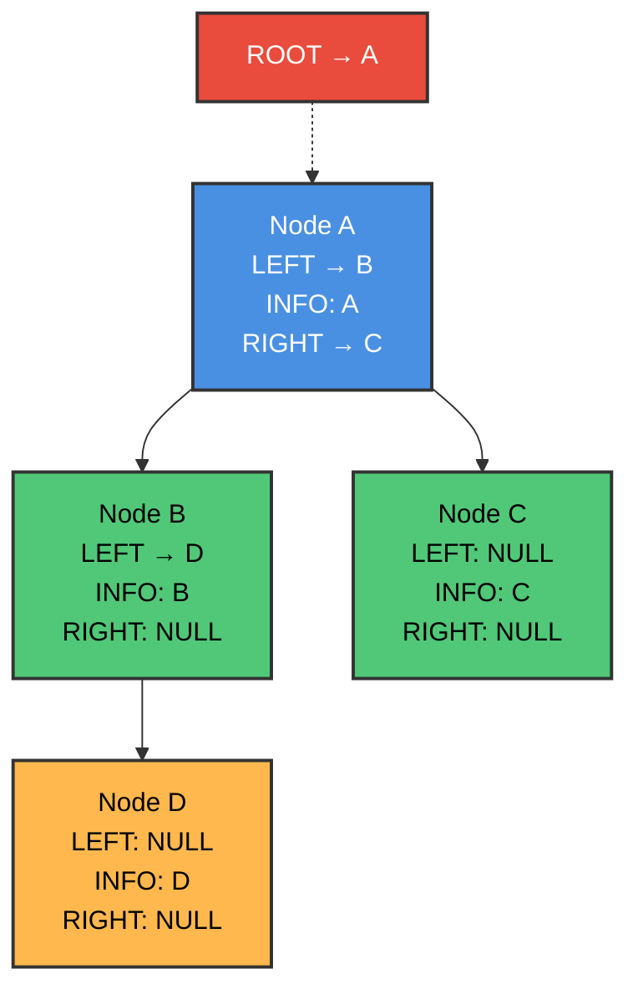
```mermaid
graph TD
    ROOT["ROOT → A"]
    
    A["Node A<br/>LEFT → B<br/>INFO: A<br/>RIGHT → C"]
    B["Node B<br/>LEFT → D<br/>INFO: B<br/>RIGHT: NULL"]
    C["Node C<br/>LEFT: NULL<br/>INFO: C<br/>RIGHT: NULL"]
    D["Node D<br/>LEFT: NULL<br/>INFO: D<br/>RIGHT: NULL"]
    
    ROOT -.-> A
    A --> B
    A --> C
    B --> D
    
    style ROOT fill:#E94B3C,stroke:#333,stroke-width:2px,color:#fff
    style A fill:#4A90E2,stroke:#333,stroke-width:2px,color:#fff
    style B fill:#50C878,stroke:#333,stroke-width:2px,color:#000
    style C fill:#50C878,stroke:#333,stroke-width:2px,color:#000
    style D fill:#FFB84D,stroke:#333,stroke-width:2px,color:#000
```

### Sequential Representation (Array)

For **complete or nearly complete** binary trees, we can use a single array:

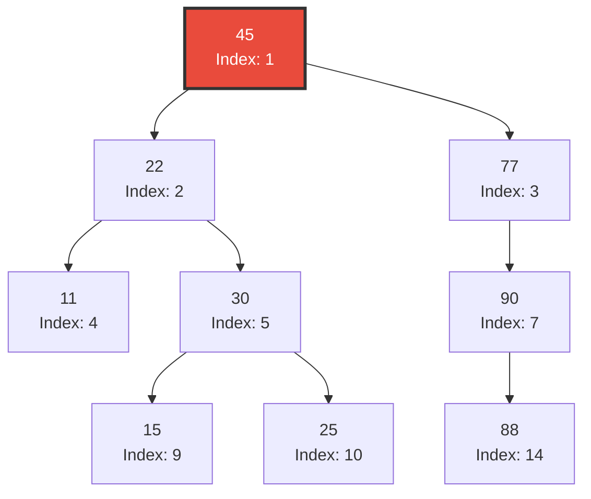
```mermaid
graph TD
    A["45<br/>Index: 1"]
    B["22<br/>Index: 2"]
    C["77<br/>Index: 3"]
    D["11<br/>Index: 4"]
    E["30<br/>Index: 5"]
    F["90<br/>Index: 7"]
    G["15<br/>Index: 9"]
    H["25<br/>Index: 10"]
    I["88<br/>Index: 14"]
    
    A --> B
    A --> C
    B --> D
    B --> E
    C --> F
    E --> G
    E --> H
    F --> I
    
    style A fill:#E94B3C,stroke:#333,stroke-width:3px,color:#fff
```

**Array Representation:**

| Index | 1  | 2  | 3  | 4  | 5  | 6 | 7  | 8 | 9  | 10 | 11 | 12 | 13 | 14 |
|-------|----|----|----|----|----|----|----|----|----|----|----|----|----|----|
| Value | 45 | 22 | 77 | 11 | 30 | — | 90 | — | 15 | 25 | — | — | — | 88 |

**Parent-Child Relationships (Root at index 1):**

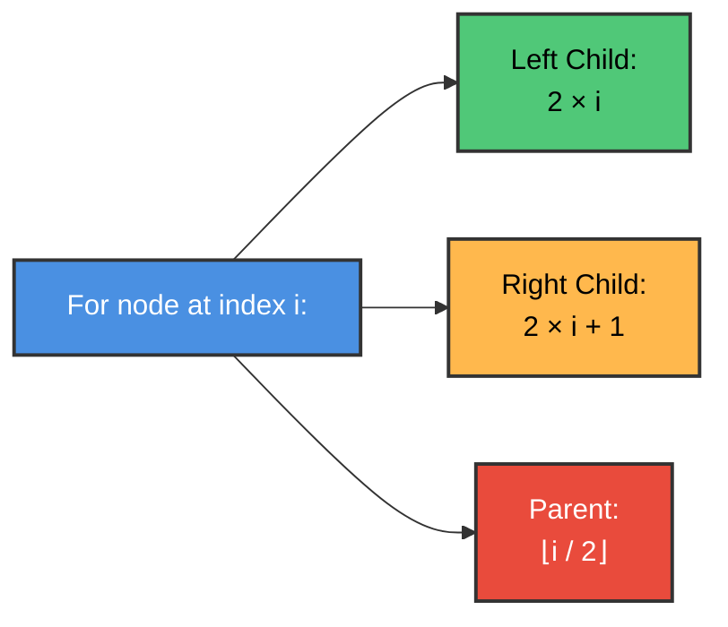
```mermaid
graph LR
    A["For node at index i:"] --> B["Left Child:<br/>2 × i"]
    A --> C["Right Child:<br/>2 × i + 1"]
    A --> D["Parent:<br/>⌊i / 2⌋"]
    
    style A fill:#4A90E2,stroke:#333,stroke-width:2px,color:#fff
    style B fill:#50C878,stroke:#333,stroke-width:2px,color:#000
    style C fill:#FFB84D,stroke:#333,stroke-width:2px,color:#000
    style D fill:#E94B3C,stroke:#333,stroke-width:2px,color:#fff
```

**Example:** Node at index 2 (value 22):
- Left child: 2 × 2 = 4 (value 11) ✓
- Right child: 2 × 2 + 1 = 5 (value 30) ✓
- Parent: ⌊2 / 2⌋ = 1 (value 45) ✓

**Pros and Cons:**

| Sequential (Array) | Linked |
|--------------------|--------|
| ✅ Simple to implement | ✅ No wasted space |
| ✅ Fast parent/child access | ✅ Works for any tree shape |
| ❌ Wastes space for sparse trees | ❌ More complex |
| ❌ Only good for complete trees | ❌ Slower access |

---

## Traversing Binary Trees

**Traversal** means visiting each node in the tree exactly once in a specific order.

### Three Standard Traversals

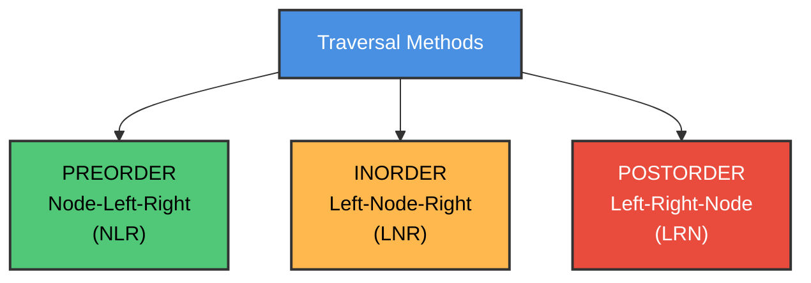
```mermaid
graph TD
    A["Traversal Methods"] --> B["PREORDER<br/>Node-Left-Right<br/>(NLR)"]
    A --> C["INORDER<br/>Left-Node-Right<br/>(LNR)"]
    A --> D["POSTORDER<br/>Left-Right-Node<br/>(LRN)"]
    
    style A fill:#4A90E2,stroke:#333,stroke-width:2px,color:#fff
    style B fill:#50C878,stroke:#333,stroke-width:2px,color:#000
    style C fill:#FFB84D,stroke:#333,stroke-width:2px,color:#000
    style D fill:#E94B3C,stroke:#333,stroke-width:2px,color:#fff
```

### Example Tree

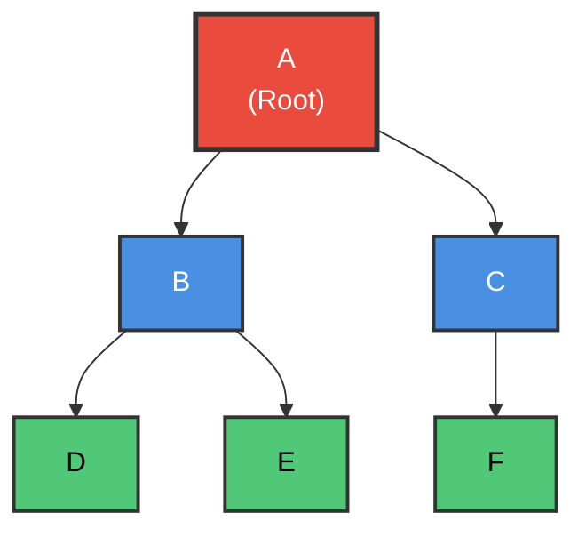
```mermaid
graph TD
    A["A<br/>(Root)"]
    B["B"]
    C["C"]
    D["D"]
    E["E"]
    F["F"]
    
    A --> B
    A --> C
    B --> D
    B --> E
    C --> F
    
    style A fill:#E94B3C,stroke:#333,stroke-width:3px,color:#fff
    style B fill:#4A90E2,stroke:#333,stroke-width:2px,color:#fff
    style C fill:#4A90E2,stroke:#333,stroke-width:2px,color:#fff
    style D fill:#50C878,stroke:#333,stroke-width:2px,color:#000
    style E fill:#50C878,stroke:#333,stroke-width:2px,color:#000
    style F fill:#50C878,stroke:#333,stroke-width:2px,color:#000
```

---

### 📘 Algorithm 7.1: Preorder Traversal (NLR)

> **Purpose:** Visit each node by processing Node first, then Left subtree, then Right subtree.

#### Pseudocode

```
Algorithm 7.1: PREORDER(TREE, ROOT)
────────────────────────────────────
TREE = Binary tree structure
ROOT = Pointer to root node

1. [Is tree empty?] If ROOT = NULL, then: Exit
2. [Process root node] Apply PROCESS to INFO[ROOT]
3. [Traverse left subtree] Call PREORDER(TREE, LEFT[ROOT])
4. [Traverse right subtree] Call PREORDER(TREE, RIGHT[ROOT])
5. Exit
```

#### 🎯 Visual Flowchart

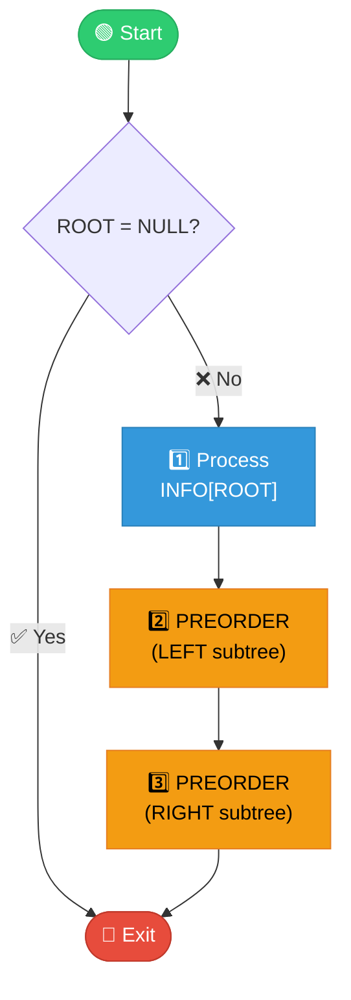
```mermaid
flowchart TD
    START([🟢 Start]) --> CHECK{"ROOT = NULL?"}
    CHECK -->|✅ Yes| EXIT([🔴 Exit])
    CHECK -->|❌ No| PROCESS["1️⃣ Process<br/>INFO[ROOT]"]
    PROCESS --> LEFT["2️⃣ PREORDER<br/>(LEFT subtree)"]
    LEFT --> RIGHT["3️⃣ PREORDER<br/>(RIGHT subtree)"]
    RIGHT --> EXIT
    
    style START fill:#2ecc71,stroke:#27ae60,color:#fff
    style EXIT fill:#e74c3c,stroke:#c0392b,color:#fff
    style PROCESS fill:#3498db,stroke:#2980b9,color:#fff
    style LEFT fill:#f39c12,stroke:#e67e22,color:#000
    style RIGHT fill:#f39c12,stroke:#e67e22,color:#000
```

#### 📝 Example: Preorder Traversal

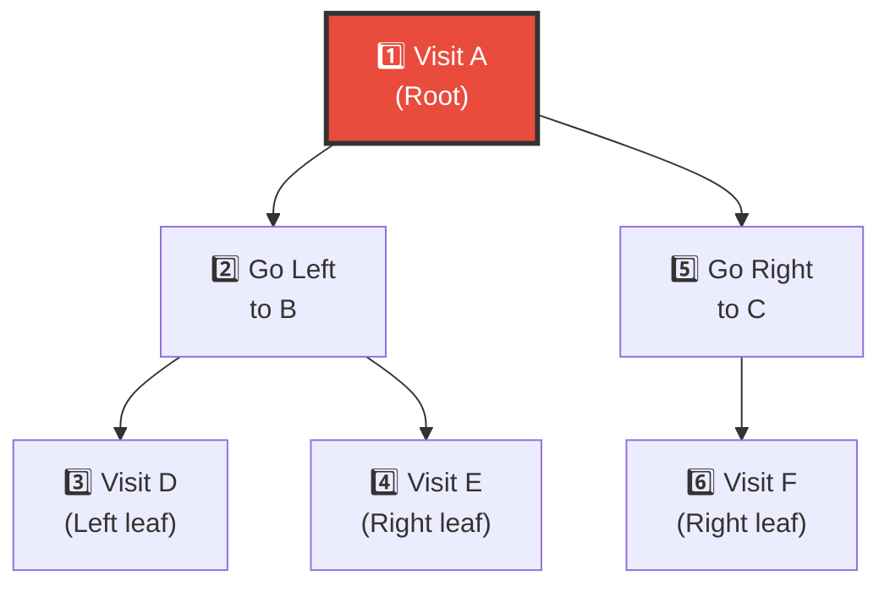
```mermaid
graph TD
    A["1️⃣ Visit A<br/>(Root)"] --> B["2️⃣ Go Left<br/>to B"]
    B --> D["3️⃣ Visit D<br/>(Left leaf)"]
    B --> E["4️⃣ Visit E<br/>(Right leaf)"]
    A --> C["5️⃣ Go Right<br/>to C"]
    C --> F["6️⃣ Visit F<br/>(Right leaf)"]
    
    style A fill:#E94B3C,stroke:#333,stroke-width:3px,color:#fff
```

**Result:** A → B → D → E → C → F

**Use Case:** Copy tree structure, prefix notation

---

### 📘 Algorithm 7.2: Inorder Traversal (LNR)

> **Purpose:** Visit each node by processing Left subtree first, then Node, then Right subtree.

#### Pseudocode

```
Algorithm 7.2: INORDER(TREE, ROOT)
──────────────────────────────────
TREE = Binary tree structure
ROOT = Pointer to root node

1. [Is tree empty?] If ROOT = NULL, then: Exit
2. [Traverse left subtree] Call INORDER(TREE, LEFT[ROOT])
3. [Process root node] Apply PROCESS to INFO[ROOT]
4. [Traverse right subtree] Call INORDER(TREE, RIGHT[ROOT])
5. Exit
```

#### 🎯 Visual Flowchart

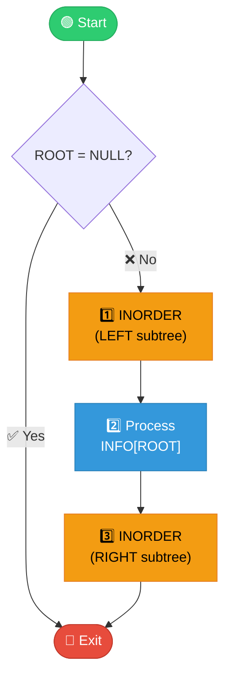
```mermaid
flowchart TD
    START([🟢 Start]) --> CHECK{"ROOT = NULL?"}
    CHECK -->|✅ Yes| EXIT([🔴 Exit])
    CHECK -->|❌ No| LEFT["1️⃣ INORDER<br/>(LEFT subtree)"]
    LEFT --> PROCESS["2️⃣ Process<br/>INFO[ROOT]"]
    PROCESS --> RIGHT["3️⃣ INORDER<br/>(RIGHT subtree)"]
    RIGHT --> EXIT
    
    style START fill:#2ecc71,stroke:#27ae60,color:#fff
    style EXIT fill:#e74c3c,stroke:#c0392b,color:#fff
    style PROCESS fill:#3498db,stroke:#2980b9,color:#fff
    style LEFT fill:#f39c12,stroke:#e67e22,color:#000
    style RIGHT fill:#f39c12,stroke:#e67e22,color:#000
```

#### 📝 Example: Inorder Traversal

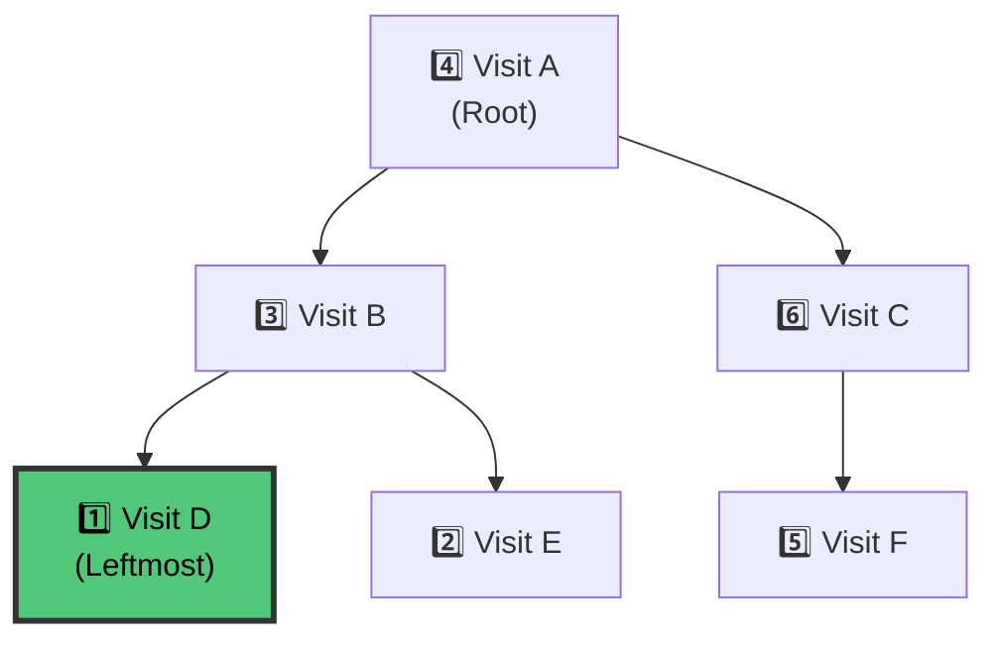
```mermaid
graph TD
    B["3️⃣ Visit B"] --> D["1️⃣ Visit D<br/>(Leftmost)"]
    B --> E["2️⃣ Visit E"]
    A["4️⃣ Visit A<br/>(Root)"] --> B
    A --> C["6️⃣ Visit C"]
    C --> F["5️⃣ Visit F"]
    
    style D fill:#50C878,stroke:#333,stroke-width:3px,color:#000
```

**Result:** D → B → E → A → F → C

> **Important:** For a **Binary Search Tree**, inorder traversal gives **sorted order**!

**Use Case:** Get sorted data from BST

---

### 📘 Algorithm 7.3: Postorder Traversal (LRN)

> **Purpose:** Visit each node by processing Left subtree first, then Right subtree, then Node.

#### Pseudocode

```
Algorithm 7.3: POSTORDER(TREE, ROOT)
────────────────────────────────────
TREE = Binary tree structure
ROOT = Pointer to root node

1. [Is tree empty?] If ROOT = NULL, then: Exit
2. [Traverse left subtree] Call POSTORDER(TREE, LEFT[ROOT])
3. [Traverse right subtree] Call POSTORDER(TREE, RIGHT[ROOT])
4. [Process root node] Apply PROCESS to INFO[ROOT]
5. Exit
```

#### 🎯 Visual Flowchart

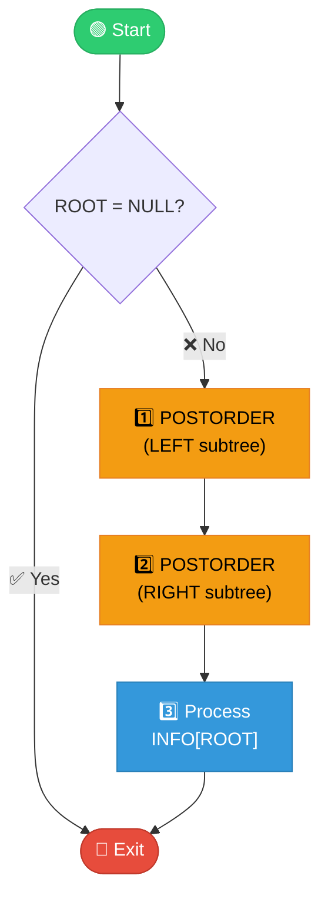
```mermaid
flowchart TD
    START([🟢 Start]) --> CHECK{"ROOT = NULL?"}
    CHECK -->|✅ Yes| EXIT([🔴 Exit])
    CHECK -->|❌ No| LEFT["1️⃣ POSTORDER<br/>(LEFT subtree)"]
    LEFT --> RIGHT["2️⃣ POSTORDER<br/>(RIGHT subtree)"]
    RIGHT --> PROCESS["3️⃣ Process<br/>INFO[ROOT]"]
    PROCESS --> EXIT
    
    style START fill:#2ecc71,stroke:#27ae60,color:#fff
    style EXIT fill:#e74c3c,stroke:#c0392b,color:#fff
    style PROCESS fill:#3498db,stroke:#2980b9,color:#fff
    style LEFT fill:#f39c12,stroke:#e67e22,color:#000
    style RIGHT fill:#f39c12,stroke:#e67e22,color:#000
```

#### 📝 Example: Postorder Traversal

```mermaid
graph TD
    A["6️⃣ Visit A<br/>(Last = Root)"] --> B["3️⃣ Visit B"]
    B --> D["1️⃣ Visit D"]
    B --> E["2️⃣ Visit E"]
    A --> C["5️⃣ Visit C"]
    C --> F["4️⃣ Visit F"]
    
    style A fill:#E94B3C,stroke:#333,stroke-width:3px,color:#fff
```

**Result:** D → E → B → F → C → A

**Use Case:** Delete tree, postfix notation

### Comparison Table

| Traversal | Order | Use Case | Time |
|-----------|-------|----------|------|
| **Preorder** | Node-Left-Right | Copy tree, prefix notation | O(n) |
| **Inorder** | Left-Node-Right | Get sorted data from BST | O(n) |
| **Postorder** | Left-Right-Node | Delete tree, postfix notation | O(n) |

### Expression Tree Example

```mermaid
graph TD
    A["×"] --> B["+"]
    A --> C["-"]
    B --> D["a"]
    B --> E["b"]
    C --> F["c"]
    C --> G["d"]
    
    style A fill:#FFB84D,stroke:#333,stroke-width:3px,color:#000
    style B fill:#4A90E2,stroke:#333,stroke-width:2px,color:#fff
    style C fill:#4A90E2,stroke:#333,stroke-width:2px,color:#fff
```

For expression: `(a + b) × (c - d)`

- **Preorder:** × + a b - c d (Prefix notation)
- **Inorder:** a + b × c - d (Infix notation - needs parentheses)
- **Postorder:** a b + c d - × (Postfix notation)

---

### 📘 Algorithm 7.4: Preorder Traversal Using Stack

> **Purpose:** Implement preorder traversal iteratively using an explicit stack instead of recursion.

#### Pseudocode

```
Algorithm 7.4: PREORDER_STACK(TREE, ROOT)
─────────────────────────────────────────
TREE  = Binary tree structure
ROOT  = Pointer to root node
STACK = Explicit stack to store nodes
PTR   = Pointer to current node

1. [Initialize] 
   Push NULL onto STACK
   Set PTR := ROOT
   
2. [Repeat until done] Repeat Steps 3 to 5 while PTR ≠ NULL:

3.     [Process current node]
       Apply PROCESS to INFO[PTR]
       
4.     [Push right child if exists]
       If RIGHT[PTR] ≠ NULL, then:
          Push RIGHT[PTR] onto STACK
       [End If]
       
5.     [Move to left or pop]
       If LEFT[PTR] ≠ NULL, then:
          Set PTR := LEFT[PTR]
       Else:
          Pop STACK into PTR
       [End If]
       
   [End of Step 2 loop]
   
6. Exit
```

#### 🎯 Visual Flowchart

```mermaid
flowchart TD
    START([🟢 Start]) --> INIT["Push NULL<br/>PTR = ROOT"]
    INIT --> CHECK{"PTR ≠ NULL?"}
    CHECK -->|❌ No| EXIT([🔴 Exit])
    CHECK -->|✅ Yes| PROCESS["Process<br/>INFO[PTR]"]
    PROCESS --> PUSHRIGHT{"RIGHT[PTR]<br/>≠ NULL?"}
    PUSHRIGHT -->|✅ Yes| PUSH["Push RIGHT[PTR]<br/>onto STACK"]
    PUSHRIGHT -->|❌ No| CHECKLEFT
    PUSH --> CHECKLEFT{"LEFT[PTR]<br/>≠ NULL?"}
    CHECKLEFT -->|✅ Yes| GOLEFT["PTR = LEFT[PTR]"]
    CHECKLEFT -->|❌ No| POP["Pop STACK<br/>into PTR"]
    GOLEFT --> CHECK
    POP --> CHECK
    
    style START fill:#2ecc71,stroke:#27ae60,color:#fff
    style EXIT fill:#e74c3c,stroke:#c0392b,color:#fff
    style PROCESS fill:#3498db,stroke:#2980b9,color:#fff
```

#### 📝 Example: Stack-Based Preorder Process

```mermaid
graph TD
    subgraph "Step 1: Push NULL, PTR=A"
        S1["Stack:<br/>NULL"]
        P1["PTR → A"]
    end
    
    subgraph "Step 2: Process A, push C, go left to B"
        S2["Stack:<br/>NULL<br/>C"]
        P2["PTR → B<br/>Print: A"]
    end
    
    subgraph "Step 3: Process B, go left to D"
        S3["Stack:<br/>NULL<br/>C"]
        P3["PTR → D<br/>Print: B"]
    end
    
    subgraph "Step 4: Process D, no children, pop C"
        S4["Stack:<br/>NULL"]
        P4["PTR → C<br/>Print: D"]
    end
    
    style S1 fill:#4A90E2,stroke:#333,stroke-width:2px,color:#fff
    style S2 fill:#50C878,stroke:#333,stroke-width:2px,color:#000
    style S3 fill:#FFB84D,stroke:#333,stroke-width:2px,color:#000
    style S4 fill:#E94B3C,stroke:#333,stroke-width:2px,color:#fff
```

**Advantage:** No recursion needed - useful when recursion depth is limited or when converting to iterative code.

---

## Binary Search Trees (BST)

### Definition

A **Binary Search Tree** is a binary tree where:
- All values in **left subtree** < node value
- All values in **right subtree** > node value
- Both subtrees are also BSTs

```mermaid
graph TD
    A["38<br/>(Root)"]
    B["14<br/>(< 38)"]
    C["56<br/>(> 38)"]
    D["8<br/>(< 14)"]
    E["23<br/>(> 14, < 38)"]
    F["45<br/>(> 38, < 56)"]
    G["82<br/>(> 56)"]
    
    A --> B
    A --> C
    B --> D
    B --> E
    C --> F
    C --> G
    
    style A fill:#E94B3C,stroke:#333,stroke-width:3px,color:#fff
    style B fill:#4A90E2,stroke:#333,stroke-width:2px,color:#fff
    style C fill:#4A90E2,stroke:#333,stroke-width:2px,color:#fff
    style D fill:#50C878,stroke:#333,stroke-width:2px,color:#000
    style E fill:#50C878,stroke:#333,stroke-width:2px,color:#000
    style F fill:#50C878,stroke:#333,stroke-width:2px,color:#000
    style G fill:#50C878,stroke:#333,stroke-width:2px,color:#000
```

**Key Property:** Inorder traversal of BST gives **sorted sequence**!
- Inorder: 8 → 14 → 23 → 38 → 45 → 56 → 82 ✓

### Why BST?

```mermaid
graph LR
    A["Data Structure"] --> B["Sorted Array"]
    A --> C["Linked List"]
    A --> D["BST"]
    
    B --> B1["Search: O(log n) ✓<br/>Insert/Delete: O(n) ✗"]
    C --> C1["Search: O(n) ✗<br/>Insert/Delete: O(1) ✓"]
    D --> D1["Search: O(log n) ✓<br/>Insert/Delete: O(log n) ✓"]
    
    style D fill:#50C878,stroke:#333,stroke-width:3px,color:#000
    style D1 fill:#50C878,stroke:#333,stroke-width:2px,color:#000
```

**BST combines best of both worlds!**

---

### 📘 Algorithm 7.5: Searching in BST

> **Purpose:** Find a specific ITEM in a Binary Search Tree and return its location.

#### Pseudocode

```
Algorithm 7.5: SEARCH_BST(ROOT, ITEM, LOC, PAR)
───────────────────────────────────────────────
ROOT = Pointer to root of BST
ITEM = Value to search for
LOC  = Will store location of ITEM (or NULL if not found)
PAR  = Will store parent of LOC (or NULL if LOC is root)

1. [Initialize - tree empty or start at root?]
   If ROOT = NULL, then:
      Set LOC := NULL and PAR := NULL
      Exit
   [End If]
   
2. [Special case - ITEM at root?]
   If ITEM = INFO[ROOT], then:
      Set LOC := ROOT and PAR := NULL
      Exit
   [End If]
   
3. [Initialize search]
   If ITEM < INFO[ROOT], then:
      Set LOC := LEFT[ROOT]
      Set PAR := ROOT
   Else:
      Set LOC := RIGHT[ROOT]
      Set PAR := ROOT
   [End If]
   
4. [Search for ITEM]
   Repeat Steps 5 and 6 while LOC ≠ NULL:
   
5.     [Found?]
       If ITEM = INFO[LOC], then: Exit
       
6.     [Not found - keep searching]
       If ITEM < INFO[LOC], then:
          Set PAR := LOC
          Set LOC := LEFT[LOC]
       Else:
          Set PAR := LOC
          Set LOC := RIGHT[LOC]
       [End If]
       
   [End of Step 4 loop]
   
7. Exit
```

#### 🎯 Visual Flowchart

```mermaid
flowchart TD
    START([🟢 Start]) --> EMPTY{"ROOT = NULL?"}
    EMPTY -->|✅ Yes| SETNIL["LOC = NULL<br/>PAR = NULL"]
    SETNIL --> EXIT([🔴 Exit])
    EMPTY -->|❌ No| ATROOT{"ITEM =<br/>INFO[ROOT]?"}
    ATROOT -->|✅ Yes| FOUND["LOC = ROOT<br/>PAR = NULL"]
    FOUND --> EXIT
    ATROOT -->|❌ No| COMPARE{"ITEM <<br/>INFO[ROOT]?"}
    COMPARE -->|✅ Yes| GOLEFT["LOC = LEFT[ROOT]<br/>PAR = ROOT"]
    COMPARE -->|❌ No| GORIGHT["LOC = RIGHT[ROOT]<br/>PAR = ROOT"]
    GOLEFT --> LOOP{"LOC ≠ NULL?"}
    GORIGHT --> LOOP
    LOOP -->|❌ No| EXIT
    LOOP -->|✅ Yes| MATCH{"ITEM =<br/>INFO[LOC]?"}
    MATCH -->|✅ Yes| EXIT
    MATCH -->|❌ No| SEARCHDIR{"ITEM <<br/>INFO[LOC]?"}
    SEARCHDIR -->|✅ Yes| MOVELEFT["PAR = LOC<br/>LOC = LEFT[LOC]"]
    SEARCHDIR -->|❌ No| MOVERIGHT["PAR = LOC<br/>LOC = RIGHT[LOC]"]
    MOVELEFT --> LOOP
    MOVERIGHT --> LOOP
    
    style START fill:#2ecc71,stroke:#27ae60,color:#fff
    style EXIT fill:#e74c3c,stroke:#c0392b,color:#fff
    style FOUND fill:#2ecc71,stroke:#27ae60,color:#fff
```

#### 📝 Example: Search for 45

```mermaid
graph TD
    subgraph "Search for 45"
        A["Start at 38<br/>45 > 38<br/>Go RIGHT →"]
        B["At 56<br/>45 < 56<br/>Go LEFT ←"]
        C["At 45<br/>Found! ✓"]
    end
    
    style A fill:#4A90E2,stroke:#333,stroke-width:2px,color:#fff
    style B fill:#FFB84D,stroke:#333,stroke-width:2px,color:#000
    style C fill:#50C878,stroke:#333,stroke-width:3px,color:#000
```

**Time Complexity:** O(h) where h = height of tree
- Best case (balanced): O(log n)
- Worst case (skewed): O(n)

---

### 📘 Algorithm 7.6: Insertion in BST

> **Purpose:** Insert a new ITEM into a Binary Search Tree maintaining BST property.

#### Pseudocode

```
Algorithm 7.6: INSERT_BST(ROOT, ITEM)
─────────────────────────────────────
ROOT = Pointer to root of BST
ITEM = Value to insert
LOC  = Location where ITEM will be inserted
PAR  = Parent of LOC

1. [Search for insert location]
   Call SEARCH_BST(ROOT, ITEM, LOC, PAR)
   
2. [Already exists?]
   If LOC ≠ NULL, then:
      Write: ITEM, "already exists in tree"
      Exit
   [End If]
   
3. [Create new node with ITEM]
   Set NEW := address of new node
   Set INFO[NEW] := ITEM
   Set LEFT[NEW] := NULL
   Set RIGHT[NEW] := NULL
   
4. [Insert as root?]
   If PAR = NULL, then:
      Set ROOT := NEW
   Else If ITEM < INFO[PAR], then:
      Set LEFT[PAR] := NEW
   Else:
      Set RIGHT[PAR] := NEW
   [End If]
   
5. Exit
```

#### 🎯 Visual Flowchart

```mermaid
flowchart TD
    START([🟢 Start]) --> SEARCH["Call SEARCH_BST<br/>(Find insert location)"]
    SEARCH --> EXISTS{"LOC ≠ NULL?<br/>(Already exists?)"}
    EXISTS -->|✅ Yes| ERROR["Write: Item exists"]
    ERROR --> EXIT([🔴 Exit])
    EXISTS -->|❌ No| CREATE["Create NEW node<br/>INFO[NEW] = ITEM<br/>LEFT[NEW] = NULL<br/>RIGHT[NEW] = NULL"]
    CREATE --> ISROOT{"PAR = NULL?<br/>(Insert as root?)"}
    ISROOT -->|✅ Yes| SETROOT["ROOT = NEW"]
    SETROOT --> EXIT
    ISROOT -->|❌ No| WHERETO{"ITEM <<br/>INFO[PAR]?"}
    WHERETO -->|✅ Yes| INSERTLEFT["LEFT[PAR] = NEW"]
    WHERETO -->|❌ No| INSERTRIGHT["RIGHT[PAR] = NEW"]
    INSERTLEFT --> EXIT
    INSERTRIGHT --> EXIT
    
    style START fill:#2ecc71,stroke:#27ae60,color:#fff
    style EXIT fill:#e74c3c,stroke:#c0392b,color:#fff
    style CREATE fill:#3498db,stroke:#2980b9,color:#fff
```

#### 📝 Example: Insert 35

```mermaid
graph TD
    A["38<br/>35 < 38<br/>Go LEFT"] --> B["14<br/>35 > 14<br/>Go RIGHT"]
    A --> C["56"]
    B --> D["8"]
    B --> E["23<br/>35 > 23<br/>Go RIGHT"]
    E -.->|"Insert here"| F["35 ✨"]
    
    style A fill:#4A90E2,stroke:#333,stroke-width:2px,color:#fff
    style B fill:#FFB84D,stroke:#333,stroke-width:2px,color:#000
    style E fill:#E94B3C,stroke:#333,stroke-width:2px,color:#fff
    style F fill:#50C878,stroke:#333,stroke-width:3px,color:#000
```

**Building BST Example:**

Insert: 40, 60, 50, 33, 55, 11

```mermaid
graph TD
    A["40"]
    B["33"]
    C["60"]
    D["11"]
    E["50"]
    F["55"]
    
    A --> B
    A --> C
    B --> D
    C --> E
    E --> F
    
    style A fill:#E94B3C,stroke:#333,stroke-width:3px,color:#fff
```

**Note:** Different insertion orders create different tree shapes!

---

### 📘 Algorithm 7.7: Deletion in BST (Case A & B)

> **Purpose:** Delete a node from BST when it has 0 or 1 child.

#### Pseudocode

```
Algorithm 7.7: DELETE_BST_CASE_AB(ROOT, ITEM)
─────────────────────────────────────────────
ROOT = Pointer to root of BST
ITEM = Value to delete
LOC  = Location of ITEM
PAR  = Parent of LOC
CHILD = The child of LOC (if any)

This algorithm handles:
- Case A: Node has no children (leaf)
- Case B: Node has exactly one child

1. [Find node to delete]
   Call SEARCH_BST(ROOT, ITEM, LOC, PAR)
   
2. [Item exists?]
   If LOC = NULL, then:
      Write: ITEM, "not in tree"
      Exit
   [End If]
   
3. [Determine which child exists]
   If LEFT[LOC] = NULL and RIGHT[LOC] = NULL, then:
      Set CHILD := NULL                    [Case A: No children]
   Else If LEFT[LOC] ≠ NULL, then:
      Set CHILD := LEFT[LOC]               [Case B: Left child exists]
   Else:
      Set CHILD := RIGHT[LOC]              [Case B: Right child exists]
   [End If]
   
4. [Delete LOC by replacing it with CHILD]
   If PAR ≠ NULL, then:                    [LOC is not root]
      If LOC = LEFT[PAR], then:
         Set LEFT[PAR] := CHILD
      Else:
         Set RIGHT[PAR] := CHILD
      [End If]
   Else:                                   [LOC is root]
      Set ROOT := CHILD
   [End If]
   
5. [Free memory]
   Free node at LOC
   
6. Exit
```

#### 🎯 Visual Flowchart

```mermaid
flowchart TD
    START([🟢 Start]) --> SEARCH["Call SEARCH_BST<br/>(Find node to delete)"]
    SEARCH --> NOTFOUND{"LOC = NULL?"}
    NOTFOUND -->|✅ Yes| ERROR["Write: Not in tree"]
    ERROR --> EXIT([🔴 Exit])
    NOTFOUND -->|❌ No| CHECKCHILD{"Count children<br/>of LOC"}
    CHECKCHILD -->|0 children| SETZERO["CHILD = NULL<br/>(Case A)"]
    CHECKCHILD -->|1 child| SETONE["CHILD = LEFT[LOC]<br/>or RIGHT[LOC]<br/>(Case B)"]
    SETZERO --> ISROOT
    SETONE --> ISROOT{"PAR ≠ NULL?"}
    ISROOT -->|❌ No| DELROOT["ROOT = CHILD"]
    ISROOT -->|✅ Yes| WHICH{"LOC =<br/>LEFT[PAR]?"}
    WHICH -->|✅ Yes| REPLEFT["LEFT[PAR] = CHILD"]
    WHICH -->|❌ No| REPRIGHT["RIGHT[PAR] = CHILD"]
    DELROOT --> FREE["Free LOC"]
    REPLEFT --> FREE
    REPRIGHT --> FREE
    FREE --> EXIT
    
    style START fill:#2ecc71,stroke:#27ae60,color:#fff
    style EXIT fill:#e74c3c,stroke:#c0392b,color:#fff
```

#### 📝 Example: Case A (No Children)

```mermaid
graph TD
    subgraph "Before"
        A1["50"]
        B1["30"]
        C1["70"]
        D1["20 ❌"]
        E1["40"]
        
        A1 --> B1
        A1 --> C1
        B1 --> D1
        B1 --> E1
    end
    
    subgraph "After"
        A2["50"]
        B2["30"]
        C2["70"]
        E2["40"]
        
        A2 --> B2
        A2 --> C2
        B2 --> E2
    end
```

#### 📝 Example: Case B (One Child)

```mermaid
graph TD
    subgraph "Before"
        A1["50"]
        B1["30 ❌"]
        C1["70"]
        D1["20"]
        
        A1 --> B1
        A1 --> C1
        B1 --> D1
    end
    
    subgraph "After"
        A2["50"]
        D2["20"]
        C2["70"]
        
        A2 --> D2
        A2 --> C2
    end
```

---

### 📘 Algorithm 7.8: Deletion in BST (Case C)

> **Purpose:** Delete a node from BST when it has 2 children.

#### Pseudocode

```
Algorithm 7.8: DELETE_BST_CASE_C(ROOT, ITEM)
────────────────────────────────────────────
ROOT = Pointer to root of BST
ITEM = Value to delete
LOC  = Location of ITEM
PAR  = Parent of LOC
SUCC = Inorder successor of LOC
PARS = Parent of SUCC

This algorithm handles:
- Case C: Node has two children

1. [Find node to delete]
   Call SEARCH_BST(ROOT, ITEM, LOC, PAR)
   
2. [Item exists?]
   If LOC = NULL, then:
      Write: ITEM, "not in tree"
      Exit
   [End If]
   
3. [Does it have 2 children?]
   If LEFT[LOC] = NULL or RIGHT[LOC] = NULL, then:
      Call DELETE_BST_CASE_AB(ROOT, ITEM)
      Exit
   [End If]
   
4. [Find inorder successor - smallest in right subtree]
   Set PTR := RIGHT[LOC]
   Set SAVE := LOC
   
   Repeat while LEFT[PTR] ≠ NULL:
      Set SAVE := PTR
      Set PTR := LEFT[PTR]
   [End loop]
   
   Set SUCC := PTR
   Set PARS := SAVE
   
5. [Copy successor's data to LOC]
   Set INFO[LOC] := INFO[SUCC]
   
6. [Delete successor (which has 0 or 1 child)]
   If LEFT[PARS] = SUCC, then:
      Set LEFT[PARS] := RIGHT[SUCC]
   Else:
      Set RIGHT[PARS] := RIGHT[SUCC]
   [End If]
   
7. [Free memory]
   Free node at SUCC
   
8. Exit
```

#### 🎯 Visual Flowchart

```mermaid
flowchart TD
    START([🟢 Start]) --> SEARCH["Call SEARCH_BST"]
    SEARCH --> NOTFOUND{"LOC = NULL?"}
    NOTFOUND -->|✅ Yes| ERROR["Write: Not in tree"]
    ERROR --> EXIT([🔴 Exit])
    NOTFOUND -->|❌ No| TWOCHILDREN{"Both LEFT[LOC]<br/>and RIGHT[LOC]<br/>exist?"}
    TWOCHILDREN -->|❌ No| CASEAB["Call DELETE_BST<br/>_CASE_AB"]
    CASEAB --> EXIT
    TWOCHILDREN -->|✅ Yes| FINDSUCC["Find SUCC =<br/>Smallest in<br/>RIGHT subtree"]
    FINDSUCC --> COPY["INFO[LOC] =<br/>INFO[SUCC]"]
    COPY --> DELSUCC["Delete SUCC<br/>(has 0 or 1 child)"]
    DELSUCC --> FREE["Free SUCC"]
    FREE --> EXIT
    
    style START fill:#2ecc71,stroke:#27ae60,color:#fff
    style EXIT fill:#e74c3c,stroke:#c0392b,color:#fff
    style FINDSUCC fill:#3498db,stroke:#2980b9,color:#fff
```

#### 📝 Example: Delete 50 (has 2 children)

```mermaid
graph TD
    subgraph "Delete 50 (has 2 children)"
        A1["50 ❌"]
        B1["30"]
        C1["70"]
        D1["20"]
        E1["40"]
        F1["60"]
        G1["80"]
        H1["55"]
        
        A1 --> B1
        A1 --> C1
        B1 --> D1
        B1 --> E1
        C1 --> F1
        C1 --> G1
        F1 --> H1
    end
    
    subgraph "Find Inorder Successor"
        I["Successor = 55<br/>(Smallest in right subtree)"]
    end
    
    subgraph "After Deletion"
        A2["55"]
        B2["30"]
        C2["70"]
        D2["20"]
        E2["40"]
        F2["60"]
        G2["80"]
        
        A2 --> B2
        A2 --> C2
        B2 --> D2
        B2 --> E2
        C2 --> F2
        C2 --> G2
    end
    
    style A1 fill:#E94B3C,stroke:#333,stroke-width:3px,color:#fff
    style I fill:#FFB84D,stroke:#333,stroke-width:2px,color:#000
    style A2 fill:#50C878,stroke:#333,stroke-width:3px,color:#000
```

---

## AVL Search Trees

### The Problem with Regular BST

```mermaid
graph TD
    subgraph "Balanced BST - Good ✓"
        A1["40"]
        B1["20"]
        C1["60"]
        D1["10"]
        E1["30"]
        F1["50"]
        G1["70"]
        
        A1 --> B1
        A1 --> C1
        B1 --> D1
        B1 --> E1
        C1 --> F1
        C1 --> G1
    end
    
    subgraph "Skewed BST - Bad ✗"
        A2["10"]
        B2["20"]
        C2["30"]
        D2["40"]
        E2["50"]
        
        A2 --> B2
        B2 --> C2
        C2 --> D2
        D2 --> E2
    end
    
    style A1 fill:#50C878,stroke:#333,stroke-width:3px,color:#000
    style A2 fill:#E94B3C,stroke:#333,stroke-width:3px,color:#fff
```

- Balanced: Height = O(log n), Search = O(log n) ✓
- Skewed: Height = O(n), Search = O(n) ✗ (like linked list!)

### AVL Tree Definition

**AVL Tree** (Adelson-Velskii and Landis, 1962) is a **self-balancing** BST where:

**Balance Factor (BF)** = Height(Left Subtree) - Height(Right Subtree)

**Rule:** For every node, BF ∈ {-1, 0, +1}

```mermaid
graph TD
    A["Balance Factor"] --> B["BF = -1<br/>Right heavier"]
    A --> C["BF = 0<br/>Perfectly balanced"]
    A --> D["BF = +1<br/>Left heavier"]
    
    style A fill:#4A90E2,stroke:#333,stroke-width:2px,color:#fff
    style B fill:#FFB84D,stroke:#333,stroke-width:2px,color:#000
    style C fill:#50C878,stroke:#333,stroke-width:2px,color:#000
    style D fill:#FFB84D,stroke:#333,stroke-width:2px,color:#000
```

**Example AVL Tree:**

```mermaid
graph TD
    A["50<br/>(BF=0)"]
    B["30<br/>(BF=0)"]
    C["70<br/>(BF=-1)"]
    D["20<br/>(BF=0)"]
    E["40<br/>(BF=0)"]
    F["60<br/>(BF=0)"]
    G["80<br/>(BF=0)"]
    H["90<br/>(BF=0)"]
    
    A --> B
    A --> C
    B --> D
    B --> E
    C --> F
    C --> G
    G --> H
    
    style A fill:#50C878,stroke:#333,stroke-width:3px,color:#000
```

### Four Types of Rotations

```mermaid
graph TD
    A["Rotations"] --> B["Single Rotations"]
    A --> C["Double Rotations"]
    
    B --> D["LL Rotation<br/>(Left-Left)"]
    B --> E["RR Rotation<br/>(Right-Right)"]
    
    C --> F["LR Rotation<br/>(Left-Right)"]
    C --> G["RL Rotation<br/>(Right-Left)"]
    
    style A fill:#4A90E2,stroke:#333,stroke-width:2px,color:#fff
    style B fill:#50C878,stroke:#333,stroke-width:2px,color:#000
    style C fill:#FFB84D,stroke:#333,stroke-width:2px,color:#000
```

---

### 📘 Algorithm 7.9: LL Rotation (Single Right Rotation)

> **Purpose:** Fix AVL tree when insertion in **left subtree of left child** causes imbalance.

#### When to Use

```
Node A has BF = +2 (left-heavy)
Node B (left child of A) has BF = +1 (left-heavy)
```

#### Pseudocode

```
Algorithm 7.9: LL_ROTATION(A)
─────────────────────────────
A = Unbalanced node (BF = +2)
B = Left child of A (BF = +1)

1. [Save pointers]
   Set B := LEFT[A]
   
2. [Rotate]
   Set LEFT[A] := RIGHT[B]
   Set RIGHT[B] := A
   
3. [Update balance factors]
   Set BF[A] := 0
   Set BF[B] := 0
   
4. [Return new root]
   Return B
```

#### 🎯 Visual Process

```mermaid
flowchart TD
    START([🟢 Start]) --> SAVE["B = LEFT[A]"]
    SAVE --> ROTATE1["LEFT[A] = RIGHT[B]"]
    ROTATE1 --> ROTATE2["RIGHT[B] = A"]
    ROTATE2 --> UPDATE["BF[A] = 0<br/>BF[B] = 0"]
    UPDATE --> RETURN["Return B as<br/>new root"]
    RETURN --> EXIT([🔴 Exit])
    
    style START fill:#2ecc71,stroke:#27ae60,color:#fff
    style EXIT fill:#e74c3c,stroke:#c0392b,color:#fff
    style ROTATE1 fill:#3498db,stroke:#2980b9,color:#fff
    style ROTATE2 fill:#3498db,stroke:#2980b9,color:#fff
```

#### 📝 Example: LL Rotation

```mermaid
graph TD
    subgraph "Before (Unbalanced)"
        A1["A (BF=+2)"]
        B1["B (BF=+1)"]
        C1["C"]
        X1["X ✨"]
        
        A1 --> B1
        A1 -.-> AR1["AR"]
        B1 --> C1
        B1 -.-> BR1["BR"]
        C1 --> X1
    end
    
    subgraph "After LL Rotation"
        B2["B (BF=0)"]
        C2["C"]
        A2["A (BF=0)"]
        X2["X"]
        
        B2 --> C2
        B2 --> A2
        C2 --> X2
        A2 -.-> BR2["BR"]
        A2 -.-> AR2["AR"]
    end
    
    style A1 fill:#E94B3C,stroke:#333,stroke-width:3px,color:#fff
    style B2 fill:#50C878,stroke:#333,stroke-width:3px,color:#000
```

---

### 📘 Algorithm 7.10: RR Rotation (Single Left Rotation)

> **Purpose:** Fix AVL tree when insertion in **right subtree of right child** causes imbalance.

#### When to Use

```
Node A has BF = -2 (right-heavy)
Node B (right child of A) has BF = -1 (right-heavy)
```

#### Pseudocode

```
Algorithm 7.10: RR_ROTATION(A)
──────────────────────────────
A = Unbalanced node (BF = -2)
B = Right child of A (BF = -1)

1. [Save pointers]
   Set B := RIGHT[A]
   
2. [Rotate]
   Set RIGHT[A] := LEFT[B]
   Set LEFT[B] := A
   
3. [Update balance factors]
   Set BF[A] := 0
   Set BF[B] := 0
   
4. [Return new root]
   Return B
```

#### 🎯 Visual Process

```mermaid
flowchart TD
    START([🟢 Start]) --> SAVE["B = RIGHT[A]"]
    SAVE --> ROTATE1["RIGHT[A] = LEFT[B]"]
    ROTATE1 --> ROTATE2["LEFT[B] = A"]
    ROTATE2 --> UPDATE["BF[A] = 0<br/>BF[B] = 0"]
    UPDATE --> RETURN["Return B as<br/>new root"]
    RETURN --> EXIT([🔴 Exit])
    
    style START fill:#2ecc71,stroke:#27ae60,color:#fff
    style EXIT fill:#e74c3c,stroke:#c0392b,color:#fff
    style ROTATE1 fill:#3498db,stroke:#2980b9,color:#fff
    style ROTATE2 fill:#3498db,stroke:#2980b9,color:#fff
```

#### 📝 Example: RR Rotation

```mermaid
graph TD
    subgraph "Before (Unbalanced)"
        A1["A (BF=-2)"]
        B1["B (BF=-1)"]
        C1["C"]
        X1["X ✨"]
        
        A1 -.-> AL1["AL"]
        A1 --> B1
        B1 -.-> BL1["BL"]
        B1 --> C1
        C1 --> X1
    end
    
    subgraph "After RR Rotation"
        B2["B (BF=0)"]
        A2["A (BF=0)"]
        C2["C"]
        X2["X"]
        
        B2 --> A2
        B2 --> C2
        A2 -.-> AL2["AL"]
        A2 -.-> BL2["BL"]
        C2 --> X2
    end
    
    style A1 fill:#E94B3C,stroke:#333,stroke-width:3px,color:#fff
    style B2 fill:#50C878,stroke:#333,stroke-width:3px,color:#000
```

---

### 📘 Algorithm 7.11: LR Rotation (Double Rotation)

> **Purpose:** Fix AVL tree when insertion in **right subtree of left child** causes imbalance.

#### When to Use

```
Node A has BF = +2 (left-heavy)
Node B (left child of A) has BF = -1 (right-heavy)
```

#### Pseudocode

```
Algorithm 7.11: LR_ROTATION(A)
──────────────────────────────
A = Unbalanced node (BF = +2)
B = Left child of A (BF = -1)
C = Right child of B

1. [First rotation: RR on B]
   Set C := RIGHT[B]
   
   [Rotate B and C]
   Set RIGHT[B] := LEFT[C]
   Set LEFT[C] := B
   Set LEFT[A] := C
   
2. [Second rotation: LL on A]
   Set LEFT[A] := RIGHT[C]
   Set RIGHT[C] := A
   
3. [Update balance factors based on C's original BF]
   If BF[C] = +1, then:
      Set BF[A] := -1
      Set BF[B] := 0
   Else If BF[C] = -1, then:
      Set BF[A] := 0
      Set BF[B] := +1
   Else:
      Set BF[A] := 0
      Set BF[B] := 0
   [End If]
   
   Set BF[C] := 0
   
4. [Return new root]
   Return C
```

#### 🎯 Visual Process

```mermaid
flowchart TD
    START([🟢 Start]) --> STEP1["Step 1:<br/>RR Rotation on B"]
    STEP1 --> STEP2["Step 2:<br/>LL Rotation on A"]
    STEP2 --> UPDATE["Update all<br/>balance factors"]
    UPDATE --> RETURN["Return C as<br/>new root"]
    RETURN --> EXIT([🔴 Exit])
    
    style START fill:#2ecc71,stroke:#27ae60,color:#fff
    style EXIT fill:#e74c3c,stroke:#c0392b,color:#fff
    style STEP1 fill:#3498db,stroke:#2980b9,color:#fff
    style STEP2 fill:#3498db,stroke:#2980b9,color:#fff
```

#### 📝 Example: LR Rotation

```mermaid
graph TD
    subgraph "Before (Unbalanced)"
        A1["A (BF=+2)"]
        B1["B (BF=-1)"]
        C1["C"]
        X1["X ✨"]
        
        A1 --> B1
        B1 --> C1
        C1 --> X1
    end
    
    subgraph "After LR Rotation"
        C2["C (BF=0)"]
        B2["B"]
        A2["A"]
        X2["X"]
        
        C2 --> B2
        C2 --> A2
        B2 --> X2
    end
    
    style A1 fill:#E94B3C,stroke:#333,stroke-width:3px,color:#fff
    style C2 fill:#50C878,stroke:#333,stroke-width:3px,color:#000
```

---

### 📘 Algorithm 7.12: RL Rotation (Double Rotation)

> **Purpose:** Fix AVL tree when insertion in **left subtree of right child** causes imbalance.

#### When to Use

```
Node A has BF = -2 (right-heavy)
Node B (right child of A) has BF = +1 (left-heavy)
```

#### Pseudocode

```
Algorithm 7.12: RL_ROTATION(A)
──────────────────────────────
A = Unbalanced node (BF = -2)
B = Right child of A (BF = +1)
C = Left child of B

1. [First rotation: LL on B]
   Set C := LEFT[B]
   
   [Rotate B and C]
   Set LEFT[B] := RIGHT[C]
   Set RIGHT[C] := B
   Set RIGHT[A] := C
   
2. [Second rotation: RR on A]
   Set RIGHT[A] := LEFT[C]
   Set LEFT[C] := A
   
3. [Update balance factors based on C's original BF]
   If BF[C] = +1, then:
      Set BF[A] := 0
      Set BF[B] := -1
   Else If BF[C] = -1, then:
      Set BF[A] := +1
      Set BF[B] := 0
   Else:
      Set BF[A] := 0
      Set BF[B] := 0
   [End If]
   
   Set BF[C] := 0
   
4. [Return new root]
   Return C
```

#### 🎯 Visual Process

```mermaid
flowchart TD
    START([🟢 Start]) --> STEP1["Step 1:<br/>LL Rotation on B"]
    STEP1 --> STEP2["Step 2:<br/>RR Rotation on A"]
    STEP2 --> UPDATE["Update all<br/>balance factors"]
    UPDATE --> RETURN["Return C as<br/>new root"]
    RETURN --> EXIT([🔴 Exit])
    
    style START fill:#2ecc71,stroke:#27ae60,color:#fff
    style EXIT fill:#e74c3c,stroke:#c0392b,color:#fff
    style STEP1 fill:#3498db,stroke:#2980b9,color:#fff
    style STEP2 fill:#3498db,stroke:#2980b9,color:#fff
```

### Summary Table

| Rotation | Condition | Solution |
|----------|-----------|----------|
| **LL** | BF(A)=+2, BF(B)=+1 | Single right rotation |
| **RR** | BF(A)=-2, BF(B)=-1 | Single left rotation |
| **LR** | BF(A)=+2, BF(B)=-1 | RR then LL rotation |
| **RL** | BF(A)=-2, BF(B)=+1 | LL then RR rotation |

---

## m-Way Search Trees and B-Trees

### m-Way Search Tree Definition

An **m-way search tree** is a tree where each node can have **up to m children** (and m-1 keys).

```mermaid
graph TD
    A["Node Structure<br/>in m-way tree"]
    B["Max m children"]
    C["Max m-1 keys"]
    D["Keys partition<br/>the subtrees"]
    
    A --> B
    A --> C
    A --> D
    
    style A fill:#4A90E2,stroke:#333,stroke-width:2px,color:#fff
```

**Example: 5-Way Search Tree**

```mermaid
graph TD
    A["18 | 44 | 76 | 198"]
    B["7 | 12"]
    C["80 | 92"]
    D["141 | 262"]
    E["8 | 10"]
    F["77"]
    G["148 | 151 | 172 | 186"]
    H["272 | 286 | 350"]
    
    A --> B
    A --> C
    A --> D
    B --> E
    C --> F
    D --> G
    D --> H
    
    style A fill:#E94B3C,stroke:#333,stroke-width:3px,color:#fff
```

Each node can have up to 5 children and 4 keys.

**Properties:**
- Keys in node: K₁ < K₂ < K₃ < ... < Km₋₁
- All keys in subtree A₀ < K₁
- All keys in subtree Aᵢ: Kᵢ < keys < Kᵢ₊₁
- All keys in subtree Am₋₁ > Km₋₁

### B-Tree Definition

A **B-tree of order m** is a **balanced** m-way search tree with these properties:

```mermaid
graph TD
    A["B-Tree Properties"] --> B["Root has<br/>2 to m children"]
    A --> C["Internal nodes have<br/>⌈m/2⌉ to m children"]
    A --> D["All leaves at<br/>same level"]
    A --> E["Node with k children<br/>has k-1 keys"]
    
    style A fill:#4A90E2,stroke:#333,stroke-width:2px,color:#fff
    style B fill:#50C878,stroke:#333,stroke-width:2px,color:#000
    style C fill:#50C878,stroke:#333,stroke-width:2px,color:#000
    style D fill:#FFB84D,stroke:#333,stroke-width:2px,color:#000
    style E fill:#E94B3C,stroke:#333,stroke-width:2px,color:#fff
```

**Example: B-Tree of Order 5**

```mermaid
graph TD
    A["31 | 45 | 85"]
    B["10 | 18 | 21"]
    C["36 | 40 | 42"]
    D["48 | 56 | 64"]
    E["87 | 88 | 100 | 112"]
    
    A --> B
    A --> C
    A --> D
    A --> E
    
    style A fill:#E94B3C,stroke:#333,stroke-width:3px,color:#fff
```

**Why B-Trees?**
- Minimize disk accesses (used in databases and file systems)
- Always balanced (guaranteed O(log n) operations)
- Efficient for large data that doesn't fit in memory

---

### 📘 Algorithm 7.13: Search in B-Tree

> **Purpose:** Search for an ITEM in a B-Tree.

#### Pseudocode

```
Algorithm 7.13: SEARCH_BTREE(NODE, ITEM, FOUND, POS)
────────────────────────────────────────────────────
NODE  = Current node being searched
ITEM  = Value to search for
FOUND = Boolean flag (true if found)
POS   = Position where ITEM is found

1. [Binary search within node]
   Set LOW := 1
   Set HIGH := NUM[NODE]    [NUM = number of keys in node]
   Set FOUND := false
   
2. [Search keys in current node]
   Repeat while LOW ≤ HIGH and not FOUND:
      Set MID := ⌊(LOW + HIGH) / 2⌋
      
      If ITEM = KEY[NODE, MID], then:
         Set FOUND := true
         Set POS := MID
      Else If ITEM < KEY[NODE, MID], then:
         Set HIGH := MID - 1
      Else:
         Set LOW := MID + 1
      [End If]
   [End loop]
   
3. [Found in this node?]
   If FOUND, then: Exit
   
4. [Is this a leaf node?]
   If CHILD[NODE, LOW] = NULL, then: Exit   [Not found]
   
5. [Recursively search child]
   Call SEARCH_BTREE(CHILD[NODE, LOW], ITEM, FOUND, POS)
   
6. Exit
```

#### 🎯 Visual Flowchart

```mermaid
flowchart TD
    START([🟢 Start]) --> BINSEARCH["Binary search<br/>in current node"]
    BINSEARCH --> FOUNDHERE{"Found in<br/>this node?"}
    FOUNDHERE -->|✅ Yes| EXIT([🔴 Exit - Found])
    FOUNDHERE -->|❌ No| ISLEAF{"Is this<br/>a leaf?"}
    ISLEAF -->|✅ Yes| NOTFOUND([❌ Exit - Not Found])
    ISLEAF -->|❌ No| RECURSE["Recursively search<br/>appropriate child"]
    RECURSE --> EXIT
    
    style START fill:#2ecc71,stroke:#27ae60,color:#fff
    style EXIT fill:#2ecc71,stroke:#27ae60,color:#fff
    style NOTFOUND fill:#e74c3c,stroke:#c0392b,color:#fff
```

---

### 📘 Algorithm 7.14: Insert in B-Tree

> **Purpose:** Insert ITEM into B-Tree maintaining B-Tree properties.

#### Pseudocode

```
Algorithm 7.14: INSERT_BTREE(ROOT, ITEM)
────────────────────────────────────────
ROOT = Root of B-Tree
ITEM = Value to insert
m    = Order of B-Tree

1. [Find leaf node for insertion]
   Call SEARCH_BTREE(ROOT, ITEM, FOUND, NODE)
   
2. [Already exists?]
   If FOUND, then:
      Write: "Item already exists"
      Exit
   [End If]
   
3. [Insert into leaf NODE]
   If NUM[NODE] < m-1, then:
      [Node has space - simple insert]
      Call INSERT_INTO_NODE(NODE, ITEM)
   Else:
      [Node is full - must split]
      Call SPLIT_NODE(NODE, ITEM)
   [End If]
   
4. Exit

Procedure: INSERT_INTO_NODE(NODE, ITEM)
────────────────────────────────────────
1. [Find position]
   Set POS := NUM[NODE]
   Repeat while POS ≥ 1 and ITEM < KEY[NODE, POS]:
      Set KEY[NODE, POS+1] := KEY[NODE, POS]
      Set POS := POS - 1
   [End loop]
   
2. [Insert]
   Set KEY[NODE, POS+1] := ITEM
   Set NUM[NODE] := NUM[NODE] + 1
   
3. Return

Procedure: SPLIT_NODE(NODE, ITEM)
──────────────────────────────────
1. [Create temporary array with all keys]
   Insert ITEM into proper position among keys
   
2. [Find median]
   Set MEDIAN := ⌈m / 2⌉
   Set MEDIAN_KEY := KEY at position MEDIAN
   
3. [Create new node]
   Set NEW := address of new node
   
4. [Distribute keys]
   Put keys 1 to MEDIAN-1 in NODE
   Put MEDIAN_KEY in parent
   Put keys MEDIAN+1 to m in NEW
   
5. [Update parent]
   If NODE is ROOT, then:
      Create new root with MEDIAN_KEY
      Set children to NODE and NEW
   Else:
      Insert MEDIAN_KEY into parent node
      (May cause recursive split)
   [End If]
   
6. Return
```

#### 🎯 Visual Flowchart

```mermaid
flowchart TD
    START([🟢 Start]) --> SEARCH["Search for<br/>insert location"]
    SEARCH --> EXISTS{"Already<br/>exists?"}
    EXISTS -->|✅ Yes| ERROR["Write: Already exists"]
    ERROR --> EXIT([🔴 Exit])
    EXISTS -->|❌ No| HASSPACE{"Node has<br/>space?"}
    HASSPACE -->|✅ Yes| SIMPLEINSERT["Insert into node<br/>in sorted order"]
    SIMPLEINSERT --> EXIT
    HASSPACE -->|❌ No| SPLIT["Split node at median<br/>Push median to parent"]
    SPLIT --> PARENTFULL{"Parent<br/>full?"}
    PARENTFULL -->|✅ Yes| SPLIT
    PARENTFULL -->|❌ No| EXIT
    
    style START fill:#2ecc71,stroke:#27ae60,color:#fff
    style EXIT fill:#e74c3c,stroke:#c0392b,color:#fff
    style SPLIT fill:#3498db,stroke:#2980b9,color:#fff
```

#### 📝 Example: Insert 58

```mermaid
graph TD
    subgraph "Node Full (37 46 55 86)"
        A1["Node has 4 keys<br/>(max allowed)"]
    end
    
    subgraph "Insert 58 in order"
        B1["37 46 55 58 86"]
    end
    
    subgraph "Split at Median (55)"
        C1["37 | 46"]
        D1["55 ↑"]
        E1["58 | 86"]
    end
    
    style B1 fill:#E94B3C,stroke:#333,stroke-width:2px,color:#fff
    style D1 fill:#50C878,stroke:#333,stroke-width:3px,color:#000
```

---

## Heap and Heapsort

### What is a Heap?

A **heap** is a **complete binary tree** where:
- **Max-heap:** Parent ≥ Children (largest at root)
- **Min-heap:** Parent ≤ Children (smallest at root)

```mermaid
graph TD
    subgraph "Max-Heap"
        A1["90"]
        B1["80"]
        C1["70"]
        D1["50"]
        E1["40"]
        F1["60"]
        G1["30"]
        
        A1 --> B1
        A1 --> C1
        B1 --> D1
        B1 --> E1
        C1 --> F1
        C1 --> G1
    end
    
    subgraph "Min-Heap"
        A2["10"]
        B2["20"]
        C2["30"]
        D2["40"]
        E2["50"]
        F2["60"]
        G2["70"]
        
        A2 --> B2
        A2 --> C2
        B2 --> D2
        B2 --> E2
        C2 --> F2
        C2 --> G2
    end
    
    style A1 fill:#E94B3C,stroke:#333,stroke-width:3px,color:#fff
    style A2 fill:#50C878,stroke:#333,stroke-width:3px,color:#000
```

**Heap Property:** Parent is always greater than (max-heap) or less than (min-heap) its children.

### Array Representation

Heaps are stored in arrays (very efficient!):

```mermaid
graph TD
    A["Index 1: Root"]
    B["Index 2i: Left child"]
    C["Index 2i+1: Right child"]
    D["Index ⌊i/2⌋: Parent"]
    
    style A fill:#E94B3C,stroke:#333,stroke-width:2px,color:#fff
    style B fill:#4A90E2,stroke:#333,stroke-width:2px,color:#fff
    style C fill:#50C878,stroke:#333,stroke-width:2px,color:#000
    style D fill:#FFB84D,stroke:#333,stroke-width:2px,color:#000
```

**Example:**

| Index | 1  | 2  | 3  | 4  | 5  | 6  | 7  |
|-------|----|----|----|----|----|----|----| 
| Value | 90 | 80 | 70 | 50 | 40 | 60 | 30 |

---

### 📘 Algorithm 7.15: Insert into Heap

> **Purpose:** Insert a new element into a max-heap maintaining heap property.

#### Pseudocode

```
Algorithm 7.15: INSERT_HEAP(HEAP, N, ITEM)
──────────────────────────────────────────
HEAP = Array representing the heap
N    = Current number of elements
ITEM = Value to insert

1. [Increase heap size]
   Set N := N + 1
   
2. [Start at new leaf position]
   Set PTR := N
   
3. [Bubble up to maintain heap property]
   Repeat while PTR > 1:
   
      Set PAR := ⌊PTR / 2⌋    [Index of parent]
      
      If ITEM ≤ HEAP[PAR], then:
         [Found correct position]
         Set HEAP[PTR] := ITEM
         Exit
      [End If]
      
      [Move parent down]
      Set HEAP[PTR] := HEAP[PAR]
      Set PTR := PAR
      
   [End loop]
   
4. [Insert at root if needed]
   Set HEAP[1] := ITEM
   
5. Exit
```

#### 🎯 Visual Flowchart

```mermaid
flowchart TD
    START([🟢 Start]) --> INCREASE["N = N + 1<br/>PTR = N"]
    INCREASE --> LOOP{"PTR > 1?"}
    LOOP -->|❌ No| INSERTROOT["HEAP[1] = ITEM"]
    INSERTROOT --> EXIT([🔴 Exit])
    LOOP -->|✅ Yes| PARENT["PAR = ⌊PTR/2⌋"]
    PARENT --> COMPARE{"ITEM ≤<br/>HEAP[PAR]?"}
    COMPARE -->|✅ Yes| INSERTHERE["HEAP[PTR] = ITEM"]
    INSERTHERE --> EXIT
    COMPARE -->|❌ No| MOVEDOWN["HEAP[PTR] = HEAP[PAR]<br/>PTR = PAR"]
    MOVEDOWN --> LOOP
    
    style START fill:#2ecc71,stroke:#27ae60,color:#fff
    style EXIT fill:#e74c3c,stroke:#c0392b,color:#fff
    style MOVEDOWN fill:#3498db,stroke:#2980b9,color:#fff
```

#### 📝 Example: Insert 70

```mermaid
graph TD
    A["Insert 70"] --> B["Add at end<br/>(as last element)"]
    B --> C["Compare with parent"]
    C --> D{"Parent < 70?"}
    D -->|Yes| E["Swap with parent"]
    D -->|No| F["Stop - Done!"]
    E --> C
    
    style A fill:#4A90E2,stroke:#333,stroke-width:2px,color:#fff
    style F fill:#50C878,stroke:#333,stroke-width:3px,color:#000
```

---

### 📘 Algorithm 7.16: Delete Max from Heap

> **Purpose:** Remove and return the maximum element (root) from a max-heap.

#### Pseudocode

```
Algorithm 7.16: DELETE_MAX_HEAP(HEAP, N, MAX)
─────────────────────────────────────────────
HEAP = Array representing the heap
N    = Current number of elements
MAX  = Will store the maximum value

1. [Check if heap is empty]
   If N = 0, then:
      Write: "Heap is empty"
      Exit
   [End If]
   
2. [Save maximum value]
   Set MAX := HEAP[1]
   
3. [Move last element to root]
   Set LAST := HEAP[N]
   Set N := N - 1
   
4. [Bubble down to maintain heap property]
   Set PTR := 1
   
   Repeat while 2 × PTR ≤ N:
   
      Set LEFT := 2 × PTR
      Set RIGHT := 2 × PTR + 1
      
      [Find larger child]
      If RIGHT ≤ N and HEAP[RIGHT] > HEAP[LEFT], then:
         Set LARGER := RIGHT
      Else:
         Set LARGER := LEFT
      [End If]
      
      [Should LAST stay here?]
      If LAST ≥ HEAP[LARGER], then:
         [Found correct position]
         Set HEAP[PTR] := LAST
         Exit
      [End If]
      
      [Move larger child up]
      Set HEAP[PTR] := HEAP[LARGER]
      Set PTR := LARGER
      
   [End loop]
   
5. [Place LAST in final position]
   Set HEAP[PTR] := LAST
   
6. Exit
```

#### 🎯 Visual Flowchart

```mermaid
flowchart TD
    START([🟢 Start]) --> EMPTY{"N = 0?"}
    EMPTY -->|✅ Yes| ERROR["Write: Heap empty"]
    ERROR --> EXIT([🔴 Exit])
    EMPTY -->|❌ No| SAVE["MAX = HEAP[1]<br/>LAST = HEAP[N]<br/>N = N - 1"]
    SAVE --> INIT["PTR = 1"]
    INIT --> LOOP{"2×PTR ≤ N?"}
    LOOP -->|❌ No| PLACE["HEAP[PTR] = LAST"]
    PLACE --> EXIT
    LOOP -->|✅ Yes| FINDLARGER["Find LARGER child"]
    FINDLARGER --> COMPARE{"LAST ≥<br/>HEAP[LARGER]?"}
    COMPARE -->|✅ Yes| PLACE
    COMPARE -->|❌ No| MOVEUP["HEAP[PTR] = HEAP[LARGER]<br/>PTR = LARGER"]
    MOVEUP --> LOOP
    
    style START fill:#2ecc71,stroke:#27ae60,color:#fff
    style EXIT fill:#e74c3c,stroke:#c0392b,color:#fff
    style MOVEUP fill:#3498db,stroke:#2980b9,color:#fff
```

#### 📝 Example: Delete Max Process

```mermaid
graph TD
    A["Delete Max"] --> B["Save root value"]
    B --> C["Move last element<br/>to root"]
    C --> D["Compare with<br/>larger child"]
    D --> E{"Parent < Child?"}
    E -->|Yes| F["Swap with child"]
    E -->|No| G["Stop - Done!"]
    F --> D
    
    style A fill:#4A90E2,stroke:#333,stroke-width:2px,color:#fff
    style G fill:#50C878,stroke:#333,stroke-width:3px,color:#000
```

---

### 📘 Algorithm 7.17: Heapsort

> **Purpose:** Sort an array in ascending order using heap data structure.

#### Pseudocode

```
Algorithm 7.17: HEAPSORT(A, N)
──────────────────────────────
A = Array to be sorted
N = Number of elements

1. [Build max-heap from array]
   Repeat for i := ⌊N/2⌋ down to 1:
      Call HEAPIFY(A, N, i)
   [End loop]
   
2. [Extract elements one by one]
   Repeat for i := N down to 2:
   
      [Swap root with last element]
      Set TEMP := A[1]
      Set A[1] := A[i]
      Set A[i] := TEMP
      
      [Heapify the reduced heap]
      Call HEAPIFY(A, i-1, 1)
      
   [End loop]
   
3. Exit

Procedure: HEAPIFY(A, SIZE, ROOT)
──────────────────────────────────
A    = Array
SIZE = Size of heap
ROOT = Root of subtree to heapify

1. [Initialize]
   Set LARGEST := ROOT
   Set LEFT := 2 × ROOT
   Set RIGHT := 2 × ROOT + 1
   
2. [Find largest among root, left, right]
   If LEFT ≤ SIZE and A[LEFT] > A[LARGEST], then:
      Set LARGEST := LEFT
   [End If]
   
   If RIGHT ≤ SIZE and A[RIGHT] > A[LARGEST], then:
      Set LARGEST := RIGHT
   [End If]
   
3. [Swap and continue if needed]
   If LARGEST ≠ ROOT, then:
      [Swap A[ROOT] and A[LARGEST]]
      Set TEMP := A[ROOT]
      Set A[ROOT] := A[LARGEST]
      Set A[LARGEST] := TEMP
      
      [Recursively heapify affected subtree]
      Call HEAPIFY(A, SIZE, LARGEST)
   [End If]
   
4. Return
```

#### 🎯 Visual Flowchart

```mermaid
flowchart TD
    START([🟢 Start]) --> BUILD["Build Max-Heap<br/>from array"]
    BUILD --> EXTRACT["Extract max<br/>(swap with last)"]
    EXTRACT --> HEAPIFY["Heapify<br/>reduced heap"]
    HEAPIFY --> MORE{"More<br/>elements?"}
    MORE -->|✅ Yes| EXTRACT
    MORE -->|❌ No| SORTED["Array is<br/>sorted!"]
    SORTED --> EXIT([🔴 Exit])
    
    style START fill:#2ecc71,stroke:#27ae60,color:#fff
    style EXIT fill:#e74c3c,stroke:#c0392b,color:#fff
    style BUILD fill:#3498db,stroke:#2980b9,color:#fff
    style HEAPIFY fill:#f39c12,stroke:#e67e22,color:#000
    style SORTED fill:#2ecc71,stroke:#27ae60,color:#fff
```

#### 📝 Heapsort Process

```mermaid
graph LR
    A["Unsorted Array"] --> B["Build Max-Heap<br/>O(n)"]
    B --> C["Delete Max n times<br/>O(n log n)"]
    C --> D["Sorted Array"]
    
    style A fill:#E94B3C,stroke:#333,stroke-width:2px,color:#fff
    style D fill:#50C878,stroke:#333,stroke-width:3px,color:#000
```

**Complexity:**
- **Time:** O(n log n) in all cases (best, average, worst)
- **Space:** O(1) (in-place sorting)

**Comparison:**

| Algorithm | Best | Average | Worst | Space |
|-----------|------|---------|-------|-------|
| Bubble Sort | O(n) | O(n²) | O(n²) | O(1) |
| Quicksort | O(n log n) | O(n log n) | O(n²) | O(log n) |
| **Heapsort** | O(n log n) | O(n log n) | O(n log n) | O(1) |

---

## Huffman's Algorithm

### What is Path Length?

**Path Length** = Number of edges from root to a node

```mermaid
graph TD
    A["Root<br/>(Level 0)"]
    B["Level 1<br/>(Path = 1)"]
    C["Level 1<br/>(Path = 1)"]
    D["Level 2<br/>(Path = 2)"]
    E["Level 2<br/>(Path = 2)"]
    
    A --> B
    A --> C
    B --> D
    B --> E
    
    style A fill:#E94B3C,stroke:#333,stroke-width:3px,color:#fff
```

**External Path Length (EPL)** = Sum of path lengths of all external (leaf) nodes

### Huffman Coding

**Problem:** Compress data by using variable-length codes
- Frequent characters → short codes
- Rare characters → long codes

```mermaid
graph TD
    A["Huffman Coding"] --> B["Variable-length<br/>codes"]
    B --> C["Frequent items:<br/>short codes"]
    B --> D["Rare items:<br/>long codes"]
    
    style A fill:#4A90E2,stroke:#333,stroke-width:2px,color:#fff
    style C fill:#50C878,stroke:#333,stroke-width:2px,color:#000
    style D fill:#FFB84D,stroke:#333,stroke-width:2px,color:#000
```

---

### 📘 Algorithm 7.18: Huffman's Algorithm

> **Purpose:** Build optimal binary tree for data compression based on character frequencies.

#### Pseudocode

```
Algorithm 7.18: HUFFMAN(FREQ, N)
────────────────────────────────
FREQ  = Array of character frequencies
N     = Number of characters
QUEUE = Priority queue of nodes

1. [Create leaf nodes for each character]
   Repeat for i := 1 to N:
      Create node with frequency FREQ[i]
      Insert node into QUEUE (min-heap based on frequency)
   [End loop]
   
2. [Build Huffman tree]
   Repeat while QUEUE has more than 1 node:
   
      [Extract two minimum frequency nodes]
      Set NODE1 := Delete_Min(QUEUE)
      Set NODE2 := Delete_Min(QUEUE)
      
      [Create new internal node]
      Set NEW := address of new node
      Set LEFT[NEW] := NODE1
      Set RIGHT[NEW] := NODE2
      Set FREQ[NEW] := FREQ[NODE1] + FREQ[NODE2]
      
      [Insert new node back into queue]
      Insert NEW into QUEUE
      
   [End loop]
   
3. [The remaining node is the root]
   Set ROOT := Delete_Min(QUEUE)
   
4. [Generate codes by traversing tree]
   Call GENERATE_CODES(ROOT, "")
   
5. Exit

Procedure: GENERATE_CODES(NODE, CODE)
──────────────────────────────────────
NODE = Current node
CODE = Current code string

1. [Is this a leaf?]
   If NODE is a leaf, then:
      Set HUFFMAN_CODE[NODE] := CODE
      Return
   [End If]
   
2. [Traverse left with '0']
   Call GENERATE_CODES(LEFT[NODE], CODE + "0")
   
3. [Traverse right with '1']
   Call GENERATE_CODES(RIGHT[NODE], CODE + "1")
   
4. Return
```

#### 🎯 Visual Flowchart

```mermaid
flowchart TD
    START([🟢 Start]) --> CREATE["Create leaf nodes<br/>for each character"]
    CREATE --> INSERT["Insert all nodes<br/>into min-heap"]
    INSERT --> LOOP{"Queue has<br/>> 1 node?"}
    LOOP -->|❌ No| CODES["Generate codes<br/>by tree traversal"]
    CODES --> EXIT([🔴 Exit])
    LOOP -->|✅ Yes| EXTRACT["Extract 2 nodes<br/>with min frequency"]
    EXTRACT --> COMBINE["Create new node<br/>with sum frequency"]
    COMBINE --> INSERTBACK["Insert new node<br/>back to queue"]
    INSERTBACK --> LOOP
    
    style START fill:#2ecc71,stroke:#27ae60,color:#fff
    style EXIT fill:#e74c3c,stroke:#c0392b,color:#fff
    style COMBINE fill:#3498db,stroke:#2980b9,color:#fff
```

#### 📝 Example: Characters with frequencies

| Char | A | B | C | D | E |
|------|---|---|---|---|---|
| Freq | 5 | 9 | 12| 13| 16|

**Building Huffman Tree:**

```mermaid
graph TD
    A["55"]
    B["25"]
    C["30"]
    D["14"]
    E["16 (E)"]
    F["13 (D)"]
    G["12 (C)"]
    H["5 (A)"]
    I["9 (B)"]
    
    A --> B
    A --> C
    B --> D
    B --> E
    D --> H
    D --> I
    C --> F
    C --> G
    
    style A fill:#E94B3C,stroke:#333,stroke-width:3px,color:#fff
```

**Resulting Codes:**

| Char | Code | Frequency | Bits Used |
|------|------|-----------|-----------|
| A | 000 | 5 | 15 |
| B | 001 | 9 | 27 |
| C | 01 | 12 | 24 |
| D | 10 | 13 | 26 |
| E | 11 | 16 | 32 |
| **Total** | | **55** | **124 bits** |

Fixed-length would need: 55 × 3 = 165 bits
Huffman saves: 165 - 124 = **41 bits (25% compression)**

---

## General Trees

### Definition

A **general tree** (or tree) is a tree where nodes can have **any number of children** (not just 2).

```mermaid
graph TD
    A["A<br/>(Root)"]
    B["B"]
    C["C"]
    D["D"]
    E["E"]
    F["F"]
    G["G"]
    H["H"]
    
    A --> B
    A --> C
    A --> D
    B --> E
    B --> F
    C --> G
    D --> H
    
    style A fill:#E94B3C,stroke:#333,stroke-width:3px,color:#fff
```

**Examples:**
- File systems (folders with many subfolders)
- XML/HTML documents
- Organization charts

### Converting General Tree to Binary Tree

**Rule:**
- **Left child** in binary tree = First child in general tree
- **Right child** in binary tree = Next sibling in general tree

```mermaid
graph TD
    subgraph "General Tree"
        A1["A"]
        B1["B"]
        C1["C"]
        D1["D"]
        E1["E"]
        F1["F"]
        
        A1 --> B1
        A1 --> C1
        A1 --> D1
        B1 --> E1
        B1 --> F1
    end
    
    subgraph "Corresponding Binary Tree"
        A2["A"]
        B2["B"]
        C2["C"]
        D2["D"]
        E2["E"]
        F2["F"]
        
        A2 --> B2
        B2 --> E2
        E2 --> F2
        B2 --> C2
        C2 --> D2
    end
    
    style A1 fill:#E94B3C,stroke:#333,stroke-width:3px,color:#fff
    style A2 fill:#50C878,stroke:#333,stroke-width:3px,color:#000
```

---

## Summary

### Tree Types Comparison

| Tree Type | Max Children | Property | Use Case |
|-----------|--------------|----------|----------|
| **Binary Tree** | 2 | Basic structure | General hierarchical data |
| **Complete Binary Tree** | 2 | All levels filled (except last) | Heaps |
| **BST** | 2 | Left < Node < Right | Fast search/insert |
| **AVL Tree** | 2 | Self-balancing BST | Guaranteed O(log n) |
| **m-Way Tree** | m | Many children | Reduce height |
| **B-Tree** | m | Balanced m-way tree | Databases, filesystems |
| **Heap** | 2 | Parent ≥ Children | Priority queues, sorting |
| **General Tree** | Any | No restriction | File systems, XML |

### Operations Complexity

| Operation | BST (Average) | AVL Tree | B-Tree | Heap |
|-----------|---------------|----------|--------|------|
| Search | O(log n) | O(log n) | O(log n) | O(n) |
| Insert | O(log n) | O(log n) | O(log n) | O(log n) |
| Delete | O(log n) | O(log n) | O(log n) | O(log n) |
| Find Min/Max | O(log n) | O(log n) | O(log n) | O(1) |

### Key Algorithms Summary

```mermaid
graph TD
    A["Tree Algorithms"] --> B["Traversals<br/>Preorder, Inorder, Postorder"]
    A --> C["BST Operations<br/>Search, Insert, Delete"]
    A --> D["AVL Rotations<br/>LL, RR, LR, RL"]
    A --> E["Heap Operations<br/>Insert, Delete Max"]
    A --> F["Heapsort<br/>O(n log n)"]
    A --> G["Huffman Coding<br/>Data Compression"]
    A --> H["B-Tree Operations<br/>Search, Insert with Split"]
    
    style A fill:#4A90E2,stroke:#333,stroke-width:2px,color:#fff
```

---

## Practice Problems

### Problem 1: Build BST

Insert the following numbers into a BST: **15, 10, 20, 8, 12, 17, 25**

<details>
<summary>Click to see solution</summary>

```mermaid
graph TD
    A["15"]
    B["10"]
    C["20"]
    D["8"]
    E["12"]
    F["17"]
    G["25"]
    
    A --> B
    A --> C
    B --> D
    B --> E
    C --> F
    C --> G
```

</details>

### Problem 2: Tree Traversals

For the tree above, give:
- Preorder: 15, 10, 8, 12, 20, 17, 25
- Inorder: 8, 10, 12, 15, 17, 20, 25
- Postorder: 8, 12, 10, 17, 25, 20, 15

### Problem 3: AVL Tree Balance Factors

Calculate balance factors for each node and determine if rotations are needed.

### Problem 4: Heapsort

Trace heapsort algorithm on: **[4, 10, 3, 5, 1]**

---
