# Chapter 8: Graphs and Their Applications


## Table of Contents

1. [Introduction](#introduction)
2. [Graph Theory Terminology](#graph-theory-terminology)
   - [Graphs and Multigraphs](#graphs-and-multigraphs)
   - [Types of Graphs](#types-of-graphs)
   - [Directed Graphs](#directed-graphs)
3. [Graph Representation](#graph-representation)
   - [Adjacency Matrix](#adjacency-matrix)
   - [Adjacency List](#adjacency-list)
4. [Path Matrix and Warshall's Algorithm](#path-matrix-and-warshalls-algorithm)
   - [Path Matrix](#path-matrix)
   - [Warshall's Algorithm](#warshalls-algorithm)
   - [Shortest-Path Algorithm](#shortest-path-algorithm)
5. [Linked Representation of a Graph](#linked-representation-of-a-graph)
6. [Operations on Graphs](#operations-on-graphs)
   - [Searching in a Graph](#searching-in-a-graph)
   - [Inserting in a Graph](#inserting-in-a-graph)
   - [Deleting from a Graph](#deleting-from-a-graph)
7. [Graph Traversal Methods](#graph-traversal-methods)
   - [Breadth-First Search (BFS)](#breadth-first-search-bfs)
   - [Depth-First Search (DFS)](#depth-first-search-dfs)
8. [Minimum Spanning Trees](#minimum-spanning-trees)
   - [Prim's Algorithm](#prims-algorithm)
   - [Kruskal's Algorithm](#kruskals-algorithm)
9. [Topological Sorting](#topological-sorting)

---

## Introduction

### What is a Graph?

**In Simple Terms:** A graph is a data structure made up of **vertices** (nodes) that hold data and **edges** (lines) connecting pairs of vertices. Unlike trees which have a strict hierarchy, graphs can have any kind of connections — including cycles — making them perfect for modeling real-world networks.

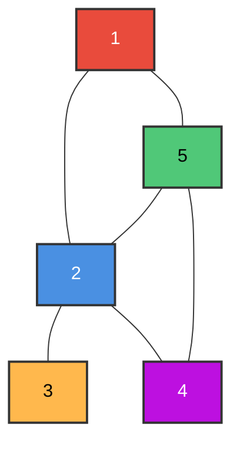

**Real-World Examples:**
- 🗺️ Road networks (cities = vertices, roads = edges)
- 🌐 Social networks (people = vertices, friendships = edges)
- ✈️ Airline routes (airports = vertices, flights = edges)
- 💻 Computer networks (devices = vertices, connections = edges)
- 📦 Dependency graphs (tasks = vertices, dependencies = edges)

### Why Graphs?

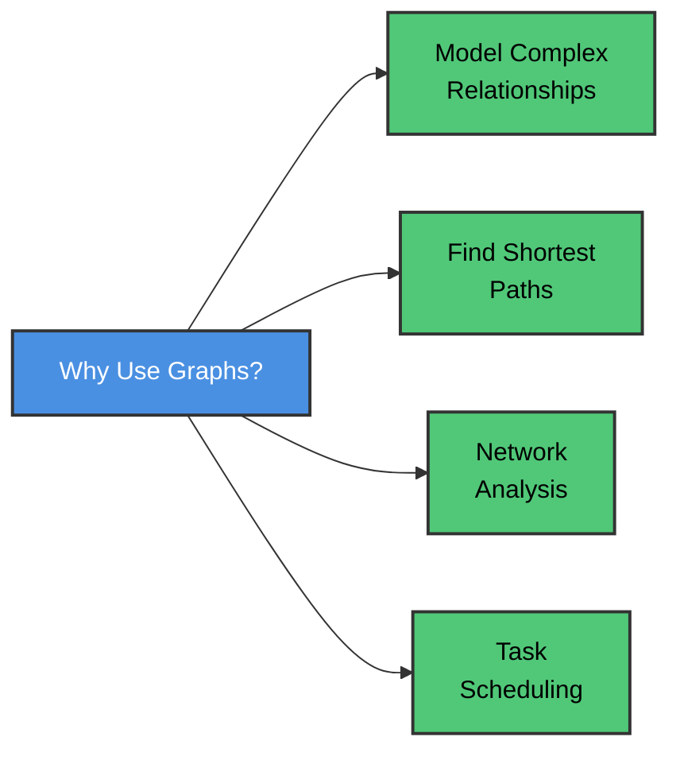

### Formal Definition

If G denotes a graph, then **G = (V, E)** where:
- **V** = Set of vertices: V = {v₁, v₂, v₃, …, vₙ}
- **E** = Set of edges: E = {e₁, e₂, e₃, …, eₘ}, where eᵢ = (vᵢ, vⱼ) connects two vertices

---

## Graph Theory Terminology

### Graphs and Multigraphs

A **graph G** consists of:
1. A set **V** of elements called **nodes** (or points or vertices)
2. A set **E** of **edges** such that each edge e in E is identified with a unique (unordered) pair [u, v] of nodes in V

| Term | Definition | Example |
|------|------------|---------|
| **Vertex (Node)** | A point in the graph that holds data | Cities in a map |
| **Edge** | A line connecting two vertices | Roads between cities |
| **Adjacent Nodes** | Two nodes connected by an edge | Neighbors |
| **Degree** | Number of edges connected to a node, deg(u) | deg(A) = 3 means A has 3 edges |
| **Isolated Node** | A node with degree 0 (no edges) | A disconnected city |
| **Path** | A sequence of vertices where each successive pair is connected by an edge | Route from A to D |
| **Simple Path** | A path where all nodes are distinct | No revisiting nodes |
| **Cycle** | A closed simple path (first vertex = last vertex) with length ≥ 3 | A → B → C → A |
| **Connected Graph** | A graph where there is a path between any two nodes | All cities reachable |
| **Complete Graph** | Every node is adjacent to every other node; has n(n-1)/2 edges | Everyone knows everyone |
| **Tree** | A connected graph without cycles | Has m-1 edges for m nodes |

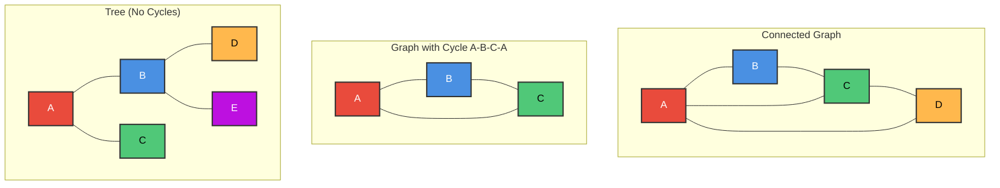

### Multigraphs

The definition of a graph may be generalized by permitting:
1. **Multiple edges** — Distinct edges connecting the same pair of endpoints
2. **Loops** — An edge whose both endpoints are the same node, e = [u, u]

Such a generalization is called a **multigraph**.

> **Key Point:** A standard graph does NOT allow multiple edges or loops. A multigraph does.

### Types of Graphs

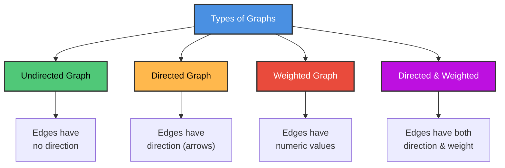

#### Undirected Graph

If each edge of a graph is **undirected** (without direction), the graph is called an **undirected graph**. The edge [u, v] is the same as [v, u].

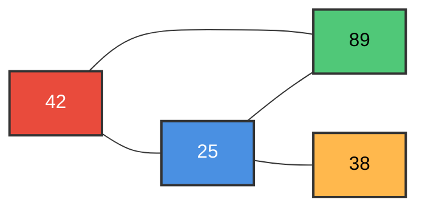

#### Directed Graph (Digraph)

If each edge of a graph is **directed** (with direction), the graph is called a **directed graph** or **digraph**. Edge (u, v) is different from (v, u).

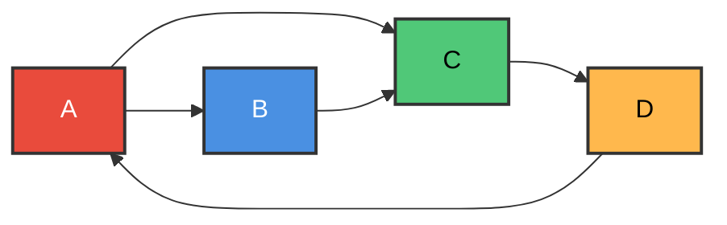

**Directed Graph Terminology:**

| Term | Definition |
|------|-----------|
| **Origin/Initial Point** | The starting node of a directed edge |
| **Destination/Terminal Point** | The ending node of a directed edge |
| **Outdegree** | Number of edges beginning at a node, outdeg(u) |
| **Indegree** | Number of edges ending at a node, indeg(u) |
| **Source** | A node with positive outdegree but zero indegree |
| **Sink** | A node with zero outdegree but positive indegree |
| **Strongly Connected** | For every pair u, v — there is a path from u to v AND from v to u |
| **Unilaterally Connected** | For every pair u, v — there is a path from u to v OR from v to u |

#### Weighted Graph

If each edge is assigned a nonnegative numerical value (cost/weight/length), the graph is called a **weighted graph**.

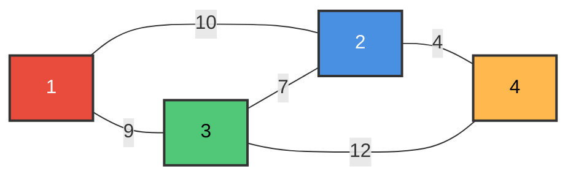

> **Note:** In a weighted graph, the **weight of a path** is the sum of the weights of all edges along that path. A shorter path (fewer edges) does NOT always mean a lighter path (lower total weight).

### Directed Graphs

A **directed graph G** (also called digraph) is a graph where each edge e is assigned a direction, identified with an **ordered pair** (u, v).

**Example:** Consider a directed graph with 4 nodes and 7 directed edges:

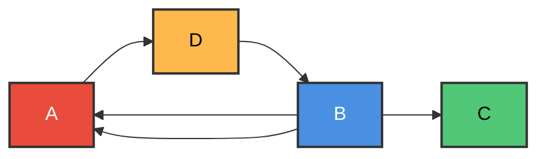

> **Important:** In directed graphs, paths must follow edge directions. A sequence (D, C, B, A) is NOT a path if (C, B) is not an edge — the direction matters!

---

## Graph Representation

A graph can be stored in computer memory mainly in two ways:

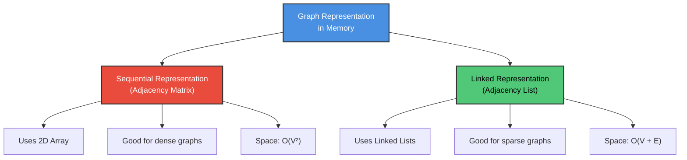

### Adjacency Matrix

The **adjacency matrix** A of a graph G with m nodes is an m × m matrix defined as:

$$a_{ij} = \begin{cases} 1 & \text{if there is an edge between vertices } i \text{ and } j \\ 0 & \text{otherwise} \end{cases}$$

In case of **weighted graphs**, we put the edge weight instead of 1, and ∞ where there is no edge.

#### Undirected Graph — Adjacency Matrix

For undirected graphs, the adjacency matrix is **symmetric**: $a_{ij} = a_{ji}$, i.e., $A = A^T$

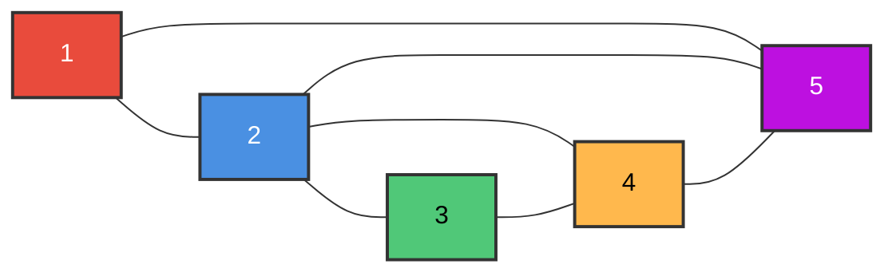

|   | 1 | 2 | 3 | 4 | 5 |
|---|---|---|---|---|---|
| **1** | 0 | 1 | 0 | 0 | 1 |
| **2** | 1 | 0 | 1 | 1 | 1 |
| **3** | 0 | 1 | 0 | 1 | 0 |
| **4** | 0 | 1 | 1 | 0 | 1 |
| **5** | 1 | 1 | 0 | 1 | 0 |

#### Weighted Undirected Graph — Adjacency Matrix

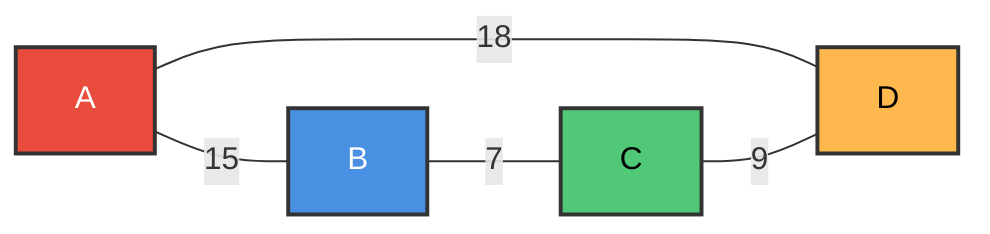

|   | A | B | C | D |
|---|---|---|---|---|
| **A** | 0 | 15 | 0 | 18 |
| **B** | 15 | 0 | 7 | 0 |
| **C** | 0 | 7 | 0 | 9 |
| **D** | 18 | 0 | 9 | 0 |

#### Directed and Weighted Graph — Adjacency Matrix

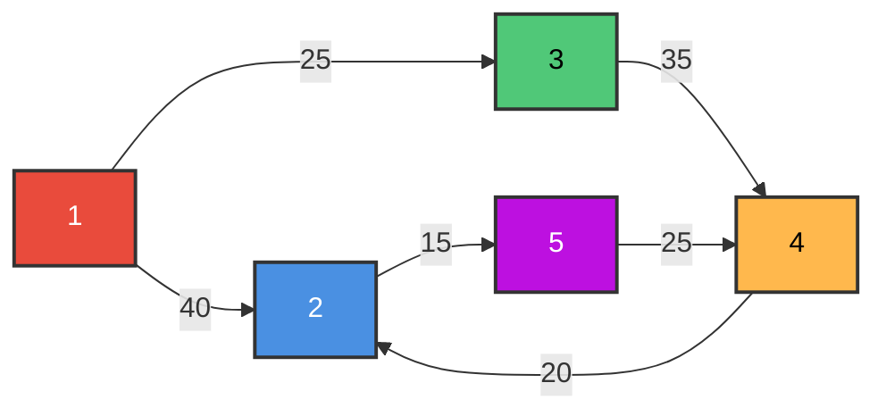

|   | 1 | 2 | 3 | 4 | 5 |
|---|---|---|---|---|---|
| **1** | ∞ | 40 | 25 | ∞ | ∞ |
| **2** | ∞ | ∞ | ∞ | ∞ | 15 |
| **3** | ∞ | ∞ | ∞ | 35 | ∞ |
| **4** | ∞ | 20 | ∞ | ∞ | ∞ |
| **5** | ∞ | ∞ | ∞ | 25 | ∞ |

#### Powers of the Adjacency Matrix

Let A be the adjacency matrix of a graph G. Then:

> **Proposition 8.2:** $a_K(i, j)$, the ij entry in the matrix $A^K$, gives the **number of paths of length K** from $v_i$ to $v_j$.

The matrix $B_r = A + A^2 + A^3 + \cdots + A^r$ gives the number of paths of length r or less from node $v_i$ to $v_j$ in the ij entry.

### Adjacency List

An **adjacency list** representation uses an array of V lists, one for each vertex. Each list Adj[u] contains all the vertices v such that there is an edge between u and v.

- Can be used for both directed and undirected graphs
- More space-efficient than adjacency matrix for sparse graphs


**Adjacency Lists:**

| Vertex | Adjacent Vertices |
|--------|------------------|
| 1 | 2 → 5 → / |
| 2 | 1 → 3 → 4 → 5 → / |
| 3 | 2 → 4 → / |
| 4 | 2 → 3 → 5 → / |
| 5 | 1 → 2 → 4 → / |

#### Adjacency Matrix vs Adjacency List

| Feature | Adjacency Matrix | Adjacency List |
|---------|-----------------|----------------|
| **Space** | O(V²) | O(V + E) |
| **Check if edge exists** | O(1) | O(degree) |
| **Find all neighbors** | O(V) | O(degree) |
| **Insert/Delete edge** | O(1) | O(degree) |
| **Best for** | Dense graphs | Sparse graphs |

#### Algorithm to Create Adjacency List

```
1. Input a graph (information of graph) and take a variable, item.
2. Declare vertex (node) and table of vertices:
   i)  struct vertex { char data; vertex *next; }
   ii) vertex table[1, …, m], *nptr, *tptr;
3. Set i = 1
4. Create a table of vertices:
   table[i].data = item;
   table[i].next = NULL;
5. Create a vertex (node) with value:
   nptr = new(vertex);
   nptr → data = item;
   nptr → next = NULL;
6. if (table[i].next == NULL), then
       table[i].next = nptr;
   else {
       tptr = table[i].next
       while (tptr → next != NULL) { tptr = tptr → next; }
       tptr → next = nptr;
   }
7. Set i = i + 1;
8. Repeat step 4 to 7 for necessary times
9. Output a linked adjacency list.
```

---

## Path Matrix and Warshall's Algorithm

### Path Matrix

The **path matrix** (or reachability matrix) P of a graph G with m nodes is defined as:

$$p_{ij} = \begin{cases} 1 & \text{if there is a path from } v_i \text{ to } v_j \\ 0 & \text{otherwise} \end{cases}$$

> **Proposition 8.3:** $p_{ij} = 1$ if and only if there is a nonzero entry in the ij position of $B_m = A + A^2 + A^3 + \cdots + A^m$

**Key Facts:**
- A directed graph G is **strongly connected** if and only if the path matrix P has **no zero entries**
- The **transitive closure** of G is the graph G' with the same nodes where (vᵢ, vⱼ) is an edge whenever there is a path from vᵢ to vⱼ in G. The path matrix P is precisely the adjacency matrix of the transitive closure.

### Warshall's Algorithm

Warshall's algorithm efficiently finds the **path matrix** P of a directed graph G, without computing powers of the adjacency matrix.

**Key Idea:** Define m-square Boolean matrices $P_0, P_1, \ldots, P_m$:
- $P_0 = A$ (the adjacency matrix)
- $P_m = P$ (the path matrix)
- $P_k[i, j] = 1$ if there is a simple path from $v_i$ to $v_j$ using no other nodes except possibly $v_1, v_2, \ldots, v_k$

**Update Rule:**

$$P_k[i, j] = P_{k-1}[i, j] \lor (P_{k-1}[i, k] \land P_{k-1}[k, j])$$

#### Algorithm 8.1: Warshall's Algorithm

```
Input:  A directed graph G with M nodes, maintained by adjacency matrix A
Output: The (Boolean) path matrix P

1. Repeat for I, J = 1, 2, ..., M:       [Initializes P]
       If A[I, J] = 0, then: Set P[I, J] := 0;
       Else: Set P[I, J] := 1.
   [End of loop.]

2. Repeat Steps 3 and 4 for K = 1, 2, ..., M:   [Updates P]

3.     Repeat Step 4 for I = 1, 2, ..., M:

4.         Repeat for J = 1, 2, ..., M:
               Set P[I, J] := P[I, J] ∨ (P[I, K] ∧ P[K, J]).
           [End of loop.]
       [End of Step 3 loop.]
   [End of Step 2 loop.]

5. Exit.
```

### Shortest-Path Algorithm

For a **weighted** directed graph, the weight matrix W is defined as:

$$w_{ij} = \begin{cases} w(e) & \text{if there is an edge } e \text{ from } v_i \text{ to } v_j \\ 0 & \text{if there is no edge from } v_i \text{ to } v_j \end{cases}$$

The Shortest-Path Algorithm (a modification of Warshall's algorithm) finds a matrix Q where $q_{ij}$ = length of the shortest path from $v_i$ to $v_j$.

**Update Rule:**

$$Q_k[i, j] = \text{MIN}(Q_{k-1}[i, j],\; Q_{k-1}[i, k] + Q_{k-1}[k, j])$$

#### Algorithm 8.2: Shortest-Path Algorithm

```
Input:  A weighted graph G with M nodes, maintained by weight matrix W
Output: Matrix Q where Q[I, J] = length of shortest path from Vᵢ to Vⱼ

1. Repeat for I, J = 1, 2, ..., M:       [Initializes Q]
       If W[I, J] = 0, then: Set Q[I, J] := INFINITY;
       Else: Set Q[I, J] := W[I, J].
   [End of loop.]

2. Repeat Steps 3 and 4 for K = 1, 2, ..., M:   [Updates Q]

3.     Repeat Step 4 for I = 1, 2, ..., M:

4.         Repeat for J = 1, 2, ..., M:
               Set Q[I, J] := MIN(Q[I, J], Q[I, K] + Q[K, J]).
           [End of loop.]
       [End of Step 3 loop.]
   [End of Step 2 loop.]

5. Exit.
```

#### Example: Shortest Path

Consider a weighted graph with nodes R, S, T, U (where v₁ = R, v₂ = S, v₃ = T, v₄ = U):

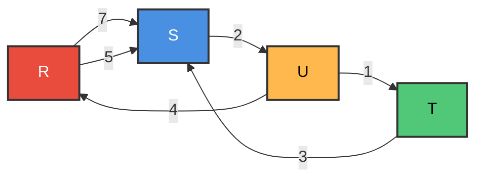

**Weight Matrix W:**

|   | R | S | T | U |
|---|---|---|---|---|
| **R** | 0 | 5 | 0 | 0 |
| **S** | 7 | 0 | 0 | 2 |
| **T** | 0 | 3 | 0 | 0 |
| **U** | 4 | 0 | 1 | 0 |

After applying the algorithm, the final matrix Q gives shortest path lengths between all pairs of nodes.

> **Note:** Algorithm 8.2 is very similar to Algorithm 8.1 — the difference is using **MIN and +** instead of **OR and AND**.

---

## Linked Representation of a Graph

The adjacency matrix has drawbacks: it's hard to insert/delete nodes and wastes space for sparse graphs. The **linked representation** (adjacency structure) is often used instead.

### Structure

The linked representation contains two lists:

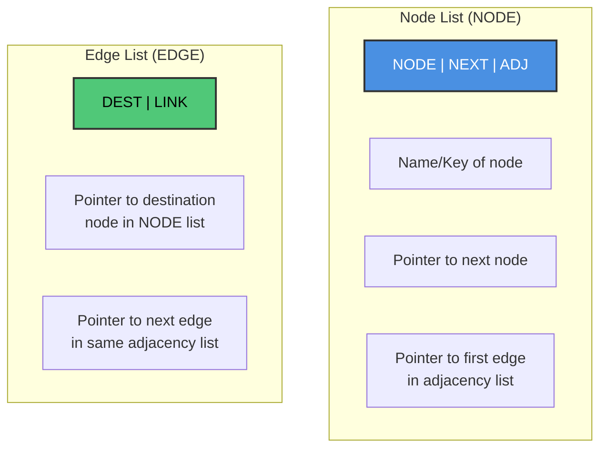

**(a) Node List:** Each element corresponds to a node in G:

| Field | Description |
|-------|-------------|
| **NODE** | Name or key value of the node |
| **NEXT** | Pointer to the next node in the list |
| **ADJ** | Pointer to the first element in the adjacency list (in EDGE list) |

**(b) Edge List:** Each element corresponds to an edge of G:

| Field | Description |
|-------|-------------|
| **DEST** | Points to the location in NODE list of the destination node |
| **LINK** | Links together edges with the same initial node |

The complete linked representation is denoted by:

```
GRAPH(NODE, NEXT, ADJ, START, AVAILN, DEST, LINK, AVAILE)
```

### Example

Consider the graph:

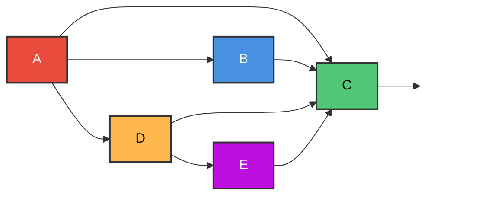

**Adjacency Lists:**

| Node | Adjacency List |
|------|---------------|
| A | B, C, D |
| B | C |
| C | — |
| D | C, E |
| E | C |

---

## Operations on Graphs

### Searching in a Graph

**Finding a node:** Use a linked list search (Procedure 8.3 — FIND) to locate node N in the NODE list.

**Finding an edge:** To find edge (A, B):
1. Find location LOCA of A in NODE list
2. Find location LOCB of B in NODE list
3. Search the successor list of A for LOCB

### Inserting in a Graph

**Insert a Node (Procedure 8.6):**
```
1. [OVERFLOW?] If AVAILN = NULL, then: Set FLAG := FALSE, and Return.
2. Set ADJ[AVAILN] := NULL.
3. Set NEW := AVAILN and AVAILN := NEXT[AVAILN]
4. Set NODE[NEW] := N, NEXT[NEW] := START and START := NEW.
5. Set FLAG := TRUE, and Return.
```

**Insert an Edge (Procedure 8.7):**
```
1. Call FIND(NODE, NEXT, START, A, LOCA).
2. Call FIND(NODE, NEXT, START, B, LOCB).
3. [OVERFLOW?] If AVAILE = NULL, then: Set FLAG := FALSE, and Return.
4. Set NEW := AVAILE and AVAILE := LINK[AVAILE].
5. Set DEST[NEW] := LOCB, LINK[NEW] := ADJ[LOCA] and ADJ[LOCA] := NEW.
6. Set FLAG := TRUE, and Return.
```

### Deleting from a Graph

**Delete an Edge (Procedure 8.8):**
```
1. Call FIND(NODE, NEXT, START, A, LOCA).    [Locates node A]
2. Call FIND(NODE, NEXT, START, B, LOCB).    [Locates node B]
3. Call DELETE(DEST, LINK, ADJ[LOCA], AVAILE, LOCB, FLAG).
4. Return.
```

**Delete a Node (Procedure 8.9):** This is more complex — we must:
1. Find the location LOC of node N
2. Delete all edges ending at N (remove LOC from every node's successor list)
3. Delete all edges beginning at N (free the successor list of N)
4. Delete N itself from the NODE list

---

## Graph Traversal Methods

There are two principal methods for systematically examining all nodes and edges of a graph:

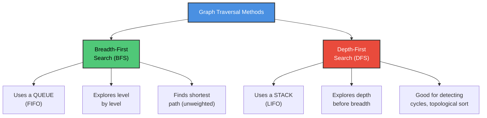

**Node Status during Traversal:**

| STATUS | State | Description |
|--------|-------|-------------|
| 1 | Ready | Initial state of the node |
| 2 | Waiting | Node is on the queue/stack, waiting to be processed |
| 3 | Processed | Node has been processed |

### Example Graph for Traversal

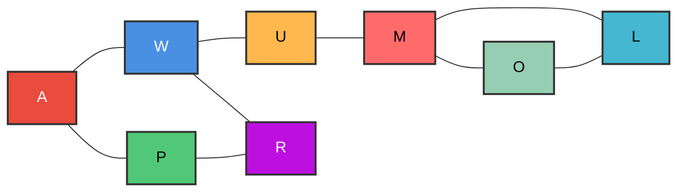

### Breadth-First Search (BFS)

**How it works:**
1. Visit a starting vertex and add its adjacent vertices to a **queue**
2. Remove a vertex from the front of the queue, visit it, and add its unvisited adjacent vertices to the queue
3. Repeat until the queue is empty

> **Remember:** A queue is a FIFO (First-In First-Out) structure.

#### BFS Algorithm

```
1. Initialize all nodes to the ready state (STATUS = 1).
2. Put the starting node A in QUEUE and change its status to 
   the waiting state (STATUS = 2).
3. Repeat Steps 4 and 5 until QUEUE is empty:
4.     Remove the front node N of QUEUE. Process N and change 
       the status of N to the processed state (STATUS = 3).
5.     Add to the rear of QUEUE all the neighbors of N that are 
       in the ready state (STATUS = 1), and change their status 
       to the waiting state (STATUS = 2).
   [End of Step 3 loop.]
6. Exit.
```

#### BFS Example — Step by Step

Starting from node **A** on the example graph:

| Step | Vertex Processed | Vertices Visited | Queue (front → rear) |
|------|-----------------|------------------|---------------------|
| 1 | A | A, W, P | W, P |
| 2 | W | A, W, P, U, R | P, U, R |
| 3 | P | A, W, P, U, R | U, R |
| 4 | U | A, W, P, U, R, M | R, M |  
| 5 | R | A, W, P, U, R, M | M |
| 6 | O | A, W, P, U, R, O, L | L, M |
| 7 | L | A, W, P, U, R, O, L, M | M |
| 8 | M | A, W, P, U, R, O, L, M | ∅ |

**BFS Traversal Order:** A → W → P → U → R → O → L → M

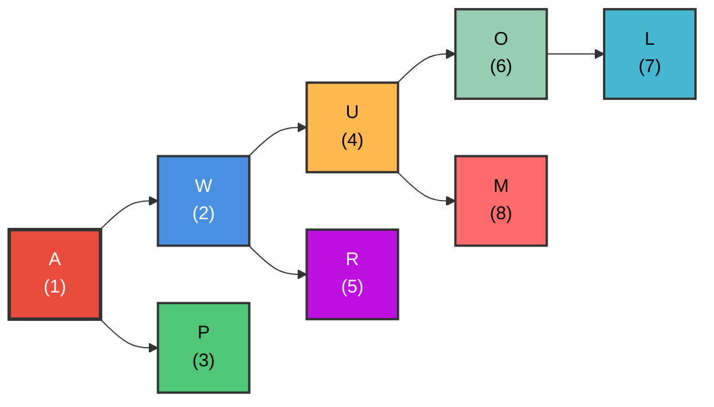

### Depth-First Search (DFS)

**How it works:**
1. Visit a starting vertex and push its adjacent vertices onto a **stack**
2. Pop a vertex from the top of the stack, visit it, and push its unvisited adjacent vertices onto the stack
3. Repeat until the stack is empty

> **Remember:** A stack is a LIFO (Last-In First-Out) structure.

#### DFS Algorithm

```
1. Initialize all nodes to the ready state (STATUS = 1).
2. Push the starting node A onto STACK and change its status to 
   the waiting state (STATUS = 2).
3. Repeat Steps 4 and 5 until STACK is empty:
4.     Pop the top node N of STACK. Process N and change its 
       status to the processed state (STATUS = 3).
5.     Push onto STACK all the neighbors of N that are still in 
       the ready state (STATUS = 1), and change their status to 
       the waiting state (STATUS = 2).
   [End of Step 3 loop.]
6. Exit.
```

#### DFS Example — Step by Step

Starting from node **A** on the example graph:

| Step | Vertex Processed | Vertices Visited | Stack (top →) |
|------|-----------------|------------------|---------------|
| 1 | A | A, P, W | P, W |
| 2 | W | A, P, W, R, U | P, R, U |
| 3 | U | A, P, W, R, U, M | P, R, M |
| 4 | M | A, P, W, R, U, M, L, O | P, R, L, O |
| 5 | O | A, P, W, R, U, M, L, O | P, R, L |
| 6 | L | A, P, W, R, U, M, L, O | P, R |
| 7 | R | A, P, W, R, U, M, L, O | P |
| 8 | P | A, P, W, R, U, M, L, O | ∅ |

**DFS Traversal Order:** A → W → U → M → O → L → R → P

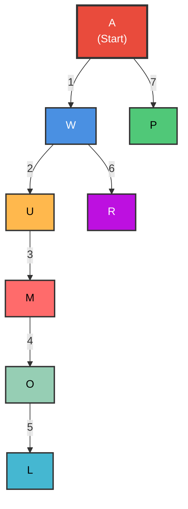

### BFS vs DFS Comparison

| Feature | BFS | DFS |
|---------|-----|-----|
| **Data Structure** | Queue (FIFO) | Stack (LIFO) |
| **Exploration** | Level by level (breadth) | As deep as possible first |
| **Shortest Path** | Yes (unweighted) | Not guaranteed |
| **Memory** | More (stores all nodes at current level) | Less (stores nodes on current path) |
| **Use Cases** | Shortest path, nearest neighbor | Cycle detection, topological sort |

---

## Minimum Spanning Trees

### What is a Spanning Tree?

A **spanning tree** of a graph G is a subgraph which:
- Is a **tree** (connected, no cycles)
- Contains **all vertices** of G
- Has exactly **V - 1 edges** (where V is the number of vertices)

### What is a Minimum Spanning Tree (MST)?

A **minimum spanning tree** is a spanning tree whose **total edge weight is minimum**.

$$w(T) = \sum_{(u,v) \in T} w(u,v)$$

```mermaid
graph TD
    subgraph "Graph"
        A1["A"] ---|6| B1["B"]
        A1 ---|12| C1["C"]
        B1 ---|8| C1
    end
    
    subgraph "Spanning Tree 1: w=20"
        A2["A"] ---|8| B2["B"]
        A2 ---|12| C2["C"]
    end
    
    subgraph "Spanning Tree 2: w=18"
        A3["A"] ---|6| B3["B"]
        A3 ---|12| C3["C"]
    end
    
    subgraph "MST: w=14 ✓"
        A4["A"] ---|6| B4["B"]
        B4 ---|8| C4["C"]
    end
    
    style A1 fill:#4A90E2,stroke:#333,stroke-width:2px,color:#fff
    style B1 fill:#4A90E2,stroke:#333,stroke-width:2px,color:#fff
    style C1 fill:#4A90E2,stroke:#333,stroke-width:2px,color:#fff
    style A4 fill:#50C878,stroke:#333,stroke-width:3px,color:#000
    style B4 fill:#50C878,stroke:#333,stroke-width:3px,color:#000
    style C4 fill:#50C878,stroke:#333,stroke-width:3px,color:#000
```

### Basic Rules for MST Construction

1. **Delete loops** from the graph
2. **Delete parallel edges** (keep only the one with minimum weight)
3. **Avoid cycles** during construction

### Two MST Algorithms

```mermaid
graph TD
    A["MST Algorithms"] --> B["Prim's Algorithm"]
    A --> C["Kruskal's Algorithm"]
    
    B --> B1["Grows a single tree<br/>by adding nearest vertex"]
    B --> B2["Start from any vertex"]
    B --> B3["Add minimum weight edge<br/>connecting tree to non-tree vertex"]
    
    C --> C1["Grows a forest<br/>by adding shortest edge"]
    C --> C2["Sort all edges by weight"]
    C --> C3["Add edges in order<br/>if they don't create a cycle"]
    
    style A fill:#4A90E2,stroke:#333,stroke-width:2px,color:#fff
    style B fill:#50C878,stroke:#333,stroke-width:2px,color:#000
    style C fill:#E94B3C,stroke:#333,stroke-width:2px,color:#fff
```

### Prim's Algorithm

**Idea:** Start from any vertex. At each step, add the **minimum weight edge** that connects a vertex in the tree to a vertex NOT in the tree.

#### Algorithm 8.4: Prim's Algorithm

```
Input:  A weighted connected graph, G = (V, E)
Output: Edge list of the minimum spanning tree, ET

1. Create an empty list ET
2. Create a list VT which will initially contain the 
   starting vertex, i.e., VT = { v₀ }
3. For each vertex i of G do
   {
       Find a minimum-weight edge e' = (v', u') among all 
       edges (v, u) such that v is in VT and u is in V - VT.
       VT = VT ∪ {u'};
       ET = ET ∪ {e'};
   }
4. Output edge list of the spanning tree, ET.
```

#### Prim's Algorithm — Example

Consider the weighted graph:

```mermaid
graph LR
    V1["V1"] ---|5| V2["V2"]
    V1 ---|3| V3["V3"]
    V1 ---|7| V4["V4"]
    V2 ---|10| V3
    V3 ---|6| V4
    V3 ---|3| V5["V5"]
    V3 ---|2| V6["V6"]
    V4 ---|7| V5
    V5 ---|2| V7["V7"]
    V5 ---|5| V8["V8"]
    V6 ---|5| V7
    V6 ---|4| V8
    V7 ---|6| V8
    
    style V1 fill:#E94B3C,stroke:#333,stroke-width:2px,color:#fff
    style V2 fill:#4A90E2,stroke:#333,stroke-width:2px,color:#fff
    style V3 fill:#50C878,stroke:#333,stroke-width:2px,color:#000
    style V4 fill:#FFB84D,stroke:#333,stroke-width:2px,color:#000
    style V5 fill:#BD10E0,stroke:#333,stroke-width:2px,color:#fff
    style V6 fill:#FF6B6B,stroke:#333,stroke-width:2px,color:#000
    style V7 fill:#45B7D1,stroke:#333,stroke-width:2px,color:#000
    style V8 fill:#96CEB4,stroke:#333,stroke-width:2px,color:#000
```

**Step-by-step Execution (starting from V3):**

| Step | VT (Vertices in Tree) | Edge Added | Weight |
|------|----------------------|------------|--------|
| Init | {V3} | — | — |
| 1 | {V3, V6} | (V3, V6) | 2 |
| 2 | {V3, V6, V5} | (V3, V5) | 3 |
| 3 | {V3, V6, V5, V1} | (V3, V1) | 3 |
| 4 | {V3, V6, V5, V1, V7} | (V5, V7) | 2 |
| 5 | {V3, V6, V5, V1, V7, V8} | (V6, V8) | 4 |
| 6 | {V3, V6, V5, V1, V7, V8, V2} | (V1, V2) | 5 |
| 7 | {V3, V6, V5, V1, V7, V8, V2, V4} | (V3, V4) | 6 |

**Total MST Weight = 2 + 3 + 3 + 2 + 4 + 5 + 6 = 25**

### Kruskal's Algorithm

**Idea:** Sort all edges by weight. Add edges one by one in order of increasing weight, **skipping any edge that would create a cycle**.

#### Algorithm 8.5: Kruskal's Algorithm

```
Input:  A weighted connected graph, G = (V, E)
Output: Edge list of the minimum spanning tree, ET

1. Create an empty list ET
2. Sort E in nondecreasing order of edge weights:
   w(eᵢ₁) ≤ w(eᵢ₂) ≤ … ≤ w(eᵢ|E|)
3. Set ecounter = 0; k = 0;
4. while (ecounter < number of vertices - 1)
   {
       k = k + 1;
       if (ET ∪ { eᵢₖ } is acyclic)
           ET = ET ∪ { eᵢₖ };
           ecounter = ecounter + 1;
   }
5. Output edge list of the spanning tree ET.
```

#### Kruskal's Algorithm — Example

Using the same weighted graph as above:

| Step | Edge Considered | Weight | Action | Reason |
|------|----------------|--------|--------|--------|
| 1 | (V3, V6) | 2 | **Add** | No cycle |
| 2 | (V5, V7) | 2 | **Add** | No cycle |
| 3 | (V1, V3) | 3 | **Add** | No cycle |
| 4 | (V3, V5) | 3 | **Add** | No cycle |
| 5 | (V6, V8) | 4 | **Add** | No cycle |
| 6 | (V1, V2) | 5 | **Add** | No cycle |
| 7 | (V6, V7) | 5 | **Skip** | Creates cycle V3-V6-V7-V5-V3 |
| 8 | (V5, V8) | 5 | **Skip** | Creates cycle V5-V8-V6-V3-V5 |
| 9 | (V3, V4) | 6 | **Add** | No cycle; 7 edges found → STOP |

**Total MST Weight = 2 + 2 + 3 + 3 + 4 + 5 + 6 = 25** (Same result as Prim's!)

### Prim's vs Kruskal's

| Feature | Prim's Algorithm | Kruskal's Algorithm |
|---------|-----------------|-------------------|
| **Approach** | Grows one tree | Grows a forest |
| **Strategy** | Add nearest vertex to tree | Add shortest edge overall |
| **Requires sorting?** | No | Yes (sort all edges) |
| **Better for** | Dense graphs | Sparse graphs |
| **Time Complexity** | O(V²) or O(E log V) with heap | O(E log E) |

---

## Topological Sorting

### What is Topological Sorting?

A **topological sort** T of a directed graph S without cycles (a **DAG** — Directed Acyclic Graph) is a **linear ordering** of the nodes that preserves the original partial ordering:

> If u < v in S (i.e., there is a path from u to v), then u comes before v in T.

### Partially Ordered Sets (Posets)

A graph S without cycles defines a **partial ordering** < with these properties:

| Property | Definition |
|----------|-----------|
| **Irreflexivity** | For each element u: u ≮ u |
| **Asymmetry** | If u < v, then v ≮ u |
| **Transitivity** | If u < v and v < w, then u < w |

### Example Graph for Topological Sort

```mermaid
graph LR
    G["G"] --> A["A"]
    G --> F["F"]
    A --> C["C"]
    B["B"] --> D["D"]
    B --> F
    D --> C
    E["E"] --> C
    F --> |  | X[" "]
    
    style G fill:#E94B3C,stroke:#333,stroke-width:2px,color:#fff
    style A fill:#4A90E2,stroke:#333,stroke-width:2px,color:#fff
    style B fill:#50C878,stroke:#333,stroke-width:2px,color:#000
    style C fill:#FFB84D,stroke:#333,stroke-width:2px,color:#000
    style D fill:#BD10E0,stroke:#333,stroke-width:2px,color:#fff
    style E fill:#FF6B6B,stroke:#333,stroke-width:2px,color:#000
    style F fill:#45B7D1,stroke:#333,stroke-width:2px,color:#000
    style X fill:none,stroke:none
```

**Adjacency Lists:**

| Node | Successors |
|------|-----------|
| A | C |
| B | D, F |
| C | — |
| D | C |
| E | C |
| F | — |
| G | A, F |

### Algorithm C: Topological Sort

**Key Idea:** Any node with zero indegree (no predecessors) can be chosen as the next element in the sort. Repeatedly:
1. Find a node N with zero indegree
2. Delete N and its edges from the graph

```
1. Find the indegree INDEG(N) of each node N of S.
2. Put in a queue all the nodes with zero indegree.
3. Repeat Steps 4 and 5 until the queue is empty:
4.     Remove the front node N of the queue.
5.     Repeat for each neighbor M of the node N:
           (a) Set INDEG(M) := INDEG(M) - 1.
           (b) If INDEG(M) = 0, then: Add M to the rear of the queue.
       [End of loop.]
   [End of Step 3 loop.]
6. Exit.
```

### Topological Sort — Step by Step Example

**Initial Indegrees:**

| Node | A | B | C | D | E | F | G |
|------|---|---|---|---|---|---|---|
| **INDEG** | 1 | 0 | 3 | 1 | 0 | 2 | 0 |

**Step-by-step Execution:**

| Step | Remove | Update Indegrees | Queue State |
|------|--------|-----------------|-------------|
| Init | — | — | B, E, G |
| 1 | B | INDEG(D)=0, INDEG(F)=1 | E, G, D |
| 2 | E | INDEG(C)=2 | G, D |
| 3 | G | INDEG(A)=0, INDEG(F)=0 | D, A, F |
| 4 | D | INDEG(C)=1 | A, F |
| 5 | A | INDEG(C)=0 | F, C |
| 6 | F | (no neighbors) | C |
| 7 | C | (no neighbors) | ∅ |

**Topological Sort Result: B → E → G → D → A → F → C**

```mermaid
graph LR
    B["B"] --> E["E"]
    E --> G["G"]
    G --> D["D"]
    D --> A["A"]
    A --> F["F"]
    F --> C["C"]
    
    style B fill:#50C878,stroke:#333,stroke-width:3px,color:#000
    style E fill:#FF6B6B,stroke:#333,stroke-width:2px,color:#000
    style G fill:#E94B3C,stroke:#333,stroke-width:2px,color:#fff
    style D fill:#BD10E0,stroke:#333,stroke-width:2px,color:#fff
    style A fill:#4A90E2,stroke:#333,stroke-width:2px,color:#fff
    style F fill:#45B7D1,stroke:#333,stroke-width:2px,color:#000
    style C fill:#FFB84D,stroke:#333,stroke-width:2px,color:#000
```

> **Note:** A topological sort is NOT unique. Another valid sort for the same graph could be: **G → B → A → D → E → F → C**

### Applications of Topological Sorting

- 📋 **Task Scheduling** — Determine the order to execute tasks with dependencies
- 📦 **Build Systems** — Compile source files in the correct dependency order
- 📚 **Course Prerequisites** — Plan which courses to take first
- 🔧 **Package Management** — Install software dependencies in order

---

## Summary

| Concept | Key Points |
|---------|-----------|
| **Graph** | Set of vertices V and edges E; G = (V, E) |
| **Types** | Undirected, Directed, Weighted, Directed & Weighted |
| **Adjacency Matrix** | V×V matrix; O(V²) space; good for dense graphs |
| **Adjacency List** | Array of linked lists; O(V+E) space; good for sparse graphs |
| **Warshall's Algorithm** | Finds path matrix (reachability); uses Boolean operations |
| **Shortest Path** | Modified Warshall's; uses MIN and + operations |
| **BFS** | Uses queue; explores level by level; finds shortest path |
| **DFS** | Uses stack; explores depth first; good for cycle detection |
| **Spanning Tree** | Subgraph connecting all vertices with no cycles; V-1 edges |
| **Prim's Algorithm** | Grows one tree; adds nearest vertex; good for dense graphs |
| **Kruskal's Algorithm** | Grows forest; adds shortest edge; good for sparse graphs |
| **Topological Sort** | Linear ordering of DAG preserving partial order; uses indegree |
