# Chapter 9: Sorting and Searching    


## Table of Contents

1. [Introduction to Sorting](#introduction-to-sorting)
2. [Types of Sorting](#types-of-sorting)
3. [Classes of Internal Sorting](#classes-of-internal-sorting)
4. [Selection Sort](#selection-sort)
5. [Insertion Sort](#insertion-sort)
6. [Merge Sort](#merge-sort)
7. [Quick Sort](#quick-sort)
8. [Summary of Internal Sorting Complexities](#summary-of-internal-sorting-complexities)
9. [External Sorting](#external-sorting)
10. [Introduction to Searching](#introduction-to-searching)
11. [Linear Searching](#linear-searching)
12. [Binary Searching](#binary-searching)
13. [Summary of Searching Complexities](#summary-of-searching-complexities)
14. [Overall Summary](#overall-summary)

---

## Introduction to Sorting

### What is Sorting?

Sorting means arranging a list of elements (data) in a specific order - either **ascending** (smallest to largest) or **descending** (largest to smallest). Sorting is one of the most fundamental operations in computer science and is used everywhere, from organizing files on your computer to ranking search results.

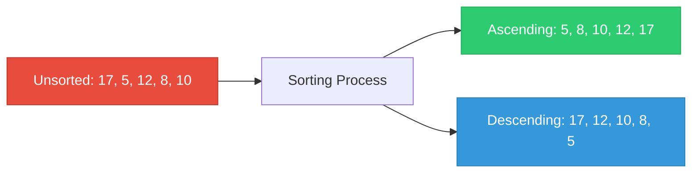

**Why is sorting important?**
- Searching becomes much faster on sorted data (e.g., binary search)
- Data is easier to read and analyze when organized
- Many algorithms require sorted data as input
- Databases use sorting constantly for queries and indexing

---

## Types of Sorting

There are two main types of sorting based on **where the data resides during the sorting process**:

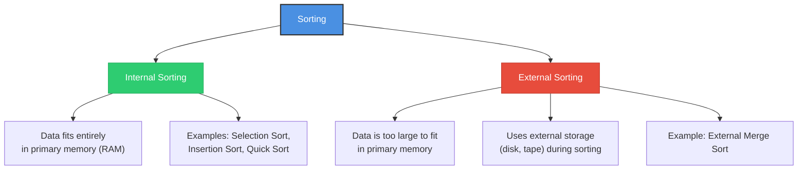

### Internal Sorting

An **internal sorting** algorithm sorts a list of data that is small enough to fit entirely in the computer's **primary (internal) memory** (RAM). Since all the data is in RAM, the algorithm can access any element directly and quickly.

> **Think of it like:** Sorting a deck of cards you hold in your hands - all cards are right there, and you can see and access any card instantly.

### External Sorting

An **external sorting** algorithm sorts a list (file) of data that is **too large to fit entirely in primary memory**. The algorithm must read portions of data from **external memory** (like a hard drive), sort them, and write them back. It repeatedly moves data between internal and external memory.

> **Think of it like:** Sorting thousands of exam papers when your desk can only hold a hundred at a time. You sort small batches on your desk, then combine the sorted batches later.

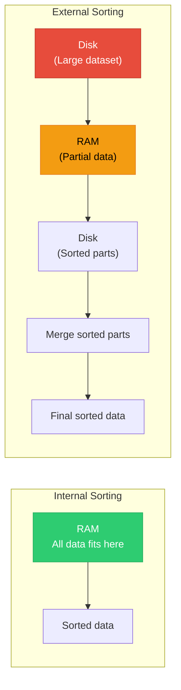

---

## Classes of Internal Sorting

Internal sorting algorithms can be classified into several categories based on their approach:

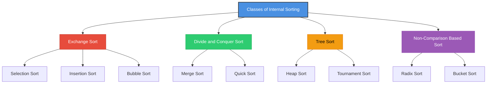

| Class | Algorithms | Basic Idea |
|-------|-----------|------------|
| **Exchange Sort** | Selection, Insertion, Bubble | Compare and swap elements to move them to the correct position |
| **Divide and Conquer** | Merge Sort, Quick Sort | Split the list into smaller parts, sort each part, then combine |
| **Tree Sort** | Heap Sort, Tournament Sort | Use a tree data structure to organize and extract sorted elements |
| **Non-Comparison** | Radix Sort, Bucket Sort | Sort without directly comparing elements; use properties like digit values |

---

## Selection Sort

### How Selection Sort Works

Selection sort works by repeatedly finding the **smallest element** from the unsorted portion of the list and placing it at the beginning of the unsorted portion. After each pass, one more element is in its final sorted position.

**Step-by-step process:**

1. Given a list of data, find the **smallest** element from the entire list. Remember its position.
2. **Swap** the smallest element with the element at the first position.
3. Now the first position is sorted. Repeat the process for the remaining list (positions 2 through n).
4. Continue until the entire list is sorted.

> **Think of it like:** Picking the shortest person from a group, placing them first, then picking the next shortest from the remaining group, and so on.

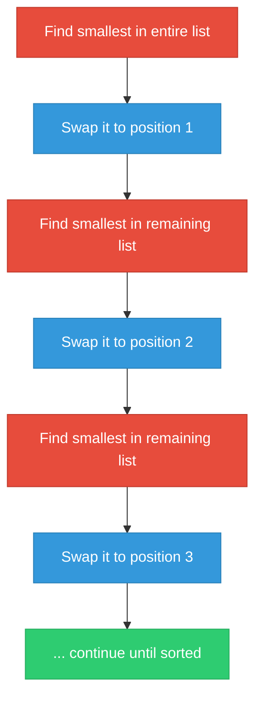

### Pictorial Example of Selection Sort

Sorting the list: **12, 18, 5, 7, 10, 8, 17**

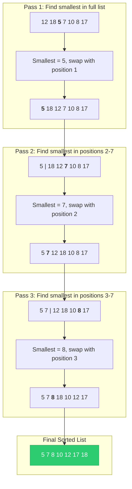

**Detailed trace:**

| Pass | List State | Smallest Found | Action |
|------|-----------|----------------|--------|
| 1 | **12** 18 5 7 10 8 17 | 5 (index 3) | Swap A[1] and A[3] |
| 2 | 5 **18** 12 7 10 8 17 | 7 (index 4) | Swap A[2] and A[4] |
| 3 | 5 7 **12** 18 10 8 17 | 8 (index 6) | Swap A[3] and A[6] |
| 4 | 5 7 8 **18** 10 12 17 | 10 (index 5) | Swap A[4] and A[5] |
| 5 | 5 7 8 10 **18** 12 17 | 12 (index 6) | Swap A[5] and A[6] |
| 6 | 5 7 8 10 12 **17** 18 | 17 (index 6) | No swap needed |
| Result | **5 7 8 10 12 17 18** | -- | Sorted! |

---

### Algorithm for Selection Sort

> **Purpose:** Sort an array A with n elements in ascending order by repeatedly selecting the smallest element.

#### Pseudocode

```
Algorithm: Selection Sort
────────────────────────────
Input: Array A[1...n]

1. for (i = 1 to n - 1)
   {
       small_index = i;

       for (j = i + 1 to n)
       {
           if (A[j] < A[small_index]) then
               small_index = j;
       } // end of inner for

       // Swap A[i] with A[small_index]
       temp = A[i];
       A[i] = A[small_index];
       A[small_index] = temp;

   } // end of outer for

2. Output: Sorted list.
```

#### Visual Flowchart

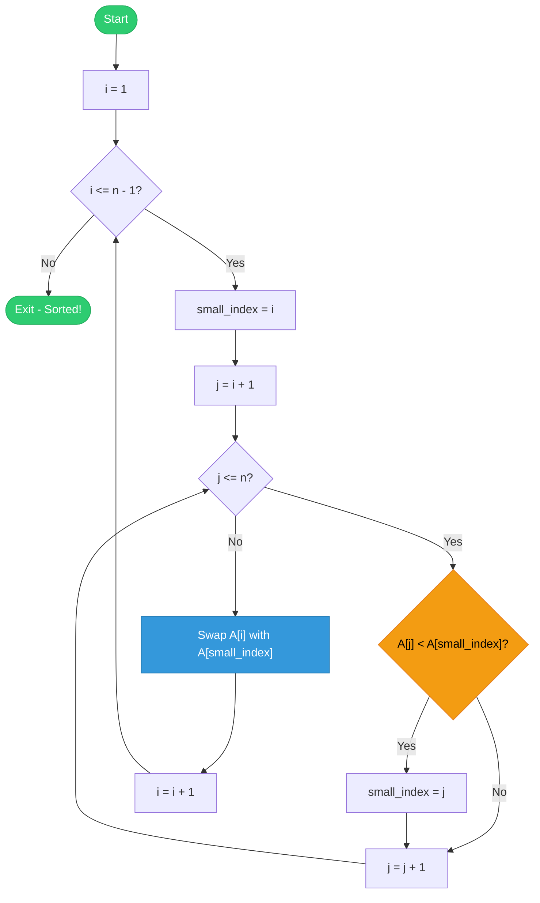

#### How the Algorithm Works (Step-by-Step)

1. **Outer loop** (`i = 1 to n-1`): Controls which position we are filling next.
2. **Set `small_index = i`**: Assume the current position holds the smallest.
3. **Inner loop** (`j = i+1 to n`): Scans the unsorted part to find the actual smallest element.
4. **If `A[j] < A[small_index]`**: Update `small_index` to `j` (we found something smaller).
5. **After inner loop**: Swap `A[i]` with `A[small_index]` to place the smallest in position `i`.
6. **Repeat** until the whole list is sorted.

---

### Complexity of Selection Sort

For each pass, the algorithm compares the current element with all remaining elements:

```
Pass 1: (n - 1) comparisons
Pass 2: (n - 2) comparisons
Pass 3: (n - 3) comparisons
...
Pass (n-1): 1 comparison
```

**Total comparisons:**

```
= (n-1) + (n-2) + (n-3) + ... + 2 + 1
= n(n - 1) / 2
= n²/2 - n/2
```

**Therefore, complexity = O(n²)**

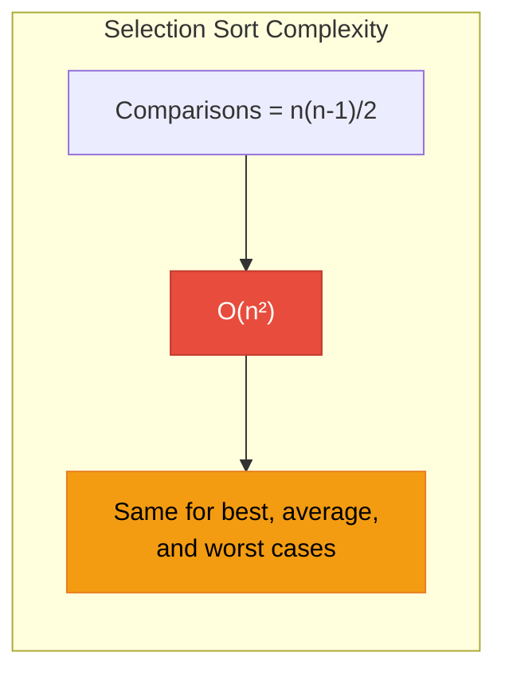

> **Key insight:** Selection sort always performs the same number of comparisons regardless of the input. Even if the array is already sorted, it still checks every element. This makes it **O(n²) in all cases**.

---

## Insertion Sort

### How Insertion Sort Works

Insertion sort builds the sorted list **one element at a time** by picking each element and inserting it into its correct position among the already-sorted elements. It is similar to how you sort playing cards in your hand - you pick up each card and slide it into the right place among the cards you have already sorted.

**Step-by-step process:**

1. Given a list of elements.
2. Start with the second element. Compare it with the first element and insert it in the correct position.
3. For each subsequent element, **shift all elements** that are greater than the current element **to the right** to make room, then insert the current element in its correct position.
4. Repeat until all elements have been inserted into their correct positions.

> **Think of it like:** Sorting playing cards in your hand. You pick up one card at a time and slide it into its proper position among the cards already in your hand.

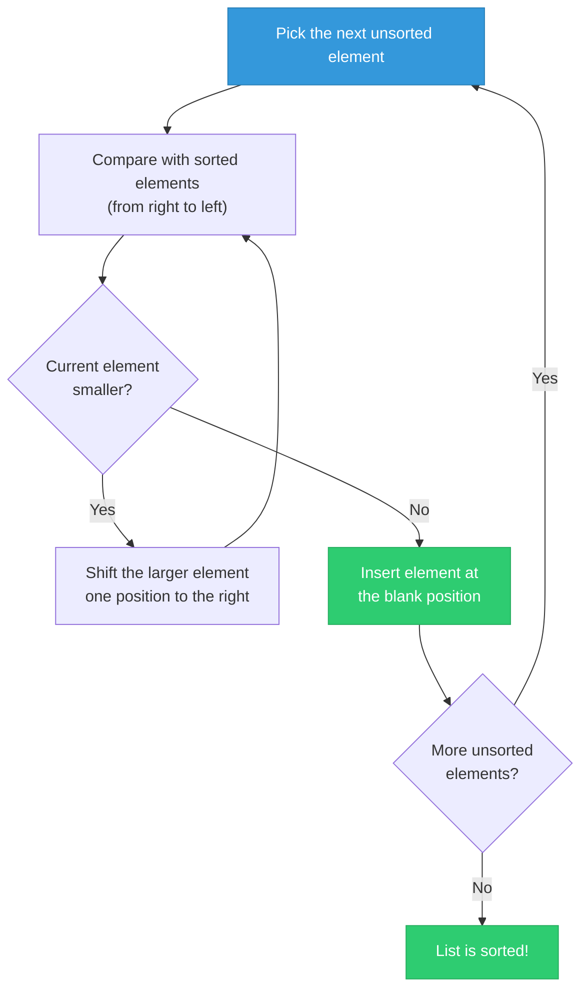

### Pictorial Example of Insertion Sort

Sorting the list: **17, 12, 18, 5, 7, 10, 8**

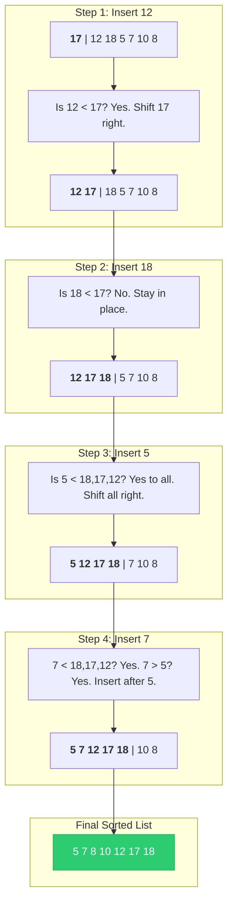

**Detailed trace:**

| Step | Element | Compared With | Action | Result |
|------|---------|--------------|--------|--------|
| 1 | 12 | 17 | 12 < 17, shift 17 right, insert 12 | **12** 17 18 5 7 10 8 |
| 2 | 18 | 17, 12 | 18 > 17, no shift needed | 12 17 **18** 5 7 10 8 |
| 3 | 5 | 18, 17, 12 | 5 < all, shift all right, insert 5 | **5** 12 17 18 7 10 8 |
| 4 | 7 | 18, 17, 12, 5 | 7 < 18,17,12 but 7 > 5, insert after 5 | 5 **7** 12 17 18 10 8 |
| 5 | 10 | 18, 17, 12, 7 | 10 < 18,17,12 but 10 > 7, insert after 7 | 5 7 **10** 12 17 18 8 |
| 6 | 8 | 18, 17, 12, 10, 7 | 8 < 18,17,12,10 but 8 > 7, insert after 7 | 5 7 **8** 10 12 17 18 |

---

### Algorithm for Insertion Sort

> **Purpose:** Sort an array A with n elements in ascending order by inserting each element into its correct position.

#### Pseudocode

```
Algorithm 9.4: Insertion Sort
────────────────────────────────
Input: Array A[1...n]

1. for (j = 2 to n)
   {
       key-value = A[j];
       i = j - 1;

       while (i > 0 and A[i] > key-value)
       {
           A[i + 1] = A[i];    // shift element right
           i = i - 1;
       } // end of while

       A[i + 1] = key-value;   // insert at correct position

   } // end of for

2. Output: Sorted list.
```

#### Visual Flowchart

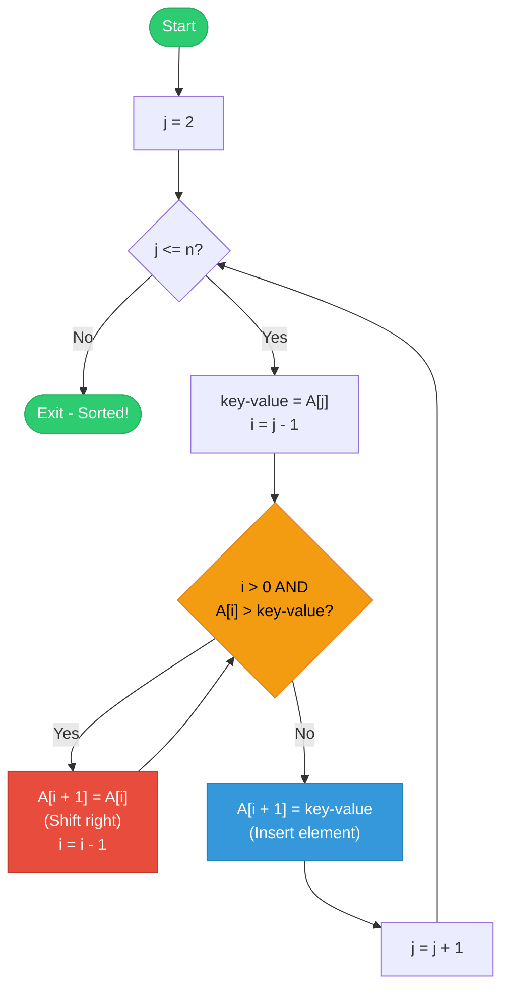

#### How the Algorithm Works (Step-by-Step)

1. **Start from the second element** (`j = 2`): The first element is already "sorted" by itself.
2. **Save the current element** in `key-value`: This is the element we want to insert.
3. **Set `i = j - 1`**: Start comparing with the element right before it.
4. **While loop**: As long as `i > 0` and `A[i]` is greater than `key-value`, shift `A[i]` one position to the right and move `i` one position to the left.
5. **Insert**: Place `key-value` at position `A[i + 1]` (the gap created by shifting).
6. **Repeat** for all elements from position 2 to n.

---

### Complexity of Insertion Sort

In the worst case (list is sorted in reverse order), the number of comparisons is:

```
Step 1:  1 comparison
Step 2:  2 comparisons
Step 3:  3 comparisons
...
Step (n-1): (n-1) comparisons
```

**Total comparisons:**

```
= 1 + 2 + 3 + ... + (n - 1)
= n(n - 1) / 2
= n²/2 - n/2
```

**Therefore, complexity = O(n²)**

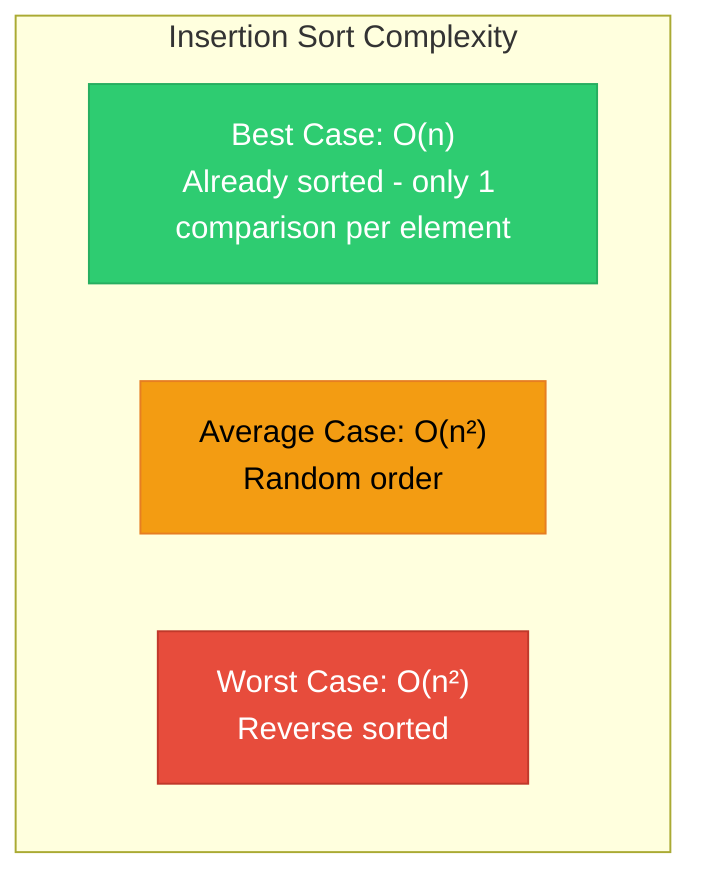

> **Key insight:** Unlike selection sort, insertion sort has a **best case of O(n)** when the list is already sorted, because the while loop never executes. This makes it efficient for nearly sorted data.

---

## Merge Sort

### How Merge Sort Works

Merge sort uses the **divide and conquer** strategy. It works by splitting the list in half repeatedly until each piece has just one element (which is inherently sorted), then **merges** the sorted pieces back together in the correct order.

**The two main phases:**

1. **Divide:** Split the n-element list into two halves of n/2 elements each. Continue splitting recursively until each sub-list has only one element. A single element is already sorted by definition.
2. **Conquer (Merge):** Combine two sorted sub-lists into one sorted list. Compare elements from both sub-lists and place the smaller one first. Repeat until all elements are merged.

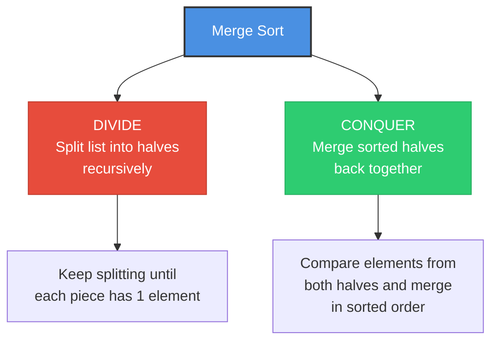

**Important characteristics:**
- Merge sort is a **recursive** procedure. A recursive function is one that calls itself repeatedly.
- A **disadvantage** of merge sort is that it requires **extra space** (an additional array) for the merging step.

> **Think of it like:** Splitting a deck of cards in half, then splitting each half again, and again, until you have individual cards. Then you merge pairs of cards in order, then merge pairs of pairs in order, and so on until the whole deck is sorted.

---

### Pictorial Example of Merge Sort

Sorting the list: **18, 26, 32, 6, 43, 15, 9, 1**

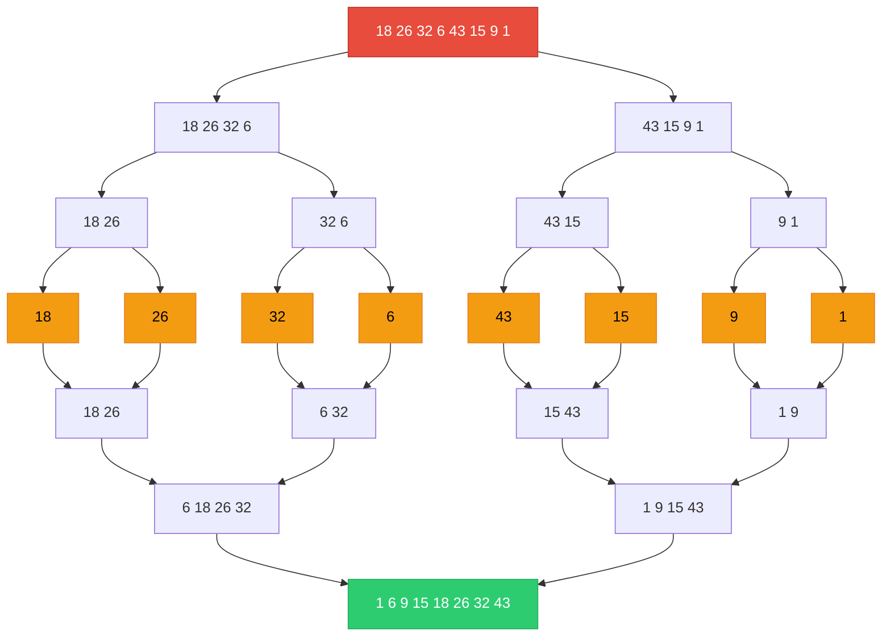

**Phase-by-phase breakdown:**

| Phase | Action | Result |
|-------|--------|--------|
| Original | Start | 18, 26, 32, 6, 43, 15, 9, 1 |
| Divide 1 | Split into 2 halves | [18, 26, 32, 6] and [43, 15, 9, 1] |
| Divide 2 | Split each half | [18, 26], [32, 6], [43, 15], [9, 1] |
| Divide 3 | Split into singles | [18], [26], [32], [6], [43], [15], [9], [1] |
| Merge 1 | Merge pairs in order | [18, 26], [6, 32], [15, 43], [1, 9] |
| Merge 2 | Merge pairs of pairs | [6, 18, 26, 32], [1, 9, 15, 43] |
| Merge 3 | Final merge | [1, 6, 9, 15, 18, 26, 32, 43] |

---

### The Merging Procedure (Detailed)

Merging is the key operation. Given two sorted arrays P[] and Q[], we combine them into a single sorted array R[].

**Example:** Merge P = [2, 4, 6, 7] and Q = [3, 5, 9, 10]

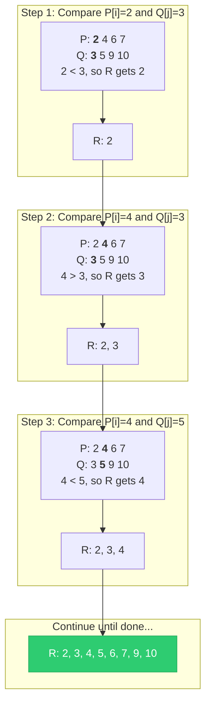

**How merging works:**
1. Use two pointers `i` and `j`, starting at the beginning of P and Q respectively.
2. Compare `P[i]` and `Q[j]`. Place the smaller one into R[k] and advance that pointer.
3. Increment `k` to the next position in R.
4. When one array is exhausted, copy all remaining elements from the other array into R.

---

### Algorithm for Merge Sort

> **Purpose:** Recursively divide the array in half, sort each half, and merge them together.

#### Pseudocode - Main Function

```
Algorithm: merge_sort(A, f, l)
────────────────────────────────
A = Array to sort
f = First index
l = Last index

1. if (f < l)
   {
       m = (f + l) / 2;              // Find the middle
       merge_sort(A, f, m);          // Sort left half
       merge_sort(A, m + 1, l);      // Sort right half
       Merge(A, f, m, l);            // Merge the two halves
   }
```

#### Pseudocode - Merging Function

```
Algorithm: Merge(A, f, m, l)
────────────────────────────────
A = Array, f = first index, m = middle index, l = last index

1. Take a temporary array T[1...l];
2. i = f; j = m + 1; k = f;

3. while (i <= m and j <= l)
   {
       if (A[i] <= A[j]) then
           T[k] = A[i]; i = i + 1;
       else
           T[k] = A[j]; j = j + 1;
       k = k + 1;
   }

4. // Copy remaining elements
   if (i > m) then
       for (b = j to l) do
       {
           T[k] = A[b]; k = k + 1;
       }
   else
       for (b = i to m) do
       {
           T[k] = A[b]; k = k + 1;
       }

5. // Copy merged result back to A
   for (i = f to l)
   {
       A[i] = T[i];
   }
```

#### Visual Flowchart - Merge Sort

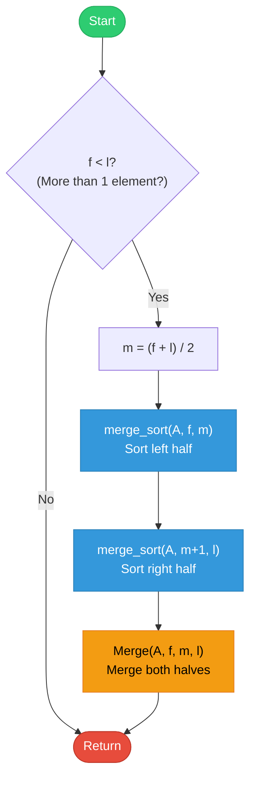

#### Visual Flowchart - Merge Function

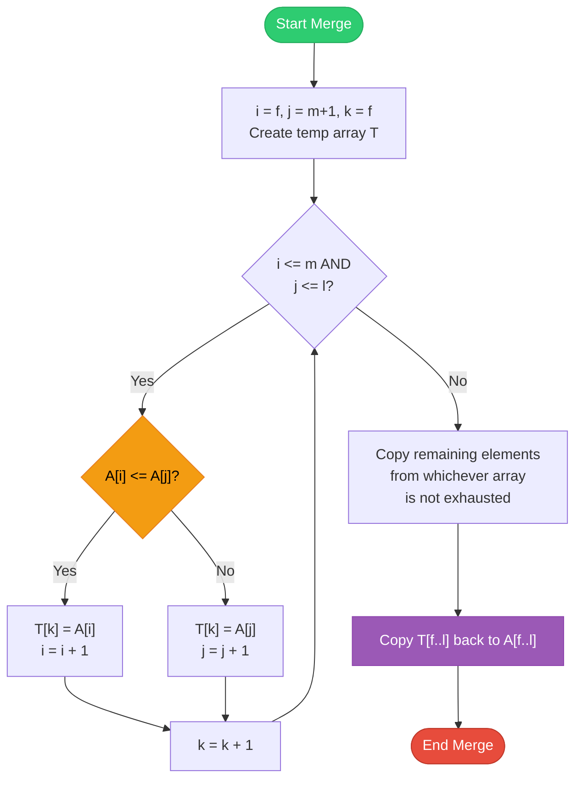

#### How the Algorithm Works (Step-by-Step)

1. **Base case:** If `f >= l`, the sub-array has 0 or 1 element, which is already sorted. Return.
2. **Find middle:** Calculate `m = (f + l) / 2` to split the array into two halves.
3. **Recursive left:** Call `merge_sort(A, f, m)` to sort the left half.
4. **Recursive right:** Call `merge_sort(A, m+1, l)` to sort the right half.
5. **Merge:** Call `Merge(A, f, m, l)` to combine the two sorted halves into one sorted array.
6. The merge function uses a temporary array `T`, compares elements from both halves, and places them in order.

---

### Complexity of Merge Sort

The computing time for merge sort is described by the **recurrence relation**:

```
T(n) = a              when n = 1 (base case)
T(n) = 2T(n/2) + n   when n > 1
```

The `2T(n/2)` comes from sorting two halves, and `+n` comes from the merging step.

**Solving the recurrence (when n = 2^k):**

```
T(n) = 2T(n/2) + n
     = 2[2T(n/4) + n/2] + n = 4T(n/4) + 2n
     = 4[2T(n/8) + n/4] + 2n = 8T(n/8) + 3n
     = ...
     = 2^k * T(1) + k*n
     = an + kn
     = an + n*log₂n

Since k = log₂n:
T(n) = O(n log₂ n)
```

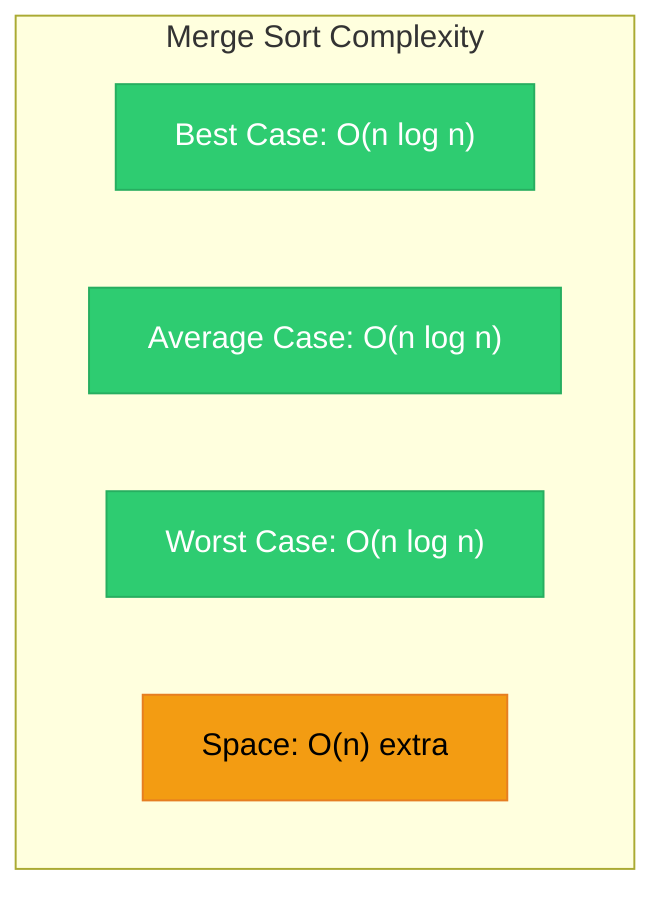

> **Key insight:** Merge sort has **O(n log₂ n) in both average and worst cases**, which is much better than O(n²) sorting algorithms. However, it requires **O(n) extra space** for the temporary array used during merging.

---

## Quick Sort

### How Quick Sort Works

Quick sort is also a **divide and conquer** method, but it works differently from merge sort. Instead of splitting the list in half, it chooses a **partitioning element** (also called a pivot) and divides the list based on that element.

**Step-by-step process:**

1. Choose one element as the **partitioning element** (pivot). Usually the first element.
2. **Divide** the list into two parts:
   - **First part (left):** All elements less than or equal to the pivot.
   - **Second part (right):** All elements greater than the pivot.
3. If any element in the first part is **greater** than the pivot, it is transferred to the second part.
4. If any element in the second part is **less** than the pivot, it is transferred to the first part.
5. The transferring is done by **exchanging (swapping)** the positions of these elements.
6. After partitioning, the pivot is in its **final sorted position**.
7. **Recursively** apply the same process to the left and right parts.

> **Think of it like:** Choosing a "middle-value" card from a deck, then putting all smaller cards on the left and all bigger cards on the right. Then repeat for each pile.

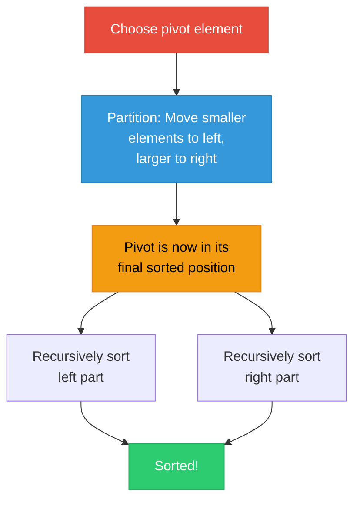

---

### Pictorial Example of Quick Sort

Sorting the list: **25, 57, 48, 37, 12, 92, 86, 33**

**Step 1: First partition (pivot = 25)**

```
Original:  [25, 57, 48, 37, 12, 92, 86, 33]
Pivot = 25

Scan from left: Find element > 25  -->  57 (position 2)
Scan from right: Find element < 25  -->  12 (position 5)
Swap 57 and 12:  [25, 12, 48, 37, 57, 92, 86, 33]

Scan from left: Find element > 25  -->  48 (position 3)
Scan from right: Find element < 25  -->  12 (position 2)
Pointers crossed! Place pivot: [12, 25, 48, 37, 57, 92, 86, 33]
                                      ^
                              Pivot in final position
```

**Step 2: Recursively sort left [12] and right [48, 37, 57, 92, 86, 33]**

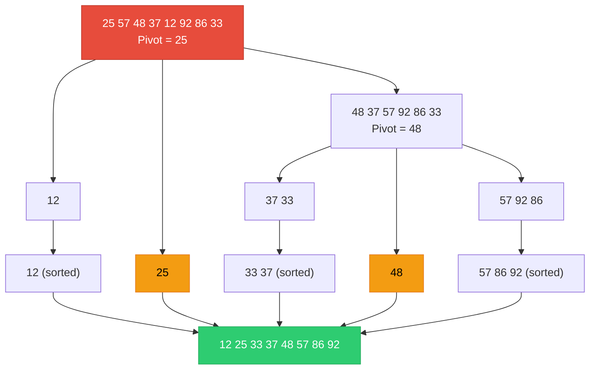

---

### Algorithm for Quick Sort

> **Purpose:** Recursively partition the array around a pivot element and sort each partition.

#### Pseudocode - Main Function

```
Algorithm: Quick_sort(f, l)
────────────────────────────
f = First index
l = Last index

1. if (f < l)
   {
       j = makepart(a, f, l + 1);    // Partition and get pivot position
       Quick_sort(f, j - 1);          // Sort left part
       Quick_sort(j + 1, l);          // Sort right part
   }
```

#### Pseudocode - Partitioning Function

```
Algorithm: makepart(a, first, last)
────────────────────────────────────
a = Array
first = First index
last = Last index
part_value = Partitioning element (first element)

1. part_value = a[first]; i = first; j = last;
2. do
   {
       do
       {
           i = i + 1;
       } while (a[i] <= part_value);     // Scan right for element > pivot

       do
       {
           j = j - 1;
       } while (a[j] > part_value);      // Scan left for element <= pivot

       if (i < j) then
           interchange(a[i], a[j]);       // Swap the two elements

   } while (i < j);

3. a[first] = a[j];      // Move pivot to its final position
   a[j] = part_value;
4. return j;              // Return pivot's final position
```

#### Visual Flowchart - Quick Sort

```mermaid
flowchart TD
    START([Start]) --> CHECK{"f < l?<br/>(More than 1 element?)"}
    CHECK -->|No| EXIT([Return])
    CHECK -->|Yes| PART["j = makepart(a, f, l+1)<br/>Partition the array"]
    PART --> LEFT["Quick_sort(f, j-1)<br/>Sort left of pivot"]
    LEFT --> RIGHT["Quick_sort(j+1, l)<br/>Sort right of pivot"]
    RIGHT --> EXIT

    style START fill:#2ecc71,stroke:#27ae60,color:#fff
    style EXIT fill:#e74c3c,stroke:#c0392b,color:#fff
    style PART fill:#f39c12,stroke:#e67e22,color:#000
    style LEFT fill:#3498db,stroke:#2980b9,color:#fff
    style RIGHT fill:#3498db,stroke:#2980b9,color:#fff
```

#### Visual Flowchart - Partition Function

```mermaid
flowchart TD
    START([Start makepart]) --> INIT["part_value = a[first]<br/>i = first, j = last"]
    INIT --> SCANR["Scan right: i = i + 1<br/>while a[i] <= part_value"]
    SCANR --> SCANL["Scan left: j = j - 1<br/>while a[j] > part_value"]
    SCANL --> CHECK{"i < j?"}
    CHECK -->|Yes| SWAP["Swap a[i] and a[j]"]
    SWAP --> SCANR
    CHECK -->|No| PLACE["Place pivot:<br/>a[first] = a[j]<br/>a[j] = part_value"]
    PLACE --> RETURN(["Return j"])

    style START fill:#2ecc71,stroke:#27ae60,color:#fff
    style RETURN fill:#e74c3c,stroke:#c0392b,color:#fff
    style SWAP fill:#3498db,stroke:#2980b9,color:#fff
    style CHECK fill:#f39c12,stroke:#e67e22,color:#000
    style PLACE fill:#9b59b6,stroke:#8e44ad,color:#fff
```

#### How the Algorithm Works (Step-by-Step)

1. **Choose pivot:** The first element `a[first]` is chosen as the partitioning element.
2. **Two scanners:** `i` starts from the left and moves right; `j` starts from the right and moves left.
3. **Scan right:** Move `i` right until you find an element **greater than** the pivot.
4. **Scan left:** Move `j` left until you find an element **less than or equal to** the pivot.
5. **Swap:** If `i < j`, swap `a[i]` and `a[j]` and repeat.
6. **Place pivot:** When `i >= j`, swap the pivot (`a[first]`) with `a[j]`. Now the pivot is in its correct final position.
7. **Recurse:** Sort the elements to the left and right of the pivot separately.

---

### Complexity of Quick Sort

#### Average Case Analysis

The average case analysis uses the recurrence:

```
T(n) = n + (1/n) * SUM[T(i-1) + T(n-i)] for i=1 to n
```

Here, `n` comparisons are needed for the first partitioning round, and `1/n` represents the probability of choosing any particular element as pivot. After extensive mathematical derivation (multiplying both sides by n, substituting n-1, subtracting, and solving):

```
T(n)/(n+1) = T(n-1)/n + 2/(n+1)

Expanding:
T(n)/(n+1) = T(1)/2 + 2 * [1/3 + 1/4 + ... + 1/(n+1)]
           ≈ 2 * ln(n+1)
           = 2 * loge(n+1)

Therefore:
T(n) ≈ 2(n+1) * loge(n)
T(n) = O(n loge n)
```

#### Worst Case

The worst case occurs when the pivot is always the **smallest** or **largest** element (e.g., when the list is already sorted). In this case:

```
T(n) = n + T(0) + T(n-1) = n + T(n-1)
     = n + (n-1) + (n-2) + ... + 1
     = n(n-1)/2
     = O(n²)
```

```mermaid
graph TD
    subgraph "Quick Sort Complexity"
        A["Best Case: O(n log n)<br/>Balanced partitions"]
        B["Average Case: O(n log_e n)<br/>Random partitions"]
        C["Worst Case: O(n²)<br/>Already sorted / reverse sorted"]
        D["Space: O(log n) for recursion stack"]
    end

    style A fill:#2ecc71,stroke:#27ae60,color:#fff
    style B fill:#f39c12,stroke:#e67e22,color:#000
    style C fill:#e74c3c,stroke:#c0392b,color:#fff
    style D fill:#3498db,stroke:#2980b9,color:#fff
```

> **Key insight:** Quick sort is **O(n log_e n) on average**, which is very fast. However, its worst case is **O(n²)**. Despite this, quick sort is often faster in practice than merge sort because it has smaller constant factors and sorts **in-place** (no extra array needed).

---

## Summary of Internal Sorting Complexities

| Algorithm | Best Case | Average Case | Worst Case | Space | Method |
|-----------|-----------|-------------|------------|-------|--------|
| **Selection Sort** | O(n²) | O(n²) | O(n²) | O(1) | Exchange |
| **Insertion Sort** | O(n) | O(n²) | O(n²) | O(1) | Exchange |
| **Merge Sort** | O(n log₂ n) | O(n log₂ n) | O(n log₂ n) | O(n) | Divide & Conquer |
| **Quick Sort** | O(n log n) | O(n log_e n) | O(n²) | O(log n) | Divide & Conquer |

```mermaid
graph LR
    subgraph "Sorting Algorithms Comparison"
        A["Selection Sort<br/>O(n²)"]
        B["Insertion Sort<br/>O(n²)"]
        C["Merge Sort<br/>O(n log n)"]
        D["Quick Sort<br/>O(n log n) avg"]
    end

    E["Slower<br/>Simple sorts"] --- A
    E --- B
    F["Faster<br/>Advanced sorts"] --- C
    F --- D

    style A fill:#e74c3c,stroke:#c0392b,color:#fff
    style B fill:#e74c3c,stroke:#c0392b,color:#fff
    style C fill:#2ecc71,stroke:#27ae60,color:#fff
    style D fill:#2ecc71,stroke:#27ae60,color:#fff
```

**Key comparisons:**
- **Merge sort** guarantees O(n log₂ n) in **both average and worst cases**, but needs extra space.
- **Quick sort** is O(n log_e n) in average case but O(n²) in worst case. It sorts in-place (no extra array).
- **Selection sort** and **insertion sort** are O(n²) and best for small datasets.
- **Insertion sort** is better than selection sort when data is nearly sorted (best case O(n)).

---

## External Sorting

### What is External Sorting?

External sorting is required when the number of records (data) to be sorted is **larger than what the computer can hold in its internal (main) memory**. In today's world, sorting extremely large datasets is critical for large corporations, banks, and government institutions.

External sorting works quite differently from internal sorting, even though the goal is the same - arrange data in increasing or decreasing order. The most common external sorting algorithm is still the **Merge Sort**.

```mermaid
graph TD
    A["External Sorting"] --> B["Why needed?"]
    A --> C["How it works?"]
    A --> D["Most common algorithm?"]

    B --> B1["Data too large<br/>for RAM"]
    C --> C1["1. Create sorted runs<br/>2. Merge sorted runs"]
    D --> D1["External Merge Sort"]

    style A fill:#4A90E2,stroke:#333,stroke-width:2px,color:#fff
    style B1 fill:#e74c3c,stroke:#c0392b,color:#fff
    style C1 fill:#f39c12,stroke:#e67e22,color:#000
    style D1 fill:#2ecc71,stroke:#27ae60,color:#fff
```

### How External Sorting Works

The process has two main phases:

1. **Run Creation Phase:** Read chunks of data that fit in memory, sort them using any internal sorting algorithm (like quick sort), and write these sorted chunks (called **runs** or sorted sub-files) back to disk.
2. **Merging Phase:** Merge the sorted runs together repeatedly until you have a single fully sorted file.

```mermaid
graph TD
    subgraph "Phase 1: Create Sorted Runs"
        A["Large unsorted file<br/>on disk"] --> B["Read chunk 1<br/>into RAM"]
        A --> C["Read chunk 2<br/>into RAM"]
        A --> D["Read chunk 3<br/>into RAM"]
        B --> B1["Sort chunk 1<br/>in RAM"]
        C --> C1["Sort chunk 2<br/>in RAM"]
        D --> D1["Sort chunk 3<br/>in RAM"]
        B1 --> E["Write sorted run 1<br/>to disk"]
        C1 --> F["Write sorted run 2<br/>to disk"]
        D1 --> G["Write sorted run 3<br/>to disk"]
    end

    subgraph "Phase 2: Merge Sorted Runs"
        E --> H["Merge run 1 + run 2"]
        F --> H
        H --> I["Merged run (1+2)"]
        I --> J["Merge (1+2) + run 3"]
        G --> J
        J --> K["Final sorted file"]
    end

    style A fill:#e74c3c,stroke:#c0392b,color:#fff
    style K fill:#2ecc71,stroke:#27ae60,color:#fff
```

### Detailed Example

Suppose we have to sort **3000 records** (R1, R2, ..., R3000), each record is 20 words long, and our computer's internal memory can hold only **1000 records** at a time.

**Phase 1: Creating sorted runs**

We read 1000 records at a time, sort them in memory, and write them to separate files:

| File | Contents | Description |
|------|----------|-------------|
| **file-1** | R1, R2, R3, ..., R1000 | First 1000 records, sorted |
| **file-2** | R1001, R1002, ..., R2000 | Next 1000 records, sorted |
| **file-3** | R2001, R2002, ..., R3000 | Last 1000 records, sorted |

**Phase 2: Merging sorted runs**

```mermaid
graph TD
    subgraph "Step 1: Merge file-1 and file-2"
        F1["file-1<br/>R1...R1000<br/>(sorted)"]
        F2["file-2<br/>R1001...R2000<br/>(sorted)"]
        F1 --> M1["Merge"]
        F2 --> M1
        M1 --> F4["file-4<br/>R1...R2000<br/>(sorted)"]
    end

    subgraph "Step 2: Merge file-4 and file-3"
        F4B["file-4<br/>R1...R2000<br/>(sorted)"]
        F3["file-3<br/>R2001...R3000<br/>(sorted)"]
        F4B --> M2["Merge"]
        F3 --> M2
        M2 --> FINAL["file-1<br/>R1...R3000<br/>(fully sorted!)"]
    end

    F4 --> F4B

    style F1 fill:#3498db,stroke:#2980b9,color:#fff
    style F2 fill:#3498db,stroke:#2980b9,color:#fff
    style F3 fill:#3498db,stroke:#2980b9,color:#fff
    style FINAL fill:#2ecc71,stroke:#27ae60,color:#fff
```

**How the merging works in practice:**

During the merging phase, since we cannot load entire files into memory at once, we read portions:

1. Read 500 records from file-1 and 500 records from file-2 into memory.
2. Merge them and write the result to file-4.
3. Read the next 500 records from file-1 and 500 from file-2.
4. Merge and append to file-4.
5. Continue until file-1 and file-2 are completely merged into file-4.
6. Similarly merge file-4 and file-3 to produce the final sorted file.

> **Key insight:** The runs can be produced using any internal sorting algorithm like quick sort. The merging is always done using the merge procedure, which is why this method is called **external merge sort**.

---

## Introduction to Searching

### What is Searching?

**Searching** means finding or locating a specific element from a given list of elements. More precisely, it is identifying or locating an element (or the position of an element) within a list.

```mermaid
graph TD
    A["Searching"] --> B["Input: A list + Target element"]
    A --> C["Output: Position of element<br/>OR 'Not Found'"]

    B --> D["Two possible results"]
    D --> E["Found: Return position/index"]
    D --> F["Not Found: Return failure message"]

    style A fill:#4A90E2,stroke:#333,stroke-width:2px,color:#fff
    style E fill:#2ecc71,stroke:#27ae60,color:#fff
    style F fill:#e74c3c,stroke:#c0392b,color:#fff
```

We will study two types of searching:

```mermaid
graph TD
    A["Searching Algorithms"] --> B["Linear Search<br/>(Sequential Search)"]
    A --> C["Binary Search"]

    B --> B1["Check each element<br/>one by one"]
    B --> B2["Works on any list<br/>(sorted or unsorted)"]
    B --> B3["Complexity: O(n)"]

    C --> C1["Divide search range<br/>in half each time"]
    C --> C2["Requires sorted list"]
    C --> C3["Complexity: O(log₂ n)"]

    style A fill:#4A90E2,stroke:#333,stroke-width:2px,color:#fff
    style B fill:#e74c3c,stroke:#c0392b,color:#fff
    style C fill:#2ecc71,stroke:#27ae60,color:#fff
```

---

## Linear Searching

### How Linear Search Works

Linear search (also called sequential search) is the simplest searching method. It checks **each element one by one** from the beginning of the list until the target element is found or the end of the list is reached.

> **Think of it like:** Looking for a specific book on a shelf by checking each book from left to right, one at a time.

### Pictorial Example of Linear Search

Given list: **17, 12, 18, 5, 7, 8, 10**
Target: **x = 7**

```mermaid
graph TD
    subgraph "Linear Search for x = 7"
        S1["Index 1: Is 17 = 7? No"]
        S2["Index 2: Is 12 = 7? No"]
        S3["Index 3: Is 18 = 7? No"]
        S4["Index 4: Is 5 = 7? No"]
        S5["Index 5: Is 7 = 7? YES! Found!"]
    end

    S1 --> S2 --> S3 --> S4 --> S5

    style S1 fill:#e74c3c,stroke:#c0392b,color:#fff
    style S2 fill:#e74c3c,stroke:#c0392b,color:#fff
    style S3 fill:#e74c3c,stroke:#c0392b,color:#fff
    style S4 fill:#e74c3c,stroke:#c0392b,color:#fff
    style S5 fill:#2ecc71,stroke:#27ae60,color:#fff
```

**Step-by-step trace:**

| Step | Index | List[index] | Comparison | Result |
|------|-------|-------------|------------|--------|
| 1 | 1 | 17 | 17 = 7? | No, continue |
| 2 | 2 | 12 | 12 = 7? | No, continue |
| 3 | 3 | 18 | 18 = 7? | No, continue |
| 4 | 4 | 5 | 5 = 7? | No, continue |
| 5 | 5 | 7 | 7 = 7? | **Yes! Location = 5** |

---

### Algorithm for Linear Search

> **Purpose:** Search for an item (x) in an array A with n elements. Return the location if found, or "Not Found".

#### Pseudocode

```
Algorithm: Linear Search
────────────────────────────
Input: A[1...n], item = x
       Location = 0

1. for (i = 1; i <= n; i = i + 1)
   {
       if (A[i] == item)
       {
           print "Found";
           location = i;
           Stop searching;
       }
   }

2. if (i > n)
       print "Not Found";

3. Output: "Found" or "Not Found"
```

#### Visual Flowchart

```mermaid
flowchart TD
    START([Start]) --> INIT["i = 1, location = 0"]
    INIT --> CHECK{"i <= n?"}
    CHECK -->|No| NOTFOUND["Print 'Not Found'"]
    NOTFOUND --> EXIT([Exit])
    CHECK -->|Yes| COMPARE{"A[i] == item?"}
    COMPARE -->|Yes| FOUND["Print 'Found'<br/>location = i"]
    FOUND --> EXIT
    COMPARE -->|No| INC["i = i + 1"]
    INC --> CHECK

    style START fill:#2ecc71,stroke:#27ae60,color:#fff
    style EXIT fill:#e74c3c,stroke:#c0392b,color:#fff
    style FOUND fill:#2ecc71,stroke:#27ae60,color:#fff
    style NOTFOUND fill:#e74c3c,stroke:#c0392b,color:#fff
    style COMPARE fill:#f39c12,stroke:#e67e22,color:#000
```

#### How the Algorithm Works (Step-by-Step)

1. **Initialize:** Set the counter `i = 1` and `location = 0`.
2. **Loop:** For each index `i` from 1 to n:
   - Compare `A[i]` with the target `item`.
   - If they match, print "Found", record the location, and stop.
3. **After loop:** If we went through all elements without finding the item (`i > n`), print "Not Found".

---

### Complexity of Linear Search

```
In average case (element is equally likely to be at any position):

Comparisons = (1 + 2 + 3 + ... + n) / n
            = n(n + 1) / (2n)
            = (n + 1) / 2
            ≈ n/2
```

| Case | Comparisons | When |
|------|-------------|------|
| **Best** | O(1) | Target is the first element |
| **Average** | O(n/2) = O(n) | Target is somewhere in the middle |
| **Worst** | O(n) | Target is the last element or not present |

**Therefore, complexity = O(n)**

```mermaid
graph LR
    subgraph "Linear Search Complexity"
        A["Best: O(1)"] --> D["Overall: O(n)"]
        B["Average: O(n)"] --> D
        C["Worst: O(n)"] --> D
    end

    style A fill:#2ecc71,stroke:#27ae60,color:#fff
    style B fill:#f39c12,stroke:#e67e22,color:#000
    style C fill:#e74c3c,stroke:#c0392b,color:#fff
```

---

## Binary Searching

### How Binary Search Works

Binary search is a much faster searching method than linear search, but it has one important **prerequisite: the elements must be arranged in either ascending or descending order** (the list must be sorted).

Binary search works by repeatedly dividing the search range in half:

1. Look at the **middle** element of the current range.
2. If it matches the target, we're done!
3. If the target is **less** than the middle element, search the **left half**.
4. If the target is **greater** than the middle element, search the **right half**.
5. Repeat until found or the range is empty.

> **Important:** Binary search is a **searching technique**, not a data structure. Do not confuse it with Binary Search Tree (BST), which is a data structure.

> **Think of it like:** Looking up a word in a dictionary. You open to the middle, decide if your word comes before or after, then focus on only that half. Each step eliminates half of the remaining pages.

```mermaid
graph TD
    A["Start with full sorted list"] --> B["Look at middle element"]
    B --> C{"Target = middle?"}
    C -->|Yes| D["Found!"]
    C -->|No| E{"Target < middle?"}
    E -->|Yes| F["Search LEFT half"]
    E -->|No| G["Search RIGHT half"]
    F --> B
    G --> B

    style D fill:#2ecc71,stroke:#27ae60,color:#fff
    style F fill:#3498db,stroke:#2980b9,color:#fff
    style G fill:#e74c3c,stroke:#c0392b,color:#fff
```

---

### Pictorial Example of Binary Search

Given sorted list: **17, 19, 28, 30, 45, 55, 58, 61, 63, 67, 72, 76, 80, 89, 99**
Target: **x = 89**

```mermaid
graph TD
    subgraph "Step 1: Search full list (indices 1-15)"
        S1["17  19  28  30  45  55  58  <b>61</b>  63  67  72  76  80  89  99"]
        S1R["mid = 8, A[8] = 61<br/>89 > 61, search RIGHT half"]
    end

    subgraph "Step 2: Search indices 9-15"
        S2["63  67  72  <b>76</b>  80  89  99"]
        S2R["mid = 12, A[12] = 76<br/>89 > 76, search RIGHT half"]
    end

    subgraph "Step 3: Search indices 13-15"
        S3["80  <b>89</b>  99"]
        S3R["mid = 14, A[14] = 89<br/>89 = 89, FOUND!"]
    end

    S1 --> S1R --> S2 --> S2R --> S3 --> S3R

    style S3R fill:#2ecc71,stroke:#27ae60,color:#fff
```

**Detailed trace:**

| Step | first | last | mid | A[mid] | Comparison | Action |
|------|-------|------|-----|--------|------------|--------|
| 1 | 1 | 15 | 8 | 61 | 89 > 61 | Search right: first = 9 |
| 2 | 9 | 15 | 12 | 76 | 89 > 76 | Search right: first = 13 |
| 3 | 13 | 15 | 14 | **89** | 89 = 89 | **Found at index 14!** |

Only **3 comparisons** to find the element in a list of 15! Linear search would have needed 14 comparisons.

---

### Algorithm for Binary Search

> **Purpose:** Find the position of element x in a sorted array A with m elements.

#### Pseudocode

```
Algorithm: Binary Search
────────────────────────────
Input: A[1...m], x (target element)

1. first = 1, last = m;

2. while (first <= last)
   {
       mid = (first + last) / 2;

       (i) if (x == A[mid]) then
               print mid;          // Found! Return position

       (ii) else if (x < A[mid]) then
               last = mid - 1;     // Search left half

       (iii) else
               first = mid + 1;    // Search right half
   }

3. if (first > last)
       print "Not Found";

4. Output: mid or "Not Found"
```

#### Visual Flowchart

```mermaid
flowchart TD
    START([Start]) --> INIT["first = 1, last = m"]
    INIT --> WHILE{"first <= last?"}
    WHILE -->|No| NOTFOUND["Print 'Not Found'"]
    NOTFOUND --> EXIT([Exit])
    WHILE -->|Yes| MID["mid = (first + last) / 2"]
    MID --> CHECK1{"x == A[mid]?"}
    CHECK1 -->|Yes| FOUND["Print mid<br/>FOUND!"]
    FOUND --> EXIT
    CHECK1 -->|No| CHECK2{"x < A[mid]?"}
    CHECK2 -->|Yes| LEFT["last = mid - 1<br/>(Search LEFT half)"]
    CHECK2 -->|No| RIGHT["first = mid + 1<br/>(Search RIGHT half)"]
    LEFT --> WHILE
    RIGHT --> WHILE

    style START fill:#2ecc71,stroke:#27ae60,color:#fff
    style EXIT fill:#e74c3c,stroke:#c0392b,color:#fff
    style FOUND fill:#2ecc71,stroke:#27ae60,color:#fff
    style NOTFOUND fill:#e74c3c,stroke:#c0392b,color:#fff
    style LEFT fill:#3498db,stroke:#2980b9,color:#fff
    style RIGHT fill:#e67e22,stroke:#d35400,color:#fff
    style CHECK1 fill:#f39c12,stroke:#e67e22,color:#000
```

#### How the Algorithm Works (Step-by-Step)

1. **Initialize:** Set `first = 1` (beginning of list) and `last = m` (end of list).
2. **Calculate midpoint:** `mid = (first + last) / 2`.
3. **Compare:**
   - If `x == A[mid]`: **Found!** Return `mid`.
   - If `x < A[mid]`: Target is in the left half. Set `last = mid - 1`.
   - If `x > A[mid]`: Target is in the right half. Set `first = mid + 1`.
4. **Repeat** while `first <= last`.
5. If `first > last`, the element is not in the list: print "Not Found".

---

### Complexity of Binary Search

With each comparison, the search range is cut in **half**:

```
After 1 comparison: n/2 elements remain
After 2 comparisons: n/4 elements remain
After 3 comparisons: n/8 elements remain
...
After k comparisons: n/2^k elements remain
```

The search stops when there is 1 element left:

```
n / 2^k = 1
n = 2^k
k = log₂ n
```

**Therefore, complexity = O(log₂ n)**

```mermaid
graph TD
    subgraph "Binary Search: Power of Halving"
        A["n elements"] --> B["n/2 after 1 step"]
        B --> C["n/4 after 2 steps"]
        C --> D["n/8 after 3 steps"]
        D --> E["..."]
        E --> F["1 element after log₂n steps"]
    end

    style A fill:#e74c3c,stroke:#c0392b,color:#fff
    style F fill:#2ecc71,stroke:#27ae60,color:#fff
```

#### Comparison: Linear vs Binary Search

| Array Size (n) | Linear Search (worst) | Binary Search (worst) |
|----------------|----------------------|----------------------|
| 10 | 10 | 4 |
| 100 | 100 | 7 |
| 1,000 | 1,000 | 10 |
| 10,000 | 10,000 | 14 |
| 1,000,000 | 1,000,000 | **20** |

> **Key insight:** For a list of 1 million elements, linear search might need up to 1,000,000 comparisons, while binary search needs at most **20**! This is the power of O(log₂ n).

---

## Summary of Searching Complexities

| Algorithm | Best Case | Average Case | Worst Case | Prerequisite |
|-----------|-----------|-------------|------------|--------------|
| **Linear Search** | O(1) | O(n) | O(n) | None (works on any list) |
| **Binary Search** | O(1) | O(log₂ n) | O(log₂ n) | List must be sorted |

```mermaid
graph LR
    subgraph "Searching Algorithms Comparison"
        A["Linear Search<br/>O(n)<br/>Any list"]
        B["Binary Search<br/>O(log₂ n)<br/>Sorted list only"]
    end

    C["When to use which?"]
    C --> D["Small or unsorted list: Linear Search"]
    C --> E["Large sorted list: Binary Search"]

    style A fill:#e74c3c,stroke:#c0392b,color:#fff
    style B fill:#2ecc71,stroke:#27ae60,color:#fff
```

---

## Overall Summary

### All Complexities at a Glance

#### Sorting Algorithms

| Algorithm | Average Case | Worst Case | Space | Notes |
|-----------|-------------|------------|-------|-------|
| **Selection Sort** | O(n²) | O(n²) | O(1) | Simple, always same comparisons |
| **Insertion Sort** | O(n²) | O(n²) | O(1) | Good for nearly sorted data; best case O(n) |
| **Merge Sort** | O(n log₂ n) | O(n log₂ n) | O(n) | Guaranteed fast, needs extra space |
| **Quick Sort** | O(n log_e n) | O(n²) | O(log n) | Fastest on average, in-place |

#### Searching Algorithms

| Algorithm | Average Case | Worst Case | Prerequisite |
|-----------|-------------|------------|-------------|
| **Linear Search** | O(n) | O(n) | None |
| **Binary Search** | O(log₂ n) | O(log₂ n) | Sorted data |

### Decision Guide: Choosing the Right Algorithm

```mermaid
graph TD
    Q1{"How large is<br/>the dataset?"} -->|Small n < 50| A1["Selection Sort<br/>or Insertion Sort<br/>Simple and sufficient"]
    Q1 -->|Large| Q2{"Fits in memory?"}
    Q2 -->|No| A2["External Merge Sort"]
    Q2 -->|Yes| Q3{"Need guaranteed<br/>worst case?"}
    Q3 -->|Yes| A3["Merge Sort<br/>O(n log n) always"]
    Q3 -->|No| A4["Quick Sort<br/>Fastest on average"]

    style A1 fill:#3498db,stroke:#2980b9,color:#fff
    style A2 fill:#9b59b6,stroke:#8e44ad,color:#fff
    style A3 fill:#2ecc71,stroke:#27ae60,color:#fff
    style A4 fill:#f39c12,stroke:#e67e22,color:#000
```

```mermaid
graph TD
    S1{"Need to search?"} -->|Yes| S2{"Is data sorted?"}
    S2 -->|No| S3{"Worth sorting first?"}
    S3 -->|No| S4["Linear Search<br/>O(n)"]
    S3 -->|Yes| S5["Sort first, then<br/>Binary Search<br/>O(n log n + log n)"]
    S2 -->|Yes| S6["Binary Search<br/>O(log₂ n)"]

    style S4 fill:#e74c3c,stroke:#c0392b,color:#fff
    style S5 fill:#f39c12,stroke:#e67e22,color:#000
    style S6 fill:#2ecc71,stroke:#27ae60,color:#fff
```

### Important Takeaways

1. **Sorting** arranges data in ascending or descending order.
2. **Internal sorting** works when all data fits in memory; **external sorting** is for data too large for memory.
3. **Selection sort** repeatedly finds the minimum and places it at the front - O(n²).
4. **Insertion sort** inserts each element into its correct position in the sorted portion - O(n²), but O(n) best case.
5. **Merge sort** divides, sorts recursively, and merges - O(n log₂ n) guaranteed, but needs extra space.
6. **Quick sort** partitions around a pivot and sorts recursively - O(n log n) average, but O(n²) worst case.
7. **External merge sort** is the standard for sorting data that doesn't fit in memory.
8. **Linear search** checks elements one by one - O(n), works on any list.
9. **Binary search** halves the search space each step - O(log₂ n), but requires a sorted list.
10. For **searching**: if you'll search many times, sort first and use binary search. If searching only once, linear search may be sufficient.

---

**End of Chapter 9**

*Go back to [Chapter 8: Graphs](../Chapter%208%20-%20Graph/README.md)*
