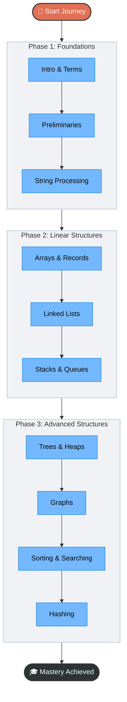
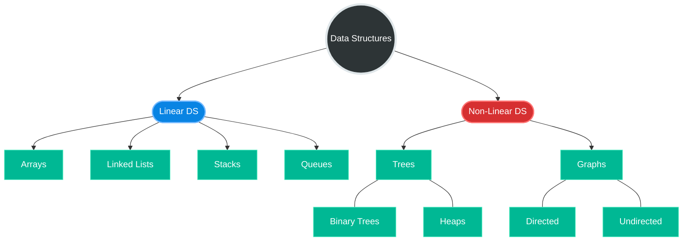

# CSE 2101: Data Structures 
<div align="center">

**A comprehensive repository for the university course on Data Structures**

[](https://github.com/shafkatb230101003-code)
[](https://github.com/shafkatb230101003-code)
[](https://github.com/shafkatb230101003-code)
<!--[](LICENSE)-->

</div>

---
 
## 📚 Course Overview

**Course Code:** CSE 2101  
**Course Title:** Data Structures  
**Credit Hours:** 3.00 (3 hours per week)  
**Textbook:** *Data Structures with C* by Seymour Lipschutz (Schaum's Outlines)

This repository contains comprehensive materials, implementations, and resources for the Data Structures course. The course provides an in-depth study of fundamental and advanced data structures, their operations, and algorithmic analysis.

### 🗺️ Course Roadmap



### 🧠 Course Topics

- Internal data representation
- Abstract data types
- Elementary asymptotic analysis: growth of functions, O, Ω and Θ notations
- Elementary data structures: arrays, linked lists, stacks, queues, trees and tree traversals, graphs and graph representations, heaps, binary search trees
- Sorting algorithms: heap sort, merge sort, quick sort
- Data structures for set operations
- Advanced data structures: balanced binary search trees (AVL trees, red-black trees, splay trees, skip lists), advanced heaps (Fibonacci heaps, binomial heaps)
- Hashing

<br>

<div align="center">



</div>

---

## 👨‍🏫 Instructors

<div align="center">

| **Md. Jahidul Islam** |
| :---: |
| Chairman, Department of Computer Science and Engineering |
| Chandpur Science and Technology University |
| **Prince Mahmud** |
| Lecturer, Department of Computer Science and Engineering |
| Chandpur Science and Technology University |
</div>

---


## 📋 Course Content

### 1. 📘 INTRODUCTION AND OVERVIEW (1.1-1.19)
<details>
<summary>Click to view topics</summary>

- 1.1 Introduction
- 1.2 Basic Terminology; Elementary Data Organization
- 1.3 Data Structures
- 1.4 Data Structure Operations
- 1.5 Algorithms: Complexity, Time-Space Tradeoff
</details>

### 2. 📐 PRELIMINARIES (2.1-2.31)
<details>
<summary>Click to view topics</summary>

- 2.1 Introduction
- 2.2 Mathematical Notation and Functions
- 2.3 Algorithmic Notation
- 2.4 Control Structures
- 2.5 Complexity of Algorithms
- 2.6 Other Asymptotic Notations (Ω, O, Θ)
- 2.7 Subalgorithms
- 2.8 Variables, Data Types
</details>

### 3. 🧵 STRING PROCESSING (3.1-3.31)
<details>
<summary>Click to view topics</summary>

- 3.1 Introduction
- 3.2 Basic Terminology
- 3.3 Storing Strings
- 3.4 Character Data Type
- 3.5 String Operations
- 3.6 Word Processing
- 3.7 Pattern Matching Algorithms
</details>

### 4. 🔢 ARRAYS, RECORDS AND POINTERS (4.1-4.56)
<details>
<summary>Click to view topics</summary>

- 4.1 Introduction
- 4.2 Linear Arrays
- 4.3 Representation of Linear Arrays in Memory
- 4.4 Traversing Linear Arrays
- 4.5 Inserting and Deleting
- 4.6 Sorting; Bubble Sort
- 4.7 Searching; Linear Search
- 4.8 Binary Search
- 4.9 Multidimensional Arrays
- 4.10 Pointers; Pointer Arrays
- 4.11 Records; Record Structures
- 4.12 Representation of Records in Memory; Parallel Arrays
- 4.13 Matrices
- 4.14 Sparse Matrices
</details>

### 5. 🔗 LINKED LISTS (5.1-5.57)
<details>
<summary>Click to view topics</summary>

- 5.1 Introduction
- 5.2 Linked Lists
- 5.3 Representation of Linked Lists in Memory
- 5.4 Traversing a Linked List
- 5.5 Searching a Linked List
- 5.6 Memory Allocation; Garbage Collection
- 5.7 Insertion into a Linked List
- 5.8 Deletion from a Linked List
- 5.9 Header Linked Lists
- 5.10 Two-way Lists
</details>

### 6. 📚 STACKS, QUEUES, RECURSION (6.1-6.66)
<details>
<summary>Click to view topics</summary>

- 6.1 Introduction
- 6.2 Stacks
- 6.3 Array Representation of Stacks
- 6.4 Linked Representation of Stacks
- 6.5 Arithmetic Expressions; Polish Notation
- 6.6 Quicksort, an Application of Stacks
- 6.7 Recursion
- 6.8 Towers of Hanoi
- 6.9 Implementation of Recursive Procedures by Stacks
- 6.10 Queues
- 6.11 Linked Representation of Queues
- 6.12 Deques
- 6.13 Priority Queues
</details>

### 7. 🌲 TREES (7.1-7.101)
<details>
<summary>Click to view topics</summary>

- 7.1 Introduction
- 7.2 Binary Trees
- 7.3 Representing Binary Trees in Memory
- 7.4 Traversing Binary Trees
- 7.5 Traversal Algorithms using Stacks
- 7.6 Header Nodes; Threads
- 7.7 Binary Search Trees
- 7.8 Searching and Inserting in Binary Search Trees
- 7.9 Deleting in a Binary Search Tree
- 7.10 AVL Search Trees
- 7.11 Insertion in an AVL Search Tree
- 7.12 Deletion in an AVL Search Tree
- 7.13 m-way Search Trees
- 7.14 Searching, Insertion and Deletion in an m-way Search Tree
- 7.15 B Trees
- 7.16 Searching, Insertion and Deletion in a B-tree
- 7.17 Heap; Heapsort
- 7.18 Path Lengths; Huffman's Algorithm
- 7.19 General Trees
</details>

### 8. 🕸️ GRAPHS AND THEIR APPLICATIONS (8.1-8.47)
<details>
<summary>Click to view topics</summary>

- 8.1 Introduction
- 8.2 Graph Theory Terminology
- 8.3 Sequential Representation of Graphs; Adjacency Matrix; Path Matrix
- 8.4 Warshall's Algorithm; Shortest Paths
- 8.5 Linked Representation of a Graph
- 8.6 Operations on Graphs
- 8.7 Traversing a Graph
- 8.8 Posets; Topological Sorting
</details>

### 9. ⚡ SORTING AND SEARCHING (9.1-9.27)
<details>
<summary>Click to view topics</summary>

- 9.1 Introduction
- 9.2 Sorting
- 9.3 Insertion Sort
- 9.4 Selection Sort
- 9.5 Merging
- 9.6 Merge-Sort
- 9.7 Radix Sort
- 9.8 Searching and Data Modification
- 9.9 Hashing
</details>

---

## 🚀 Getting Started

### Prerequisites

To use the code examples in this repository, you need:

- **C Compiler** (GCC recommended)
- **Text Editor or IDE** (VS Code, Code::Blocks, Dev-C++, or any C IDE)
- **Basic understanding of C programming**

### Installation

1. **Clone the repository**
   ```bash
   git clone https://github.com/M-F-Tushar/CSE-2101-Data-Structures.git
   cd CSE-2101-Data-Structures
   ```

2. **Compile a C program**
   ```bash
   gcc filename.c -o output
   ./output
   ```

3. **Navigate to specific chapters**
   ```bash
   cd Chapter-04-Arrays-Records-Pointers/examples
   ```

---

## 💻 Usage

Each chapter folder contains:

- **README.md**: Detailed explanation of concepts covered in that chapter
- **examples/**: Working code examples demonstrating the concepts
- **exercises/**: Practice problems with solutions

### Running Examples

```bash
# Navigate to a chapter
cd Chapter-05-Linked-Lists/examples

# Compile the program
gcc linked_list_operations.c -o linked_list

# Run the program
./linked_list
```

---

## 🎯 Learning Outcomes

By the end of this course, students will be able to:

1. Understand and implement various data structures in C
2. Analyze algorithm complexity using Big O, Omega, and Theta notations
3. Choose appropriate data structures for specific problems
4. Implement searching and sorting algorithms
5. Work with advanced data structures like AVL trees, B-trees, and heaps
6. Apply graph algorithms for real-world problems
7. Design efficient algorithms with optimal time-space tradeoffs

---

## 📚 Reference Materials

### Primary Textbook
- **Seymour Lipschutz** - *Data Structures with C* (Schaum's Outlines)

### Additional Resources
- Thomas H. Cormen et al. - *Introduction to Algorithms* (CLRS)
- Ellis Horowitz & Sartaj Sahni - *Fundamentals of Data Structures in C*
- Robert Sedgewick - *Algorithms in C*

### Online Resources
- [GeeksforGeeks - Data Structures](https://www.geeksforgeeks.org/data-structures/)
- [Visualgo - Algorithm Visualizations](https://visualgo.net/)
- [Big-O Cheat Sheet](https://www.bigocheatsheet.com/)

---

## 🤝 Contributing

Contributions are welcome! Here's how you can help:

1. **Fork the repository**
2. **Create a new branch** (`git checkout -b feature/improvement`)
3. **Make your changes**
4. **Commit your changes** (`git commit -m 'Add some feature'`)
5. **Push to the branch** (`git push origin feature/improvement`)
6. **Open a Pull Request**

### Contribution Guidelines

- Follow the existing code structure and naming conventions
- Add comments to explain complex logic
- Test your code before submitting
- Update documentation if necessary
- Write clear commit messages

---

## 📝 Course Progress

- [x] Chapter 1: Introduction and Overview
- [x] Chapter 2: Preliminaries
- [x] Chapter 3: String Processing
- [x] Chapter 4: Arrays, Records and Pointers
- [x] Chapter 5: Linked Lists
- [x] Chapter 6: Stacks, Queues, Recursion
- [x] Chapter 7: Trees
- [x] Chapter 8: Graphs and Their Applications
- [x] Chapter 9: Sorting and Searching

*Note: Currently, 9 chapters have been completed. The repository will be updated as the course progresses.*

---

## 📧 Contact

**Md. Shafkat Hossain Mazumder**  
- 📧 Email: shafkat.b230101003@student.cstu.ac.bd
- 🐙 GitHub: [@Shafkat Hosaain](https://github.com/shafkatb230101003-code)
- 📍 Location: Chandpur, Bangladesh

---

## 📄 License

This project is licensed under the MIT License - see the [LICENSE](https://github.com/shafkatb230101003-code/DSA/blob/bf847a7362575b8ec883b04cfd8ba8ab268dcfef/MIT%20license) file for details.

---

## 🌟 Acknowledgments

- **Seymour Lipschutz** for the excellent textbook
- Course instructors and teaching assistants
- Fellow students for discussions and collaboration
- Open source community for inspiration

<div align="center">

⭐ **Star this repository if you find it helpful!** ⭐

</div
